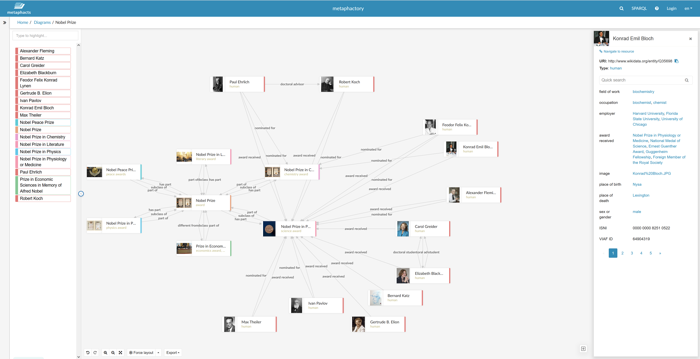

# metaphacts

[metaphacts](https://metaphacts.com/ "https://metaphacts.com/") offers a flexible, open
platform for describing and querying graph data and for visualizing and interacting
with knowledge graphs. Using [metaphactory](https://metaphacts.com/product "https://metaphacts.com/product"),
you can build interactive web applications such as visualizations and dashboards on top
of knowledge graphs in Neptune using the RDF data model. The metaphactory platform
supports a low-code development experience with a UI for data loading, a visual
ontology modeling interface with OWL and SHACL support, a SPARQL query UI and query
catalog, and a rich set of Web components for graph exploration, visualization, search
and authoring.

Here is a sample metaphactory visualization:

The platform is designed for and used productively in engineering, manufacturing,
pharma, life Sciences, finance, insurance, and more. To see a sample solution architecture,
check out [this
blog post](https://aws.amazon.com/blogs/apn/exploring-knowledge-graphs-on-amazon-neptune-using-metaphactory/ "https://aws.amazon.com/blogs/apn/exploring-knowledge-graphs-on-amazon-neptune-using-metaphactory/").

To get started with a free trial of metaphactory, visit the [AWS Marketplace](https://aws.amazon.com/marketplace/pp/prodview-2h6qiqogjqe2m "https://aws.amazon.com/marketplace/pp/prodview-2h6qiqogjqe2m").
