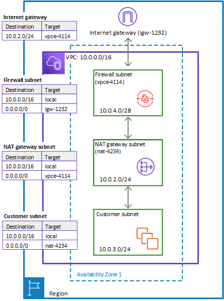

# Architecture with an internet gateway and a NAT gateway using AWS Network Firewall

You can add a network address translation (NAT) gateway to your AWS Network Firewall
architecture, for the areas of your VPC where you need NAT capabilities.

AWS provides NAT gateways decoupled from your other cloud services, so you can use it in
your architecture only where you need it. This can help you reduce load and
load costs. For information about NAT
gateways, see [NAT gateways](../../../vpc/latest/userguide/vpc-nat-gateway.md "../../../vpc/latest/userguide/vpc-nat-gateway.md") in the _Amazon Virtual Private Cloud User Guide_.

The following figure depicts a VPC configuration for Network Firewall with an internet gateway
and a NAT gateway.

