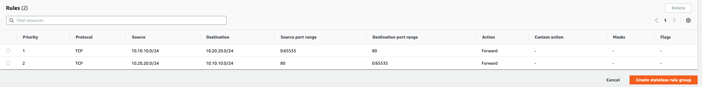

# Avoiding asymmetric routing with AWS Network Firewall

Network Firewall doesn’t support asymmetric routing. Use the guidance that follows to prevent asymmetric routing in your network traffic where you use Network Firewall.

In Network Firewall, asymmetric routing occurs when both request network traffic and its related response network traffic are not routed to the same Network Firewall endpoint. In order for Network Firewall to properly process traffic, the traffic must be routed to the Network Firewall endpoint in both directions.

The following are considerations to keep in mind to prevent asymmetric routing:

- **Centralized deployment model** - If your firewall uses a centralized deployment model:
  - On the Transit Gateway which is on the inspection VPC of the firewall, use the Transit Gateway appliance mode to keep the traffic request and response flows on the same Network Firewall endpoint. For information about configuring the Transit Gateway appliance mode, see [AWS Transit Gateway traffic flow and asymmetric routing](../../../prescriptive-guidance/latest/inline-traffic-inspection-third-party-appliances/transit-gateway-asymmetric-routing.md "../../../prescriptive-guidance/latest/inline-traffic-inspection-third-party-appliances/transit-gateway-asymmetric-routing.md").
  - Configure your Transit Gateway route tables to route both forward and return direction traffic via your firewall attachment.

- **Decentralized deployment model** - If your firewall is deployed in a decentralized deployment model inspecting internet-bound traffic from an internet gateway, use a route table with an Internet Gateway [edge association](../../../vpc/latest/userguide/VPC_Route_Tables.md#RouteTables:~:text=virtual%20private%20gateway.-,Edge%20association,-%E2%80%94A%20route%20table "../../../vpc/latest/userguide/VPC_Route_Tables.md#RouteTables:~:text=virtual%20private%20gateway.-,Edge%20association,-%E2%80%94A%20route%20table") to route inbound traffic through the Network Firewall endpoint, in addition to an outbound route in the application subnet.
- **NAT gateway** - If Network Firewall is downstream of your Network address translation (NAT) Gateway, make sure that the NAT gateway's subnet routes traffic through the Network Firewall endpoint. For information about using NAT gateway with Network Firewall, see the following resources:
  - [Architecture with an internet gateway and a NAT gateway using AWS Network Firewall](arch-igw-ngw.md "arch-igw-ngw.md")
  - [Using the NAT gateway with AWS Network Firewall for centralized egress](../../../whitepapers/latest/building-scalable-secure-multi-vpc-network-infrastructure/using-nat-gateway-with-firewall.md "../../../whitepapers/latest/building-scalable-secure-multi-vpc-network-infrastructure/using-nat-gateway-with-firewall.md")
  - [How do I set up AWS Network Firewall with a NAT gateway?](https://aws.amazon.com/premiumsupport/knowledge-center/network-firewall-set-up-with-nat-gateway/ "https://aws.amazon.com/premiumsupport/knowledge-center/network-firewall-set-up-with-nat-gateway/")

- **Stateless rules** - If your Network Firewall firewall uses stateless rules:
  - Be aware that unidirectional `pass` rules can create asymmetric forwarding when the policy’s stateless default action is **forward to stateful rules**.
  - Ensure that your stateless rules forward traffic symmetrically to the stateful engine using the **forward to stateful rule groups** action. Often this means writing pairs of rules to match both forward and return direction traffic. For information about the foward to stateful rule groups option, see [Creating a firewall policy in AWS Network Firewall](firewall-policy-creating.md "firewall-policy-creating.md"). The following example shows a pair of rules that match both forward and return direction traffic:

  
