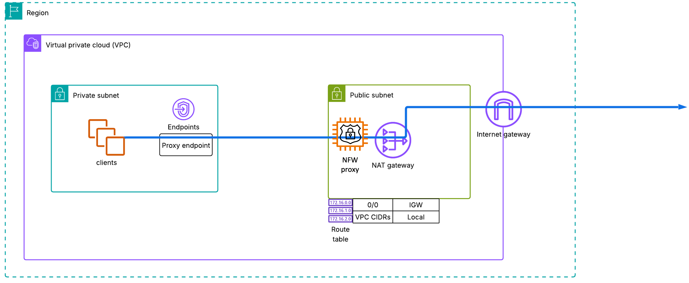
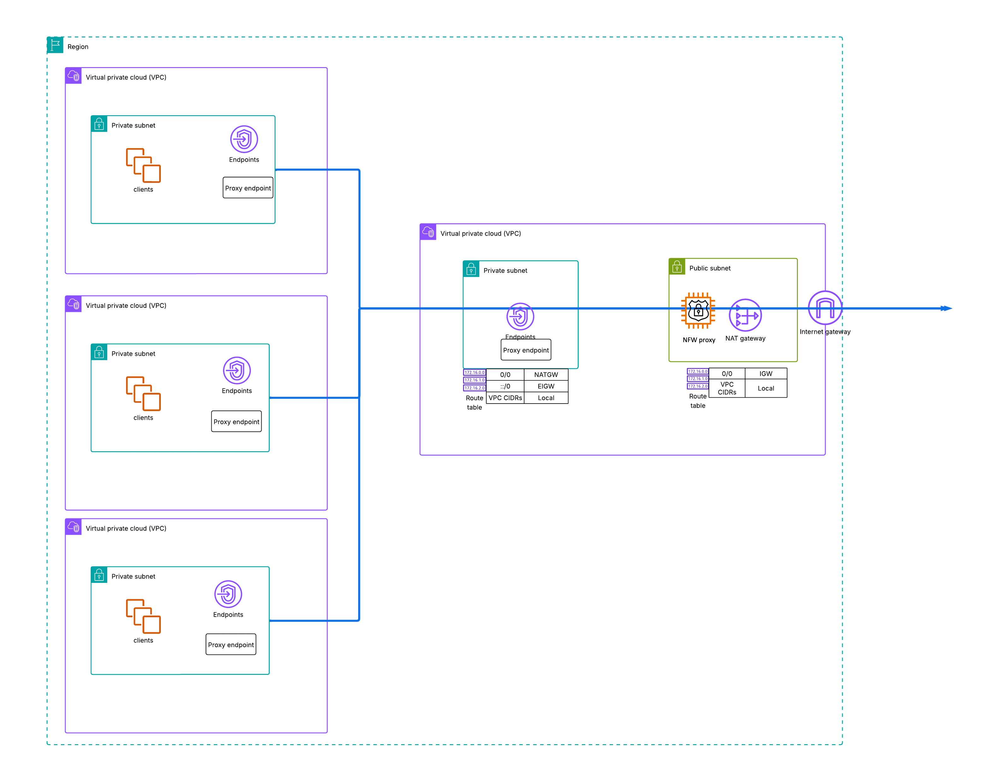
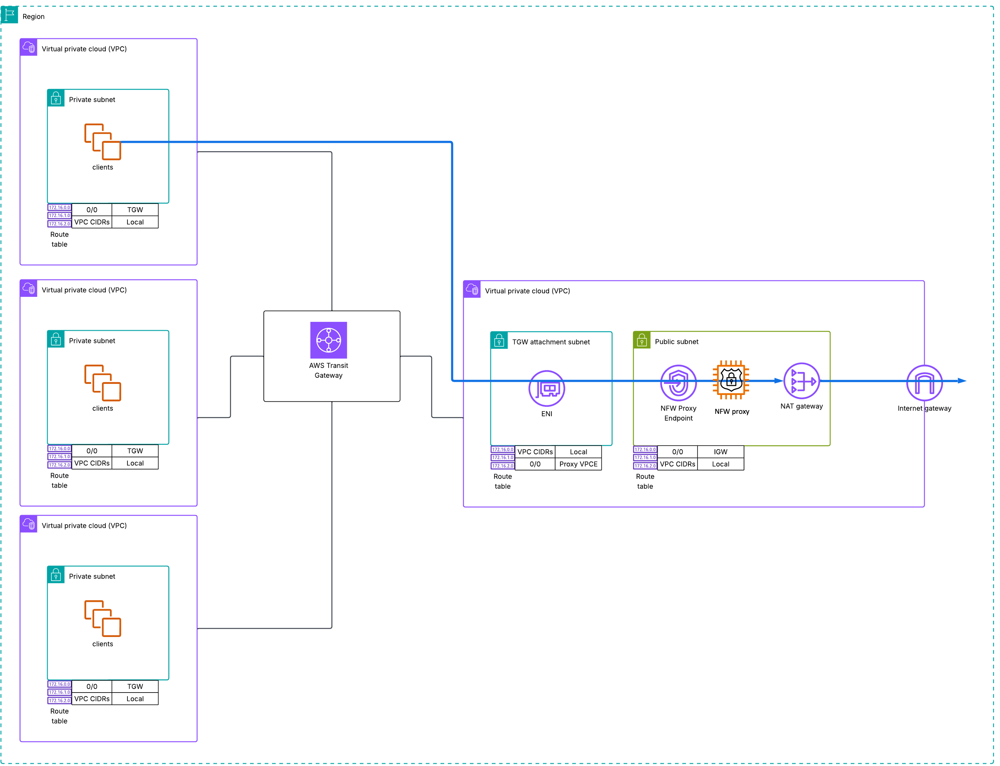

# Architecture overview

###### Note

Network Firewall Proxy is in public preview release and is subject to change.

This section provides a high-level view of simple architectures that you can configure with AWS Network Firewall Proxy.

AWS Network Firewall Proxy is configured on your NAT Gateway and inspects traffic from your workloads in your VPC before the network address translation is performed. To implement the service, associate your proxy configuration with the NAT Gateway that handles your outbound traffic. To access the Proxy, you must set up the HTTP_PROXY, HTTPS_PROXY, and NO_PROXY environment variables appropriately on your applications. The proxy comes with a fully qualified domain name which resolves to the IP address of a PrivateLink interface endpoint that is used to carry your traffic to and from the proxy for inspection before it reaches the internet. For more information on setup, see details in [Pre-requisites](proxy-pre-requisites.md "proxy-pre-requisites.md").

###### Note

The proxy uses the DHCP options of the VPC that it is present in.

You can either configure the Network Firewall Proxy in the same VPC as your applications or centrally in a separate VPC. When configured centrally in a separate VPC, it can be accessed using PrivateLink endpoints or Transit Gateway. We will discuss these three architecture below.

1. Dedicated VPC Model: Deploy individual Network Firewall Proxies within each VPC for isolated, per-VPC traffic control and security policies.
2. Centralized Proxy Model: Configure a single, central proxy serving multiple VPCs through proxy endpoints, enabling consistent security policies across your infrastructure.
3. Transit Gateway Deployment: Leverage AWS Transit Gateway for connecting multiple VPCs with non-overlapping CIDR blocks to a centralized proxy, providing scalable network security for complex multi-VPC architectures.

## 1. Dedicated VPC Proxy Architecture

When the Network Firewall Proxy and the Applications are in the same VPC. This architecture provides complete isolation and independent control over proxy configurations for each VPC. Traffic from applications within a VPC flows through its designated proxy before reaching the NAT Gateway for internet access.

###### Note

When you create a VPC endpoint, AWS automatically creates a private hosted zone that resolves the FQDN of the proxy to the IP address of the endpoint.

## 2. Centralized Proxy Architecture With Proxy Endpoints

This architecture implements a centralized AWS Network Firewall Proxy that serves multiple VPCs through proxy endpoints. The proxy resides in a dedicated security VPC, while proxy endpoints are automatically created in each connected application VPC. Traffic from all application VPCs flows through these endpoints to the central proxy before reaching the internet.

## 3. Transit Gateway Integration Architecture

For environments with non-overlapping CIDR ranges, you can leverage AWS Transit Gateway (TGW) to connect multiple VPCs to a centralized proxy. This architecture extends the centralized proxy model by using TGW as the connectivity layer between application VPCs and the security VPC hosting the proxy.

