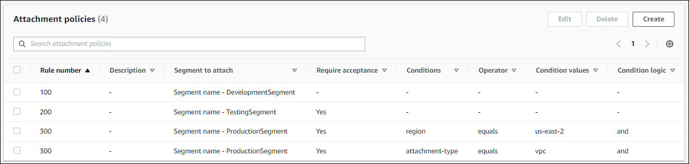

# Create an attachment policy in an AWS Cloud WAN core

network policy version

The following steps guide you through configuring a core network for a policy version
using the **Policy versions** link on the AWS Network Manager console. For more
information about attachment policies, see [Attachment policies](cloudwan-create-policy-version.md#cloudwan-policy-create-attachment "cloudwan-create-policy-version.md#cloudwan-policy-create-attachment").

An attachment policy requires the following:

- The core network configured. See [Configure the core network settings in an AWS Cloud WAN policy
  version](cloudwan-core-network-config.md "cloudwan-core-network-config.md").
- One or more segments. See [Segments](cloudwan-create-policy-version.md#cloudwan-policy-create-segment "cloudwan-create-policy-version.md#cloudwan-policy-create-segment").
- If you are optionally creating a service insertion action, you'll first need the
  following:
  - A network functions group. See [Network function groups](cloudwan-create-policy-version.md#cloudwan-core-network-function "cloudwan-create-policy-version.md#cloudwan-core-network-function").
  - At least one attachment. Supported attachment types are Connect, Direct
    Connect gateway, transit gateway route table, VPC, and Site-to-Site VPN. For more
    information about attachments, see [Attachments in AWS Cloud WAN](cloudwan-create-attachment.md "cloudwan-create-attachment.md") .

  ###### Important

  An attachment is required when creating a policy that includes a service insertion action. If
  there is no associated attachment in the policy, traffic will be dropped
  instead of being redirected to a specified network function
  group.

###### To create an attachment policy

1. Access the Network Manager console at [https://console.aws.amazon.com/networkmanager/home/](https://console.aws.amazon.com/networkmanager/home "https://console.aws.amazon.com/networkmanager/home").
2. Under **Connectivity** choose **Cloud WAN**.
3. On the **Global networks** page, choose the global network ID that for the core network you want to create a policy version for, and then choose **Core network**.
4. In the navigation pane, choose **Policy versions**.
5. Choose **Create policy version**.
6. Choose **Attachment policies**.
7. Choose **Create**.
8. For the **Rule number**, enter the rule number to apply to
   this attachment. Rule numbers determine the order in which rules are run.
9. Enter an optional **Description** to identify the attachment policy.
10. In the **Action** section, choose how you want to associate
    the attachment to the segment. Choose one of the following:
    - **Segment name** — associates the attachment by the segment
      name. After choosing this option, the segment to attach to from the
      **Attach to segment** dropdown list.
    - **Attachment tag value** — associates the attachment by the
      tag's value in a key-value pair. Enter the tag value in the
      **Attachment tag** value field.
    - **Network function group** — creates an attachment policy
      rule for service insertion. Choose a network functions group for the service
      insertion policy. This option requires that you choose **Condition
      logic** and then the **AND** operator. For the
      **Type** you can choose the **Tag name** , **Tag value**, or both.

11. Choose one of the following:
    - **Inherit segments acceptance value** if the attachment
      inherits the acceptance setting from a segment when a segment was created.
      This can't be changed.
    - **Requires attachment acceptance** if you require
      approval for attachments to be mapped to this segment.
    - If no acceptance option is chosen, attachments are automatically
      mapped to the segment.

###### Note

If `require-attachment-acceptance` is
`false` for a segment, it's still possible for
attachments to be added to or removed from a segment
automatically when their tags change. If this behavior is not
desired, set `require-attachment-acceptance` to
`true`. 12. (Optional) For **Condition logic**, further refine how the attachment
is associated with the segment.

###### Important

**Condition logic** is required using **AND**
for a network functions group attachment policy rule. The **AND**
condition must use a **Tag name** or **Tag value**
associated with the attachment.

    * Choose **OR** — if you want to associate the attachment with
     the segment by either the **Segment
     name**/**Attachment tag value**,
     *or* by the chosen conditions.
    * Choose **AND** — if you want to associate the attachment with
     the segment by either the **Segment
     name**/**Attachment tag value**
    *and* by the chosen conditions.

If no acceptance option is chosen, attachments are automatically mapped to the
segment. 13. In **Conditions**, set the condition logic by doing the
following:

    1. From the **Type** dropdown list, choose one of the
     following condition types:


    	* **Resource Id**  — Set an **OR** or
    	 **AND** condition that uses a Resource
    	 ID.
    	* **Attachment type** — Set an **OR**
    	 or **AND** condition that matches a specific
    	 attachment type.
    	* **Account** — Set an **OR** or
    	 **AND** condition that matches an
    	 account.
    	* **Tag name** — Set an **OR** or
    	 **AND** condition that matches a specific tag
    	 name.
    	* **Tag value** — Set an **OR** or
    	 **AND** condition that matches a specific tag
    	 value.
    ###### Important

    **Tag name** and **Tag value** are
     the only supported and available **Conditions** for a
     **Network function group** attachment
     policy.
    2. From the **Operator** dropdown list, choose one
     of the following operators. The operator determines the relationship of the
     Type.


    ###### Note

    Operators are not supported when for a network function group
     attachment policy when the **Type** is **Tag
     name**. The full tag name must be used.


    	* **Equals** — Filters results that match the passed
    	 **Condition value**.
    	* **Not equals** — Filters results that do not match
    	 the passed **Condition value**. This option is not
    	 used for **Attachment type**.
    	* **Begins with** — Filters results that start with the
    	 passed **Condition value**. This option is not used
    	 for **Attachment type**.
    	* **Contains** — Filters results that match a substring
    	 within a string. This option is not used for **Attachment
    	 type**.
    	* **Any** — Filters results that match any field. This
    	 option is not used for **Attachment type**.
    3. In the **Condition values** field, enter the value that
     corresponds to the **Type** and
     **Operator**. This option is not used for
     **Attachment type**. If you're creating a network
     function group attachment policy, the full tag name or value are required.
     Partial C
    4. Choose **Add** to include additional conditions or choose
     **Remove** to delete any conditions.

14. Choose **Create attachment policy**.
15. Choose **Create policy**.

## Example condition logic for a network

function group attachment policy

The following shows a partial JSON example using the OR operator for a network function
group attachment policy.

- There are two segments, `production` and
  `development`.
- Rule numbers are manually assigned to each attachment policy for rule processing.
  Rules are then processed in numerical order according to the number assigned to
  them. In this example, the rule number is assigned `600` .
- Using the OR Condition logic, the network function group attachment policy
  looks for any segment with the value `production` or
  `development`.

For more information on the parameters used in the JSON file, see [Core network policy version parameters in
AWS Cloud WAN](cloudwan-policies-json.md "cloudwan-policies-json.md").

```
{
      "rule-number": 600,
      "condition-logic": "or",
      "conditions": [
        {
          "type": "tag-value",
          "operator": "equals",
          "key": "segment",
          "value": "production"
        },
        {
          "type": "tag-value",
          "operator": "equals",
          "key": "stage",
          "value": "development"
        }
      ],
      "action": {
        "add-to-network-function-group": "networkfunctiongroupone"
      }
    }
```

## Example attachment policy

The following shows a JSON containing three attachment policies for a core network.

- There are three segments, `DevelopmentSegment`,
  `TestingSegment`, and `ProductionSegment`, which were
  first created on the **Segments** tab of the **Create
  policy** page. When these segments were created,
  `DevelopmentSegment` was set to automatically accept attachments,
  while `TestingSegment` and `ProductionSegment` were
  required to accept attachments. `ProductionSegment` was also limited
  to `us-east-1` only and only `TestingSegment` is allowed
  to advertise to this segment.
- Rule numbers are manually assigned to each attachment policy for rule
  processing. Rules are then processed in numerical order according to the number
  assigned to them. In this example, the following rule numbers are used:
  `100` for `DevelopmentSegment`, `200` for
  `TestingSegment`, and `300` for
  `ProductionSegment`. This indicates that rule `100`
  will be run first, followed by rule `200` and then rule
  `300`. Once an attachment matches a rule, no further rules are
  processed for that attachment. Rule `300` for
  `ProductionSegment` additionally indicates that the policy will
  only accept `vpc` attachments and only if the request comes from
  `us-east-2`.

For more information on the parameters used in the JSON file, see [Core network policy version parameters in
AWS Cloud WAN](cloudwan-policies-json.md "cloudwan-policies-json.md").

```
{
  "version": "2021.12",
  "core-network-configuration": {
    "vpn-ecmp-support": true
  },
  "segments": [
    {
      "name": "DevelopmentSegment",
      "require-attachment-acceptance": false
    },
    {
      "name": "TestingSegment",
      "require-attachment-acceptance": true
    },
    {
      "name": "ProductionSegment",
      "edge-locations": [
        "us-east-1"
      ],
      "require-attachment-acceptance": true,
      "isolate-attachments": true,
      "allow-filter": [
        "TestingSegment"
      ]
    }
  ],
  "attachment-policies": [
    {
      "rule-number": 100,
      "condition-logic": "or",
      "conditions": [],
      "action": {
        "association-method": "constant",
        "segment": "DevelopmentSegment"
      }
    },
    {
      "rule-number": 200,
      "condition-logic": "or",
      "conditions": [],
      "action": {
        "association-method": "constant",
        "segment": "TestingSegment",
        "require-acceptance": true
      }
    },
    {
      "rule-number": 300,
      "condition-logic": "and",
      "conditions": [
        {
          "type": "region",
          "operator": "equals",
          "value": "us-east-2"
        },
        {
          "type": "attachment-type",
          "operator": "equals",
          "value": "vpc"
        }
      ],
      "action": {
        "association-method": "constant",
        "segment": "ProductionSegment",
        "require-acceptance": true
      }
    }
  ]
}
```

Using the **Visual editor**, the same policies display as follows:



Note that if an attachment policy uses the **and** condition, each
condition appears on a separate row of the editor. In this example, since rule number
300 uses **region** and **attachment-type**
conditions, each of those conditions appear on separate rows.
