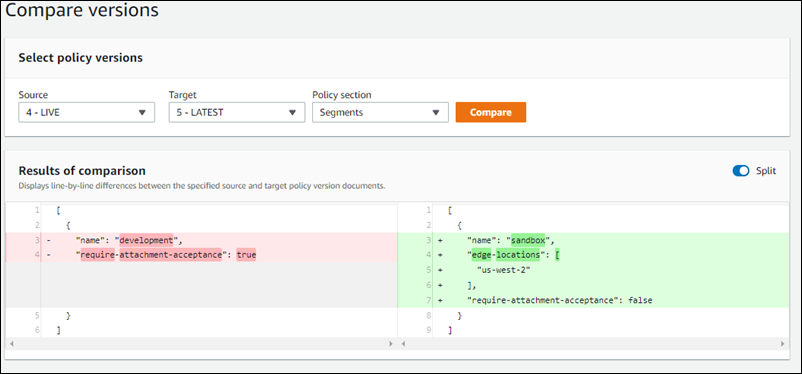

# Compare AWS Cloud WAN core network policy change set versions

Compare two policy versions against each other using the console. The comparison
returns line-by-line changes between the two policies in JSON format with changes
highlighted.

###### To compare policy versions

1. Access the Network Manager console at [https://console.aws.amazon.com/networkmanager/home/](https://console.aws.amazon.com/networkmanager/home "https://console.aws.amazon.com/networkmanager/home").
2. Under **Connectivity**, choose **Global Networks**.
3. On the **Global networks** page, choose the global network ID.
4. In the navigation pane, choose **Core network**, and then
   choose **Policy versions**.
5. Under **Policy version ID**, choose the policy version that
   you want to compare against another policy.
6. Choose **View or apply change set**.
7. On the Change set page, choose **Compare with LIVE**.
8. From the **Source** and **Target** dropdown
   lists, choose the policy versions that you want to compare.
9. (Optional) From the **Policy section** dropdown list, choose
   a specific policy section to compare. Options are:
   - **All** — Compares all policy changes between the two
     policies. This is the default view.
   - **Network configuration** — Compares Border Gateway
     Protocol (BGP), Autonomous System Number (ASN), and core network edge
     locations.
   - **Segments** — Compares segment additions, deletions,
     or modifications.
   - **Segment actions** — Compares segment sharing and
     filtering.
   - **Attachment policies** — Compare how attachments map
     to segments.

10. Choose **Compare**.

The **Results of comparison** section displays the changes
between the two policies. In the following example, the
**Segments** of a current LIVE **Source**
policy are compared against the segment changes to an undeployed
**Target** policy. The comparison shows that a new segment,
**sandbox**, will be added when deploying the
**Target** policy version.

 11. By default, the changes for each policy display in separate policy windows. To
see the results of the comparison line-by-line in a single window, turn the
**Split** toggle off.
