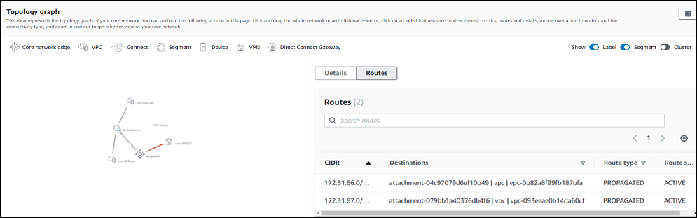
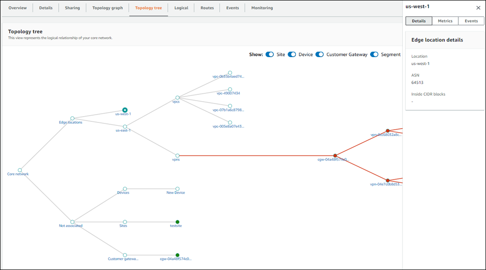
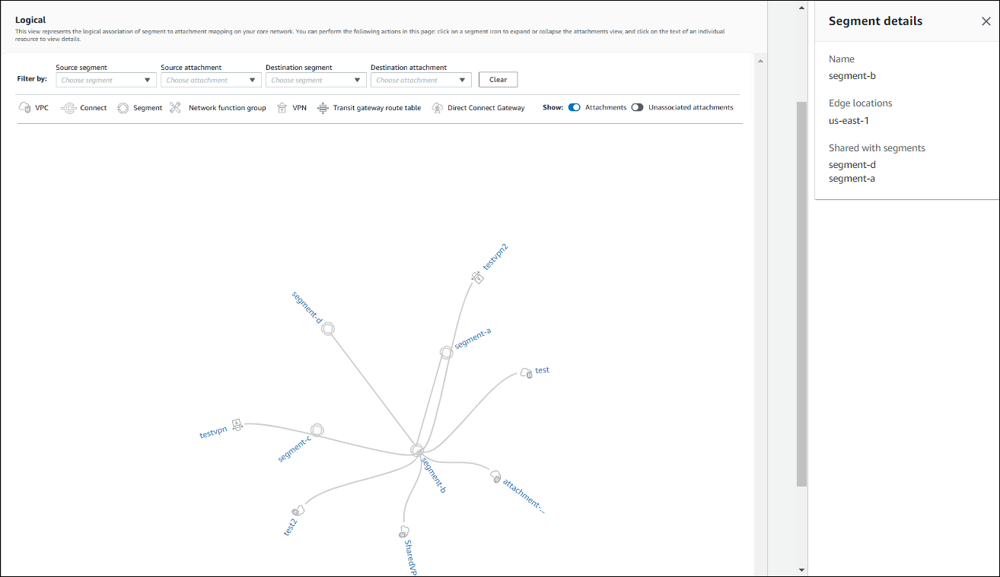
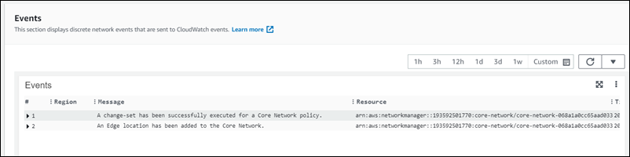

# Access Cloud WAN core network

dashboards

Use the following dashboards to view information about your Cloud WAN core network. For more information about the Cloud WAN core network dashboards, see [Cloud WAN core network dashboards](cloudwan-visualize-networks.md#cloudwan-core-network-intro "cloudwan-visualize-networks.md#cloudwan-core-network-intro").

###### Core network dashboards

- [Overview](#cloudwan-visualize-core-overview "#cloudwan-visualize-core-overview")
- [Details](#cloudwan-visualize-core-details "#cloudwan-visualize-core-details")
- [Sharing](#cloudwan-visualize-core-sharing "#cloudwan-visualize-core-sharing")
- [Topology graph](#cloudwan-visualize-core-topology-graph "#cloudwan-visualize-core-topology-graph")
- [Topology tree](#cloudwan-visualize-core-topology-tree "#cloudwan-visualize-core-topology-tree")
- [Logical](#cloudwan-visualize-core-logical "#cloudwan-visualize-core-logical")
- [Routes](#cloudwan-visualize-core-routes "#cloudwan-visualize-core-routes")
- [Routing information base](#cloudwan-visualize-core-routing-information-base "#cloudwan-visualize-core-routing-information-base")
- [Events](#cloudwan-visualize-core-events "#cloudwan-visualize-core-events")
- [Monitoring](#cloudwan-visualize-core-monitoring "#cloudwan-visualize-core-monitoring")

## Overview

On the AWS Cloud WAN console **Overview** page, you can view the following
information:

- Your core network resource inventory.
- The location of core network edges and transit gateways within your global
  network, displayed as icons on a map. Connections are shown between
  resources.
- Throughput information between core network edges.
- The number of core network attachments per edge, shown as a stacked column
  chart. You can filter this chart to display specific attachment types.
- The number of network function groups used to route specific traffic to
  security appliances.

Use the following legend to understand the icons on your core network map:

| Icon                                  | Description                                                                                                                                                                                                                        |
| ------------------------------------- | ---------------------------------------------------------------------------------------------------------------------------------------------------------------------------------------------------------------------------------- |
| The icon for edge locations.          | **Edge locations** The total number of edge locations in your core network. The number is shown in the \*_Inventory_ • section and as an icon on the map for each edge location in your core network.                  |
| The icon for segments.                | **Segments\* • The total number of segments in your core network. The number is shown in the **Inventory\* • section and as an icon on the map for each section in your core network.                               |
| The icon for network function groups. | **Network function groups\* • The total number of network function groups in your core network. The number is shown in the **Inventory\* • section and as an icon on the map for each section in your core network. |
| The icon for devices.                 | **Devices** The total number of devices in your core network. The number is shown in the \*_Inventory_ • section and as an icon on the map for each device in your core network.                                       |
| The icon for sites.                   | **Sites** The total number of sites in your core network. The number is shown in the \*_Inventory_ • section and as an icon on the map for each site in your core network.                                             |

###### To view the core network map

1. Access the Network Manager console at [https://console.aws.amazon.com/networkmanager/home/](https://console.aws.amazon.com/networkmanager/home "https://console.aws.amazon.com/networkmanager/home").
2. Under **Connectivity**, choose **Global networks**.
3. On the **Global networks** page, choose the global network ID.
4. In the navigation pane, choose **Core network**.
5. The **Overview** page opens by default.
6. The **Inventory** section shows information about your core
   network: the number of **Edge locations** in your core network,
   the number of **Segments**, the number of
   **Devices**, and the number of **Sites**.
7. The **Geography** section displays a world map with the
   locations of your resources.
8. The **Throughput** section shows throughput information
   between the core network edges.
   - (Optional) Metrics and events use the default time set up in the CloudWatch Events event. To set a custom time frame, choose **Custom** and then choose a **Relative** or **Absolute** time, and then choose if you want to see that date range in **UTC** or the edge location's **Local time zone**.

   Choose **Add to dashboard** to add this metric to your CloudWatch dashboard. For more information about using CloudWatch dashboards, see
   [Using
   Amazon CloudWatch Dashboards](../../../AmazonCloudWatch/latest/monitoring/CloudWatch_Dashboards.md "../../../AmazonCloudWatch/latest/monitoring/CloudWatch_Dashboards.md") in the _Amazon CloudWatch User
   Guide_.

   ###### Note

   The **Add to dashboard** option only works if your registered transit gateway is in the US West (Oregon) Region.

9. The **Attachment** section displays information about each
   attachment for each core network edge location. Choose the **Filter by
   attachment type** dropdown list. By default all attachment types
   are chosen. Clear the check box for any attachment type that you don't want to
   include in the graph. You can filter by any combination of:
   - **VPN**
   - **VPC**
   - **Connect**

## Details

The **Details** page provides information about your core network
resources.

###### To view your core network details

1. Access the Network Manager console at [https://console.aws.amazon.com/networkmanager/home/](https://console.aws.amazon.com/networkmanager/home "https://console.aws.amazon.com/networkmanager/home").
2. Under **Connectivity**, choose **Global networks**.
3. On the **Global networks** page, choose the global network ID.
4. In the navigation pane, choose **Core network**.
5. The **Overview** page opens by default.
6. Choose the **Details** tab.

The **Details** page shows the following information:

    * **Name** — The name that you gave to the core network
     when you created it.
    * **State** — The current state of the core network.
     Possible states are **Pending**,
     **Available**, **Deleting**, and
     **Updating**.
    * **Core network ARN** — The unique Amazon Resource
     Number (ARN) of the core network.
    * **AWS account** — The AWS account that's
     associated with the core network.
    * **Description** — The description given to the core
     network when it was created.
    * **Tags** — The key-value tags that were associated
     with the core network when it was created.

7. (Optional) Change the core network **Description**. Choose
   **Edit** in the **Core network details**
   section, and then in the **Description** field, replace the
   current description with a new description. Then choose **Edit core
   network** to save your change.
8. (Optional) Edit, remove or add Tags. In the **Tags** section
   choose **Edit tags** and do any of the following. When
   finished, choose **Edit core network** to return to the
   **Details** tab.
   1. Choose **Add tag** to add a new tag. Add
      **Key** and **Value** pairs to
      help identify this resource. You can add multiple tags.
   2. Choose **Remove tag** to delete any tag. You are not
      prompted to confirm the deletion.
   3. To edit an existing tag, enter the new **Key** or
      **Value** into the applicable field.

## Sharing

On the **Sharing** page, you can view your currently shared network
resources. You can also use AWS Resource Access Manager (RAM) to share a core network
across accounts or across your organization in AWS organizations.

###### To view shared network resources

1. Access the Network Manager console at [https://console.aws.amazon.com/networkmanager/home/](https://console.aws.amazon.com/networkmanager/home "https://console.aws.amazon.com/networkmanager/home").
2. Under **Connectivity**, choose **Global networks**.
3. On the **Global networks** page, choose the global network ID.
4. In the navigation pane, choose **Core network**.
5. The **Overview** page opens by default.
6. Choose the **Sharing** tab.

The **Resource sharing** page displays a list of the
resources that you're currently sharing. 7. If you want to share a network resource. See [Shared AWS Cloud WAN core network](cloudwan-share-network.md "cloudwan-share-network.md") for the steps to share a network
resource.

## Topology graph

On the **Topology graph** page, you can view a topology diagram of
your core network that includes core network and transit gateway networks. It includes
information about AWS Regions, core network edges, segments, VPCs, VPNs, and Connect
attachments. Icons represent specific resource type and lines represent connections
between resources. The line colors represent the state of the connection between AWS
and the on-premises resources. You can filter the topology view to show specific
segment, and exclude AWS Regions and labels that are shown.

Use the following legend to understand the icons on your core network topology graph:

| Icon                                             | Description                                                                                   |
| ------------------------------------------------ | --------------------------------------------------------------------------------------------- |
| The icon for core network edges.                 | **Core network edge** The core network edges in your network.                              |
| The icon for VPC attachments.                    | **VPC**The VPC attachments in your core network.                                           |
| The icon for Connect attachments.                | **Connect** The Connect attachments in your core network.                                  |
| The icon for segments.                           | **Segment** The segments in your core network.                                             |
| The icon for devices.                            | **Devices** The devices in your core network.                                              |
| The icon for VPN attachments.                    | **VPN** The VPN attachments in your core network.                                          |
| The icon for Direct Connect Gateway attachments. | **Direct Connect Gateway** The Direct Connect Gateway attachments in your core network. |

###### To view the core network topology graph

1. Access the Network Manager console at [https://console.aws.amazon.com/networkmanager/home/](https://console.aws.amazon.com/networkmanager/home "https://console.aws.amazon.com/networkmanager/home").
2. Under **Connectivity**, choose **Global networks**.
3. On the **Global networks** page, choose the global network ID.
4. In the navigation pane, choose **Core network**.
5. The **Overview** page opens by default.
6. Choose the **Topology graph** tab.

A topological representation of your global network is displayed. Connect
lines are created between your resources. 7. (Optional) Filter the information displayed in the topology by making choices
for any combination of the following:

    * **Label** — Turns resource labels on or off.
    * **Segment** — Turns the display segments on or
     off.
    * **Cluster** — Turns the display of a cluster on or
     off.

8. On the graph, choose any of your network resources to view details about that
   resource. A panel opens on the right-hand side of the graph.

In this example, the `development` segment is chosen in the graph.
The panel displays **Details** about the segment. Choose the
**Routes** tab to view the segment
routes.

Depending on the resource chosen, the following information is available in the panel:

    * **Core network edge** — **Details**,
     **Metrics**, and **Events**. See
     [AWS Cloud WAN events and metrics](cloudwan-events-metrics.md "cloudwan-events-metrics.md") for more information about
     the types of metrics and events that can be tracked.
    * **VPC**, **Connect**,
     **VPN**, and **Direct Connect
     Gateway** — **Details** and
     **Events**.
    * **Segment** — **Details** and
     **Routes**.
    * **Device** — Device
     **Details**.

## Topology tree

The **Topology tree** page shows a logical diagram of your core
network. Here you can view the network tree for your core network. By default, the page
displays all resources in your core network and the logical relationships between them.
You can filter the network tree to show specific on-premises resource types only. For
example, the preceding image shows sites and devices, and excludes customer gateways.
You can choose any of the nodes to view information about the specific resource it
represents. The line colors represent the state of the relationships between AWS and
the on-premises resources.

###### To view the topology tree

1. Access the Network Manager console at [https://console.aws.amazon.com/networkmanager/home/](https://console.aws.amazon.com/networkmanager/home "https://console.aws.amazon.com/networkmanager/home").
2. Under **Connectivity**, choose **Global networks**.
3. On the **Global networks** page, choose the global network ID.
4. In the navigation pane, choose **Core network**.
5. The **Overview** page opens by default.
6. Choose the **Topology tree** tab.

A logical representation of your global network is displayed, along with the
details of your global network configuration. 7. (Optional) Filter the information that is displayed in the topology by making
choices for any combination of the following:

    * **Site** — Turns the display of sites on or
     off.
    * **Device** — Turns the display of devices on or
     off.
    * **Customer Gateway** — Turns the display of customer
     gateways on or off.
    * **Segment** — Turns the display of segments on or
     off.

8. On the tree, choose the label of any of your network resources to view details
   about that resource. A panel opens on the right-hand side of the tree.

In this example, an edge location, **us-west-1**, is chosen
in the tree. The panel displays **Edge location details**.
Choose any of the tabs in the panel to view more information about that edge
location.

Depending on the resource chosen, the following information is available in
the panel. See [AWS Cloud WAN events and metrics](cloudwan-events-metrics.md "cloudwan-events-metrics.md") for more information
about the types of events that can be tracked.

    * **Core network** - Core network details, including
     the **AWS account** and current
     **State** of the core network.
    * **Sites** — **Details** and
     **Events**.
    * **Devices** — **Details** and
     **Events**.
    * **Customer Gateway** — **Details**
     and **Events**.
    * **Segment** — **Details** and
     **Events**.
    * **Not associated** — There is no information to
     return.

## Logical

The **Logical** page shows a logical representation of the segments
in your core network. You can filter by a specific source or destination segment, or by
a source or destination attachment. You can view the network tree for your global
network, which includes core network and transit gateway networks. By default, the page
displays all resources in your global network and the logical relationships between
them. You can filter the network tree to show specific on-premises resource types only.
For example, the preceding image shows sites and devices, and excludes customer
gateways. You can choose any of the nodes to view information about the specific
resource that it represents. The line colors represent the state of the relationships
between AWS and any on-premises resources.

Use the following legend to understand the icons on your core network logical graph:

| Icon                                                  | Description                                                                                              |
| ----------------------------------------------------- | -------------------------------------------------------------------------------------------------------- |
| The icon for VPC attachments.                         | **VPC**The VPC attachments in your core network.                                                      |
| The icon for Connect attachments.                     | **Connect** The Connect attachments in your core network.                                             |
| The icon for segments.                                | **Segment** The segments in your core network.                                                        |
| The icon for network function groups.                 | **Network function group** The network function groups in your core network.                          |
| The icon for VPN attachments.                         | **VPN** The VPN attachments in your core network.                                                     |
| The icon for transit gateway route table attachments. | **Transit gateway route table** The transit gateway route table attachments in your core network.  |
| The icon for Direct Connect gateway attachments.      | **Direct Connect gateway attachment** The Direct Connect gateway attachments in your core network. |

###### To access the logical diagram for a core network

1. Access the Network Manager console at [https://console.aws.amazon.com/networkmanager/home/](https://console.aws.amazon.com/networkmanager/home "https://console.aws.amazon.com/networkmanager/home").
2. Under **Connectivity**, choose **Global networks**.
3. On the **Global networks** page, choose the global network ID.
4. In the navigation pane, choose **Core network**.
5. The **Overview** page opens by default.
6. Choose the **Logical** tab.

By default, all segments and all attachments are displayed in the logical
representation. 7. (Optional) Do any of the following:

    * From the **Source segment** dropdown list, choose a
     segment from the core network.
    * From the **Source attachment** dropdown list, choose
     an attachment from the source segment.
    * From the **Destination segment** dropdown list,
     choose a destination segment from the core network.
    * From the **Destination attachment** dropdown list,
     choose an attachment from the destination segment.

The logical graph updates based on your choices. Choose
**Clear** to reset the page. 8. (Optional) Filter the information that is displayed in the topology by making
choices for any combination of the following:

    * **Attachments** — Turns the display of attachments on
     or off.
    * **Show unassociated attachments** — Turns the display
     of unassociated attachments on or off.

9. On the graph, choose any of your network resources to view details about that
   resource. A panel opens on the right-hand side of the graph.

In this example, a segment, **segment-b**, is chosen in the
graph. The panel displays **Segment details**.

Depending on the resource chosen, the following information is available in
the panel:

    * **VPC**, **Connect**,
     **VPN**, **Transit gateway route
     table,** and **Direct Connect Gateway** —
     Attachment **Details** and **Events**.
     See [AWS Cloud WAN events and metrics](cloudwan-events-metrics.md "cloudwan-events-metrics.md") for more information about
     the types of events that can be tracked.
    * **Segment** — **Segment details**
     and **Routes**.
    * **Network function groups** — **Edge
     locations** and **Send to**/**Send
     via**.

## Routes

On the **Routes** page, you can search for and view core network
routes. On this page, you can refine results to show routes for specific segments and
edge locations.

###### To access core network routes

1. Access the Network Manager console at [https://console.aws.amazon.com/networkmanager/home/](https://console.aws.amazon.com/networkmanager/home "https://console.aws.amazon.com/networkmanager/home").
2. Under **Connectivity**, choose **Global networks**.
3. On the **Global networks** page, choose the global network ID.
4. In the navigation pane, choose **Core network**.
5. The **Overview** page opens by default.
6. Choose the **Routes** tab.
7. In the **Routes filter** section, choose one of the
   following:
   - Choose **Segment**, and then from the
     **Segment** and **Edge** location
     drop-down lists, choose the segment and edge location.
   - Choose **Network function group**, and then from the
     **Network function group** and **Edge
     location** drop-down lists, choose the network function
     group and edge location that you want to create a route filter for.

8. Choose **Search routes**.

The **Routes** table updates to display the routes for the
chosen segment and edge location and includes the following:

    * **CIDR** — All CIDRs used by this route.
    * **Destinations** — All destination addresses.
    * **Route types** — The type of route. This will be
     either **PROPAGATED** or
     **STATIC**.
    * **Route state** — The current state of a route. This
     will be either **ACTIVE** or
     **BLACKHOLE**.

## Routing information base

On the **Routing information base** page, you can search for and view core network
routing information base entries. The routing information base shows all route candidates before any routing policies have been applied.
Unlike the [Routes](#cloudwan-visualize-core-routes "#cloudwan-visualize-core-routes") view which shows the final installed routes, the routing information base includes all prefixes
advertised with their BGP attributes: local preference, AS path, MED, and BGP community tags. This view of your routes with BGP attributes
can be useful to help you design your routing policies. On this page, you can refine results to show routing information base entries
for specific segments and edge locations.

###### To access core network routing information base

1. Access the Network Manager console at [https://console.aws.amazon.com/networkmanager/home/](https://console.aws.amazon.com/networkmanager/home "https://console.aws.amazon.com/networkmanager/home").
2. Under **Connectivity**, choose **Global networks**.
3. On the **Global networks** page, choose the global network ID.
4. In the navigation pane, choose **Core network**.
5. The **Overview** page opens by default.
6. Choose the **Routing information base** tab.
7. In the **Routing filter** section, from the
   **Segment** and **Edge location**
   drop-down lists, choose the segment and edge location that you want the routing information base entries on.
8. (Optional) In the **Additional filters** section,
   you can select up to 10 additional attribute values to refine your search. From
   the **Attribute** drop-down list, choose any number of the following
   attributes to filter on:
   - **MED**
   - **AS Path**
   - **Community**
   - **Local Preference**
   - **Resource ID**
   - **Resource Type**
   - **IP Address**
   - **Attachment ID**
   - **Next hop segment**
   - **Next hop edge location**

9. Choose **Get routing information**.

The **Route information base** table updates to display the route information base entries for the
chosen segment and edge location and includes the following:

    * **Prefix** — The prefix of the route.
    * **Next Hop** — The destination of the route.
    * **Local preference** — The local preference BGP attribute of the route.
    * **AS Path** — The AS path BGP attribute of the route.
    * **MED** — The Multi-Exit Discriminator BGP attribute of the route.
    * **Community** — List of BGP community tags for the route.

## Events

You can monitor your core network using Amazon EventBridge, which delivers a near-real-time stream
of system events that describe changes in your resources. Using simple rules that you
can quickly set up, you can match events and route them to one or more target functions
or streams. For more information, see the [Amazon EventBridge User Guide](../../../eventbridge/latest/userguide.md "../../../eventbridge/latest/userguide.md").

**Prerequisites:** Before monitoring events, you must
onboard CloudWatch Logs Insights. This is a one-time process that needs to be completed at the
account level. After this is set up for your core network, you'll be able to see event
updates on this page. For more information on AWS Cloud WAN events, see [AWS Cloud WAN events and metrics](cloudwan-events-metrics.md "cloudwan-events-metrics.md").

###### To access core network events

1. Access the Network Manager console at [https://console.aws.amazon.com/networkmanager/home/](https://console.aws.amazon.com/networkmanager/home "https://console.aws.amazon.com/networkmanager/home").
2. Under **Connectivity**, choose **Global networks**.
3. On the **Global networks** page, choose the global network ID.
4. In the navigation pane, choose **Core network**.
5. The **Overview** page opens by default.
6. Choose the **Events** tab.

The **Events** section updates with the EventBridge events that
occurred during the selected time frame. 7. (Optional) Metrics and events use the default time set up in the CloudWatch Events event. To set a custom time frame, choose **Custom** and then choose a **Relative** or **Absolute** time, and then choose if you want to see that date range in **UTC** or the edge location's **Local time zone**.

Choose **Add to dashboard** to add this metric to your CloudWatch dashboard. For more information about using CloudWatch dashboards, see
[Using
Amazon CloudWatch Dashboards](../../../AmazonCloudWatch/latest/monitoring/CloudWatch_Dashboards.md "../../../AmazonCloudWatch/latest/monitoring/CloudWatch_Dashboards.md") in the _Amazon CloudWatch User
Guide_.

###### Note

The **Add to dashboard** option only works if your registered transit gateway is in the US West (Oregon) Region. 8. In the following example, the **Events** section shows two
events occurring within a custom 15-month time frame:

    * A change set was executed successfully for a core network policy
     update.
    * An edge location was added to the core network.

For a full list of tracked events, see [Monitor with Amazon CloudWatch Events](cloudwan-cloudwatch-events.md "cloudwan-cloudwatch-events.md").

## Monitoring

You can monitor your core network by using Amazon CloudWatch, which collects raw data and
processes it into readable, near-real-time metrics. These statistics are kept for 15
months, so that you can access historical information and gain a better perspective on
how your network is performing. You can also set alarms that watch for certain
thresholds, and send notifications or take actions when those thresholds are met. For
more information, see the [Amazon CloudWatch User Guide](../../../AmazonCloudWatch/latest/monitoring.md "../../../AmazonCloudWatch/latest/monitoring.md").

On the monitoring page you can view usage metrics for your core network, filtering by
specific edge locations.

###### To access core network monitoring details

1. Access the Network Manager console at [https://console.aws.amazon.com/networkmanager/home/](https://console.aws.amazon.com/networkmanager/home "https://console.aws.amazon.com/networkmanager/home").
2. Under **Connectivity**, choose **Global networks**.
3. On the **Global networks** page, choose the global network ID.
4. In the navigation pane, choose **Core network**.
5. The **Overview** page opens by default.
6. Choose the **Monitoring** tab.
7. From the **Core network edge** list, choose the core
   network edge that you want to monitor.
8. (Optional) Metrics and events use the default time set up in the CloudWatch Events event. To set a custom time frame, choose **Custom** and then choose a **Relative** or **Absolute** time, and then choose if you want to see that date range in **UTC** or the edge location's **Local time zone**.

Choose **Add to dashboard** to add this metric to your CloudWatch dashboard. For more information about using CloudWatch dashboards, see
[Using
Amazon CloudWatch Dashboards](../../../AmazonCloudWatch/latest/monitoring/CloudWatch_Dashboards.md "../../../AmazonCloudWatch/latest/monitoring/CloudWatch_Dashboards.md") in the _Amazon CloudWatch User
Guide_.

###### Note

The **Add to dashboard** option only works if your registered transit gateway is in the US West (Oregon) Region. 9. The page updates the following monitors:

    * **Bytes in**
    * **Bytes out**
    * **Bytes dropped – black hole**
    * **Bytes dropped – no route**
    * **Packets in**
    * **Packets out**
    * **Packets dropped – black hole**
    * **Packets dropped – no route**
