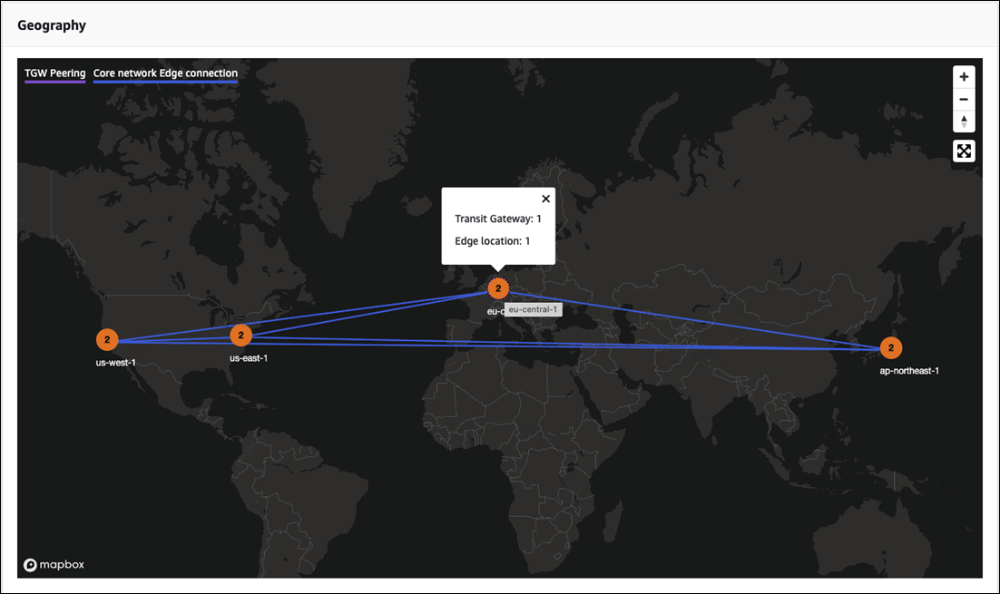
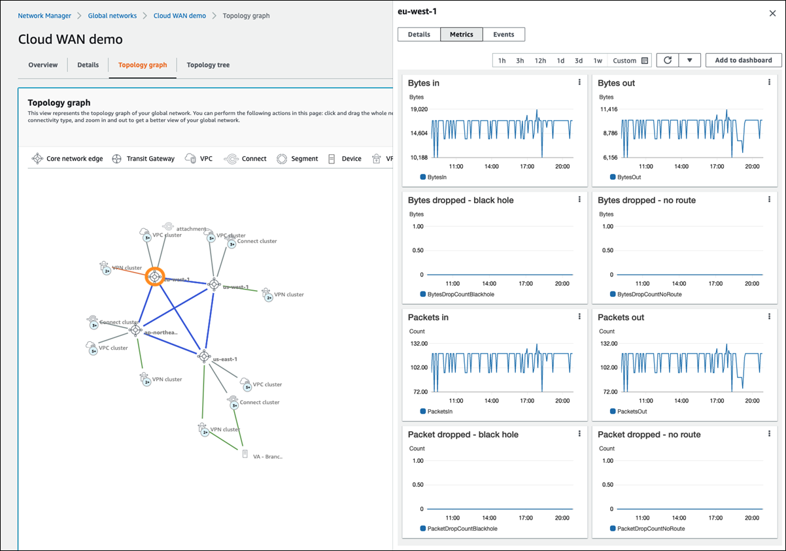
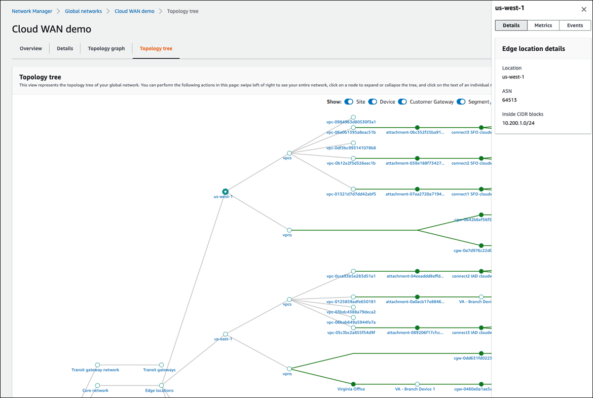

# Access AWS Cloud WAN global network dashboards

Visualize and monitor your global networks in the Network Manager console through a graphical
representation of your global network topology, including a map showing the locations of
transit gateways, edge locations, devices, and sites.

Use the following dashboards to view information about your Cloud WAN global network. For more information about the Cloud WAN core network dashboards, see [Cloud WAN global network
dashboards](cloudwan-visualize-networks.md#cloudwan-global-network-intro "cloudwan-visualize-networks.md#cloudwan-global-network-intro").

###### Global network dashboards

- [Overview](#cloudwan-visualize-global-overview "#cloudwan-visualize-global-overview")
- [Details](#cloudwan-visualize-global-details "#cloudwan-visualize-global-details")
- [Topology graph](#cloudwan-visualize-global-topology-graph "#cloudwan-visualize-global-topology-graph")
- [Topology tree](#cloudwan-visualize-global-topology-tree "#cloudwan-visualize-global-topology-tree")

## Overview

On the AWS Cloud WAN console **Overview** page, you can view the following
information:

- Your global network resource inventory, which includes any core networks and
  transit gateway networks.
- The location of core network edges and transit gateways within your global
  network, displayed as icons on global map. Connections are shown between
  resources.

Use the following legend to understand the icons on your global network map:

| Icon                           | Description                                                                                                                                                                                                                      |
| ------------------------------ | -------------------------------------------------------------------------------------------------------------------------------------------------------------------------------------------------------------------------------- |
| The icon for edge locations.   | **Edge locations** The total number of edge locations in your global network. The number is shown in the \*_Inventory_ • section and as an icon on the map for each edge location in your global network.            |
| The icon for transit gateways. | **Transit gateways\* • The total number of transit gateways in your global network. The number is shown in the **Inventory\* • section and as an icon on the map for each transit gateway in your global network. |
| The icon for devices.          | **Devices** The total number of devices in your global network. The number is shown in the \*_Inventory_ • section and as an icon on the map for each device in your global network.                                 |
| The icon for sites.            | **Sites** The total number of sites in your global network. The number is shown in the \*_Inventory_ • section and as an icon on the map for each site in your global network.                                       |

###### To access your global network resource inventory list

1. Access the Network Manager console at [https://console.aws.amazon.com/networkmanager/home/](https://console.aws.amazon.com/networkmanager/home "https://console.aws.amazon.com/networkmanager/home").
2. Under **Connectivity**, choose **Global Networks**.
3. On the **Global networks** page, choose the global network ID.
4. In the navigation pane, choose **Dashboard**.
5. The **Overview** page opens by default. This page shows
   information about the network resources in your global network:
   - The **Inventory** section shows the number of
     **Edge locations** in your global network, the
     number of **Transit gateways**, the number of
     **Devices**, and the number of
     **Sites**.

   In the following example, you'll see that there are four Regions,

   **us-west-2**, **us-east-**1,
   **eu-central-1**, and
   **ap-northeast-1**. Some Regions are represented by
   a number (for example, **eu-central-1** is represented
   by the number `2`,). This indicates that there are two
   network resources associated with that region. Choosing
   `2` opens a displays what those network resources
   are: one transit gateway and one edge location.

   

6. The**Details** page shows the add **Key** and
   **Value** pairs to further help identify this resource. You
   can add multiple tags by choosing **Add tag**, or remove any
   tag by choosing **Remove tag**.
7. Choose **Create attachment**.

## Details

The **Details** page provides information about your global network
resources. You can view information about your global network, as well as edit the
Description, or add and remove tags.

###### To access global network details

1. Access the Network Manager console at [https://console.aws.amazon.com/networkmanager/home/](https://console.aws.amazon.com/networkmanager/home "https://console.aws.amazon.com/networkmanager/home").
2. Under **Connectivity**, choose **Global Networks**.
3. On the **Global networks** page, choose the global network ID.
4. In the navigation pane, choose **Dashboard**.
5. Choose the **Details** tab.

The **Details** page shows the following information:

    * **Name** — The name that you gave to the global
     network when you created it.
    * **State** — The current state of the network.
     Possible states are **Pending**,
     **Available**, **Deleting**, and
     **Updating**.
    * **Global network ARN** — The unique Amazon Resource
     Number (ARN) of the global network.
    * **AWS account** — The AWS account that's associated with the global
     network.
    * **Description** — The description given to the global
     network when it was created.
    * **Tags** — The key-value tags associated with the
     global network when it was created.

6. (Optional) Change the global network **Description**. Choose
   **Edit** in the **Details** section, and
   then in the **Description - _optional_**
   field, replace the current description with a new description. Then choose
   **Edit global network** to save your change.
7. (Optional) Edit, remove or add tags. In the **Tags** section,
   choose **Edit tags** and do any of the following. When
   finished, choose **Edit global network** to return to the
   **Details** page.
   1. Choose **Add tag** to add a new tag. Add
      **Key** and **Value** pairs to
      help identify this resource. You can add multiple tags.
   2. Choose **Remove tag** to delete any tag. You are not
      prompted to confirm the deletion.
   3. To edit an existing tag, enter the new **Key** or
      **Value** into the applicable field.

## Topology graph

On the **Topology graph** page, you can view a topology diagram of your
global network that includes core network and transit gateway networks. It includes
information about AWS Regions, core network edges, transit gateways, segments, VPCs,
VPNs, and Connect attachments. Icons represent specific resource types, and lines
represent connections between resources. The line colors represent the state of the
connection between AWS and the on-premises resources. You can filter the topology view
to show specific segments and exclude AWS Regions and labels from being shown.

Use the following legend to understand the icons on your topology graph:

| Icon                                  | Description                                                                       |
| ------------------------------------- | --------------------------------------------------------------------------------- |
| The icon for core network edges.      | **Core network edge** The core network edges in your global network.           |
| The icon for transit gateways.        | **Transit Gateway**The transit gateways in your global network.                |
| The icon for VPC attachments.         | **VPC**The VPC attachments in your global network.                             |
| The icon for Connect attachments.     | **Connect** The Connect attachments in your global network.                    |
| The icon for segments.                | **Segment** The segments in your global network.                               |
| The icon for devices.                 | **Devices** The devices in your global network.                                |
| The icon for VPNs.                    | **VPN** The VPNs in your global network.                                       |
| The icon for Direct Connect Gateways. | **Direct Connect Gateway** The Direct Connect Gateways in your global network. |
| The icon for Regions.                 | **Regions** The Regions in your global network.                                |

###### To access the topology graph for a global network

1. Access the Network Manager console at [https://console.aws.amazon.com/networkmanager/home/](https://console.aws.amazon.com/networkmanager/home "https://console.aws.amazon.com/networkmanager/home").
2. Under **Connectivity**, choose **Global Networks**.
3. On the **Global networks** page, choose the global network ID.
4. In the navigation pane, choose **Dashboard**.
5. Choose the **Topology graph** tab.

A topological representation of your global network is displayed. Connect
lines are created between your resources. 6. (Optional) Filter the information that is displayed in the topology by making
choices for any combination of the following:

    * **Label** — Turns resource labels on or off.
    * **Region** — Turns the display of a Region on or
     off.
    * **Segment** — Turns the display Segments on or
     off.
    * **Cluster** — Turns the display of clusters on or
     off.

7. On the **Topology graph**, choose any of your network
   resources to view details about that resource. A panel opens on the right-hand
   side of the graph.

The following example shows the Metrics for the **eu-west-1**
edge location.

Depending on the resource chosen, the following information is available in
the panel:

    * **Core network edge** — **Details**,
     **Metrics**, and **Events**. See
     [AWS Cloud WAN events and metrics](cloudwan-events-metrics.md "cloudwan-events-metrics.md") for more information about
     the types of events that can be tracked.
    * **Transit gateway** — **Transit gateway
     details**.
    * **VPC**, **Connect**,
     **VPC**, **VPN**, and
     **Direct Connect Gateway** — **Attachment
     details**.
    * **Segment** — **Segment details**
     and **Routes**.
    * **Device** — **Device
     details**.
    * **Region** — **Region
     details**.

## Topology tree

The **Topology tree** page shows a logical diagram of your global network.
Here you can view the network tree for your global network, which includes core network
and transit gateway networks. By default, the page displays all resources in your global
network and the logical relationships between them. You can filter the network tree to
show specific on-premises resource types only. For example, the preceding image shows
sites and devices, and excludes customer gateways. You can choose any of the nodes to
view information about the specific resource that it represents. The line colors
represent the state of the relationships between AWS and any on-premises
resources.

###### To access the topology tree for a global network

1. Access the Network Manager console at [https://console.aws.amazon.com/networkmanager/home/](https://console.aws.amazon.com/networkmanager/home "https://console.aws.amazon.com/networkmanager/home").
2. Under **Connectivity**, choose **Global Networks**.
3. On the **Global networks** page, choose the global network ID.
4. In the navigation pane, choose **Dashboard**.
5. Choose the **Topology tree** tab.

A logical representation of your global network is displayed, along with the
details of your global network configuration. 6. (Optional) Filter the information that is displayed in the topology tree by
making choices for any combination of the following:

    * **Site** — Turns the display of sites on or
     off.
    * **Device** — Turns the display of devices on or
     off.
    * **Customer Gateway** — Turns the display of customer
     gateways on or off.
    * **Segment** — Turns the display of segments on or
     off.

7. In the **Topology tree**, choose any of your network
   resources to view details about that resource. A panel opens on the right-hand
   side of the graph.

The following example shows the **Details** for the
**us-west-1** edge location.

Depending on the resource chosen, the following information is available in the
panel:

- **Edge location** — **Details**,
  **Metrics**, and **Events**. See [AWS Cloud WAN events and metrics](cloudwan-events-metrics.md "cloudwan-events-metrics.md") for more information about the types of
  events that can be tracked.
- **VPC**, **Connect**, **VPC**,
  **VPN**, and **Direct Connect Gateway**
  attachments — **Attachment details** and
  **Events**.
- **Transit Gateways** — **Transit Gateway
  details**.
- **Device** — **Device details**.
- **Sites** — **Site details**.
