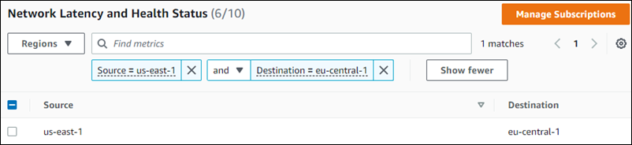
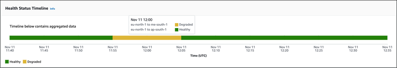
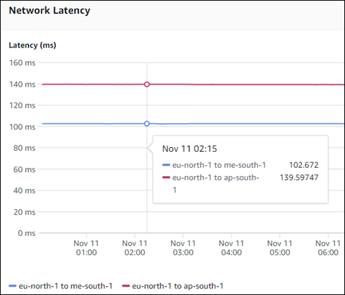

# Monitor Infrastructure Performance using the AWS Network Manager console

View the network performance between two Regions, between two Availability
Zones, or in the two connections within an Availability Zone. After you choose a starting and
ending date, and a period by which to aggregate performance, the network performance metrics
display in the **Health status timeline** and **Network latency
timeline** for that time period. You can also subscribe or unsubscribe performance
metrics from Amazon CloudWatch. When you subscribe, you're able to view performance metrics in CloudWatch.

###### Note

Enabling subscriptions with CloudWatch might incur a charge. For more information about CloudWatch pricing
guidelines, see [Amazon CloudWatch pricing](https://aws.amazon.com/cloudwatch/pricing/ "https://aws.amazon.com/cloudwatch/pricing/").

Choose between two Regions, two Availability Zones, or connections within an Availability Zone. You can choose
multiple Region, Availability Zones or intra-Availability Zones, but you can't have a
combination of all three. Combinations of Regions, Inter-Availability Zones, or
Intra-Availability Zones are not supported.

###### To choose a Region or Availability Zone

1. Access the Network Manager console at [https://console.aws.amazon.com/networkmanager/home/](https://console.aws.amazon.com/networkmanager/home "https://console.aws.amazon.com/networkmanager/home").
2. Under **Monitoring and troubleshooting**, choose
   **Infrastructure Performance**.
3. From the Regions drop-down list, choose whether you want to see
   **Inter-Region**, **Inter-Availability
   Zone**, or **Intra-Availability Zone** performance data.

By default the table populates all possible **Source** and
**Destination** pairs of Regions or Availability Zones, or
all possible pairs within an intra-Availability Zone. This section displays whether that pair
is subscribed to Amazon CloudWatch. Sort on **Source**,
**Destination**, or **Subscription** to more easily select
which Regions or Availability Zones you want to check network performance
for. 4. Scroll through the pages and choose one or more pairs. 5. (Optional). To choose specific Regions or Availability Zone, choose
**Find metrics**.

    1. In the **Find metrics** field, choose one of the following
     **Properties**:

    	* **Source** — The Region or Inter/Intra Availability
    	 Zone that's the source of the network traffic.
    	* **Destination** — The Region or Inter/Intra
    	 Availability Zone that's the destination for the network source.
    	* **Subscription** — Indicates whether the Region or
    	 Availability Zone is **Subscribed** or **Unsubscribed** for CloudWatch notifications. For more information about managing
    	 subscriptions with CloudWatch, see [Amazon CloudWatch subscriptions for Infrastructure Performance](nmip-subscriptions-cw.md "nmip-subscriptions-cw.md").
    2. For the property operator, choose one of the following operators:

    	* **Source =** — Returns network performance results only for the
    	 chosen Region, Availability Zone, or an **unsubscribed**
    	 subscription status.
    	* **Source !=** — Does not equal. Excludes the chosen
    	 Region, Availability Zone, or **unsubscribed**
    	 subscription status from the network performance results.
    3. From the **Source Values** drop-down list, choose the value to apply to
     the operator.
    4. Repeat the previous step if you want to include multiple metrics in the results.
    5. By default, each metric that you add is separated by **and** connecting
     logic, restricting results to the criteria that meet all of the requirements. To return
     results that match any of your chosen metrics, choose **or** from the
     drop-down list.

    All metrics use the same connecting logic. Combinations of
     **and**/**or** logic are not supported. If you change the
     connecting logic between two metrics, all other metrics will use the same connecting
     logic.
    6. The following example shows a filter for a single Source Region,
     `us-east-1`
    ***and*** a single Destination
     Region, `eu-central-1`. The results return one combination:

    

6. Choose a time range, and then choose **Apply**. You can choose a
   **Relative range** or an **Absolute range**.

**Relative range** options use a date range based on your current date
and time:

    * **Last 30 minutes**
    * **Last 1 hour**
    * **Last 6 hour**
    * **Last 1 day**
    * **Last 1 week**
    * **Custom range** — Set a custom date range. Enter a
     **Duration**, and then choose one of the following **Units of
     time**:

    	+ **seconds**
    	+ **minutes** (default)
    	+ **hours**
    	+ **days**
    	+ **weeks**
    	+ **years**

**Absolute range** allows you to set a specific start date and time and
end date and time. The date range cannot exceed 30 days.

###### Note

Performance metrics are not available prior to Oct 26, 2022 00:00:00 GMT+000.

    * On the calendar control, choose the start and end dates. Or,

    	+ Enter a **Start date** and **End date** using a
    	 `YYYY/MM/DD` format.
    	+ Enter a **Start time** and **End time** using an
    	 `hh:mm` format.

If you choose dates using the calendar control, the default start and end times are set to
`00:00`. You can change those times by entering your preferred times in
the fields.

When using an absolute range, both start and end dates are required. 7. Choose the time period by which you want the performance aggregated. Options are:

    * **5M** — Five minutes (default)
    * **15M** — Fifteen minutes
    * **1H** — One hour
    * **1D** — One day
    * **1W** — One week

8. The **Health status timeline** and **Network latency
   sections** update.

## Health status timeline

The **Health status timeline** shows a single consolidated view of network
performance for the chosen Region, Inter-Availability Zone, or Intra-Availability
Zone pairs over the starting and end times, consolidated by the aggregation period. The timeline
displays the following network latency statuses:

- **Healthy** (green) — Network performance fell within the expected range.
- **Degraded** (yellow) — Network latency fell below the expected
  range.

Hover over the status bar at a particular date and time to display the health status at that
time for the pairs you've chosen.

In the following example, network performance is checked for two pairs of
Regions: `eu-north-1` and `me-south-1`, as well as
`eu-north-1` and `ap-south-1`. The time period uses a **Relative
time** of **Last 1 hour** on November 11, and the aggregation period
is **5M** (five minutes). From **11:55** AM to 12:05 PM during
this hour there was **Degraded** performance. Hovering over the status bar shows
that degraded performance occurred only between the `eu-north-1` and
`me-south-1` Regions, while network performance for the other
Region pair was healthy.

###### Note

This example is provided for illustrative purposes only and does not represent the actual
network health status between these Regions during this time.

## Network latency

The Network latency section shows the actual network performance speed between the chosen
Region, Availability Zone, or within an Availability Zone pairs over the starting and end times,
consolidated by the aggregation period. Latency can run from a minimum of **0
ms** to a maximum of **160 ms**. Each chosen pair is represented by
individual lines in the section, with a legend at the bottom of the page mapping a line to a
pair. Hover anywhere over the graph at a particular time to view a comprehensive list of all
chosen pairs and the actual latency at that time. Or, if you want to see the latency for a
specific pair, choose that line. The following example shows the latency of two
Region pairs : `eu-north-1` and `me-south-1`, as well as
`eu-north-1` and `ap-south-1` at **02:15** on
**Nov 11**.

###### Note

This example is provided for illustrative purposes only and does not represent the actual
network latency between these Regions during this time.

