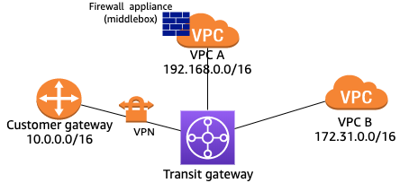
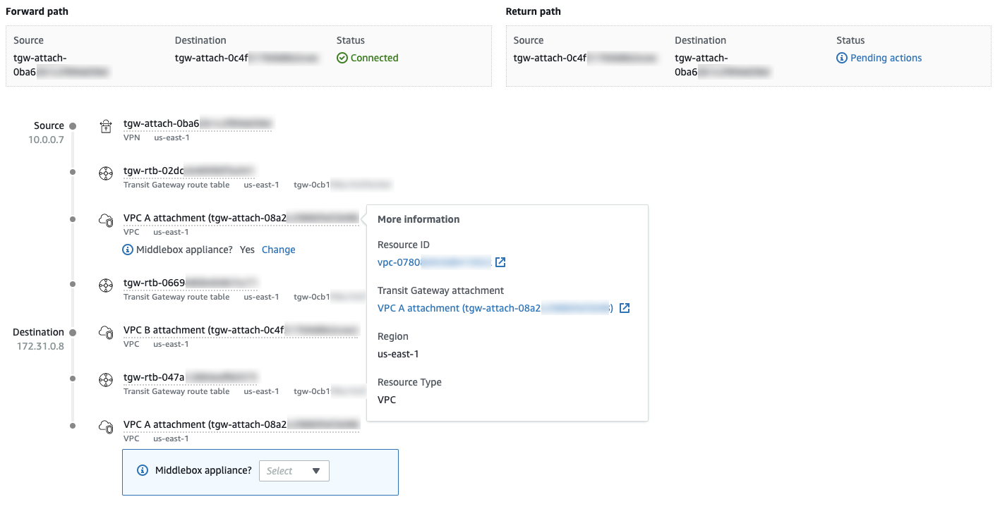

# Example: Route analysis with a

middlebox configuration

If you've configured a VPC to act as a middlebox appliance for inspecting traffic that
flows to other parts of your network, you can indicate the location of the appliance in
the route analysis. In the following example, the transit gateway has two VPC
attachments and a VPN attachment. VPC A runs a firewall appliance (middlebox) that
inspects the traffic that flows between the VPN connection and VPC B.

In the Route Analyzer, you can specify the location of the middlebox appliance as
follows:

1. Under **Source**, specify the transit gateway and the VPN
   attachment. Specify an IP address from the range of the on-premises network, for
   example, `10.0.0.7`.
2. Under **Destination**, specify the transit gateway and the
   attachment for VPC B. Specify an IP address from the CIDR block of VPC B, for
   example, `172.31.0.8`.
3. For **Middlebox appliance?**, choose
   **Include**.
4. Run the route analysis.
5. For the **Middlebox appliance?** sections for the transit
   gateway attachment for VPC A, choose **Yes**.

You can choose the ID of any resource in the path to view more information
about that resource.

