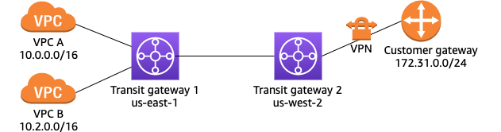
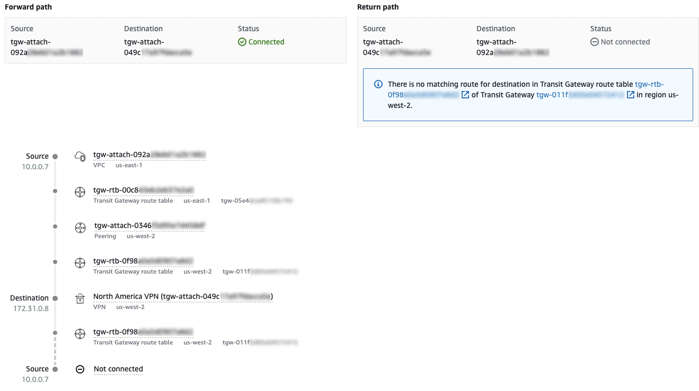

# Example: Route analysis for peered transit

gateways

In the following example, transit gateway 1 has two VPC attachments, and a peering
attachment to transit gateway 2. Transit gateway 2 has a Site-to-Site VPN attachment to your
on-premises network. You want to use the Route Analyzer to ensure that the VPCs and
Site-to-Site VPN connections can route traffic to each other through the transit gateways.

In the Route Analyzer, do the following:

1. Under **Source**, specify transit gateway 1 and the transit
   gateway attachment for VPC A. Specify an IP address from the CIDR block of VPC
   A, for example, `10.0.0.7`.
2. Under **Destination**, specify transit gateway 2 and the VPN
   attachment. Specify an IP address from the range of the on-premises network, for
   example, `172.31.0.8`.
3. Ensure that **Include return path in results** is
   selected.
4. Run the route analysis. In the results, verify the path between the source and
   destination. For example, the following results indicate that there is a forward
   path from transit gateway 1 to transit gateway 2, but no return path. Check the
   route table for transit gateway 2, and ensure that there is a static route that
   points to the peering attachment.

 5. To run the analysis between VPC B and the VPN connection, modify the
information under **Source**. Choose the transit gateway
attachment for VPC B, and specify an IP address from the CIDR block of VPC B,
for example, `10.2.0.9`. 6. Reload the results and verify the path between the source and
destination.
For more information about the routing configuration for this scenario, see the [transit gateway peering example](../../../vpc/latest/tgw/how-transit-gateways-work.md#TGW_Scenarios "../../../vpc/latest/tgw/how-transit-gateways-work.md#TGW_Scenarios").
