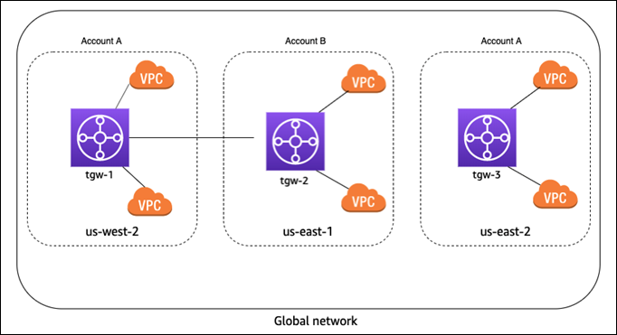
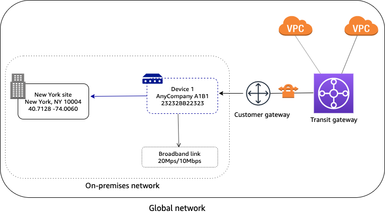
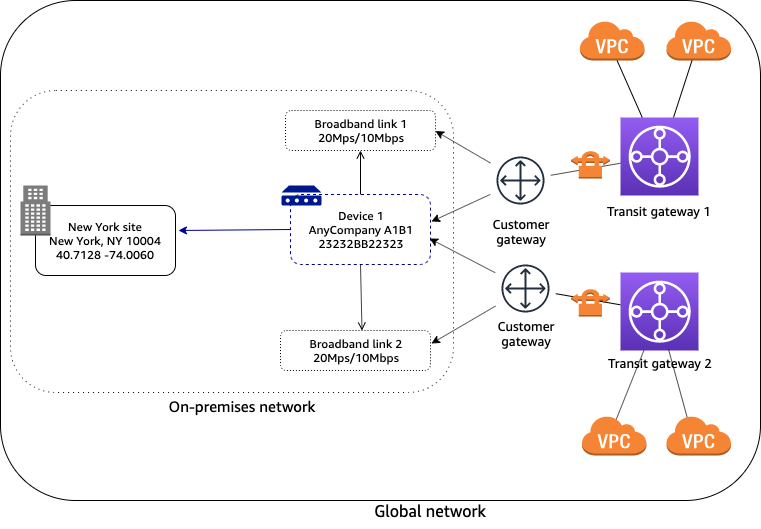
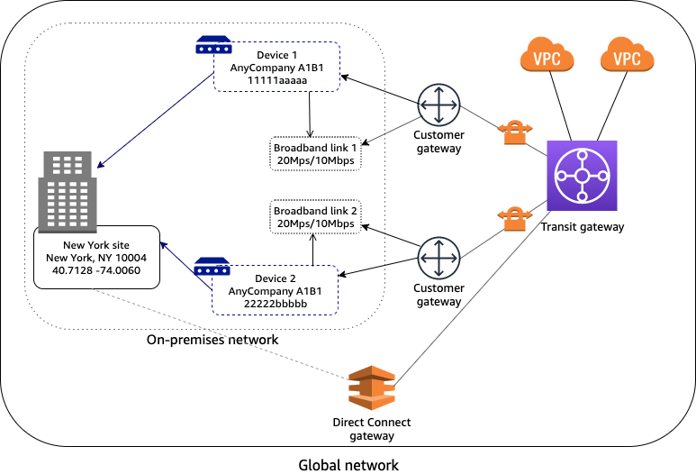
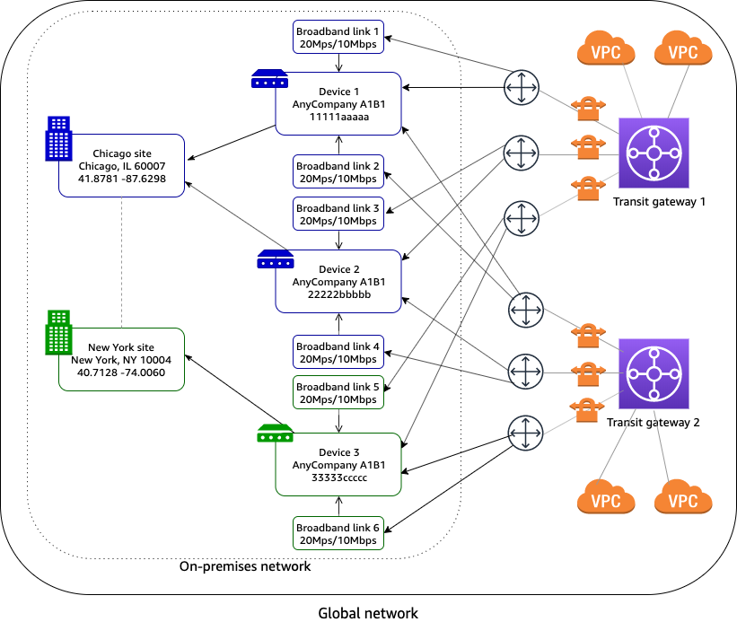
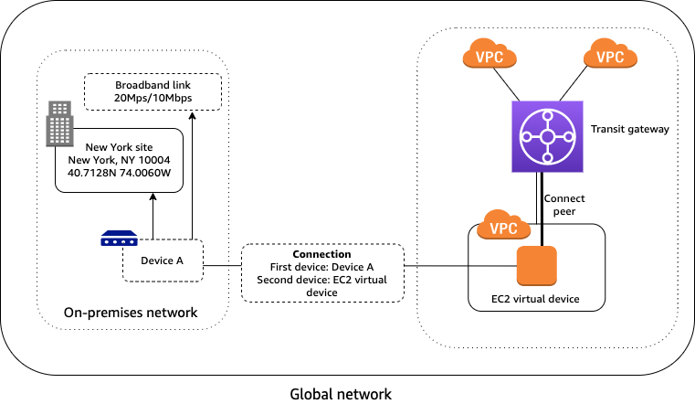

# AWS Global Networks for Transit Gateways scenarios

The following are common use cases and scenarios for using AWS Global Networks for Transit Gateways to manage your
transit gateways.

###### Contents

- [AWS-only
  multi-Region and multi-account global network](#scenario-aws-only-global-network "#scenario-aws-only-global-network")
- [Single device with a single VPN connection](#scenario-one-device-one-vpn "#scenario-one-device-one-vpn")
- [Device with multiple VPN connections](#scenario-device-multiple-vpns "#scenario-device-multiple-vpns")
- [Multi-device and multi-link site](#scenario-multi-device-site "#scenario-multi-device-site")
- [SD-WAN connecting to AWS](#scenario-wan-to-aws "#scenario-wan-to-aws")
- [Connection between devices](#scenario-tgw-connect "#scenario-tgw-connect")

## AWS-only

multi-Region and multi-account global network

In this scenario, your AWS network consists of three transit gateways. You own
transit gateways `tgw-1` and `tgw-3`. Transit gateway
`tgw-1` has a peering attachment with transit gateway `tgw-2`
that's in a different AWS account. Your entire network is within AWS, and does not
consist of on-premises resources.

For this scenario, do the following in Network Manager:

- Create a global network. For more information, see [Create a global network using AWS Network Manager](global-networks-creating.md "global-networks-creating.md").
- Register the transit gateways `tgw-1` and `tgw-3` with
  your global network. For more information, see [Register a transit gateway using AWS Network Manager](register-tgw.md "register-tgw.md").

When you register `tgw-1`, the transit gateway peering attachment is
included in the global network, and you can see information about `tgw-2`.
However, any attachments for `tgw-2` are not included in your global network.
To see attachments for `tgw-2,` you must enable multi-account access.

- This enables trusted access for global networks and allows for registering delegated
  administrators. For more information enabling trusted access and registering
  delegated administrators, see [Multi-account in AWS Global Networks for Transit Gateways](nm-multi-account.md "nm-multi-account.md").
- Register the `tgw-2` transit gateway with your global network. For more
  information, see [Transit gateway registrations in AWS Global Networks for Transit Gateways](tgw-registrations.md "tgw-registrations.md").

## Single device with a single VPN connection

In the following scenario, your global network consists of a single site with a single
device and link. The site is connected to your AWS network through a Site-to-Site VPN attachment on
a transit gateway. Your transit gateway also has two VPC attachments.

For this scenario, do the following in Network Manager:

- Create a global network. For more information, see [Create a global network using AWS Network Manager](global-networks-creating.md "global-networks-creating.md").
- Register the transit gateway. For more information, see [Register a transit gateway using AWS Network Manager](register-tgw.md "register-tgw.md").
- Create a site, device, and link. For more information, see [Sites and links in AWS Global Networks for Transit Gateways](nm-sites.md "nm-sites.md") and [Devices in AWS Global Networks for Transit Gateways](nm-devices.md "nm-devices.md").
- Associate the device with the site and with the link. For more information,
  see [Associate or disassociate a device
  link using AWS Network Manager](nm-device-link-associate.md "nm-device-link-associate.md").
- Associate the customer gateway (for the transit gateway Site-to-Site VPN attachment) with
  the device, and optionally, the link. For more information, see [Customer gateway associations](gw-association.md#cgw-associations "gw-association.md#cgw-associations").

## Device with multiple VPN connections

In the following scenario, your on-premises network consists of a device with two
Site-to-Site VPN connections to AWS. The device is associated with two customer gateways on two
different transit gateways. Each VPN connection uses a separate link. To indicate which
link applies to which VPN connection, you associate the customer gateway with both the
device and the corresponding link.

For this scenario, do the following in global networks:

- Create a global network. For more information, see [Create a global network using AWS Network Manager](global-networks-creating.md "global-networks-creating.md").
- Register the transit gateways. For more information, see [Register a transit gateway using AWS Network Manager](register-tgw.md "register-tgw.md").
- Create a site, device, and link. For more information, see [Sites and links in AWS Global Networks for Transit Gateways](nm-sites.md "nm-sites.md") and [Devices in AWS Global Networks for Transit Gateways](nm-devices.md "nm-devices.md").
  />.
- Associate the device with the site and both links. For more information, see
  [Associate or disassociate a device
  link using AWS Network Manager](nm-device-link-associate.md "nm-device-link-associate.md").
- Associate each customer gateway with the device and the corresponding link.
  For more information, see [Customer gateway associations](gw-association.md#cgw-associations "gw-association.md#cgw-associations").

## Multi-device and multi-link site

In the following scenario, your on-premises network consists of a site with two
devices and two separate Site-to-Site VPN connections to AWS. For example, in a single building or
campus, you might have multiple devices connected to AWS resources. Each device is
associated with a customer gateway that's attached to your transit gateway.

Your AWS network is also connected to your on-premises network though an Direct Connect
gateway, which is an attachment on your transit gateway.

For this scenario, do the following in global networks:

- Create a global network. For more information, see [Create a global network using AWS Network Manager](global-networks-creating.md "global-networks-creating.md").
- Register the transit gateway. For more information, see [Register a transit gateway using AWS Network Manager](register-tgw.md "register-tgw.md").
- Create one site, two devices, and two links. For more information, see [Sites and links in AWS Global Networks for Transit Gateways](nm-sites.md "nm-sites.md") and [Devices in AWS Global Networks for Transit Gateways](nm-devices.md "nm-devices.md").
- Associate each device with the corresponding link. For more information, see
  [Associate or disassociate a device
  link using AWS Network Manager](nm-device-link-associate.md "nm-device-link-associate.md").
- Associate each customer gateway with the corresponding device and link. For
  more information, see [Customer gateway associations](gw-association.md#cgw-associations "gw-association.md#cgw-associations").

## SD-WAN connecting to AWS

In the following example, your on-premises network consists of two sites. The Chicago
site has two devices and the New York site has one device. Your AWS network consists of
two transit gateways. All devices are associated with customer gateways (Site-to-Site VPN
attachments) on both transit gateways.

Your on-premises network is managed using SD-WAN. The SD-WAN controller creates Site-to-Site VPN
connections to the transit gateways, and creates the device, site, and link resources in
Network Manager. This automates connectivity and enables you to get a full view of your network in
global networks. The SD-WAN controller can also use global networks events and metrics to enhance its
dashboard.

For more information about Partners who can help you set up your Site-to-Site VPN connections,
see [AWS Network Manager](https://aws.amazon.com/transit-gateway/network-manager "https://aws.amazon.com/transit-gateway/network-manager").

## Connection between devices

In the following scenario, your AWS network consists of a transit gateway with a [Connect attachment](../../../vpc/latest/tgw/tgw-connect.md "../../../vpc/latest/tgw/tgw-connect.md") to a VPC that contains a virtual
appliance on an EC2 instance. A Connect peer (GRE tunnel) is established between the
transit gateway and the appliance. The appliance is connected to a physical device in your
on-premises network through a connection.

For this scenario, do the following in global networks:

- Create a global network. For more information, see [Create a global network using AWS Network Manager](global-networks-creating.md "global-networks-creating.md").
- Register the transit gateway. For more information, see [Register a transit gateway using AWS Network Manager](register-tgw.md "register-tgw.md").
- Create a site, device, and link for your on-premises network. For more information, see [Sites and links in AWS Global Networks for Transit Gateways](nm-sites.md "nm-sites.md") and [Devices in AWS Global Networks for Transit Gateways](nm-devices.md "nm-devices.md").
- Associate the device with the site and with the link. For more information,
  see [Associate or disassociate a device
  link using AWS Network Manager](nm-device-link-associate.md "nm-device-link-associate.md").
- Create a device for the EC2 virtual device. For visualization in the global networks
  console, specify the AWS location of the device (for example, the Availability
  Zone). For more information, see [Devices in AWS Global Networks for Transit Gateways](nm-devices.md "nm-devices.md").
- Create a connection between the on-premises device and the virtual device. For
  more information, see [Associate or disassociate an on-premises
  link using AWS Network Manager](nm-devices-onprem.md "nm-devices-onprem.md").
- Associate the Connect peer with the on-premises device. For more information,
  see [Associate or disassociate a Connect peer using AWS Network Manager](nm-devices-connect-peer.md "nm-devices-connect-peer.md").
