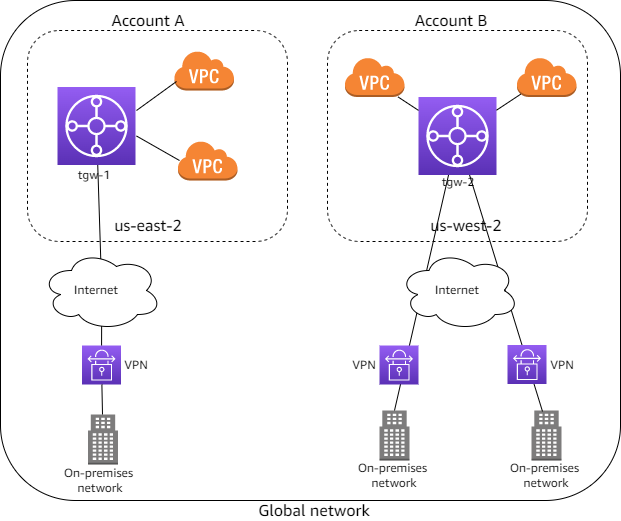

# How AWS Global Networks for Transit Gateways works

To use global networks for transit gateways, you first create a _global network_ to
represent your network. Initially, the global network is empty. You then register your
existing transit gateways and define your on-premises resources in the global network. This
enables you to visualize and monitor your AWS resources and your on-premises networks
through the global networks dashboard on the AWS Network Manager console.

After you create your global network, you can monitor your networks through this
dashboard. You can view network activity and health using Amazon CloudWatch metrics and Amazon CloudWatch Events.
The global networks dashboard can help you identify whether issues in your network are caused by AWS
resources, your on-premises resources, or the connections between them.

global networks does not create, modify, or delete your transit gateways and their attachments. To
work with transit gateways, use the Amazon VPC console and the Amazon EC2 APIs.

###### Contents

- [Register transit gateways](#nm-how-it-works-tgws "#nm-how-it-works-tgws")
- [Define and associate your on-premises
  network](#nm-how-it-works-on-premises "#nm-how-it-works-on-premises")
- [Supported resource types](#nm-supported-resource-type "#nm-supported-resource-type")

## Register transit gateways

You can register transit gateways that are in the same AWS account as your global
network. When you register a transit gateway, the following transit gateway attachments
are automatically included in your global network:

- VPCs
- Site-to-Site VPN connections
- AWS Direct Connect gateways
- Transit Gateway Connect
- Transit gateway peering connections

When you register a transit gateway that has a peering attachment, you can view the
peer transit gateway in your global network, but you cannot view its attachments. If you
own the peer transit gateway, you can register it in your global network to view its
attachments.

If you delete a transit gateway, it's automatically deregistered from your global
network.

### Multi-Region and multi-account network

You can create a global network that includes transit gateways in multiple AWS
Regions and accounts. This enables you to monitor the global health of your AWS
network. In the following diagram, the global network includes a transit gateway in
the `us-east-2` Region from Account A and a transit gateway in the
`us-west-2` Region from Account B. Each transit gateway has VPC and
VPN attachments. You can use the Network Manager console to view and monitor both of the
transit gateways and their attachments.

## Define and associate your on-premises

network

To represent your on-premises network, you add _devices_,
_links_, and _sites_ to your global network.
A site represents the physical location of your branch, office, store, campus, or
data center. When you add a site, you can specify the location information,
including the physical address and coordinates.

A device represents the physical or virtual appliance that establishes connectivity
with a transit gateway over an IPsec tunnel. A link represents a single outbound
internet connection used by a device, for example, a 20-Mbps broadband link.

When you create a device, you can specify its physical location, and the site where
it's located. A device can have a more specific location than the site, for example, a
building in a campus or a floor in a building. When you create a link, you create it for
a specific site. You can then associate a device with a link.

To connect your on-premises network to your AWS resources, associate a customer
gateway that's in your global network with the device. If you've created a device to
represent a virtual appliance sitting inside your VPC, and you've established a
Connect peer from your virtual appliance to your AWS Transit Gateway, associate a Connect peer
with the device to connect your virtual appliance network to your AWS resources. In
the following diagram, the on-premises network is connected to a transit gateway through
a Site-to-Site VPN connection.

You can have multiple devices in a site, which you can associate a device with
multiple links. For examples, see [AWS Global Networks for Transit Gateways scenarios](gnw-scenarios.md "gnw-scenarios.md").

You can work with one of our Partners in the AWS Partner Network (APN) to provision
and connect your on-premises networks. For more information, see [AWS Network Manager](https://aws.amazon.com/transit-gateway/network-manager "https://aws.amazon.com/transit-gateway/network-manager").

## Supported resource types

After you register a transit gateway, you can view and monitor the resources in your global
network.

| **Amazon VPC resources**          |
| --------------------------------- | -------------------------------------------------------------------------------------------------------------------------------------------- |
| **Resource**                      | **Related resources**                                                                                                                        |
| Transit gateway                   | • Transit gateway attachment • Transit gateway route table                                                                                |
| Transit gateway attachment        | • Direct Connect gateway • Transit gateway • Transit gateway attachment • Transit Gateway Connect peer • VPC • VPN connection |
| Transit gateway route table       | • Transit gateway                                                                                                                            |
| Transit Gateway Connect peer      | • Device • Transit gateway attachment                                                                                                     |
| **AWS VPN resources**             |
| **Resource**                      | **Related resources**                                                                                                                        |
| Customer gateway                  | • Device • VPN connection                                                                                                                 |
| VPN connection                    | • Customer gateway • Transit gateway attachment                                                                                           |
| **AWS Direct Connect resources**  |
| **Resource**                      | **Related resources**                                                                                                                        |
| Direct Connect connection         | • Virtual interface                                                                                                                          |
| Direct Connect gateway            | • Transit gateway attachment • Virtual interface                                                                                          |
| Virtual interface                 | • Direct Connect connection • Direct Connect gateway                                                                                      |
| **AWS Network Manager resources** |
| **Resource**                      | **Related resources**                                                                                                                        |
| Connection                        | • Device                                                                                                                                     |
| Device                            | • Connection • Customer gateway • Link • Site • Transit Gateway Connect peer                                                     |
| Link                              | • Device • Site                                                                                                                           |
| Site                              | • Device • Link                                                                                                                           |
