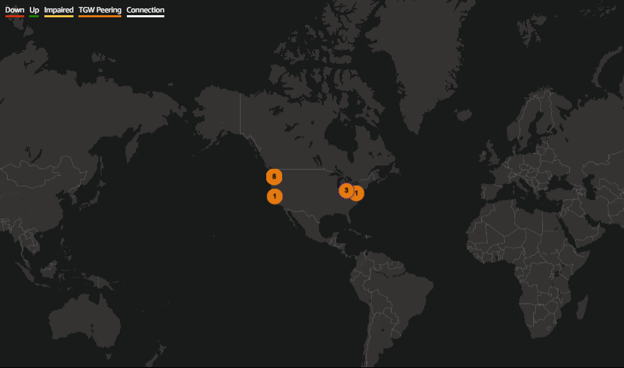
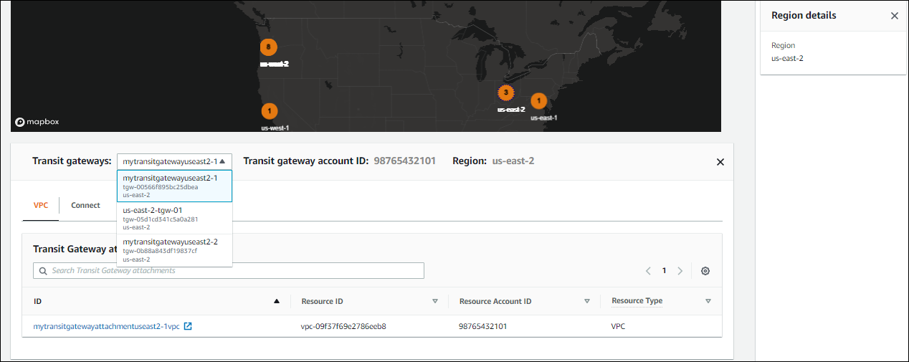
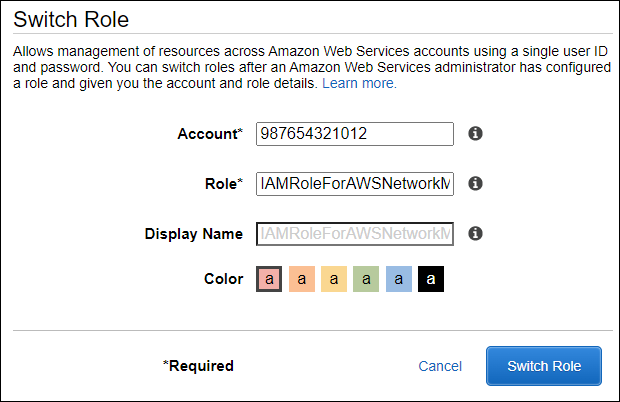
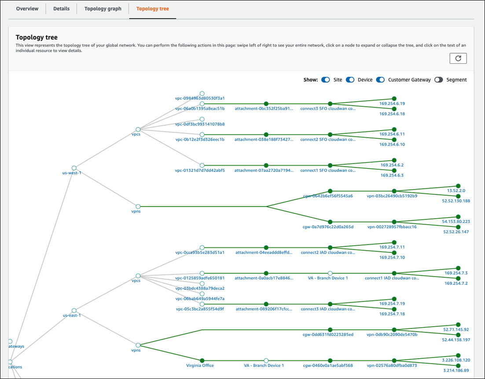

# Access transit gateway network dashboards using AWS Network Manager

he AWS Network Manager console provides a group of dashboards for AWS Global Networks for Transit Gateways, allowing you to view and
monitor your network of transit gateways. Dashboards include information about network resources,
their geographic locations, the network topology, and the logical network associations. If
you want to view the dashboards for a specific transit gateway, see [Access transit gateway dashboards using AWS Network Manager](nm-visualize-tgw.md "nm-visualize-tgw.md").

###### Topics

- [Overview](#cloudwan-tgw-overview "#cloudwan-tgw-overview")
- [Geography](#cloudwan-tgw-geography "#cloudwan-tgw-geography")
- [Topology tree](#cloudwan-tgw-topology "#cloudwan-tgw-topology")
- [Events](#cloudwan-tgw-events "#cloudwan-tgw-events")
- [Monitoring](#cloudwan-tgw-monitoring "#cloudwan-tgw-monitoring")
- [Route analyzer](#cloudwan-tgw-routes "#cloudwan-tgw-routes")

## Overview

The Overview page displays details about your transit gateway network, the VPN status,
the Connect peer status, and any network events affecting your transit gateways.

###### To access transit gateway network details

1. Access the Network Manager console at [https://console.aws.amazon.com/networkmanager/home/](https://console.aws.amazon.com/networkmanager/home "https://console.aws.amazon.com/networkmanager/home").
2. Under **Connectivity**, choose **Global Networks**.
3. On the **Global networks** page, choose the global network ID.
4. In the navigation pane, choose **Transit Gateway network**.
5. The **Overview** page opens by default, showing information about your transit gateways.
6. On the **Overview** page you contains the following information:
   - Your transit gateway network **Inventory**:

| Icon                           | Description                                                                                                                                                                                              |
| ------------------------------ | -------------------------------------------------------------------------------------------------------------------------------------------------------------------------------------------------------- | ------------------------------------------------------------------------------------------------------------------------------------------------------------------------------------------------------------------------------------------------------------------------------------------------------------------------------------------------------------------------------------------------------------------------------------------------------------------------------------------------------------------------------------------------------------------------------------------------------------------------------------------------------------------------------------------------------------------------------------------------------------------------------------------------------------------------------------------------------------------------------------------------------------------------------------------------------------------------------------------------------------------------------------------------------------------------------------------------------------------------------------------------------------------------------------------------------------------------------------------------------------------------------------------------------------------------------------------------------------------------------------------------------------------------------------------------------------------------------------------------------------------------------------------------------------------------------------------------------------------------------------------------------------------------------------------------------------------------------------------------------------------------------------------------------------------------------------------------------------------------------------------------------------------------------------------------------------------------------------------------------------------------------------------------------------------------------------------------------------------------------------------------------------------------------------------------------------------------------------------------------------------------------------------------------------------------------------------------------------------------------------------------------------------------------------------------------------------------------------------------------------------------------------------------------------------------------------------------------------------------------------------------------------------------------------------------------------------------------------------------------------------------------------------------------------------------------------------------------------------------------------------------------------------------------------------------------------------------------------------------------------------------------------------------------------------------------------------------------------------------------------------------------------------------------------------------------------------------------------------------------------------------------------------------------------------------------------------------------------------------------------------------------------------------------------------------------------------------------------------------------------------------------------------------------------------------------------------------------------------------------------------------------------------------------------------------------------------------------------------------------------------------------------------------------------------------------------------------------------------------------------------------------------------------------------------------------------------------------------------------------------------------------------------------------------------------------------------------------------------------------------------------------------------------------------------------------------------------------------------------------------------------------------------------------------------------------------------------------------------------------------------------------------------------------------------------------------------------------------------------------------------------------------------------------------------------------------------------------------------------------------------------------------------------------------------------------------------------------------------------------------------------------------------------------------------------------------------------------------------------------------------------------------------------------------------------------------------------------------------------------------------------------------------------------------------------------------------------------------------------------------------------------------------------------------------------------------------------------------------------------------------------------------------------------------------------------------------------------------------------------------------------------------------------------------------------------------------------------------------------------------------------------------------------------------------------------------------------------------------------------------------------------------------------------------------------------------------------------------------------------------------------------------------------------------------------------------------------------------------------------------------------------------------------------------------------------------------------------------------------------------------------------------------------------------------------------------------------------------------------------------------------------------------------------------------------------------------------------------------------------------------------------------------------------------------------------------------------------------------------------------------------------------------------------------------------------------------------------------------------------------------------------------------------------------------------------------------------------------------------------------------------------------------------------------------------------------------------------------------------------------------------------------------------------------------------------------------------------------------------------------------------------------------------------------------------------------------------------------------------------------------------------------------------------------------------------------------------------------------------------------------------------------------------------------------------------------------------------------------------------------------------------------------------------------------------------------------------------------------------------------------------------------------------------------------------------------------------------------------------------------------------------------------------------------------------------------------------------------------------------------------------------------------------------------------------------------------------------------------------------------------------------------------------------------------------------------------------------------------------------------------------------------------------------------------------------------------------------------------------------------------------------------------------------------------------------------------------------------------------------------------------------------------------------------------------------------------------------------------------------------------------------------------------------------------------------------------------------------------------------------------------------------------------------------------------------------------------------------------------------------------------------------------------------------------------------------------------------------------------------------------------------------------------------------------------------------------------------------------------------------------------------------------------------------------------------------------------------------------------------------------------------------------------------------------------------------------------------------------------------------------------------------------------------------------------------------------------------------------------------------------------------------------------------------------------------------------------------------------------------------------------------------------------------------------------------------------------------------------------------------------------------------------------------------------------------------------------------------------------------------------------------------------------------------------------------------------------------------------------------------------------------------------------------------------------------------------------------------------------------------------------------------------------------------------------------------------------------------------------------------------------------------------------------------------------------------------------------------------------------------------------------------------------------------------------------------------------------------------------------------------------------------------------------------------------------------------------------------------------------------------------------------------------------------------------------------------------------------------------------------------------------------------------------------------------------------------------------------------------------------------------------------------------------------------------------------------------------------------------------------------------------------------------------------------------------------------------------------------------------------------------------------------------------------------------------------------------------------------------------------------------------------------------------------------------------------------------------------------------------------------------------------------------------------------------------------------------------------------------------------------------------------------------------------------------------------------------------------------------------------------------------------------------------------------------------------------------------------------------------------------------------------------------------------------------------------------------------------------------------------------------------------------------------------------------------------------------------------------------------------------------------------------------------------------------------------------------------------------------------------------------------------------------------------------------------------------------------------------------------------------------------------------------------------------------------------------------------------------------------------------------------------------------------------------------------------------------------------------------------------------------------------------------------------------------------------------------------------------------------------------------------------------------------------------------------------------------------------------------------------------------------------------------------------------------------------------------------------------------------------------------------------------------------------------------------------------------------------------------------------------------------------------------------------------------------------------------------------------------------------------------------------------------------------------------------------------------------------------------------------------------------------------------------------------------------------------------------------------------------------------------------------------------------------------------------------------------------------------------------------------------------------------------------------------------------------------------------------------------------------------------------------------------------------------------------------------------------------------------------------------------------------------------------------------------------------------------------------------------------------------------------------------------------------------------------------------------------------------------------------------------------------------------------------------------------------------------------------------------------------------------------------------------------------------------------------------------------------------------------------------------------------------------------------------------------------------------------------------------------------------------------------------------------------------------------------------------------------------------------------------------------------------------------------------------------------------------------------------------------------------------------------------------------------------------------------------------------------------------------------------------------------------------------------------------------------------------------------------------------------------------------------------------------------------------------------------------------------------------------------------------------------------------------------------------------------------------------------------------------------------------------------------------------------------------------------------------------------------------------------------------------------------------------------------------------------------------------------------------------------------------------------------------------------------------------------------------------------------------------------------------------------------------------------------------------------------------------------------------------------------------------------------------------------------------------------------------------------------------------------------------------------------------------------------------------------------------------------------------------------------------------------------------------------------------------------------------------------------------------------------------------------------------------------------------------------------------------------------------------------------------------------------------------------------------------------------------------------------------------------------------------------------------------------------------------------------------------------------------------------------------------------------------------------------------------------------------------------------------------------------------------------------------------------------------------------------------------------------------------------------------------------------------------------------------------------------------------------------------------------------------------------------------------------------------------------------------------------------------------------------------------------------------------------------------------------------------------------------------------------------------------------------------------------------------------------------------------------------------------------------------------------------------------------------------------------------------------------------------------------------------------------------------------------------------------------------------------------------------------------------------------------------------------------------------------------------------------------------------------------------------------------------------------------------------------------------------------------------------------------------------------------------------------------------------------------------------------------------------------------------------------------------------------------------------------------------------------------------------------------------------------------------------------------------------------------------------------------------------- |
| AWS Cloud WAN transit gateways | **Transit gateways** The total number of registered transit gateways in your global network. Choose the link to open the **Transit gateways** page to view more information about your transit gateways. |
| AWS Cloud WAN sites            | **Sites** The total number of sites associated with your transit gateways. Choose the link to open the **Sites** page to view more information about your transit gateway sites.                         |
| AWS Cloud WAN devices          | **Devices** The total number of devices associated with your transit gateways. Choose the link to open the **Devices** page to view more information about your transit gateway devices.                 |  • The **Transit gateways VPN status**. The following is displayed: + **ID** – The ID of the transit gateway. Choose the link to open details about the transit gateway. + **Name** – Name of the transit gateway. + **Region** – Region where the transit gateway is located + **Down VPN** – The percentage of your total transit gateway VPNs that are down. + **Impaired VPN** –The percentage of your total VPNs that are impaired. + **Up VPN** – The percentage of your total VPNs that are up.  • The **Transit gateways connect peer status**. The following is displayed: + **ID** – The ID of the transit gateway. + **Name** – Name of the transit gateway. + **Region** – Region where the transit peer is located + **Down Connect peer** – The percentage of your total transit gateway Connect peers that are down. + **Impaired Connect peer** – The percentage of your total transit gateway Connect peers that are impaired. + **Up VPN** – The percentage of your total transit gateway Connect peers that are up.  • The **Network events summary** displays CloudWatch Events number of core network attachments per edge, shown as a stacked column chart. (Optional) Metrics and events use the default time set up in the CloudWatch Events event. To set a custom time frame, choose **Custom** and then choose a **Relative** or **Absolute** time, and then choose if you want to see that date range in **UTC** or the edge location's **Local time zone**. Choose **Add to dashboard** to add this metric to your CloudWatch dashboard. For more information about using CloudWatch dashboards, see [Using Amazon CloudWatch Dashboards](../../../AmazonCloudWatch/latest/monitoring/CloudWatch_Dashboards.md "../../../AmazonCloudWatch/latest/monitoring/CloudWatch_Dashboards.md") in the _Amazon CloudWatch User Guide_. ###### Note The **Add to dashboard** option only works if your registered transit gateway is in the US West (Oregon) Region. ## Geography The Geography page displays a world map showing the locations of your transit gateway network. ###### To access a geographic map of your transit gateways 1. Access the Network Manager console at [https://console.aws.amazon.com/networkmanager/home/](https://console.aws.amazon.com/networkmanager/home "https://console.aws.amazon.com/networkmanager/home"). 2. Under **Connectivity**, choose **Global Networks**. 3. On the **Global networks** page, choose the global network ID. 4. In the navigation pane, choose **Transit Gateway network**. 5. The **Overview** page opens by default, showing information about your transit gateways. 6. Choose the **Geography** tab. A world map displays, showing you the locations of the following:  • **AWS** **TGWs** and **VPCs**.  • The **Connectivity** of **VPNs**, **Direct Connects**, and **Connect peers**.  • **On-premises** **Sites** and **Devices**.  • **Not associated** **Sites** and **Devices**. 7. In the following example, there are four AWS Regions, **us-west-1** **us-west-2**, **us-east-1**, and **us-east-2**. Each Region is labeled and represented by a number, indicating the number of transit gateways in that Region. For example, **us-east-2** is represented by the number `3`, indicating that there are three network resources associated with the us-west-2 Region.  8. If your account is a delegated administrator in a multi-account environment, you can view details about the transit gateways for different accounts. 9. Choose the number representing a Region. For example, choose `3`. The following information displays:  • The right pane shows the AWS Region, us-east-2.  • A bottom panel shows with a **Transit Gateways** dropdown list option, displaying each transit gateway in that Region. In this example, there are `3` transit gateways in us-east-2. Choose a transit gateway from the dropdown list to view details about that transit gateway. In this example, you can see that the **Resource Account ID** for this transit gateway is another account in the multi-account environment, `98765432101`.  10. To view more details about the transit gateway, choose the ID link to open the **Transit gateway details** page for the gateway. If your global network is part of a multi-account environment, you can choose an **ID** from a member account and view details about that attachment. The **Resource Account ID** column displays the account ID that the transit gateway belongs to. Viewing details about a member's resources prompts you to use the Network Manager console to switch roles to the member account where the resource is located. ###### Note Switching roles logs you out of the current account and into the member account associated with the attachment. ###### To view resource details in a member account 1. When choosing a link to a member account, you're prompted to switch console roles:  2. The following values populate the **Switch Role** screen. Keep the following values:  • **Account** — The account ID for the member account that the resource is associated with.  • **Role** — `IAMRoleForAWSNetworkManagerCrossAccountResourceAccess` is the required IAM role for accessing resources across multiple accounts. 3. Choose **Switch Role**. You're logged out of your current account and into that member account. A new tab opens showing the details of the resource. For example, if you choose a VPC resource, the VPC resource page opens for the member account that owns the resource. 4. Depending on the delegated permission level assigned to the delegated administrators and the management account when trusted access was enabled, you can either view information (read-only permission) about the resource or add/modify (administrator permission) the resource. 5. To return to the original member account, choose one of the following:  • On your current tab, choose the browser **Back** button. On the **Switch Role** login screen, enter the **Account** ID of the account you want, and then choose **Switch Role**.  • If you haven't closed it, choose the tab for the account you've just logged out of, and then choose **Reload**. ## Topology tree The **Topology tree** page shows a logical diagram of your transit gateway network. ###### To access the topology tree for a transit gateway network 1. Access the Network Manager console at [https://console.aws.amazon.com/networkmanager/home/](https://console.aws.amazon.com/networkmanager/home "https://console.aws.amazon.com/networkmanager/home"). 2. Under **Connectivity**, choose **Global Networks**. 3. On the **Global networks** page, choose the global network ID. 4. In the navigation pane, choose **Transit Gateway network**. 5. The **Overview** page opens by default, showing information about your transit gateways. 6. Choose the **Topology tree** tab. 7. By default, the **Topology tree** page displays all **Sites**, **Devices**, and**Customer Gateways** of your transit gateway and the logical relationships between them. You can filter the network tree to show specific resources types only to view information about the specific resource it represents. The line colors represent the state of the relationships between AWS and the on-premises resources. The following example shows the topology tree for two edge locations, **us-west-1** and **us-east-1**.  8. In the **Topology tree**, choose an attachment. The attachment details display in the left pane. 9. If your global network is part of a multi-account environment, you can choose a **Resource ID** from a member account and view details about that attachment. Viewing details about a member's resources prompts you to switch Network Manager console roles to the member account where the resource is located. ###### Note Switching roles logs you out of the current account and into the delegated administrator account associated with the attachment. ###### To view resource details in a member account 1. When choosing a link to a member account, you're prompted to switch console roles:  2. The following values populate the **Switch Role** screen. Keep the following values:  • **Account** — The account ID for the member account that the resource is associated with.  • **Role** — `IAMRoleForAWSNetworkManagerCrossAccountResourceAccess` is the required IAM role for accessing resources across multiple accounts. 3. Choose **Switch Role**. You're logged out of your current account and into that member account. A new tab opens showing the details of the resource. For example, if you choose a VPC resource, the VPC resource page opens for the member account that owns the resource. 4. Depending on the delegated permission level assigned to the delegated administrators and the management account when trusted access was enabled, you can either view information (read-only permission) about the resource or add/modify (administrator permission) the resource. 5. To return to the original member account, choose one of the following:  • On your current tab, choose the browser **Back** button. On the **Switch Role** login screen, enter the **Account** ID of the account you want, and then choose **Switch Role**.  • If you haven't closed it, choose the tab for the account you've just logged out of, and then choose **Reload**. ## Events Track your transit gateway events using Amazon EventBridge that delivers a near-real-time stream of system events that describe changes in your resources. Using simple rules that you can quickly set up, you can match events and route them to one or more target functions or streams. For more information, see the [Amazon EventBridge User Guide](../../../eventbridge/latest/userguide.md "../../../eventbridge/latest/userguide.md"). ###### To access transit gateway network events 1. Access the Network Manager console at [https://console.aws.amazon.com/networkmanager/home/](https://console.aws.amazon.com/networkmanager/home "https://console.aws.amazon.com/networkmanager/home"). 2. Under **Connectivity**, choose **Global Networks**. 3. On the **Global networks** page, choose the global network ID. 4. In the navigation pane, choose **Transit Gateway network**. 5. The **Overview** page opens by default, showing information about your transit gateways. 6. Choose the **Events** tab. The **Events** section updates with the events that occurred during the time frame. (Optional) Metrics and events use the default time set up in the CloudWatch Events event. To set a custom time frame, choose **Custom** and then choose a **Relative** or **Absolute** time, and then choose if you want to see that date range in **UTC** or the edge location's **Local time zone**. Choose **Add to dashboard** to add this metric to your CloudWatch dashboard. For more information about using CloudWatch dashboards, see [Using Amazon CloudWatch Dashboards](../../../AmazonCloudWatch/latest/monitoring/CloudWatch_Dashboards.md "../../../AmazonCloudWatch/latest/monitoring/CloudWatch_Dashboards.md") in the _Amazon CloudWatch User Guide_. ###### Note The **Add to dashboard** option only works if your registered transit gateway is in the US West (Oregon) Region. ## Monitoring You can monitor your transit gateways using Amazon CloudWatch which collects raw data and processes it into readable, near-real-time metrics. These statistics are kept for 15 months, so that you can access historical information and gain a better perspective on how your network is performing. You can also set alarms that watch for certain thresholds, and send notifications or take actions when those thresholds are met. For more information, see the [Amazon CloudWatch User Guide](../../../AmazonCloudWatch/latest/monitoring.md "../../../AmazonCloudWatch/latest/monitoring.md"). On the monitoring page you can view usage metrics for your transit gateways, filtering by specific transit gateways. ###### To access transit gateway network monitoring details 1. Access the Network Manager console at [https://console.aws.amazon.com/networkmanager/home/](https://console.aws.amazon.com/networkmanager/home "https://console.aws.amazon.com/networkmanager/home"). 2. Under **Connectivity**, choose **Global Networks**. 3. On the **Global networks** page, choose the global network ID. 4. In the navigation pane, choose **Transit Gateway network**. 5. The **Overview** page opens by default, showing information about your transit gateways. 6. Choose the **Monitoring** tab. 7. Choose a transit gateway that you want to monitor. If you're using an account that's set up as a delegated administrator between accounts, you can choose a transit gateway from one of those other accounts. The transit gateway list displays the ID, the Region, and the account ID. 8. (Optional) Metrics and events use the default time set up in the CloudWatch Events event. To set a custom time frame, choose **Custom** and then choose a **Relative** or **Absolute** time, and then choose if you want to see that date range in **UTC** or the edge location's **Local time zone**. Choose **Add to dashboard** to add this metric to your CloudWatch dashboard. For more information about using CloudWatch dashboards, see [Using Amazon CloudWatch Dashboards](../../../AmazonCloudWatch/latest/monitoring/CloudWatch_Dashboards.md "../../../AmazonCloudWatch/latest/monitoring/CloudWatch_Dashboards.md") in the _Amazon CloudWatch User Guide_. ###### Note The **Add to dashboard** option only works if your registered transit gateway is in the US West (Oregon) Region. 9. The page updates the following transit gateway monitors:  • **Bytes in**  • **Bytes out**  • **Bytes dropped – black hole**  • **Bytes dropped – no route**  • **Packets in**  • **Packets out**  • **Packets dropped – black hole**  • **Packets dropped – no route** 10. (Optional) Choose **Add to dashboard** to add this metric to your CloudWatch dashboard. For more information about using CloudWatch dashboards, see [Using Amazon CloudWatch Dashboards](../../../AmazonCloudWatch/latest/monitoring/CloudWatch_Dashboards.md "../../../AmazonCloudWatch/latest/monitoring/CloudWatch_Dashboards.md") in the Amazon CloudWatchUser Guide. ###### Note The **Add to dashboard** option only works if your registered transit gateway is in the US West (Oregon) Region. ## Route analyzer The Route Analyzer analyzes the routing path between a specified source and destination. ###### Note Route Analyzer checks the routes on Transit Gateway route tables only ###### To analyze transit gateway routes 1. Access the Network Manager console at [https://console.aws.amazon.com/networkmanager/home/](https://console.aws.amazon.com/networkmanager/home "https://console.aws.amazon.com/networkmanager/home"). 2. Under **Connectivity**, choose **Global Networks**. 3. On the **Global networks** page, choose the global network ID. 4. In the navigation pane, choose **Transit Gateway network**. 5. The **Overview** page opens by default, showing information about your transit gateways. 6. Choose the **Route Analyzer** tab. 7. In the **Source** section,  • Choose the source **Transit Gateway** for the route that you want to analyze. If you're logged on to an account that's set up as a delegated administrator between accounts, you can choose a transit gateway from one of those other accounts. The transit gateway list displays the ID, the Region, and the account ID.  • Choose the source **Transit Gateway attachment** for the route.  • Enter either the IPv4 or IPv6 **IP address**.  • Clear the **Include return path in results** check box if you don't want . This is chosen by default.  • Choose if this is a **Middlebox appliance**. For more information on middlebox configurations, see [Route analysis with a middlebox configuration](example-route-analyzer-middlebox.md "example-route-analyzer-middlebox.md"). 8. In the Destination section,  • Choose the destination **Transit Gateway**. If you're logged on to an account that's set up as a delegated administrator between accounts, you can choose a transit gateway from one of those other accounts. The transit gateway list displays the ID, the Region, and the account ID.  • Choose the destination **Transit Gateway attachment** for the route.  • Enter either the IPv4 or IPv6 **IP address**. 9. Choose **Run route analysis**. 10. The Results of route analysis return the **Source** and **Destination** transit gateways and the current **Status**. An error message is returned if no information is found in the transit gateway route table. For more information on route tables, see [Transit gateway route tables](../../../vpc/latest/tgw/tgw-route-tables.md "../../../vpc/latest/tgw/tgw-route-tables.md"). |
