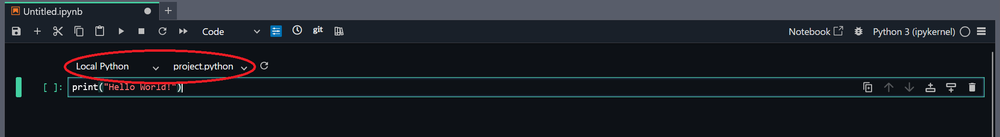
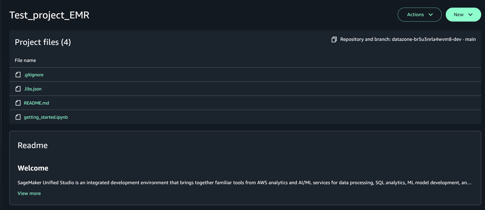

# Get started using EMR Serverless in Amazon SageMaker Unified Studio

## Overview

Amazon EMR Serverless provide a powerful way to process data at scale without managing infrastructure.
In addition to Amazon EMR on EC2 clusters, you can create and delete EMR Serverless applications directly from SageMaker
Unified Studio. EMR Serverless applications operate similarly to traditional notebooks, letting you run queries and code while
actively observing the output simultaneously.

Unlike traditional notebooks, the contents of an EMR notebook run in a client and are executed by a kernel in your EMR Serverless Application.
This means you don't need to configure a cluster to run applications, and helps you avoid over or under provisioning resources for your jobs.
EMR Serverless is ideal for applications that need responses quickly, such as interactive data analysis.

This architecture allows you to use a single EMR Serverless application on multiple clusters and run clusters on demand as it
fits your use case and needs. These are seperate from Spark applications For more general information about EMR Serverless Notebooks and Applications, see the
[EMR Management Guide](../../../emr/latest/ManagementGuide/emr-managed-notebooks.md "../../../emr/latest/ManagementGuide/emr-managed-notebooks.md").

### Getting started with EMR serverless applications

SageMaker Unified Studio provides a straightforward interface for creating EMR Serverless applications. In order to create a new EMR Serverless Application
your admin needs to enable blueprints. For more information about the blueprint setup process see [Enable or disable blueprints](../../../sagemaker-unified-studio/latest/adminguide/blueprints.md#enable-disable-blueprints "../../../sagemaker-unified-studio/latest/adminguide/blueprints.md#enable-disable-blueprints") in the _Amazon Sagemaker Unified Studio Guide_. Once blueprints are enabled:

1. From the SageMaker Unified Studio UI, navigate to the Project Management view and then select your project from the project list.
2. Select **Compute** from the navigation bar, then select Data processing. Select the Add Compute button. You'll be prompted to connect
   to an existing compute resource or create new compute resources. From there, select EMR Serverless.
3. On the **Add Compute** screen, you'll add your compute resource's name, description, and release label. You will also be prompted to select a permission
   mode. Your options are compatibility and fine-grained.
   - Compatibility mode. This permission mode allows your project to be compatible with data managed using full-table access, meaning the compute engine can access all rows and columns in the data.
     Choosing this option configures your compute to work with data assets from AWS and from external systems that you connect to from your project.
   - Fine-grained mode. This option is for data managed using fine-grained access, meaning the compute engine can only access specific rows and columns from the full
     dataset. Choosing this option configures your compute to work with data asset subscriptions from Amazon SageMaker catalog.

Your EMR Serverless compute will now be listed in your Data processing list. From here, you can connect to your EMR Serverless compute while running
a notebook.

### Connecting to an EMR Serverless compute

Once you have an EMR serverless compute added, you can connect to the compute directly from the Sagemaker Unified Studio
notebook workspace.

To connect to an EMR Serverless compute:

1. Above a code block in your Jupyter Notebook, there will be two drop down boxes. One lets you select your connection type, the other
   your compute.

 2. Select the connection type "PySpark" and then click on the drop down for your Compute. From here you can select your EMR Serverless compute
from the second drop down box. 3. Run the code in your code block. The first time you run code, it will connect to the compute and start
a session for your connection. This means that you are connected to the serverless compute, and all codeblocks
using this EMR compute this session will use this connection.

For first-time users, we recommend starting with the EMR example notebook provided (getting_started.ipynb),
which demonstrates basic operations and best practices. You can access this notebook from the Examples tab in the Unified Studio
file browser, pictured below:

Due to the nature of EMR Serverless applications, you can have multiple computes available at once. This allows you to maintain
your notebook code while connecting to different EMR applications as needed for various workloads. You can switch between applications
without modifying your notebook code, allowing you to test different configurations or work with different data processing requirements.

### (Optional) Remove or stop an EMR application

While using EMR serverless compute, you may need to stop using a particular compute either for a period of time or permanently.
You can remove or stop EMR serverless computes in those cases. Stopping a compute lets you pause a compute until you want to reactiveate it
Applications in this paused state can be reactivated whenver you want, with all definition remaining. You only incure storage costs for
stopped applications

For applications you don't intend to use again, you can delete, or remove them. This will permanently delete the application, and cannot be undone.
To access the application again you will need to recreate it. Deleting an application removes all costs associated with it including storage cost.

EMR Serverless computes can be removed from projects via the Data processing tab in your project view. Simply click the menu to the right of the
compute's name and click Remove. Removed EMR Serverless computes are deleted. You can also manually stop
an EMR Serverless compute by using the EMR Studio page on the AWS Console. For more information see Manage applications from the EMR Studio console in the
EMR Serverless user guide.
