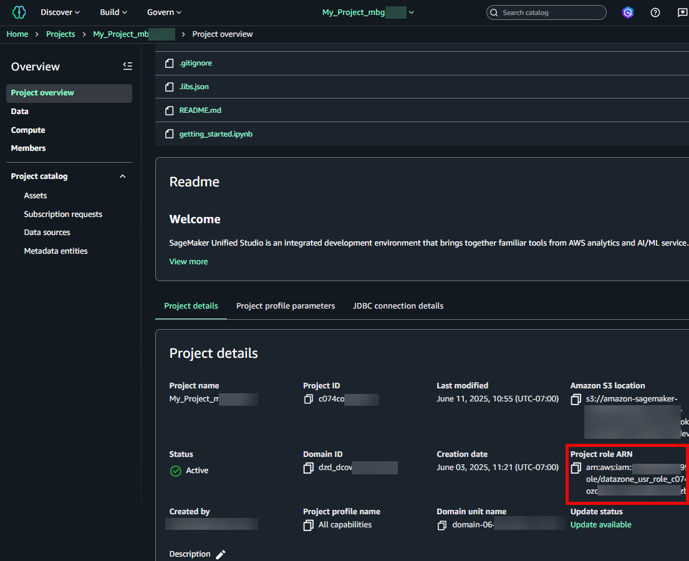
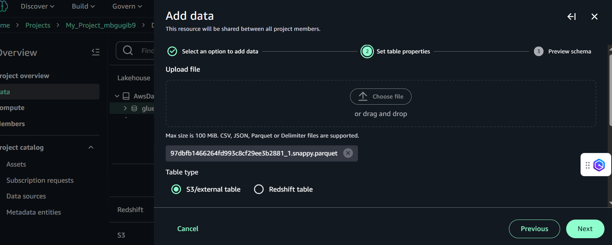
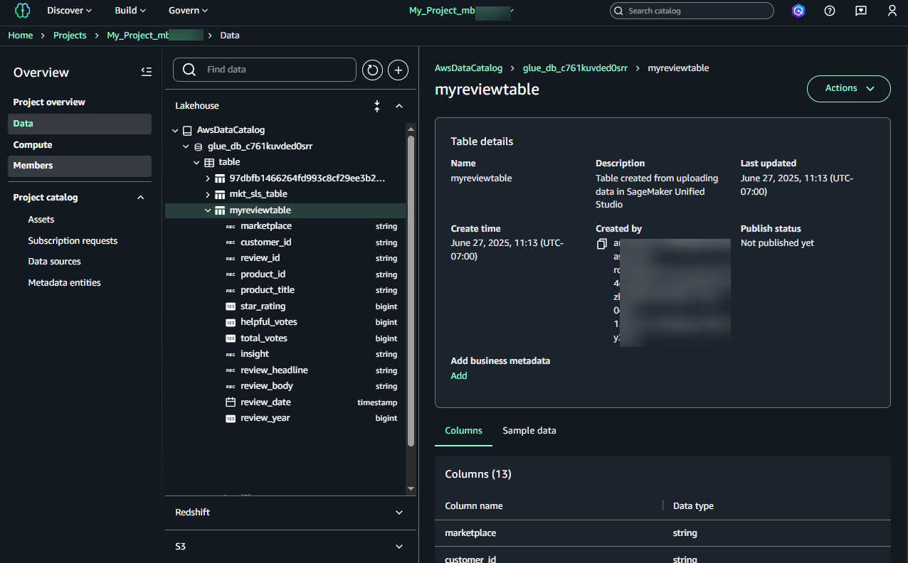
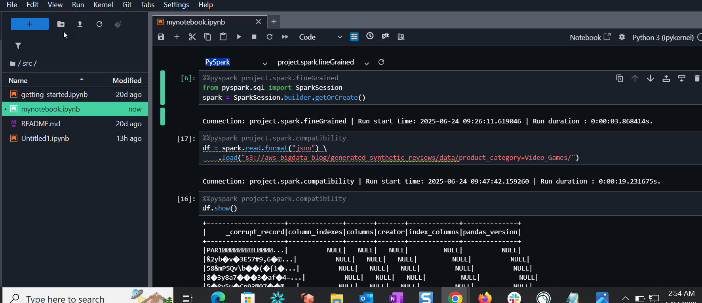
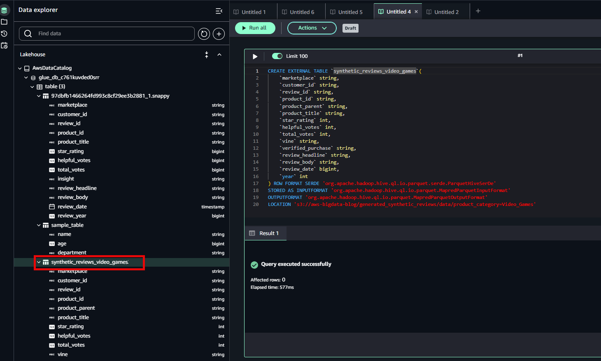
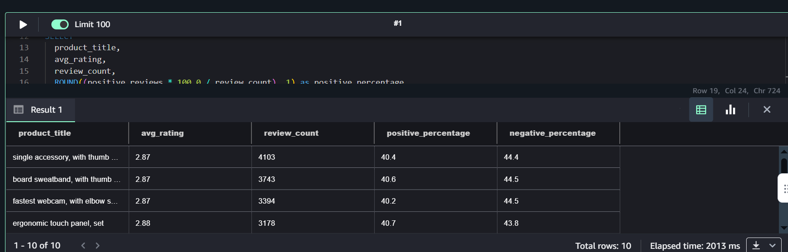
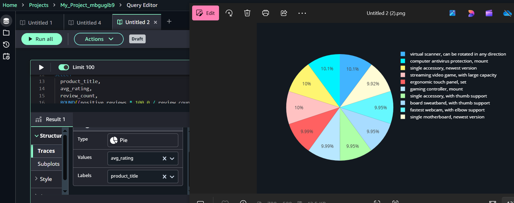

# Get started with importing and querying data

sets for AWS Glue Data Catalog and Amazon S3 in Amazon SageMaker Unified Studio

In this Getting Started tutorial for the next generation of Amazon SageMaker, you will use
Amazon SageMaker Unified Studio, Amazon SageMaker Catalog, and Amazon SageMaker Lakehouse to
import and query data sets. You will learn how to access and leverage your existing
AWS Glue Data Catalog resources within Amazon SageMaker Unified Studio, allowing you to query and
analyze your data without moving or duplicating it.

You will need to have administrator access to a domain or create a domain.

A summary of the tasks in this getting started are as follows.

- Prerequisites and permissions setup
- Setting up AWS Glue Data Catalog resources
- Configuring S3 access and data import
- Multiple query options (Spark and Athena) and data visualization/analysis
  capabilities:

      + Use Spark in Jupyter notebooks
      + Use Athena in the query editor
      + Create and modify tables using SQL
      + Visualize results using charts

  This getting started uses a .parquet file as sample S3 Raw file data to import that you
  can retrieve from the public bucket. There are other formats of data you can import into
  Lake Formation tables for AWS Glue Data Catalog, such as RDS tables, DynamoDB tables, or RedShift
  tables.

###### Topics

- [Prerequisites](#gdc-s3-glue-prerequisites "#gdc-s3-glue-prerequisites")
- [Step 1: Connect to an AWS Glue Data Catalog](#w2aac19c17 "#w2aac19c17")
- [Step 2: Get started with importing S3 data](#gdc-s3-gdc-bucket "#gdc-s3-gdc-bucket")
- [Step 3: Get started with the query editor](#gdc-s3-query-editor "#gdc-s3-query-editor")

## Prerequisites

The following prerequisities are required for this getting started procedure.

- Create a project with an **All capabilities**
  project profile. This project profile sets up your project with access to S3 and
  Athena resources. There is more information about how to create a new project in the
  topic [Setting up Amazon SageMaker AI](setting-up.md#create-new-project "setting-up.md#create-new-project").
- A project role is created automatically when the project is created in
  SageMaker Unified Studio. You will make a note of the project role as detailed
  in the prerequisities below.
- You can either use an existing AWS Glue database or create a new one. The Glue
  database must be Lake Formation managed.
- You can either use an existing AWS Glue table or create a new one. The Glue table
  must be Lake Formation managed.
- You also set up the Data lake administrator and revoke specified permissions.

Subsequent sections go into more detail regarding configuring each of these prerequisites.

###### To set up the Lake Formation Data Lake administrator

You must set up a user or role as the Lake Formation Data Lake administrator for
your catalog data. This administrator grants access to data-lake
resources.

1. In [Create a data lake administrator](../../../lake-formation/latest/dg/initial-lf-config.md#create-data-lake-admin "../../../lake-formation/latest/dg/initial-lf-config.md#create-data-lake-admin") in the _AWS Lake Formation Developer Guide_, follow the instructions to add the
   `AWSLakeFormationDataAdmin` managed policy to the user in
   IAM.
2. After you add the IAM permission, follow the steps in [Create a data lake administrator](../../../lake-formation/latest/dg/initial-lf-config.md#create-data-lake-admin "../../../lake-formation/latest/dg/initial-lf-config.md#create-data-lake-admin") to add the
   inline policy granting permission to create the service-linked role.

###### To add the Lake Formation Data Lake administrator in the Lake Formation

console

After updating the policies in the previous step for the user or role you want to
make the Data lake administrator, use the Lake Formation console to add that user or
role to the list under Data lake administrators. Use the following
steps to add the Data lake administrator on the console.

1. Open the AWS Lake Formation console.
2. Under **Administration**, choose **Administrative
   roles and tasks**.
3. Under **Data lake administrators**, choose
   **Add**.
4. For **Access type**, choose **Data lake
   administrator**.
5. For **IAM users and roles**, choose the user or role that you
   want to make the Data lake administrator. Make sure it is the same user or role
   for which you updated the IAM permissions in the Prerequisites.
6. Choose **Confirm**.

###### Revoke the `IAMAllowedPrincipals` group permission

You must revoke the `IAMAllowedPrincipals` group permission on both
database and table to enforce AWS Lake Formation permission for access. For more information,
see [Revoking permission using the AWS Lake Formation console](../../../lake-formation/latest/dg/lake-formation-permissions.md#revoke-permissions "../../../lake-formation/latest/dg/lake-formation-permissions.md#revoke-permissions") in the _AWS Lake Formation Developer Guide_.

###### Note

For the purposes of this topic, revoke the group permission as provided. This makes it so Lake Formation is the central point for managing fine-grained access control to your data lake resources. You
can also use hybrid permissions in Lake Formation. For more information about
hybrid permissions, see [Hybrid access
mode](../../../lake-formation/latest/dg/hybrid-access-mode.md "../../../lake-formation/latest/dg/hybrid-access-mode.md") in the _AWS Lake Formation Developer
Guide_.

1. Open the AWS Lake Formation console.
2. Under **Permissions**, choose **Data
   permissions**.
3. Choose the selector next to the `IAMAllowedPrincipals` group
   designated for **Database**.
4. Choose **Revoke**.

## Step 1: Connect to an AWS Glue Data Catalog

Complete the steps in this section to set up your resources and permissions for
accessing AWS Glue Data Catalog and preparing to import data.

### Make a note of your IAM project

role

In the following sections of this topic, you will configure permissions using the
project role in IAM that was created when you created your SageMaker Unified
Studio project. The project role is an IAM role that is created and associated with a new project. This role grants the necessary permissions
for users working on the project to use AWS resources, such as Amazon S3, for instance. You will attach a resource-based bucket policy and configure
permissions in the lakehouse. Use the following steps to make a note of the IAM project
role for your SageMaker Unified Studio project. You will use the role in a procedure that follows when you configure and grant Lake Formation permissions.

1. Navigate to Amazon SageMaker Unified Studio using the URL from the Amazon
   SageMaker management console and log in using your SSO or AWS
   credentials.
2. Use the top center menu of the Amazon SageMaker home page to navigate to
   the project you want to use.
3. Under the **Overview**, choose **Project
   overview**.
4. Choose the **Project details** tab.
5. Choose the project role that is associated with your Amazon SageMaker Unified Studio project. This
   role was created in IAM upon project creation and was copied in the steps
   above. In **Project role ARN**, copy the project role
   ARN.

The Project IAM role will have the following format:
`arn:aws:iam::ACCOUNT_ID:role/datazone_usr_role_xxxxxxxxxxxxxx_yyyyyyyyyyyyyy`



### Register the S3 location for

AWS Glue Data Catalog tables in Amazon SageMaker Unified Studio

To access existing AWS Glue Data Catalog tables in Amazon SageMaker Unified Studio, complete
the following steps to configure permissions.

###### To register the S3 location and configure access

1. Open the AWS Lake Formation console using the data lake administrator.
   Choose **Data lake locations** in the navigation pane, and
   then choose **Register location**.
2. Enter the S3 prefix for Amazon S3 path. For this topic, you must register
   the following S3 location in order to allow it to be queried:
   `s3://aws-bigdata-blog/generated_synthetic_reviews/data/product_category=Video_Games`.
3. For **IAM role**, choose your Lake Formation data access
   IAM role, which is not a service linked role.
4. Select **Lake Formation** for **Permission
   mode**, and then choose **Register
   location**.
5. For Database permissions, choose **Describe**, and then
   choose **Grant**.

### Grant permission on the

databases to the project role

You will grant database access to the IAM role that is associated with your
Amazon SageMaker Unified Studio project. This role is called the project role, and it was created in
IAM upon project creation. To access existing AWS Glue Data Catalog databases in Amazon
SageMaker Unified Studio, complete the following steps to configure
permissions.

1. On the Lake Formation console, under **Data Catalog** in
   the navigation pane, choose **Databases**.
2. Select the existing AWS Glue Data Catalog database.
3. From the **Actions** menu, choose
   **Grant** to grant permissions to the project
   role.
4. For **IAM users and roles**, choose the **project
   role**. This is the SageMaker Unified Studio project role that
   you noted previously in [Make a note of your IAM project
   role](#gdc-s3-gdc-bucket-projectrole "#gdc-s3-gdc-bucket-projectrole").
5. Select **Named Data Catalog resources**, and for
   **Catalogs**, choose the default catalog or a catalog
   you want to use.
6. For **Databases**, choose the default database or a
   database you want to use.
7. For **Database permissions**, select
   **Describe** and choose
   **Grant**.

Granting these permissions provides the means to query the Lake Formation data in later steps.

### Grant permission on the tables to

the project role

You will grant table access to the IAM role that is associated with your Amazon SageMaker Unified Studio project.
This role is called the project role, and it was created in IAM upon
project creation. To grant permission on the tables to the project role,
complete the following steps.

######

1. On the Lake Formation console, under **Data Catalog** in
   the navigation pane, choose **Databases**.
2. Select the existing Data Catalog database.
3. From the **Actions** menu, choose Grant to grant
   permissions to the project role.
4. For **IAM users and roles**, choose the project role.
   This is the SageMaker Unified Studio project role that you noted previously
   in [Make a note of your IAM project
   role](#gdc-s3-gdc-bucket-projectrole "#gdc-s3-gdc-bucket-projectrole").
5. Select **Named Data Catalog resources**, and for
   **Catalogs**, choose the default catalog.
6. For **Databases**, choose your **Data Catalog** database.
7. For **Tables**, select the tables that you need to
   provide permission to the project role.
8. For **Table permissions**, select
   **Select** and **Describe**.
9. For **Grantable permissions**, choose
   **Select** and **Describe**.
10. Choose **Grant**.

###### Important

You should revoke any existing permissions of
`IAMAllowedPrincipals` on the databases and tables within
Lake Formation as detailed in the prerequisites.

### Create a new Lakehouse catalog

In your project, create a new Lakehouse catalog. If you plan to use the default
catalog, you can skip these steps.

###### To create a Lakehouse catalog

1. In the Amazon SageMaker Unified Studio, navigate to your project.
2. On the project page, under **Data**, choose
   **Lakehouse**.
3. Choose the **+** button.
4. In the **Add data** section, choose **Create
   Lakehouse catalog**.
5. Choose **Next**.
6. In the **Add catalog** section, enter a name for your
   catalog.
7. (Optional) Enter a description for the catalog.
8. Choose **Add catalog**.

After completing these steps, your database will appear under the catalog that
you've created.

### Add data and create an AWS Glue

table

In your project, create an AWS Glue table using sample data. To create a Glue table
in Amazon SageMaker Unified Studio, complete the following steps.

###### To add data and create a Glue table

1. Access the public S3 bucket to download the sample data. Download the
   .parquet file named
   `97dbfb1466264fd993c8cf29ee3b2881_1.snappy.parquet` to your
   local drive.
2. In the Amazon SageMaker Unified Studio console, navigate to your
   project.
3. On the project page, under **Overview**, choose
   **Data**. Choose **Lakehouse**.
4. Next to your Glue database, choose the options menu (three dots), and
   choose **Create table**.
5. Next, upload the file in .CSV, JSON, Parquet, or Delimiter formats. For
   this example, upload the Parquet file you downloaded from the public sample
   bucket.
6. For **Table type**, **External/S3** is selected by default as the type of source.
7. Choose **Add data**. For **Catalog
   name**, choose the name from the drop-down menu.

 8. For **Database**, choose the database that you created in
the **Use or create a Glue database** section from the drop-down menu. 9. For **Table name**, enter a table name of your
choice. 10. For **Data format**, choose the data format from the
drop-down menu. The format updates automatically when you upload a
file. 11. Choose **Next**. Allow a few minutes for the schema
creation to display. 12. Choose **Create table**.

The table appears under your database, such as in this example showing the new
table `myreviewtable` added.



### Verify access to your AWS Glue table from

the Amazon SageMaker Unified Studio query editor

To verify that you can access the existing AWS Glue table from the Amazon SageMaker Unified Studio query editor, complete the following steps:

###### To verify that the Athena query can be accessed for the table

1. Navigate to Amazon SageMaker Unified Studio using the URL from the Amazon
   SageMaker management console and log in using your SSO or AWS
   credentials.
2. Use the top center menu of the Amazon SageMaker home page to navigate to
   the project you want to use.
3. On the project page, under **Overview**, choose
   **Data**, and then choose
   **Lakehouse**.
4. Next to the new table, choose the options menu (three dots), and choose
   **Query with Athena**. You can also choose to preview the data.

## Step 2: Get started with importing S3 data

### Create or use an S3 bucket

In S3, create or have a bucket and note the bucket path, such as
`s3://amzn-s3-demo-bucket`. You will upload your sample data to the
existing bucket.

### (Optional) Use sample data in your

existing S3 bucket

Configure your S3 data using an existing bucket and sample data to upload and
import.

Alternately, you can use the public bucket with the sample data location and skip
this step.

###### To upload sample S3 data

Use the S3 console to upload the sample .parquet file from your local drive to
your S3 source bucket.

1. Sign in to Amazon Simple Storage Service.
2. Navigate to the .parquet file that you downloaded from the public sample
   bucket.
3. Navigate to your existing S3 bucket and choose
   **Upload**. Upload the file to your S3 bucket.
4. Choose **Save**.

### Edit your IAM project role and attach the

S3 bucket policy

Configure your IAM role with a policy for S3 bucket permissions to allow the
SageMaker project role to access your S3 source bucket. Use these steps to create
and attach a resource-based bucket policy and configure permissions in
Lakehouse.

###### To attach the S3 bucket policy to the project role

1. Using the account that is associated with the SageMaker domain, navigate
   to the IAM console, and choose **Roles**.
2. Choose the project role that is associated with your Amazon SageMaker Unified Studio project.
   This role was created automatically when you created your project in
   Amazon SageMaker Unified Studio. This is the project role that you made a note of
   previously in [Make a note of your IAM project
   role](#gdc-s3-gdc-bucket-projectrole "#gdc-s3-gdc-bucket-projectrole"). Open the project role,
   such as
   `arn:aws:iam::ACCOUNT_ID:role/<datazone_usr_role_xxxxxxxxxxxxxx_yyyyyyyyyyyyyy>`.
3. Choose **Add permissions**, and then choose
   **Create inline policy**.
4. Choose **JSON**, and then paste the following policy
   statement into the Policy editor. The following is an example bucket policy.
   Replace ACCOUNT_ID with the account ID where the domain resides,
   <s3_bucket> with the name of the S3 bucket that you intend to query in
   SageMaker Unified Studio, and
   <datazone_usr_role_xxxxxxxxxxxxxx_yyyyyyyyyyyyyy> with the project
   role in SageMaker Unified Studio. For the purposes of this topic, replace
   the `amzn-s3-demo-bucket` value with the bucket name for the sample data
   (`s3://aws-bigdata-blog/generated_synthetic_reviews/*`).

### Open a new notebook and start an Apache

Spark session to import the data

Configure your SageMaker spark session to import and query the S3 data using a
Jupyter notebook in the console. To access the data through the unified JupyterLab
experience with a spark session, complete the following steps:

1. Sign in to your SageMaker project.
2. Navigate to the **Project overview** page.
3. Choose **New**, and then choose
   **Notebook**.
4. Choose the default notebook titled `Untitled.jpynb`. Click the
   file name and type in the field to rename the file to
   `mynotebok.jpynb`.
5. On the SageMaker Unified Studio project page, on the top menu, choose
   **Build**. Under **IDE &
   APPLICATIONS**, choose **JupyterLab**.
6. Wait for the space to be ready.
7. Choose the plus sign and for **Notebook**, choose
   **Python3**.
8. In the notebook, switch the connection type to `PySpark` and
   choose `spark.fineGrained`.
9. Use the following command to initialize a Spark session.

```
from pyspark.sql import SparkSession
spark = SparkSession.builder.getOrCreate()
```

10. In the notebook, keep the connection type at `PySpark` and
    choose `spark.compatibility`.

Use the following command in a cell to load the S3 source with the
%%pyspark cell magic. This imports the S3 data. Make sure the second line is
indented as shown.

```
%%pyspark
df = spark.read.format("json") \
    .load("s3://`s3://aws-bigdata-blog/generated_synthetic_reviews/data/product_category=Video_Games`/")
```

11. Use the following command in a cell to query the S3 source with the
    %%pyspark cell magic. This queries the data.

```
%%pyspark
df.show()
```



## Step 3: Get started with the query editor

You can use the query editor to perform analysis using SQL. The query editor tool
provides a place to write and run queries, view results, and share your work with your
team.

### Prerequisites to access your

project

Before you get started with the query editor, you must have access to Amazon
SageMaker Unified Studio and create a project.

- Navigate to Amazon SageMaker Unified Studio using the URL from your admin
  and log in using your SSO or [configure credentials with IAM Identity Center](../../../sagemaker-unified-studio/latest/userguide/getting-started-access-the-portal.md#getting-started-sign-up "../../../sagemaker-unified-studio/latest/userguide/getting-started-access-the-portal.md#getting-started-sign-up").

### Query AWS Glue sample data using Amazon Athena

in Amazon SageMaker Unified Studio

After you create a project, you can use the query editor to write and run queries.
Use the following steps to create a table using a SQL query with Athena, query the
table, and visualize the results.

1. In the Amazon SageMaker Unified Studio, navigate to your project.
2. On the project page, under **Overview**, choose
   **Data**.
3. Choose **Lakehouse**, Expand
   **AwsDataCatalog**, and then choose the three-dot
   action menu next to your database.
4. Choose **Query with Athena**.
5. Copy and paste the following SQL query into the editor. The following
   query will create a table `synthetic_reviews_video_games` and
   query it.

```
CREATE EXTERNAL TABLE `synthetic_reviews_video_games`(
    `marketplace` string,
    `customer_id` string,
    `review_id` string,
    `product_id` string,
    `product_parent` string,
    `product_title` string,
    `star_rating` int,
    `helpful_votes` int,
    `total_votes` int,
    `vine` string,
    `verified_purchase` string,
    `review_headline` string,
    `review_body` string,
    `review_date` bigint,
    `year` int
) ROW FORMAT SERDE 'org.apache.hadoop.hive.ql.io.parquet.serde.ParquetHiveSerDe'
STORED AS INPUTFORMAT 'org.apache.hadoop.hive.ql.io.parquet.MapredParquetInputFormat'
OUTPUTFORMAT 'org.apache.hadoop.hive.ql.io.parquet.MapredParquetOutputFormat'
LOCATION 's3://aws-bigdata-blog/generated_synthetic_reviews/data/product_category=Video_Games'
```

###### Note

For simplicity, in this topic, these steps create a table under a
specific partition folder instead of creating a top level table that
includes all the partition folders. As a gene3ral recommendation, create
tables at the top level.

The SQL query creates an external table named
"synthetic_reviews_video_games" that maps to Amazon product review data
stored in Parquet format. The table defines columns for marketplace,
customer information, product details, ratings, and review content. 6. Choose the **Run cell** icon.

When the query finishes running, a Result tab appears below the cell to
display the outcome.

 7. Refresh the **Data explorer** navigation pane, and view
the table you created in the **Lakehouse** section. 8. Choose **Add SQL** to add another cell to the querybook.
Then enter the following script:

```
WITH review_stats AS (
  SELECT
    product_title,
    ROUND(AVG(star_rating), 2) as avg_rating,
    COUNT(*) as review_count,
    COUNT(CASE WHEN star_rating >= 4 then 1 END) as positive_reviews,
    COUNT(CASE WHEN star_rating <= 2 then 1 END) as negative_reviews
  FROM "awsdatacatalog"."glue_db_<database-ID>"."synthetic_reviews_video_games"
  GROUP BY product_title
  HAVING COUNT(*) >= 5
)
SELECT
  product_title,
  avg_rating,
  review_count,
  ROUND((positive_reviews * 100.0 / review_count), 1) as positive_percentage,
  ROUND((negative_reviews * 100.0 / review_count), 1) as negative_percentage
FROM review_stats
WHERE avg_rating >= 2.5
ORDER BY review_count DESC, avg_rating DESC
LIMIT 10;
```

This query completes the following tasks:

    * Creates a CTE (Common Table Expression) to calculate review
     statistics
    * Calculates average ratings, total review count, and counts of
     positive/negative reviews per game
    * Filters for games with at least 5 reviews
    * Computes the percentage of positive and negative reviews
    * Shows only games with an average rating of 2.5 or higher
    * Orders results by review count and average rating
    * Returns the top 10 most reviewed, highly-rated games

The results will show you the most popular well-rated games in your
dataset, along with meaningful metrics about their review
distribution.

 9. Choose the **Run cell** icon.

In the **Results** tab, the first ten rows of the table
you created are displayed. 10. In the **Results** tab, you can choose the
**Chart view** icon. This opens up a chart view with a
line graph as a default. 11. Set up the chart to display a pie chart. Choose
**Trace**.

    1. For **Type**, choose **Pie**.
    2. For **Values**, choose **avg\_rating**.
    3. For **Labels**, choose **product\_title**.
    4. Choose the download arrow to view the chart.

This displays a pie chart so you can visualize results.



After you've finished querying the data, you can choose to view the queries in
your query history and save them to share with other project members.
