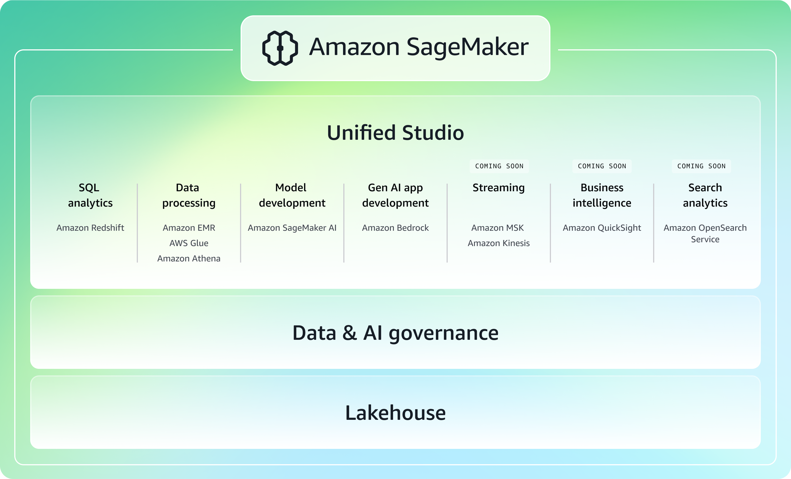

# What is Amazon SageMaker?

Bringing together widely adopted [artificial intelligence (AI)](https://aws.amazon.com/ai/ "https://aws.amazon.com/ai/") and [analytics](https://aws.amazon.com/big-data/datalakes-and-analytics/ "https://aws.amazon.com/big-data/datalakes-and-analytics/") capabilities,
the next generation of [Amazon SageMaker](https://aws.amazon.com/sagemaker/ "https://aws.amazon.com/sagemaker/") delivers an integrated experience for analytics and AI
with unified access to all your data. Collaborate and build in Amazon SageMaker Unified Studio using familiar AWS tools for SQL
analytics, data processing, model development, and generative AI, accelerated by [Amazon Q Developer](https://aws.amazon.com/q/ "https://aws.amazon.com/q/").
Access all your data whether it's stored in data lakes, data warehouses, or third-party or federated
data sources, with governance built in to meet enterprise security needs.

## Guide to SageMaker

The next generation of Amazon SageMaker was
[announced at re:Invent 2024](https://aws.amazon.com/blogs/big-data/the-next-generation-of-amazon-sagemaker-the-center-for-all-your-data-analytics-and-ai/ "https://aws.amazon.com/blogs/big-data/the-next-generation-of-amazon-sagemaker-the-center-for-all-your-data-analytics-and-ai/")
serves as the center for all data, analytics, and AI. Analytics and AI workflows are converging,
with organizations now using the same data sources for traditional analytics, machine learning,
and generative AI. In response, AWS has created the next generation of SageMaker to serve as a
unified platform for these workflows. The next generation of SageMaker brings together the
purpose-built components needed for data exploration, preparation and integration, big data
processing, SQL analytics, machine learning (ML) model development and training,
and generative AI application development.

###### Note

The original Amazon SageMaker has been renamed [SageMaker AI](../../../sagemaker/latest/dg/whatis.md "../../../sagemaker/latest/dg/whatis.md").
It is available in the next generation Amazon SageMaker for those who wish to use it alongside additional capabilities, or
as a standalone service for those who wish to focus specifically on building, training,
and deploying AI and ML models at scale.

The next generation of Amazon SageMaker consists of two primary components:

1. Amazon SageMaker Unified Studio, which provides an integrated experience to use all your data
   and tools for analytics and AI
2. Data and AI governance, which applies enterprise-level security and data management with built-in governance
   throughout the entire data and AI lifecycle

Additionally, SageMaker is built upon an open lakehouse architecture that unifies access to all your data across
Amazon Simple Storage Service ([Amazon S3](../../../AmazonS3/latest/userguide/GetStartedWithS3.md "../../../AmazonS3/latest/userguide/GetStartedWithS3.md"))
data lakes, [Amazon Redshift](../../../redshift.md "../../../redshift.md") data warehouses,
and other external sources

### Unified Studio

[Amazon SageMaker Unified Studio](../../../sagemaker-unified-studio/latest/userguide/what-is-sagemaker-unified-studio.md "../../../sagemaker-unified-studio/latest/userguide/what-is-sagemaker-unified-studio.md")
is a single data and AI development environment
that brings together functionality and tools that AWS offers in [Amazon EMR](../../../emr/latest/ManagementGuide/emr-what-is-emr.md "../../../emr/latest/ManagementGuide/emr-what-is-emr.md"),
[AWS Glue](../../../glue/latest/dg/what-is-glue.md "../../../glue/latest/dg/what-is-glue.md"),
[Amazon Athena](../../../athena/latest/ug/what-is.md "../../../athena/latest/ug/what-is.md"),
[Amazon Redshift](../../../redshift/latest/mgmt/welcome.md "../../../redshift/latest/mgmt/welcome.md"),
[Amazon MWAA](../../../mwaa/latest/userguide/what-is-mwaa.md "../../../mwaa/latest/userguide/what-is-mwaa.md"),
[Amazon Bedrock](../../../bedrock/latest/userguide/what-is-bedrock.md "../../../bedrock/latest/userguide/what-is-bedrock.md"),
and [Amazon SageMaker AI](../../../sagemaker/latest/dg/whatis.md "../../../sagemaker/latest/dg/whatis.md"). From within the unified studio, you can discover, access,
and query data and AI assets, then collaborate to build and share analytics and AI artifacts, including data, models, and generative AI applications.

### Data & AI governance

The next generation of Amazon SageMaker simplifies the discovery, governance, and collaboration
for data and AI. With
[Amazon SageMaker Catalog](../../../sagemaker-unified-studio/latest/userguide/working-with-business-catalog.md "../../../sagemaker-unified-studio/latest/userguide/working-with-business-catalog.md"),
users can securely discover and access approved data and assets using semantic search
with generative AI–created metadata, or you could just ask
[Amazon Q Developer](../../../amazonq/latest/qdeveloper-ug/what-is.md "../../../amazonq/latest/qdeveloper-ug/what-is.md") with
natural language to find your data. Seamlessly share and collaborate on data and AI assets
through publishing and subscribing workflows. With SageMaker, you can apply
[Amazon Bedrock Guardrails](../../../bedrock/latest/userguide/guardrails-how.md "../../../bedrock/latest/userguide/guardrails-how.md") to protect and filter your model outputs, helping ensure responsible
gen AI application development. Build trust throughout your organization with
[data quality monitoring](../../../sagemaker-unified-studio/latest/userguide/data-quality.md "../../../sagemaker-unified-studio/latest/userguide/data-quality.md"),
sensitive data detection, and data and machine learning (ML)
[lineage](../../../sagemaker-unified-studio/latest/userguide/datazone-data-lineage.md "../../../sagemaker-unified-studio/latest/userguide/datazone-data-lineage.md").

### Lakehouse architecture

The next generation of Amazon SageMaker is built on an
[open lakehouse architecture](../../../sagemaker-unified-studio/latest/userguide/lakehouse.md "../../../sagemaker-unified-studio/latest/userguide/lakehouse.md"),
fully compatible with
[Apache Iceberg](../../../prescriptive-guidance/latest/apache-iceberg-on-aws/introduction.md "../../../prescriptive-guidance/latest/apache-iceberg-on-aws/introduction.md").
Unify all your data across Amazon S3 data lakes and Amazon Redshift data warehouses to build analytics
and AI/ML applications on a single copy of data. The lakehouse gives you the flexibility
to access and
[query your data with Apache Iceberg–compatible tools and engines](../../../athena/latest/ug/querying-iceberg.md "../../../athena/latest/ug/querying-iceberg.md").
You can also connect to
[federated data sources](../../../sagemaker-unified-studio/latest/userguide/lakehouse-data-connection.md "../../../sagemaker-unified-studio/latest/userguide/lakehouse-data-connection.md") such as Amazon DynamoDB, Google BigQuery,
and Snowflake and query your data in-place. With
[zero-ETL integrations](../../../redshift/latest/mgmt/zero-etl-using.md "../../../redshift/latest/mgmt/zero-etl-using.md"),
you can bring data
from operational databases and 3rd party applications into your lakehouse in near real-time.
Integrated fine-grained access controls help you secure your data to ensure only the right people
have access to the right data.

## Capabilities of Amazon SageMaker Unified Studio

The next generation of Amazon SageMaker and its unified studio provide an integrated
experience to use all your data and tools for analytics and AI. Discover your data and put it
to work using familiar AWS tools for model development, generative AI, data processing, and
[SQL analytics](../../../sagemaker-unified-studio/latest/userguide/sql-query.md "../../../sagemaker-unified-studio/latest/userguide/sql-query.md").
Work across compute resources using unified notebooks, discover and query diverse
data sources with a built-in SQL editor, train and deploy AI models at scale, and rapidly build
custom generative AI applications. Create and securely share analytics and AI artifacts such as
data, models, and generative AI applications to bring data products to market faster.

Some common capabilities of Amazon SageMaker Unified Studio include the following:

### SQL analytics

Leverage SageMaker's SQL analytic capabilities across all of your unified data
through Amazon SageMaker's lakehouse architecture. Users have the
[flexibility to use Athena
or Redshift query engines](../../../sagemaker-unified-studio/latest/userguide/query-editor-navigate.md "../../../sagemaker-unified-studio/latest/userguide/query-editor-navigate.md") to support their analytical workloads. Query your data in open
formats stored on Amazon S3 with high performance through
[Amazon Athena](../../../athena/latest/ug/what-is.md "../../../athena/latest/ug/what-is.md"), eliminating the
need to move or duplicate data between your data lakes and data warehouse. Include your Redshift data as part of the
[lakehouse architecture](../../../sagemaker-unified-studio/latest/userguide/lakehouse-how.md "../../../sagemaker-unified-studio/latest/userguide/lakehouse-how.md"),
leveraging the Redshift
query engine for SQL workloads on structured data.

### Data processing

Prepare, orchestrate, and process your data with capabilities in SageMaker,
allowing you to run Apache Spark, Trino, and other open-source analytics
frameworks in a unified data and AI development environment.
[Process your data](../../../sagemaker-unified-studio/latest/userguide/compute.md "../../../sagemaker-unified-studio/latest/userguide/compute.md"),
wherever it lives, with connectivity to hundreds of data sources
with Amazon Athena, Amazon EMR, and AWS Glue.

### Data integration

You can use data integration capabilities in Amazon SageMaker to connect to and act on all
your data. With AWS data integration capabilities, you can bring together data from multiple
sources, operationalize it, and manage to deliver high quality data to your lakehouse architecture,
across your data lakes and data warehouses.

###### Note

_What data sources am I able to integrate with Amazon SageMaker?_

You are able to unify all your data across Amazon Redshift data warehouses and Amazon S3 data lakes, including S3 Tables,
with SageMaker's lakehouse architecture. Bring your
operational databases and 3rd party application data like Salesforce and SAP to the lakehouse
in near real time through
[zero-ETL integrations](../../../glue/latest/dg/zero-etl-using.md "../../../glue/latest/dg/zero-etl-using.md").
You can use [hundreds of connectors](../../../glue/latest/dg/available-connections.md "../../../glue/latest/dg/available-connections.md") to integrate
data from various sources. Additionally, you can access and query data in-place with
[federated
query capabilities](../../../sagemaker-unified-studio/latest/userguide/lakehouse-data-connection.md#lakehouse-data-connection-supported "../../../sagemaker-unified-studio/latest/userguide/lakehouse-data-connection.md#lakehouse-data-connection-supported") across third-party data sources.

### Machine learning and model development

[Amazon SageMaker AI](../../../sagemaker/latest/dg/whatis.md "../../../sagemaker/latest/dg/whatis.md")
is a fully managed service that brings together a broad set of tools to enable high-performance,
low-cost machine learning (ML). Most capabilities of SageMaker AI are available as part of Amazon SageMaker Unified Studio,
in addition to being available in Amazon SageMaker Studio. With SageMaker AI, you can
[build](../../../sagemaker/latest/dg/gs-console.md "../../../sagemaker/latest/dg/gs-console.md"),
[train](../../../sagemaker/latest/dg/train-model.md "../../../sagemaker/latest/dg/train-model.md")
and
[deploy](../../../sagemaker/latest/dg/deploy-model.md "../../../sagemaker/latest/dg/deploy-model.md")
ML models at scale using tools like notebooks, debuggers, profilers, pipelines, MLOps,
and more—all in one integrated development environment (IDE).

###### Note

_When should I use
[SageMaker Unified Studio](../../../sagemaker-unified-studio/latest/userguide/what-is-sagemaker-unified-studio.md "../../../sagemaker-unified-studio/latest/userguide/what-is-sagemaker-unified-studio.md")
instead of [SageMaker AI](../../../sagemaker/latest/dg/studio-updated.md "../../../sagemaker/latest/dg/studio-updated.md") studio?_

Currently, SageMaker Unified Studio should be used when you are looking to unify and
share your data as a single integrated experience across analytics, ML, and gen AI workloads.
You are able to eliminate data silos with an open lakehouse architecture to unify access to
data lakes, data warehouses, third-party or federated data sources, and meet all enterprise
security needs with built-in data and AI governance.

If you want to solely focus on the purpose-built tools to perform all machine learning (ML)
development steps, from preparing data to building, training, deploying, and managing your
ML and gen AI models, SageMaker Studio remains a great choice. Additionally, use
SageMaker Studio when there are requirements for
[RStudio](../../../sagemaker/latest/dg/rstudio.md "../../../sagemaker/latest/dg/rstudio.md"),
[Canvas](../../../sagemaker/latest/dg/canvas.md "../../../sagemaker/latest/dg/canvas.md"),
[real-time collaboration](../../../sagemaker/latest/dg/domain-space.md "../../../sagemaker/latest/dg/domain-space.md")
via shared spaces, and
[Feature Store](../../../sagemaker/latest/dg/feature-store.md "../../../sagemaker/latest/dg/feature-store.md").

### Generative AI application development

[Access Amazon Bedrock's capabilities through SageMaker Unified Studio](../../../sagemaker-unified-studio/latest/userguide/bedrock.md "../../../sagemaker-unified-studio/latest/userguide/bedrock.md")
to quickly build and customize your generative AI applications. This intuitive interface lets you
work with high-performing foundation models (FMs) from leading companies like Anthropic, Mistral,
Meta, and Amazon, and use advanced features like
[Amazon Bedrock Knowledge Bases](../../../sagemaker-unified-studio/latest/userguide/creating-a-knowledge-base-component.md "../../../sagemaker-unified-studio/latest/userguide/creating-a-knowledge-base-component.md"),
[Amazon Bedrock Guardrails](../../../sagemaker-unified-studio/latest/userguide/guardrails.md "../../../sagemaker-unified-studio/latest/userguide/guardrails.md"),
[Amazon Bedrock Agents](../../../sagemaker-unified-studio/latest/userguide/app-deploy.md "../../../sagemaker-unified-studio/latest/userguide/app-deploy.md"), and
[Amazon Bedrock Flows](../../../sagemaker-unified-studio/latest/userguide/create-flows-app.md "../../../sagemaker-unified-studio/latest/userguide/create-flows-app.md").
You can develop generative AI applications faster within SageMaker Unified Studio's secure environment, ensuring alignment with your requirements and responsible AI guidelines.

###### Note

_When should I use Bedrock in SageMaker Unified Studio versus the
[standalone Amazon Bedrock service](../../../bedrock/latest/userguide/what-is-bedrock.md "../../../bedrock/latest/userguide/what-is-bedrock.md")?_

Amazon Bedrock's capabilities in Amazon SageMaker Unified Studio are ideal for enterprise teams who need a governed low-code/no-code environment for collaboratively building and deploying generative AI applications, alongside unified analytics and machine learning capabilities.

Customers can use the standalone Bedrock service from the AWS Management Console or
Bedrock API when they want to leverage the full feature set of Bedrock including the
latest agents, flow and guardrail enhancements, and the Bedrock SDK.

## Get started with Amazon SageMaker

You can view demos of Amazon SageMaker and get started by setting up a domain and project.

### View demos of Amazon SageMaker

To see Amazon SageMaker before using it yourself, you can review the following clickthrough demos:

- For an end-to-end demo, see [the Amazon SageMaker detailed clickthrough experience](https://aws.storylane.io/share/szmiwp3unlio "https://aws.storylane.io/share/szmiwp3unlio").
  This demo includes SageMaker Lakehouse, Amazon SageMaker Catalog, and more in Amazon SageMaker Unified Studio.
- For a demo of SageMaker Lakehouse, see [Amazon SageMaker: Access data in your lakehouse](https://aws.storylane.io/share/xo2xinwrkiey "https://aws.storylane.io/share/xo2xinwrkiey").
  This demo includes SageMaker Lakehouse in Amazon SageMaker Unified Studio, including adding a data source and querying data.
- For a demo of the Amazon SageMaker Catalog, see [Amazon SageMaker: Catalog](https://aws.storylane.io/share/3siijvynnjzu "https://aws.storylane.io/share/3siijvynnjzu").
  This demo includes Amazon SageMaker Catalog in Amazon SageMaker Unified Studio, including browsing assets and subscribing to an asset.
- For a demo of generative AI, see [Amazon SageMaker: Generative AI playground and Gen AI app development](https://aws.storylane.io/share/a1mpxfjgstqw "https://aws.storylane.io/share/a1mpxfjgstqw").

### Get started with setting up Amazon SageMaker

To get started using Amazon SageMaker, go to [Setting up Amazon SageMaker](setting-up.md "setting-up.md") in this guide to set up a domain and create a project.
This domain setup and project creation is a prerequisite for all other tasks in Amazon SageMaker.
