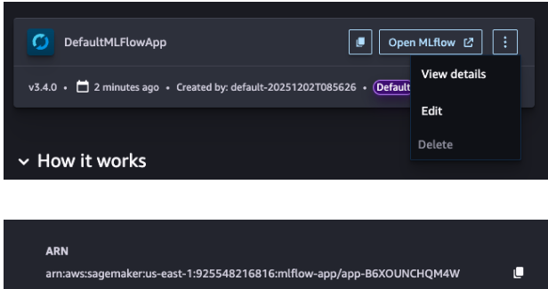
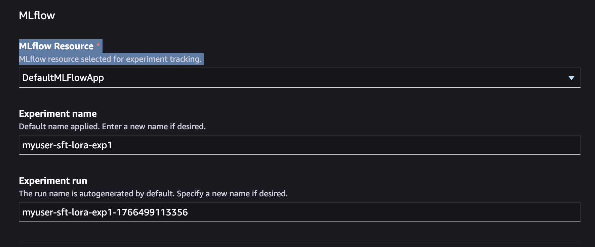

# Monitoring Progress Across Iterations

You can track metrics via MLflow.

## Nova Customization - MLFlow setup for SageMaker HyperPod

To enable your SageMaker HyperPod environment to output metrics to MLFlow, it is necessary to do some additional setup.

1. Open Amazon SageMaker AI
2. Select SageMaker Studio
   1. If there is a profile already created, select "Open Studio".
   2. If no profile is created, select "Create A SageMaker Domain" to set one up

3. Select MLFlow. If there is not any MLFlow App created, select "Create MLFlow App"
4. Click on the copy/paste button or the "View Details" menu item on the ML Flow App in order to get the ARN. You will need this when you submit your training job.

 5. On the HyperPod cluster execution role, add the following policy. This will allow the HyperPod cluster to call the MLFlow API to publish metrics.

```

{
    "Version": "2012-10-17",
    "Statement": [
        {
            "Effect": "Allow",
            "Action": "sagemaker-mlflow:*",
            "Resource": [
                "arn:aws:sagemaker:us-east-1:372836560492:mlflow-app/*"
            ]
        },
        {
            "Effect": "Allow",
            "Action": [
                "sagemaker:ListMlflowTrackingServers",
                "sagemaker:CallMlflowAppApi"
            ],
            "Resource": "*"
        }
    ]
}

```

### Submitting a job via the CLI

Specify 4 new override parameters, either in the command line, or in the recipe yaml.

1. `mlflow_tracking_uri`: The ARN of the MLFlow App
2. `mlflow_experiment_name`: The name for this run of the experiment
3. `mlflow_experiment_name`: The experiment name where the metrics will be stored in MLFlow
4. `mlflow_run_name`: The name for this experiment

Command line

```

--override-parameters '{"recipes.run.mlflow_tracking_uri": "arn:aws:sagemaker:us-east-1:925548216816:mlflow-app/app-B6XOUNCHQM4W", "recipes.run.mlflow_experiment_name": "myuser-sft-lora-exp1", "recipes.run.mlflow_run_name": "myuser-sft-lora-exp1-202512181940"}'

```

yaml:

```

## Run config
run:
  mlflow_tracking_uri: "arn:aws:sagemaker:us-east-1:925548216816:mlflow-app/app-B6XOUNCHQM4W"
  mlflow_experiment_name: "myuser-sft-lora-exp1"
  mlflow_run_name: "myuser-sft-lora-exp1-202512181940"

```

### Submitting a job via the SageMaker Studio UI

MLFlow integration is already built into the SageMaker Studio UI experience. When submitting a training job, simply indicate which MLFlow App instance to use.

1. In SageMaker Studio, navigate to Models > Nova 2.0 Lite > Customize > Customize with UI.
2. Expand the Advanced Configuration section
3. Select the MLFlow App where you would like to send the training metrics. You can also set your experiment name and experiment run here.



## Create an MLflow app

**Using Studio UI:** If you create a training job
through the Studio UI, a default MLflow app is created automatically and selected by
default under Advanced Options.

**Using CLI:** If you use the CLI, you must create an
MLflow app and pass it as an input to the training job API request.

```
mlflow_app_name="<enter your MLflow app name>"
role_arn="<enter your role ARN>"
bucket_name="<enter your bucket name>"
region="<enter your region>"

mlflow_app_arn=$(aws sagemaker create-mlflow-app \
  --name $mlflow_app_name \
  --artifact-store-uri "s3://$bucket_name" \
  --role-arn $role_arn \
  --region $region)
```

## Access the MLflow app

**Using CLI:** Create a pre-signed URL to access the
MLflow app UI:

```
aws sagemaker create-presigned-mlflow-app-url \
  --arn $mlflow_app_arn \
  --region $region \
  --output text
```

**Using Studio UI:** The Studio UI displays key
metrics stored in MLflow and provides a link to the MLflow app UI.

## Key metrics to track

Monitor these metrics across iterations to assess improvement and track the job progress:

**For SFT**

- Training loss curves
- Number of samples consumed and time to process samples
- Performance accuracy on held-out test sets
- Format compliance (e.g., valid JSON output rate)
- Perplexity on domain-specific evaluation data

**For RFT**

- Average reward scores over training
- Reward distribution (percentage of high-reward responses)
- Validation reward trends (watch for over-fitting)
- Task-specific success rates (e.g., code execution pass rate, math problem
  accuracy)

**General**

- Benchmark performance deltas between iterations
- Human evaluation scores on representative samples
- Production metrics (if deploying iteratively)

## Determining when to stop

Stop iterating when:

- **Performance plateaus**: Additional training
  no longer meaningfully improves target metrics
- **Technique switching helps**: If one
  technique plateaus, try switching (e.g., SFT → RFT → SFT) to break through
  performance ceilings
- **Target metrics achieved**: Your success
  criteria are met
- **Regression detected**: New iterations
  degrade performance (see rollback procedures below)

For detailed evaluation procedures, refer to the **Evaluation** section.
