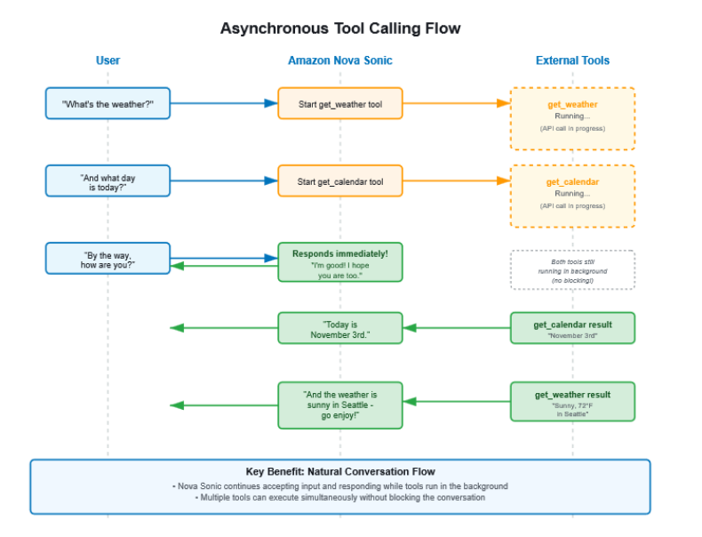
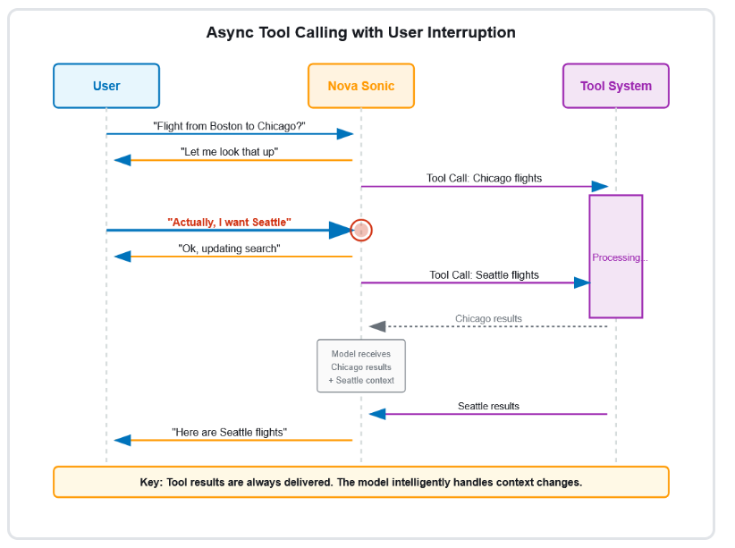

# Asynchronous tool calling

Asynchronous tool calling allows Amazon Nova 2 Sonic to continue the conversation while
waiting for tool results. This creates a more natural conversational flow,
especially for tools that require time to execute.

## How it works

When a tool is invoked, Amazon Nova 2 Sonic can continue generating speech while
your application processes the tool request in the background. Once the tool
result is ready, you send it back to the model, which incorporates the
information into the ongoing conversation.

This approach prevents awkward silences during tool execution and maintains
conversational momentum.

## Handling user

interruptions

If a user interrupts (barge-in) while a tool is being executed, your
application should:

1. Continue processing the tool request
2. Handle the user's new input
3. Decide whether to still send the tool result or discard it based on
   relevance
