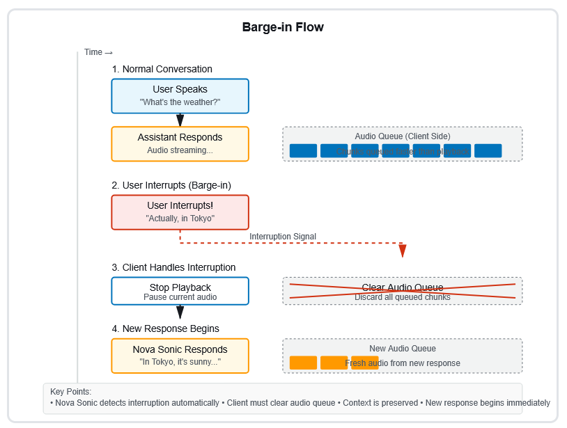

# Barge-in

Barge-in allows users to interrupt the AI assistant while it's speaking, just like
in natural human conversations. Instead of waiting for the assistant to finish,
users can interject with new information, correct or clarify their previous
statement, redirect the conversation to a different topic, or simply stop the
assistant when they've heard enough. This creates a more natural and responsive
conversational experience.

The following diagram illustrates the complete barge-in conversation flow:

## How Amazon Nova 2 Sonic handles

barge-in

Amazon Nova 2 Sonic is designed to handle interruptions gracefully. When the user
starts speaking during a response, the system immediately stops generating the
current response, maintains full conversational context, sends an interruption
signal to the client and begins processing the new user input.

**Context Preservation:** Even when interrupted,
Nova Sonic remembers what was said before the interruption, the topic being
discussed, the conversation history and any relevant context from previous
turns. This ensures the conversation remains coherent and natural.

## Client-side implementation

requirements

While Amazon Nova 2 Sonic handles barge-in on the server side, you need to implement
client-side logic for a complete experience.

**The audio queue challenge:** Audio generation
is faster than playback speed. This means:

- Nova Sonic generates audio chunks quickly
- Your client receives and queues these chunks
- The client plays them back at normal speaking speed
- When a barge-in occurs, there's already audio queued for
  playback

**Required client-side logic:** Your application
must handle four key steps:

1. **Detect the Interruption Signal:**
   Listen for the interruption event from Nova Sonic and react immediately
   when received.
2. **Stop Current Playback:** Pause the
   currently playing audio and stop any audio that's mid-playback.
3. **Clear the Audio Queue:** Remove all
   queued audio chunks and discard any buffered audio from the interrupted
   response.
4. **Start New Audio:** Begin playing the
   newly received audio and resume normal playback flow.
