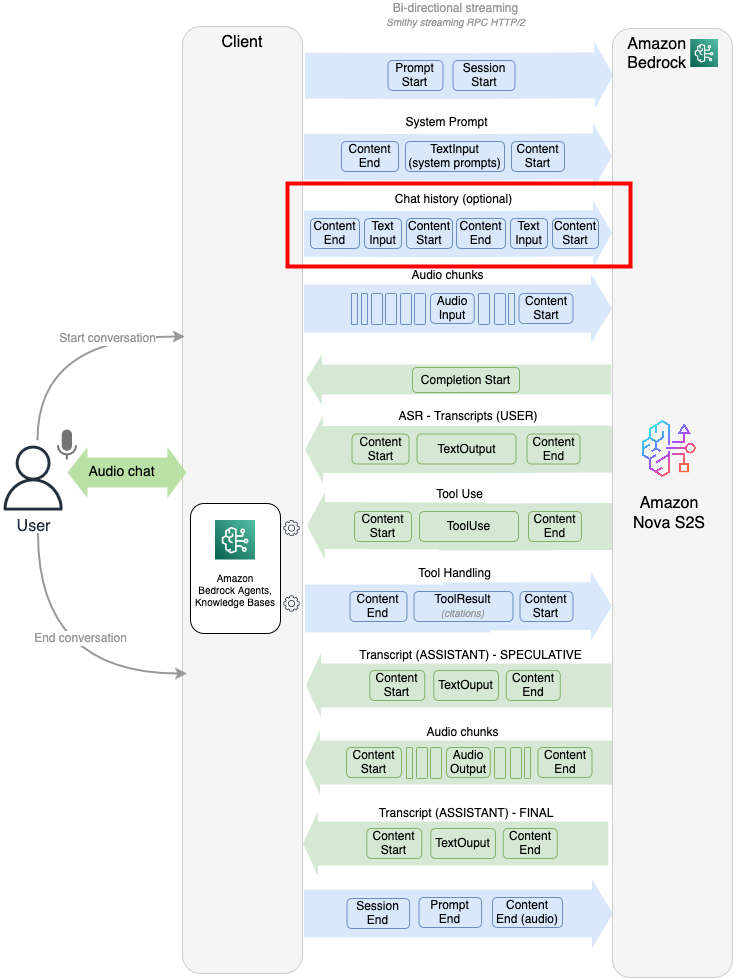

# Managing chat history

Amazon Nova 2 Sonic responses include ASR (Automatic Speech Recognition) transcripts for
both user and assistant voices. Storing chat history is a best practice—not only for
logging purposes but also for resuming sessions when the connection is unexpectedly
closed. This allows the client to send context back to Nova Sonic to continue the
conversation seamlessly.

Refer to the following resources for more information on managing chat
history:

1. [Logging chat history](https://github.com/aws-samples/amazon-nova-samples/tree/main/speech-to-speech/repeatable-patterns/chat-history-logger "https://github.com/aws-samples/amazon-nova-samples/tree/main/speech-to-speech/repeatable-patterns/chat-history-logger")
2. [Resuming conversations](https://github.com/aws-samples/amazon-nova-samples/tree/main/speech-to-speech/repeatable-patterns/resume-conversation "https://github.com/aws-samples/amazon-nova-samples/tree/main/speech-to-speech/repeatable-patterns/resume-conversation")

## Sending chat history

A conversation history can be included only once, after the system/speech
prompt and before audio streaming begins. Overall chat history cannot be larger
than 40KB. The following diagram shows when chat history is passed in during the
event lifecycle:



Each historical message requires three events: `contentStart`,
`textInput` and `contentEnd`.

**Event schema per message:**

- `contentStart` - Defines the message role and
  configuration

```
{
  "event": {
    "contentStart": {
      "promptName": "<prompt-id>",
      "contentName": "<content-id>",
      "type": "TEXT",
      "interactive": true,
      "role": "ASSISTANT",
      "textInputConfiguration": {
        "mediaType": "text/plain"
      }
    }
  }
}
```

- `textInput` - Contains the actual message content. One
  textInput cannot be larger than 1KB. If so, split into multiple
  textInputs in the same content block. If the conversation is larger than
  40KB, trim the overall chat history.

```
{
  "event": {
    "textInput": {
      "promptName": "<prompt-id>",
      "contentName": "<content-id>",
      "content": "Take your time, Don. I'll be here when you're ready."
    }
  }
}
```

- `contentEnd` - Marks the end of the message

```
{
  "event": {
    "contentEnd": {
      "promptName": "<prompt-id>",
      "contentName": "<content-id>"
    }
  }
}
```

Repeat these three events for each message in your chat history, alternating
between USER and ASSISTANT roles.

**Important considerations:**

- Chat history can only be included **once** per session
- Chat history must be sent **after the system
  prompt** and **before audio streaming
  begins**
- All historical messages must be sent before starting the audio
  streaming
- Each message must specify either USER or ASSISTANT role
- Use the stored transcript content from textOutput events as the
  content value in textInput

## Receiving ASR transcripts

During a conversation, Amazon Nova 2 Sonic sends ASR transcripts through output
events. Each transcript is delivered as a sequence of three events:
contentStart, textOutput, and contentEnd.

**Example: User speech transcript:**

1. contentStart - Indicates the beginning of a transcript:

```
{
  "event": {
    "contentStart": {
      "additionalModelFields": "{\"generationStage\":\"FINAL\"}",
      "completionId": "<completion-id>",
      "contentId": "<content-id>",
      "promptName": "<prompt-id>",
      "role": "USER",
      "sessionId": "<session-id>",
      "textOutputConfiguration": {
        "mediaType": "text/plain"
      },
      "type": "TEXT"
    }
  }
}
```

2. textOutput - Contains the actual transcript content:

```
{
  "event": {
    "textOutput": {
      "completionId": "<completion-id>",
      "content": "hello how are you",
      "contentId": "<content-id>",
      "promptName": "<prompt-id>",
      "role": "USER",
      "sessionId": "<session-id>"
    }
  }
}
```

3. contentEnd - Marks the end of the transcript:

```
{
  "event": {
    "contentEnd": {
      "completionId": "<completion-id>",
      "contentId": "<content-id>",
      "promptName": "<prompt-id>",
      "sessionId": "<session-id>",
      "stopReason": "PARTIAL_TURN",
      "type": "TEXT"
    }
  }
}
```

The same three-event pattern applies for both USER and ASSISTANT roles.
Extract the `content` field from the `textOutput` event
and the `role` field from the `contentStart` event to
build your chat history.

## Best practices

Always store chat history to enable:

- Session resumptions across difference devices
- Conversation logging and auditing
- Context preservation for follow-up interactions

Important: When saving chat history, use text outputs based on their
generationStage:

- Speculative - A preview of what Nova 2 Sonic plans to say, generated
  before audio synthesis begins
- Final - The actual sentence-level transcription of what was spoken in
  the audio response

Always save the FINAL text output to your chat history, as it represents the
accurate record of the conversation.

Example of FINAL output (save this to chat history):

```
ContentStart event: {
  "additionalModelFields": "{\"generationStage\":\"FINAL\"}",
  "completionId": "<completion-id>",
  "contentId": "<content-id>",
  "role": "ASSISTANT",
  "sessionId": "<session-id>",
  "type": "TEXT"
}
```

Example of SPECULATIVE output (optional preview, not for history):

```
ContentStart event: {
  "additionalModelFields": "{\"generationStage\":\"SPECULATIVE\"}",
  "completionId": "<completion-id>",
  "contentId": "<content-id>",
  "role": "ASSISTANT",
  "sessionId": "<session-id>",
  "type": "TEXT"
}
```
