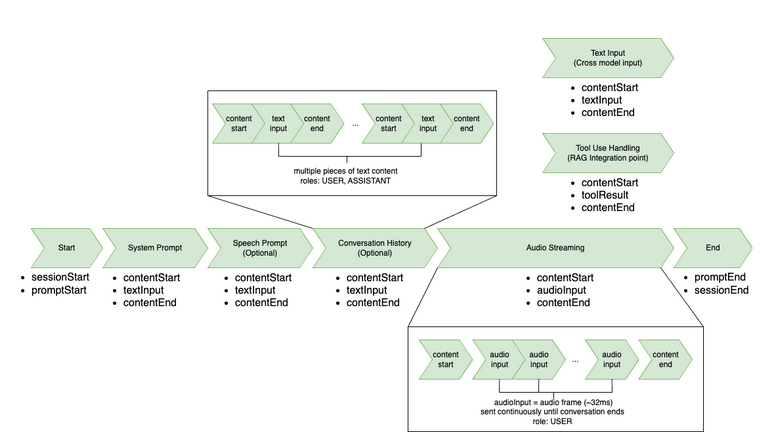

# Handling input events with the bidirectional

API

The bidirectional Stream API uses an event-driven architecture with structured
input and output events. Understanding the correct event ordering is crucial for
implementing successful conversational applications and maintaining the proper
conversation state throughout interactions.

## Overview

The Nova Sonic conversation follows a structured event sequence. You begin by
sending a `sessionStart` event that contains the inference
configuration parameters, such as temperature and token limits. Next, you send
`promptStart` to define the audio output format and tool
configurations, assigning a unique `promptName` identifier that must
be included in all subsequent events.

For each interaction type (system prompt, audio, and so on), you follow a
three-part pattern: use `contentStart` to define the content type and
the role of the content (`SYSTEM`, `USER`,
`ASSISTANT`, `TOOL`, `SYSTEM_SPEECH`), then
provide the actual content event, and finish with `contentEnd` to
close that segment. The `contentStart` event specifies whether you're
sending tool results, streaming audio, or a system prompt. The
`contentStart` event includes a unique `contentName`
identifier.

## Conversation History

A conversation history can be included only once, after the system prompt and
before audio streaming begins. It follows the same
`contentStart`/`textInput`/`contentEnd`
pattern. The `USER` and `ASSISTANT` roles must be defined
in the `contentStart` event for each historical message. This
provides essential context for the current conversation but must be completed
before any new user input begins.

## Audio Streaming

Audio streaming operates with continuous microphone sampling. After sending an
initial `contentStart`, audio frames (approximately 32ms each) are
captured directly from the microphone and immediately sent as
`audioInput` events using the same `contentName`.
These audio samples should be streamed in real-time as they're captured,
maintaining the natural microphone sampling cadence throughout the conversation.
All audio frames share a single content container until the conversation ends
and it is explicitly closed.

## Closing the Session

After the conversation ends or needs to be terminated, it's essential to
properly close all open streams and end the session in the correct sequence. To
properly end a session and avoid resource leaks, you must follow a specific
closing sequence:

- Close any open audio streams with the `contentEnd`
  event.
- Send a `promptEnd` event that references the original
  `promptName`.
- Send the `sessionEnd` event.

Skipping any of these closing events can result in incomplete conversations or
orphaned resources.

These identifiers create a hierarchical structure: the `promptName`
ties all conversation events together, while each `contentName` marks
the boundaries of specific content blocks. This hierarchy ensures that model
maintains proper context throughout the interaction.



## Input Event Flow

The structure of the input event flow is provided in this section.

The session start event initializes the conversation with inference
configuration and turn detection settings.

**Inference Configuration:**

- `maxTokens`: Maximum number of tokens to generate
  in the response
- `topP`: Nucleus sampling parameter (0.0 to 1.0) for
  controlling randomness
- `temperature`: Controls randomness in generation
  (0.0 to 1.0)
  **Turn Detection Configuration:** The
  `endpointingSensitivity` parameter controls how quickly
  Nova Sonic detects when a user has finished speaking:

- `HIGH`: Detects pauses quickly, enabling faster
  responses but may cut off slower speakers
- `MEDIUM`: Balanced sensitivity for most
  conversational scenarios (recommended default)
- `LOW`: Waits longer before detecting end of speech,
  better for thoughtful or hesitant speakers

```
{
    "event": {
        "sessionStart": {
            "inferenceConfiguration": {
                "maxTokens": "int",
                "topP": "float",
                "temperature": "float"
            },
            "turnDetectionConfiguration": {
                "endpointingSensitivity": "HIGH" | "MEDIUM" | "LOW"
            }
        }
    }
}
```

**Example:**

```
{
    "event": {
        "sessionStart": {
            "inferenceConfiguration": {
                "maxTokens": 2048,
                "topP": 0.9,
                "temperature": 0.7
            },
            "turnDetectionConfiguration": {
                "endpointingSensitivity": "MEDIUM"
            }
        }
    }
}
```

The prompt start event defines the conversation configuration
including output formats, voice selection, and available tools.

For a list of available voice IDs, refer to [Language support and multilingual capabilities](sonic-language-support.md "sonic-language-support.md")

```
{
    "event": {
        "promptStart": {
            "promptName": "string", // unique identifier same across all events i.e. UUID
            "textOutputConfiguration": {
                "mediaType": "text/plain"
            },
            "audioOutputConfiguration": {
                "mediaType": "audio/lpcm",
                "sampleRateHertz": 8000 | 16000 | 24000,
                "sampleSizeBits": 16,
                "channelCount": 1,
                "voiceId": "matthew" | "tiffany" | "amy" | "olivia" | "lupe" | "carlos" | "ambre" | "florian" | "lennart" | "beatrice" | "lorenzo" |
                        "tina" | "carolina" | "leo" | "kiara" | "arjun",
                "encoding": "base64",
                "audioType": "SPEECH"
            },
            "toolUseOutputConfiguration": {
                "mediaType": "application/json"
            },
            "toolConfiguration": {
                "tools": [
                    {
                        "toolSpec": {
                            "name": "string",
                            "description": "string",
                            "inputSchema": {
                                "json": "{}"
                            }
                        }
                    }
                ]
            }
        }
    }
}
```

#### Text

The text content start event is used for system prompts,
conversation history, and cross-modal text input.

**Interactive Parameter:**

- `true`: Enables cross-modal input, allowing
  text messages during an active voice session
- `false`: Standard text input for system prompts
  and conversation history

**Role Types:**

- `SYSTEM`: System instructions and
  prompts
- `USER`: User messages in conversation history
  or cross-modal input
- `ASSISTANT`: Assistant responses in
  conversation history
- `SYSTEM_SPEECH`: Controls transcription formatting
  for Hindi code-switching (Latin/Devanagari/mixed scripts)

```
{
    "event": {
        "contentStart": {
            "promptName": "string", // same unique identifier from promptStart event
            "contentName": "string", // unique identifier for the content block
            "type": "TEXT",
            "interactive": "boolean", // true for cross-modal input
            "role": "SYSTEM" | "USER" | "ASSISTANT" | "TOOL" | "SYSTEM_SPEECH",
            "textInputConfiguration": {
                "mediaType": "text/plain"
            }
        }
    }
}
```

**Example - System Prompt:**

```
{
    "event": {
        "contentStart": {
            "promptName": "conv-12345",
            "contentName": "system-prompt-1",
            "type": "TEXT",
            "interactive": false,
            "role": "SYSTEM",
            "textInputConfiguration": {
                "mediaType": "text/plain"
            }
        }
    }
}
```

**Example - Cross-modal
Input:**

```
{
    "event": {
        "contentStart": {
            "promptName": "conv-12345",
            "contentName": "user-text-1",
            "type": "TEXT",
            "interactive": true,
            "role": "USER",
            "textInputConfiguration": {
                "mediaType": "text/plain"
            }
        }
    }
}
```

#### Audio

```
{
    "event": {
        "contentStart": {
            "promptName": "string", // same unique identifier from promptStart event
            "contentName": "string", // unique identifier for the content block
            "type": "AUDIO",
            "interactive": true,
            "role": "USER",
            "audioInputConfiguration": {
                "mediaType": "audio/lpcm",
                "sampleRateHertz": 8000 | 16000 | 24000,
                "sampleSizeBits": 16,
                "channelCount": 1,
                "audioType": "SPEECH",
                "encoding": "base64"
            }
        }
    }
}
```

#### Tool

```
{
    "event": {
        "contentStart": {
            "promptName": "string", // same unique identifier from promptStart event
            "contentName": "string", // unique identifier for the content block
            "interactive": false,
            "type": "TOOL",
            "role": "TOOL",
            "toolResultInputConfiguration": {
                "toolUseId": "string", // existing tool use id
                "type": "TEXT",
                "textInputConfiguration": {
                    "mediaType": "text/plain"
                }
            }
        }
    }
}
```

```
{
    "event": {
        "textInput": {
            "promptName": "string", // same unique identifier from promptStart event
            "contentName": "string", // unique identifier for the content block
            "content": "string"
        }
    }
}
```

```
{
    "event": {
        "audioInput": {
            "promptName": "string", // same unique identifier from promptStart event
            "contentName": "string", // same unique identifier from its contentStart
            "content": "base64EncodedAudioData"
        }
    }
}
```

```
"event": {
    "toolResult": {
        "promptName": "string", // same unique identifier from promptStart event
        "contentName": "string", // same unique identifier from its contentStart
        "content": "{\"key\": \"value\"}" // stringified JSON object as a tool result
    }
}
```

```
{
    "event": {
        "contentEnd": {
            "promptName": "string", // same unique identifier from promptStart event
            "contentName": "string" // same unique identifier from its contentStart
        }
    }
}
```

```
{
    "event": {
        "promptEnd": {
            "promptName": "string" // same unique identifier from promptStart event
        }
    }
}
```

```
{
    "event": {
        "sessionEnd": {}
    }
}
```
