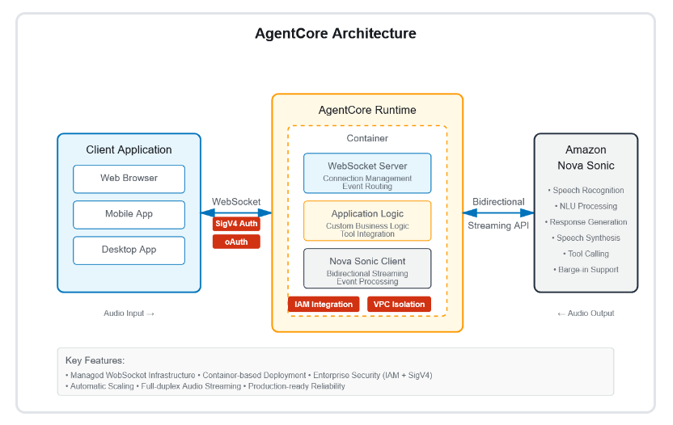
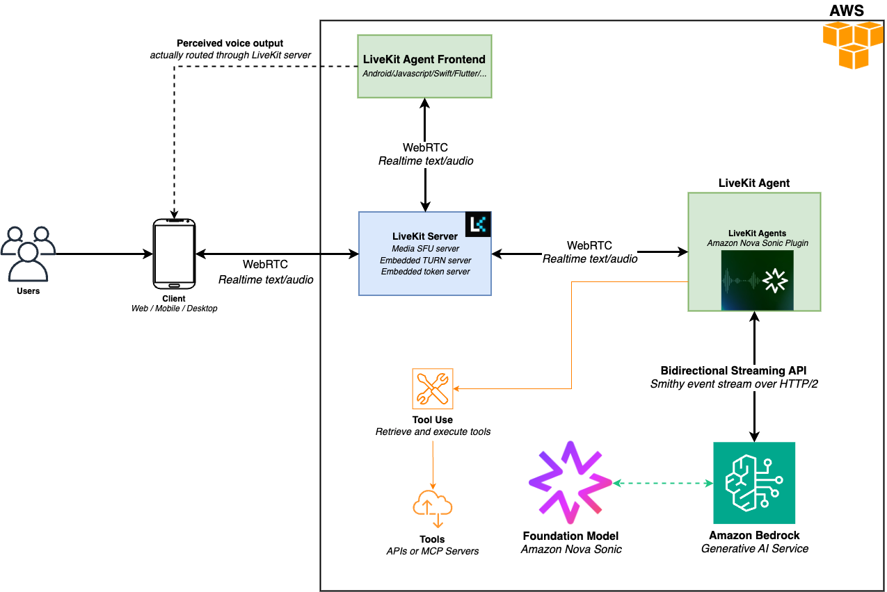
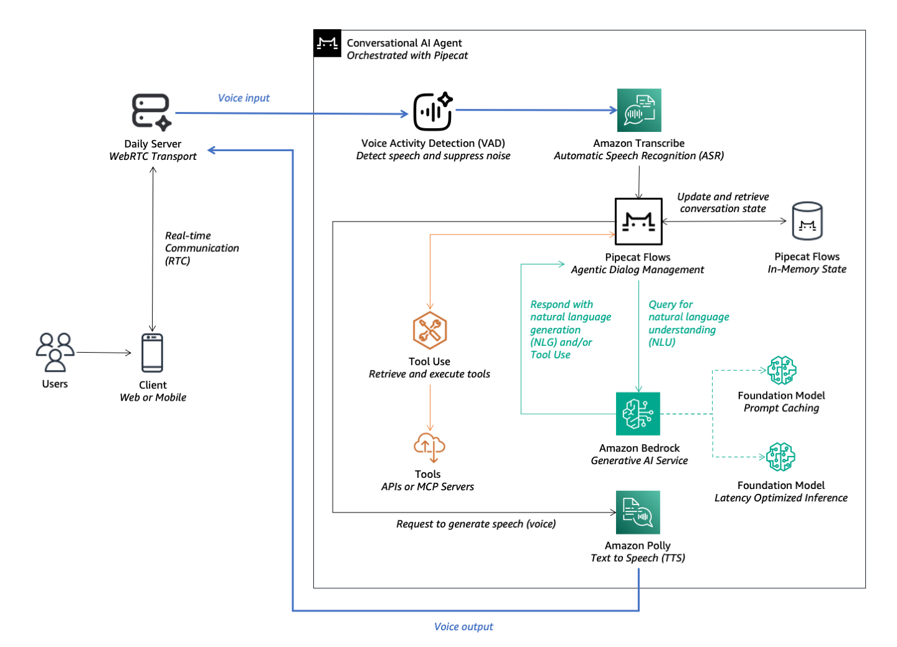
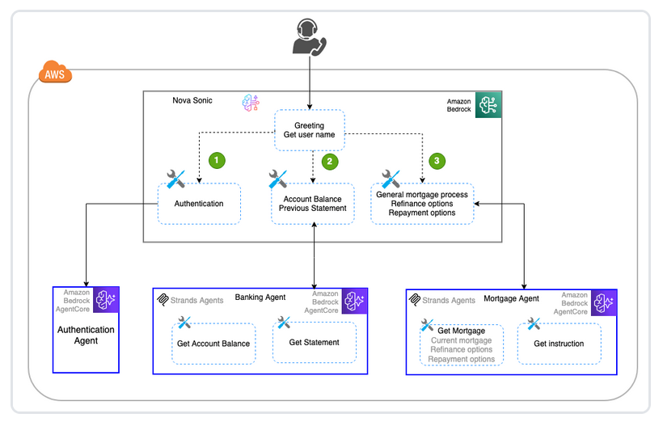

# Integrations

Amazon Nova 2 Sonic can be integrated with various frameworks and platforms to build
conversational AI applications. These integrations provide pre-built components and
simplified APIs for common use cases.

## Strands Agents

Strands Agents is a simple yet powerful SDK that takes a model-driven approach to
building and running AI agents. From simple conversational assistants to complex
autonomous workflows, from local development to production deployment, Strands
Agents scales with your needs.

The BidiAgent provides real-time audio and text interaction through persistent
streaming connections. Unlike traditional request-response patterns, this agent
maintains long-running conversations with support for interruptions, concurrent
processing and continuous audio responses.

**Prerequisites:**

- Python 3.8 or later installed
- Credentials for AWS configured with access to Amazon Bedrock
- Basic familiarity with Python async/await syntax

For comprehensive documentation on the Strands framework, visit the official
Strands documentation.

**Code example:**

```
import asyncio
from strands.experimental.bidi.agent import BidiAgent
from strands.experimental.bidi.io.audio import BidiAudioIO
from strands.experimental.bidi.io.text import BidiTextIO
from strands.experimental.bidi.models.novasonic import BidiNovaSonicModel
from strands_tools import calculator

async def main():
    """Test the BidirectionalAgent API."""
    # Audio and Text input/output utility
    audio_io = BidiAudioIO(audio_config={})
    text_io = BidiTextIO()

    # Nova Sonic model
    model = BidiNovaSonicModel(region="us-east-1")

    async with BidiAgent(model=model, tools=[calculator]) as agent:
        print("New BidiAgent Experience")
        print("Try asking: 'What is 25 times 8?' or 'Calculate the square root of 144'")

        await agent.run(
            inputs=[audio_io.input()],
            outputs=[audio_io.output(), text_io.output()]
        )

if __name__ == "__main__":
    try:
        asyncio.run(main())
    except KeyboardInterrupt:
        print("\nConversation ended by user")
    except Exception as e:
        print(f"Error: {e}")
        import traceback
        traceback.print_exc()
```

## LiveKit

LiveKit is an open-source platform for building real-time audio and video
applications. Amazon Nova 2 Sonic can be integrated with LiveKit to create scalable voice
applications with features like multi-party conversations, recording and
streaming.

## Pipecat

Pipecat is a framework for building voice and multimodal conversational AI
applications. It provides a pipeline-based architecture that simplifies the
integration of speech recognition, language models and text-to-speech
services.

**Key Features:**

- Pipeline-based architecture for modular design
- Built-in support for multiple AI services
- Easy integration with Amazon Nova 2 Sonic
- Support for real-time audio processing

## Framework integrations

Amazon Nova 2 Sonic can be integrated with various frameworks and platforms to build
sophisticated voice applications. The following examples demonstrate integration
patterns with popular frameworks.

Amazon Bedrock AgentCore provides a framework for building AI agents with Amazon Bedrock
models. It includes tools for agent orchestration, memory management and
integration with external services.


**Key features:**

- Agent orchestration and workflow management
- Built-in memory and state management
- Integration with Amazon Bedrock models and tools
  LiveKit is an open-source platform for building real-time audio and video
  applications. Integration with Amazon Nova 2 Sonic enables voice-based
  interactions in LiveKit applications.


**Key features:**

- Real-time audio streaming
- Low-latency communication
- Support for multiple participants
  Pipecat is a framework for building voice and multimodal conversational AI
  applications. It provides a pipeline-based architecture for processing audio
  streams and integrating with various AI services.


**Key features:**

- Pipeline-based audio processing
- Modular component architecture
- Support for multiple AI service integrations
  Multi-agentic architectures allow you to build complex conversational
  systems where multiple specialized agents work together. Each agent can
  handle specific tasks or domains, with Amazon Nova 2 Sonic orchestrating the
  conversation flow.


**Benefits:**

- Separation of concerns with specialized agents
- Easier maintenance and updates
- Improved scalability
- Better handling of complex workflows
  Amazon Nova 2 Sonic can be integrated with telephony systems to build
  voice-based contact center solutions. This enables natural language
  interactions over phone calls with features like call routing, IVR
  (Interactive Voice Response) and agent assistance.

**Use cases:**

- Automated customer service
- Interactive voice response (IVR) systems
- Agent assistance and call routing
