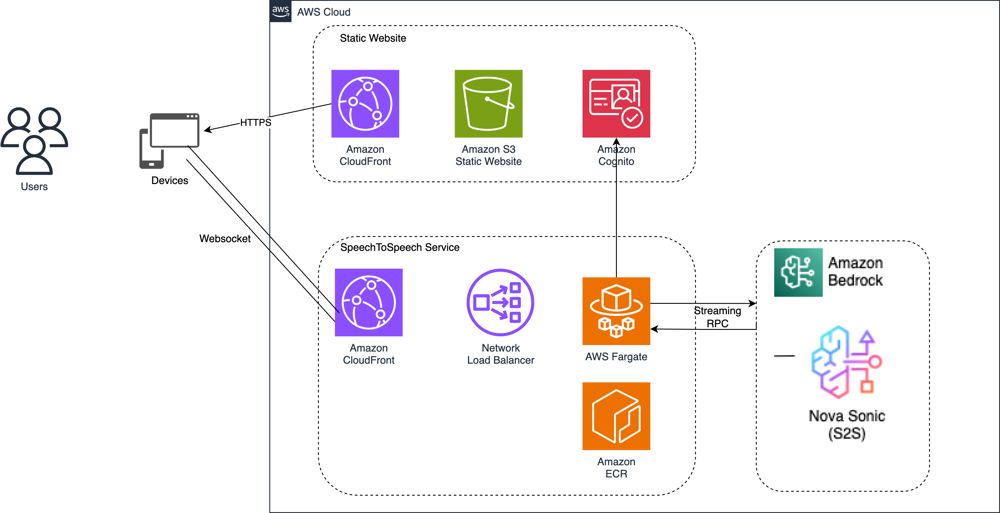

# Integrations

Amazon Nova 2 Sonic can be integrated with various frameworks and platforms to build
conversational AI applications. These integrations provide pre-built components and
simplified APIs for common use cases.

## Strands Agents

Strands Agents is a simple yet powerful SDK that takes a model-driven approach to
building and running AI agents. From simple conversational assistants to complex
autonomous workflows, from local development to production deployment, Strands
Agents scales with your needs.

For comprehensive documentation on the Strands framework, visit the [official Strands documentation](https://strandsagents.com/latest/documentation/docs/user-guide/quickstart/ "https://strandsagents.com/latest/documentation/docs/user-guide/quickstart/").

The Strands BidiAgent provides real-time audio and text interaction through
persistent streaming connections. Unlike traditional request-response patterns, this
agent maintains long-running conversations with support for interruptions,
concurrent processing and continuous audio responses.

**Prerequisites:**

- Python 3.8 or later installed
- Credentials for AWS configured with access to Amazon Bedrock
- Basic familiarity with Python async/await syntax

**Code example:**

**Installation:**

Install the required packages:

```
pip install strands-agents strands-agents-tools
```

Run this example:

```
import asyncio
from strands.experimental.bidi.agent import BidiAgent
from strands.experimental.bidi.io.audio import BidiAudioIO
from strands.experimental.bidi.io.text import BidiTextIO
from strands.experimental.bidi.models.novasonic import BidiNovaSonicModel
from strands_tools import calculator

async def main():
    """Test the BidirectionalAgent API."""
    # Audio and Text input/output utility
    audio_io = BidiAudioIO(audio_config={})
    text_io = BidiTextIO()

    # Nova Sonic model
    model = BidiNovaSonicModel(region="us-east-1")

    async with BidiAgent(model=model, tools=[calculator]) as agent:
        print("New BidiAgent Experience")
        print("Try asking: 'What is 25 times 8?' or 'Calculate the square root of 144'")

        await agent.run(
            inputs=[audio_io.input()],
            outputs=[audio_io.output(), text_io.output()]
        )

if __name__ == "__main__":
    try:
        asyncio.run(main())
    except KeyboardInterrupt:
        print("\nConversation ended by user")
    except Exception as e:
        print(f"Error: {e}")
        import traceback
        traceback.print_exc()
```

```
from strands.experimental.bidi.agent import BidiAgent
from strands.experimental.bidi.io.audio import BidiAudioIO
from strands.experimental.bidi.io.text import BidiTextIO
from strands.experimental.bidi.models.novasonic import BidiNovaSonicModel
from strands_tools import calculator
```

- BidiAgent: The main agent class that orchestrates bidirectional
  conversations
- BidiAudioIO: Handles audio input and output for speech
  interactions
- BidiTextIO: Provides text output for transcriptions and
  responses
- BidiNovaSonicModel The Nova 2 Sonic model wrapper
- Calculator: A pre-built tool for mathematical operations

```
audio_io = BidiAudioIO(audio_config={})
text_io = BidiTextIO()
```

The BidiAudioIO manages microphone input and speaker output, while
BidiTextIO displays text transcriptions and responses in the console.

```
model = BidiNovaSonicModel(region="us-east-1")
```

Create a Nova Sonic model instance. The region parameter specifies the AWS
region where the model is deployed.

```
async with BidiAgent(model=model, tools=[calculator]) as agent:
    await agent.run(
        inputs=[audio_io.input()],
        outputs=[audio_io.output(), text_io.output()]
    )
```

The agent is created with:

- Model: The Nova 2 Sonic model to use
- Tools: List of tools the agent can call (like calculator)
- Inputs: Audio input from the microphone
- Outputs: Audio output to speakers and text output to
  console

## Framework integrations

Amazon Nova 2 Sonic can be integrated with various frameworks and platforms to build
sophisticated voice applications. The following examples demonstrate integration
patterns with popular frameworks.

Amazon Bedrock AgentCore provides a managed runtime environment for deploying Nova 2
Sonic applictions with enterprise-grade security and scalability. AgentCore
simplifies the deployment of real-time voice AI applications by handling
infrastructure, authentication, and WebSocket connectivity.


**Key features:**

- Bidirectional streaming - Native support for Nova Sonic's
  full-duplex streaming interface with real-time event processing and
  low-latency communication.
- WebSocket infrastructure - Production-ready WebSocket servers with
  automatic scaling, connection management, and error recovery.
- Container deployment - Deploy Nova Sonic applications as
  containers to managed infrastructure with horizontal scaling and
  independent versioning.
- Enterprise security - Fine-grained authentication via IAM and
  SigV4, VPC isolation, and comprehensive audit logging.
  The architecture shows how client applications connect to AgentCore
  Runtime via WebSocket with SigV4 authentication. The containerized
  environment includes your WebSocket server, application logic, and Nova
  Sonic client, all communicating with Nova Sonic through the bidirectional
  streaming API.

**Benefits:**

- Simplified operations: Focus on application logic while AgentCore
  manages infrastructure, scaling, and reliability.
- Enterprise security: Built-in authentication, authorization, and
  compliance features for production deployments.
- Cost efficienty: Pay only for what you use with automatic scaling
  and resource optimization.
- Developer productivity: Reduce time to production with managed
  WebSocket infrastructure and container deployment.
  **Use cases**

- Customer service voice assistants with secure
  authentication
- Enterprise voice applications requiring IAM integration
- Multi-tenant voice platforms with isolated deployments
- Voice-enabled applications requiring compliance and audit
  trails
  For detailed documentation on deploying Nova Sonic with AgentCore, visit
  the [Amazon Bedrock
  AgentCore Documentation.](https://aws.amazon.com/bedrock/agentcore/ "https://aws.amazon.com/bedrock/agentcore/")

LiveKit is an open-source platform for building real-time audio and video
applications. Integration with Amazon Nova 2 Sonic enables developers to build
conversational voice interfaces without managing complex audio pipelines or
signaling protocols.

For detailed implementation examples and code examples, visit the [LiveKit AWS
Integration Documentation.](https://docs.livekit.io/agents/integrations/aws/ "https://docs.livekit.io/agents/integrations/aws/")


**How it works:**

- Client layer: Web, mobile, or desktop applications connect using
  LiveKit's client SDKs, which handle audio capture, WebRTC streaming,
  and playback.
- LiveKit Server: Acts as the real-time communication hub, managing
  WebRTC connections, routing audio streams, and handling session
  state with low-latency optimization.
- LiveKit Agent: Python-based agent that receives audio from the
  server, processes it through the Nova Sonic plugin, and streams
  responses back. Includes built-in features like voice activity
  detection and turn management.
- Amazon Nova 2 Sonic: Processes the audio stream through
  bidirectional streaming API, performing speech recognition, natural
  language understanding, and generating conversational responses with
  synthesized speech.
  Pipecat is a framework for building voice and multimodal conversational AI
  applications. It provides a modular, pipeline-based architecture that
  orchestrates multiple components to create intelligent voice applications
  with Amazon Nova Sonic and other AWS services.

For detailed implementation examples and code samples, visit the [PipeCat AWS
Integration Documentation.](https://docs.pipecat.ai/server/services/s2s/aws "https://docs.pipecat.ai/server/services/s2s/aws")

**Key features:**

- Pipeline architecture: Modular Python-based framework for
  composing voice AI components including ASR, NLU, TTS, and
  more.
- Pipecat flows: State management framework for building complex
  conversational logic and tool execution.
- WebRTC Support: Built-in integration with Daily and other WebRTC
  providers for real-time audio streaming.
- AWS Integration: Native support for Amazon Bedrock, Amazon
  Transcribe, and Amazon Polly.


The architecture includes:

- WebRTC Transport: Real-time audio streaming between client devices
  and application server.
- Voice activity detection (VAD): Silero VAD with configurable
  speech detection and noise suppression.
- Speech recognition: Amazon Transcribe for accurate, real-time
  speech-to-text conversion.
- Natural language understanding: Amazon Nova Pro on Bedrock with
  latency-optimized inference.
- Tool execution: Pipecat Flows for API integration and backend
  service calls.
- Response generation: Amazon Nova Pro for coherent, context-aware
  responses.
- Text-to-speech: Amazon Polly with generative voices for lifelike
  speech output.
  Deploy your Nova Sonic applications to AWS using infrastructure as code
  with AWS CDK (Cloud Development Kit). This approach provides repeatable,
  version-controlled deployments with best practices built in.

Deployment options

- Amazon ECS (Elastic Container Service): Fully managed container
  orchestration with Application Load Balancer integration,
  auto-scaling, and serverless Fargate execution.
- Amazon EKS (Elastic Kubernetes Services): Managed Kubernetes for
  complex orchestration, advanced networking, multi-region
  deployments, and extensive tooling ecosystem.
- AWS CDK: AWS CDK allows you to define cloud infrastructure using
  familiar programming languages.
  For a complete, production-ready example of deploying Nova Sonic with AWS
  CDK, see the [Speech-to-Speech CDK Sample](https://github.com/aws-samples/generative-ai-cdk-constructs-samples/tree/main/samples/speech-to-speech "https://github.com/aws-samples/generative-ai-cdk-constructs-samples/tree/main/samples/speech-to-speech") on GitHub. This sample
  demonstrates:



- Complete CDK infrastructure setup with TypeScript
- WebSocket server implementation for real-time communication
- Container deployment with ECS and Fargate
- Application Load Balancer configuration for WebSocket
  support
- VPC networking and security group setup
- CloudWatch monitoring and logging
- Best practices for production deployments
  Multi-agent architecture is a widely used pattern for designing AI
  assistants that handle complex tasks. In a voice assistant powered by Nova 2
  Sonic, this architecture coordinates multiple specialized agents, where each
  agent operates independently to enable parallel processing, modular design,
  and scalable solutions.

Nova Sonic serves as the orchestrator in a multi-agent system, performing
two key functions:

Conversation flow management: Ensures all necessary information is
collected before proceeding to the next step in the conversation.

Intent classification: Analyzes user inquiries and routes them to the
appropriate specialized sub-agent.


The diagram above shows a banking voice assistant that uses a multi-agent
architecture. The conversation flow begins with a greeting and collecting
the user's name, then handles inquiries related to banking or mortgages
through specialized sub-agents.

Conversation flow example:

1. User connects to voice assistant.
2. Nova 2 Sonic: "Hello! What's your name?"
3. User: "My name is John"
4. Nova 2 Sonic: "Hi John, how can I help you today?"
5. User: "I want to check my account balance"
6. Nova 2 Sonic: [Routes to Authentication Agent]
7. Authentication Agent: "Please provide your account ID"
8. User: "12345"
9. Authentication Agent: [Verifies identity]
10. Nova 2 Sonic: [Routes to Banking Agent]
11. Banking Agent: "Your current balance is $5,431,10"
    While this example demonstrates sub-agents using the Strands Agents
    framework deployed on Amazon Bedrock AgentCore, the architecture is
    flexible. You can choose:

- Your preferred agent framework
- Any LLM provider
- Custom hosting options
- Different orchestration patterns
  **Benefits:**

- Modularity: Each agent focuses on a specific domain, making the
  system easier to maintain and update.
- Scalability: Add new agents without modifying existing ones,
  allowing your system to grow with your needs.
- Parallel processing: Multiple agents can work simultaneously,
  improving response times for complex queries.
- Specialization: Each agent can be optimized for its specific task,
  using the most appropriate tools and knowledge bases.
- Fault isolation: If one agent fails, others continue to function,
  improving overall system reliability.
  Refer to [this blog](https://aws.amazon.com/blogs/machine-learning/building-a-multi-agent-voice-assistant-with-amazon-nova-sonic-and-amazon-bedrock-agentcore/ "https://aws.amazon.com/blogs/machine-learning/building-a-multi-agent-voice-assistant-with-amazon-nova-sonic-and-amazon-bedrock-agentcore/") for more details and code examples.

See the [Nova Sonic Workshop Multi-Agent Lab](https://catalog.workshops.aws/amazon-nova-sonic-s2s/en-US/02-repeatable-pattern/05-multi-agent-agentcore "https://catalog.workshops.aws/amazon-nova-sonic-s2s/en-US/02-repeatable-pattern/05-multi-agent-agentcore") for hands-on
samples.

Amazon Nova 2 Sonic integrates with telephony providers to enable AI-powered
voice applications accessible via phone calls. This guide covers integration
with Twilio, Vonage, and other SIP-based systems for building contact center
solutions and voice agents.

**Twilio**: Cloud communications platform
with programmable voice and media streaming capabilities.

**Vonage**: Global communications APIs with
voice, WebSocket audio streaming, and SIP connectivity.

AWS provides a comprehensive sample implementation demonstrating Nova
Sonic in a contact center environment with real-time analytics and telephony
integration.

Repository: [Sample Sonic Contact Center with Telephony](https://github.com/aws-samples/sample-sonic-contact-center-with-telephony "https://github.com/aws-samples/sample-sonic-contact-center-with-telephony")
