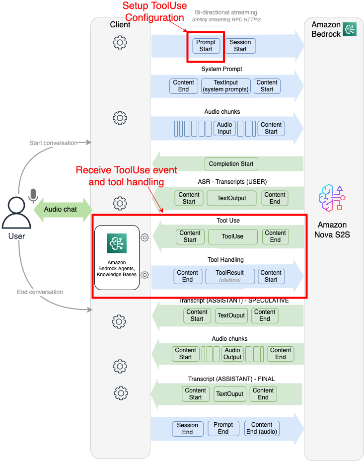

# Tool configuration

Amazon Nova 2 Sonic supports tool use (also known as function calling), allowing the
model to request external information or actions during conversations, such as API
calls, database queries, or custom code functions. This allows your voice assistant
to take actions, retrieve information, and integrate with external services based on
user requests.

Nova 2 Sonic features asynchronous tool calling, enabling the AI to continue
conversing naturally while tools run in ther background - creating a more fluid and
responsive user experience.

The following are simplified steps on how to use tools:

1. Define tools: specify available tools with their parameters in the
   promptStart event
2. User speaks: user makes a request that requires a tool (such as, "What's
   the weather in Seattle?")
3. Tool invocation: Nova 2 Sonic recognizes the need and sends a toolUse
   event
4. Execute rool: Your application executes the tool and returns
   results
5. Response Generation: Nova 2 Sonic incorporates the results into its spoken
   response
   The following diagram illustrates how tool use works:



## Defining tools

Tools are defined using a JSON schema that describes their purpose,
parameters, and expected inputs.

The following are tool definition components and explanations:

- Name: Unique identifier for the tool (use snake_case)
- Description: Clear explanation of what the tool does; helps the AI
  decide when to use it
- InputSchema: JSON schema defining the parameters the tool
  accepts
- Properties: Individual parameters with types and descriptions
- Required: Array of parameter names that must be provided

Here's a simple weather tool definition

```
{
  "toolSpec": {
    "name": "get_weather",
    "description": "Get current weather information for a specific location",
    "inputSchema": {
      "json": {
        "type": "object",
        "properties": {
          "location": {
            "type": "string",
            "description": "City name or zip code"
          },
          "units": {
            "type": "string",
            "enum": ["celsius", "fahrenheit"],
            "description": "Temperature units"
          }
        },
        "required": ["location"]
      }
    }
  }
}

```

Tool configuration is passed to Nova 2 Sonic in the
`promptStart` event along with audio and text output
settings:

```
{
    "event": {
        "promptStart": {
            "promptName": "<prompt-id>",
            "textOutputConfiguration": {
                "mediaType": "text/plain"
            },
            "audioOutputConfiguration": {
                "mediaType": "audio/lpcm",
                "sampleRateHertz": 16000,
                "sampleSizeBits": 16,
                "channelCount": 1,
                "voiceId": "matthew",
                "encoding": "base64",
                "audioType": "SPEECH"
            },
            "toolUseOutputConfiguration": {
                "mediaType": "application/json"
            },
            "toolConfiguration": {
                "tools": [
                    {
                        "toolSpec": {
                            "name": "get_weather",
                            "description": "Get current weather information for a specific location",
                            "inputSchema": {
                                "json": {
                                    "type": "object",
                                    "properties": {
                                        "location": {
                                            "type": "string",
                                            "description": "City name or zip code"
                                        },
                                        "units": {
                                            "type": "string",
                                            "enum": ["celsius", "fahrenheit"],
                                            "description": "Temperature units"
                                        }
                                    },
                                    "required": ["location"]
                                }
                            }
                        }
                    }
                ],
                "toolChoice": {
                    "auto": {}
                }
            }
        }
    }
}

```

## Tool Choice Parameters

Nova 2 Sonic supports three tool choice parameters to control when and which
tools are used. Specify the toolChoice parameter in your tool
configuration:

- Auto (default): The model decides whether any tools are needed and can
  call multiple tools if required. Provides maximum flexibility.
- Any: Ensures at least one of the available tools is called at the
  beginning of the response, with the model selecting the most appropriate
  one. Useful when you have multiple knowledge bases or tools and want to
  guarantee one is used.
- Tool: Forces a specific named tool to be called exactly once at the
  beginning of the response. For example, if you specify a knowledge base
  tool, the model will query it before responding, regardless of whether
  it thinks the tool is needed.

**Tool Choice Examples**

Auto (default)

```
"toolChoice": {
    "auto": {}
}

```

Any:

```
"toolChoice": {
    "any": {}
}

```

Specific Tool:

```
"toolChoice": {
    "tool": {
        "name": "get_weather"
    }
}

```

## Receiving and processing tool use

events

When Amazon Nova 2 Sonic determines that a tool is needed, it sends a
`toolUse` event containing:

1. `toolUseID`: unique identifier for this tool
   invocation
2. ToolName: the tool name to execute
3. Content: JSON string containing parameters extracted from the user's
   request
4. SessionID: current session identifier
5. Role: set to "TOOL" for tool use events

Example tool use event

```
{
    "event": {
        "toolUse": {
            "completionId": "<completion-id>",
            "content": "{\"location\": \"Seattle\", \"units\": \"fahrenheit\"}",
            "contentId": "<content-id>",
            "promptName": "<prompt-id>",
            "role": "TOOL",
            "sessionId": "<session-id>",
            "toolName": "get_weather",
            "toolUseId": "<tool-use-id>"
        }
    }
}
```

Processing steps

1. Receive the toolUse event from Nova 2 Sonic
2. Extract the tool name and parameters from the event
3. Execute your tool logic (API call, database query, and so on)
4. Return the result using a toolResult event

Example ToolResult Event

```
{
    "event": {
        "toolResult": {
            "promptName": "<prompt-id>",
            "contentName": "<content-id>",
            "content": "{\"temperature\": 72, \"condition\": \"sunny\", \"humidity\": 45}"
        }
    }
}
```

## Best practices

- Clear descriptions: Write detailed tool descriptions to help Nova 2
  Sonic understand when to use each tool.
- Validate parameters: Always validate tool parameters before execution
  to prevent errors. Define tool parameters using proper JSON schema with
  structured data types (such as enums, numbers, or booleans) rather than
  open-ended strings whenever possible.
- Error handling: Return meaningful error messages in toolResult events
  when tools fail.
- Async execution: Take advantage of asynchronous tool calling to
  maintain conversation flow.
- Tool naming: Use descriptive, action-oriented names (such as
  get_weather, search_database, send_email).
