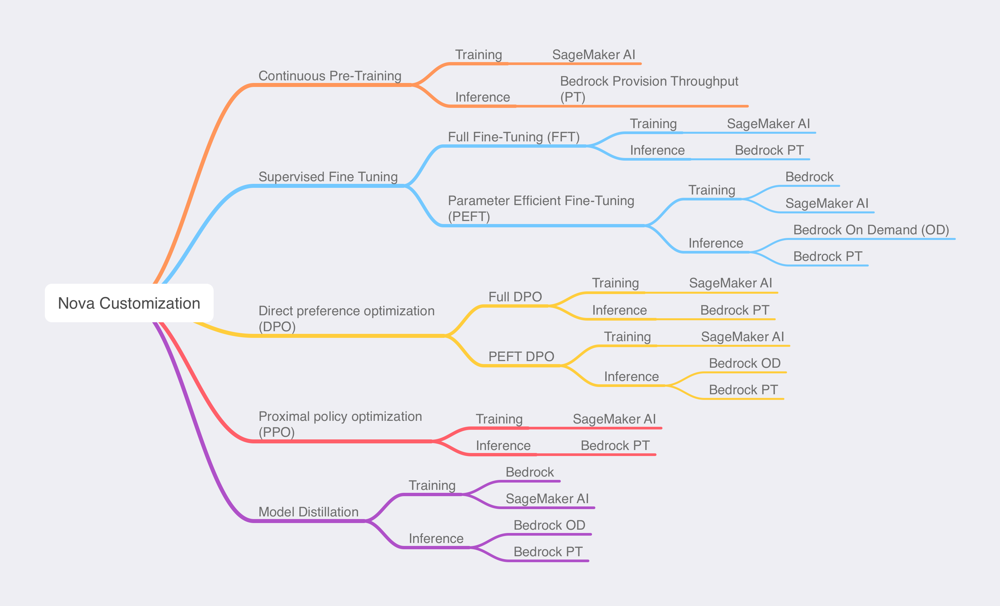

# Customizing Amazon Nova models

You can customize Amazon Nova models with [Amazon Bedrock](../../../bedrock/latest/userguide/custom-models.md "../../../bedrock/latest/userguide/custom-models.md") or [SageMaker AI](../../../sagemaker/latest/dg/gs.md "../../../sagemaker/latest/dg/gs.md"), depending on the requirements of your use case, to improve model performance and create a better customer experience.

Customization for the Amazon Nova models is provided with responsible AI considerations. The following table summarizes the availability of customization and distillation for Amazon Nova.

| Model Name          | Model ID                       | Amazon Bedrock Fine-tuning | Amazon Bedrock Distillation | Sagemaker Training Job Fine-tuning |
| ------------------- | ------------------------------ | -------------------------- | --------------------------- | ---------------------------------- |
| Amazon Nova Micro   | amazon.nova-micro-v1:0:128k    | Yes                        | Student                     | Yes                                |
| Amazon Nova Lite    | amazon.nova-lite-v1:0:300k     | Yes                        | Student                     | Yes                                |
| Amazon Nova Pro     | amazon.nova-pro-v1:0:300k      | Yes                        | Teacher and student         | Yes                                |
| Amazon Nova Premier | amazon.nova-premier-v1:0:1000k | No                         | Teacher                     | No                                 |
| Amazon Nova Canvas  | amazon.nova-canvas-v1:0        | Yes                        | No                          | No                                 |
| Amazon Nova Reel    | amazon.nova-reel-v1:1          | No                         | No                          | No                                 |

The following image demonstrates the customization paths available for Amazon Nova models:

The following table summarizes the training recipe options available. The table includes information about both the service you can use and the inference technique available.

| Training recipe                                                | Amazon Bedrock | SageMaker AI Training Jobs | SageMaker AI Hyperpod | On demand | Provision throughput |
| -------------------------------------------------------------- | -------------- | -------------------------- | --------------------- | --------- | -------------------- |
| Parameter-efficient supervised fine-tuning                     | Yes            | Yes                        | Yes                   | Yes       | Yes                  |
| Full rank supervised fine-tuning                               | No             | Yes                        | Yes                   | No        | Yes                  |
| Parameter-efficient fine-tuning Direct Preference Optimization | No             | Yes                        | Yes                   | Yes       | Yes                  |
| Full rank Direct Preference Optimization                       | No             | Yes                        | Yes                   | No        | Yes                  |
| Proximal policy optimization reinforcement learning            | No             | No                         | Yes                   | No        | Yes                  |
| Distillation • Amazon Nova Premier as teacher               | Yes            | No                         | Yes                   | Yes       | Yes                  |
| Distillation • Amazon Nova Pro as teacher                   | Yes            | No                         | Yes                   | Yes       | Yes                  |
| Continuous pre-training                                        | No             | No                         | Yes                   | No        | Yes                  |

###### Topics

- [With Amazon Bedrock](customize-fine-tune-bedrock.md "customize-fine-tune-bedrock.md")
- [With Amazon SageMaker AI](customize-fine-tune-sagemaker.md "customize-fine-tune-sagemaker.md")
