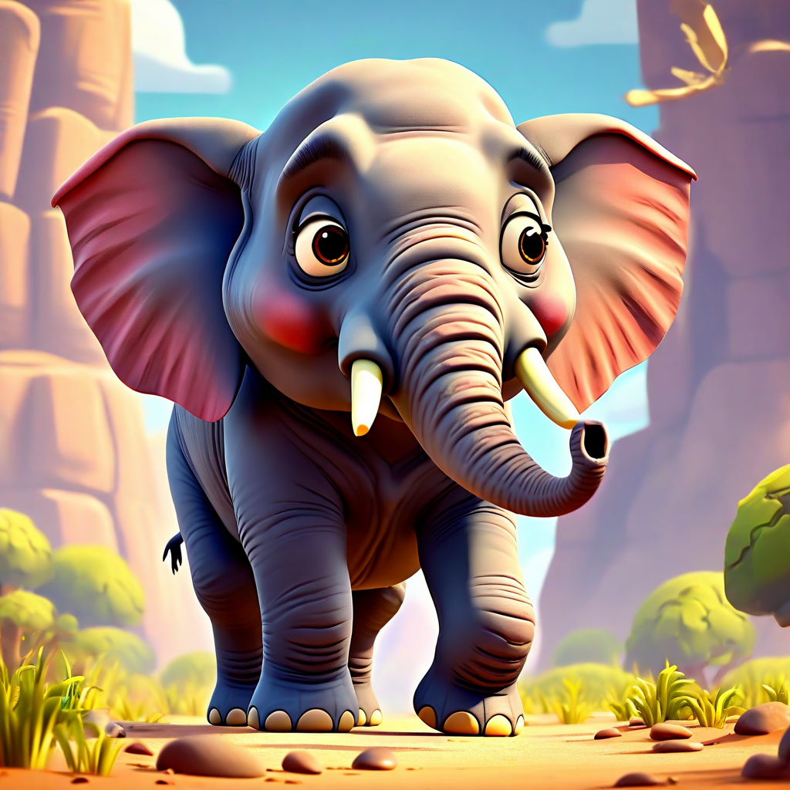
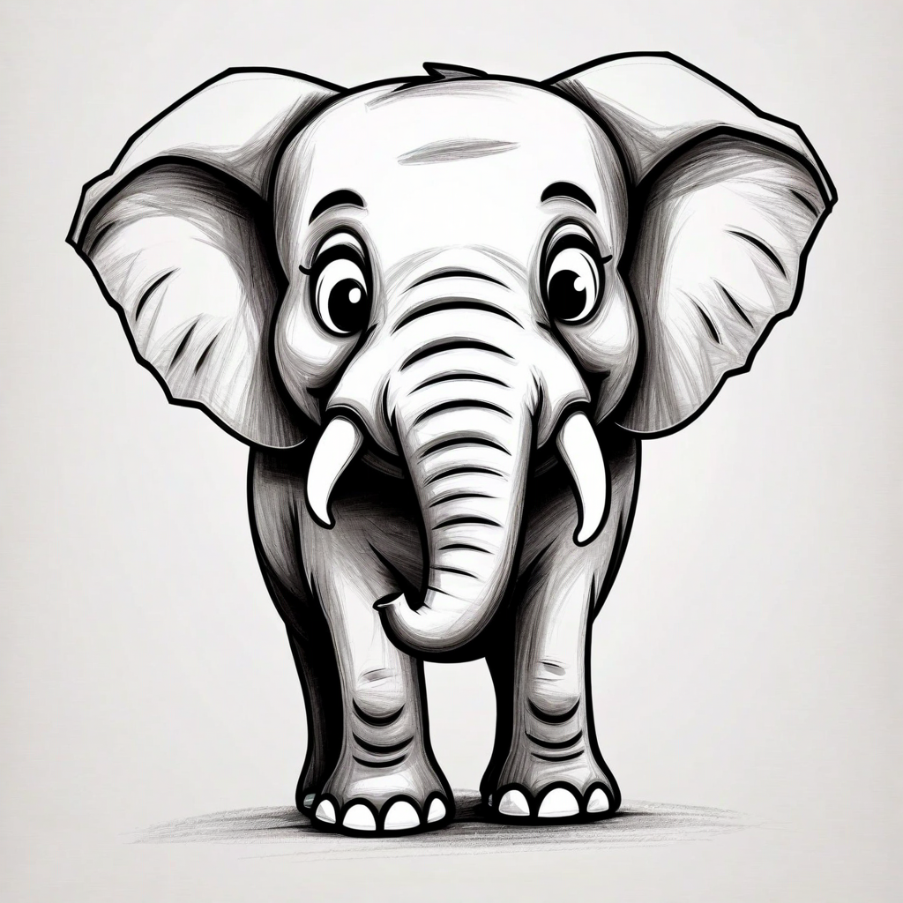
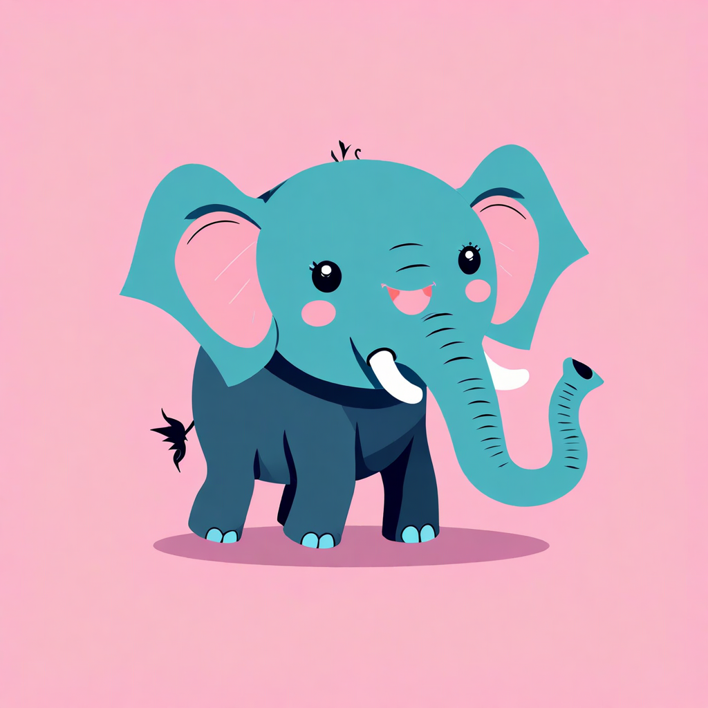
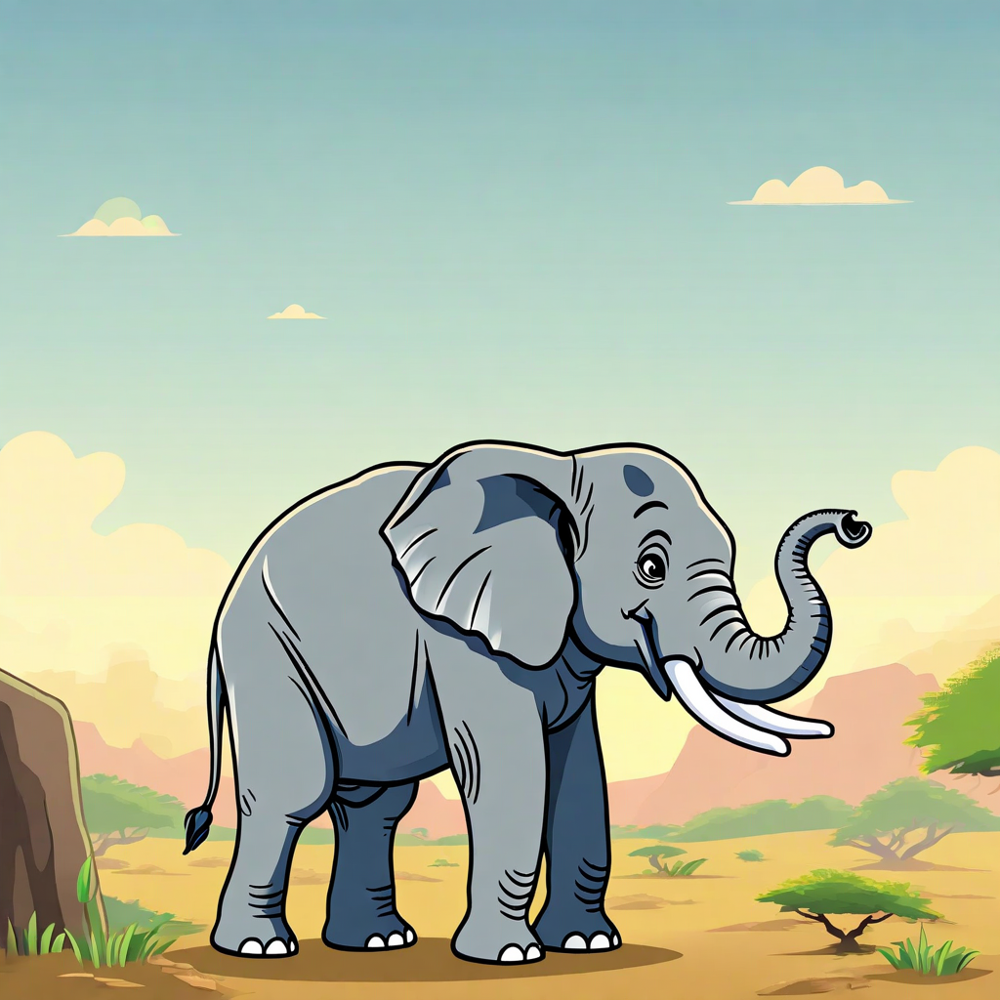
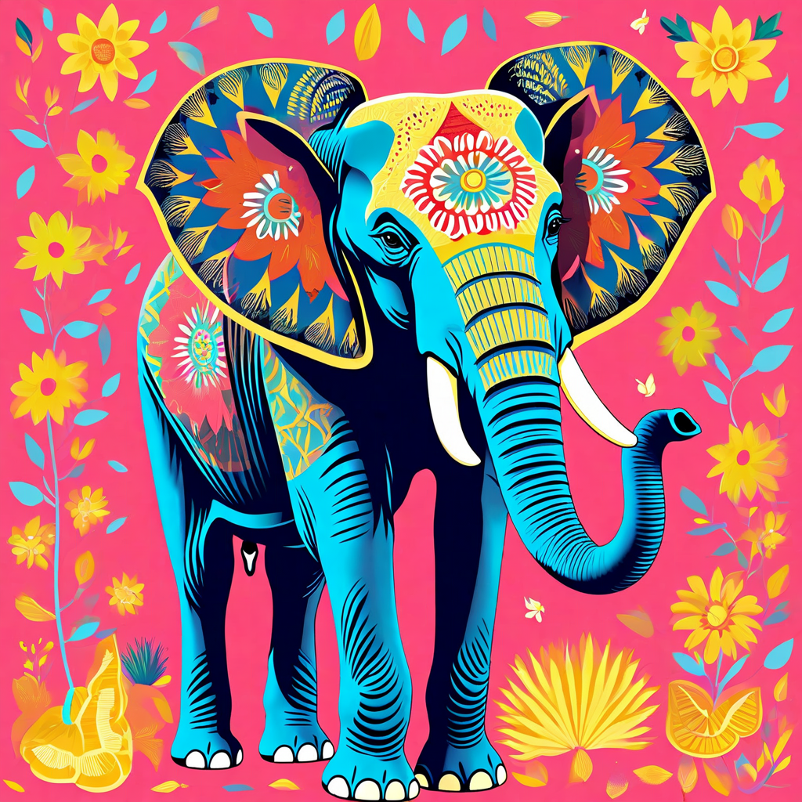
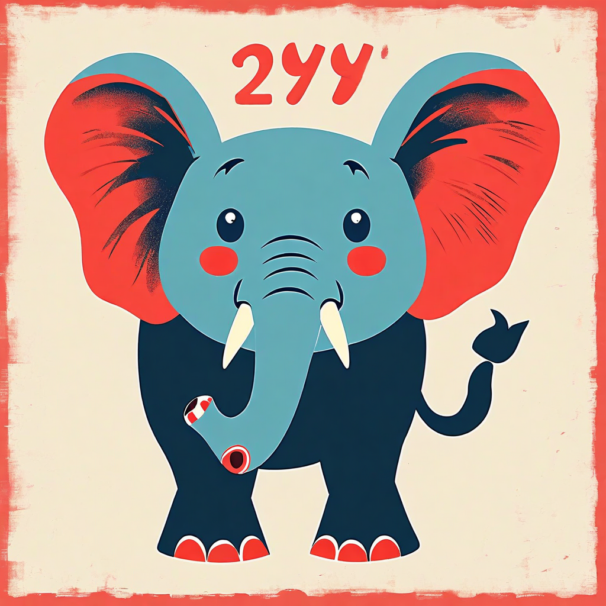
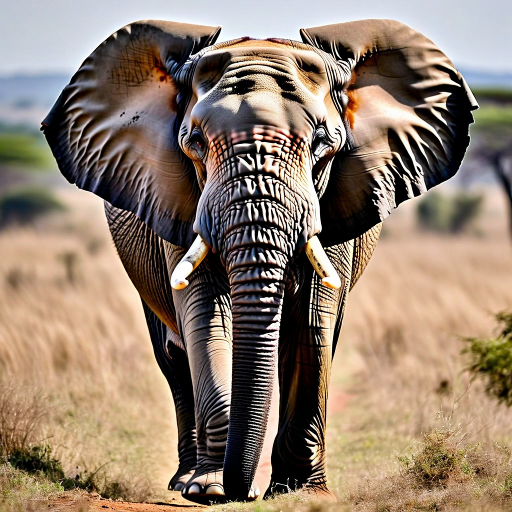
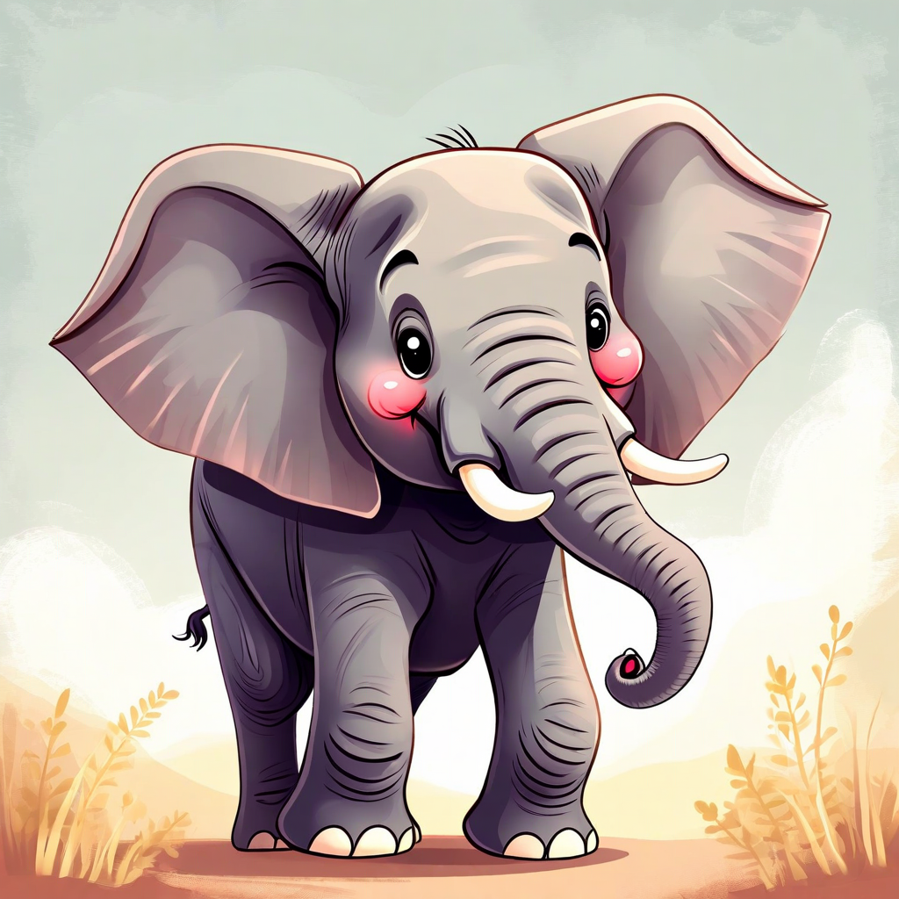

# Visual Styles

Amazon Nova Canvas allows you to generate images in a variety of predefined styles. With the `"TEXT_TO_IMAGE"` task type, use the `style` parameter to pick a predefined visual style. Choose from these available styles:

- `"3D_ANIMATED_FAMILY_FILM"` - A style that alludes to 3D animated films. Featuring realistic rendering and characters with cartoonish or exaggerated physical features. This style is capable of producing character-focused images, object- or prop-focused images, and environment- or setting-focused images of both interiors and exteriors.
- `"DESIGN_SKETCH"` - A style featuring hand-drawn line-art without a lot of wash or fill that is not too refined. This style is used to convey concepts and ideas. It is useful for fashion and product design sketches as well as architectural sketches.
- `"FLAT_VECTOR_ILLUSTRATION"` - A flat-color illustration style that is popular in business communications. It is also useful for icon and clip art images.
- `"GRAPHIC_NOVEL_ILLUSTRATION"` - A vivid ink illustration style. Characters do not have exaggerated features, as with some other more cartoon-ish styles.
- `"MAXIMALISM"` - Bright, elaborate, bold, and complex with strong shapes, and rich details. This style can be applied to a variety of subjects, such as illustrations, photography, interior design, graphic design, or packaging design.
- `"MIDCENTURY_RETRO"` - Alludes to graphic design trends from the 1940s through 1960s.
- `"PHOTOREALISM"` - Realistic photography style, including different repertoires such as stock photography, editorial photography, journalistic photography, and more. This style shows realistic lighting, depth of field, and composition fitting the repertoire. The most common subjects are humans, but can also include animals, landscapes, and other natural features.
- `"SOFT_DIGITAL_PAINTING"` - This style has more finish and refinement than a sketch. It includes shading, three dimensionality, and texture that might be lacking in other styles.

###### Note

Amazon Nova Canvas is not limited to the styles in this list. You can achieve many other visual styles by omitting the `style` parameter and describing your desired style within your prompt. Optionally, you can use the `negativeText` parameter to further steer the style characteristics away from undesired characteristics.

The following images display the same image generated in each of the previously described styles.

