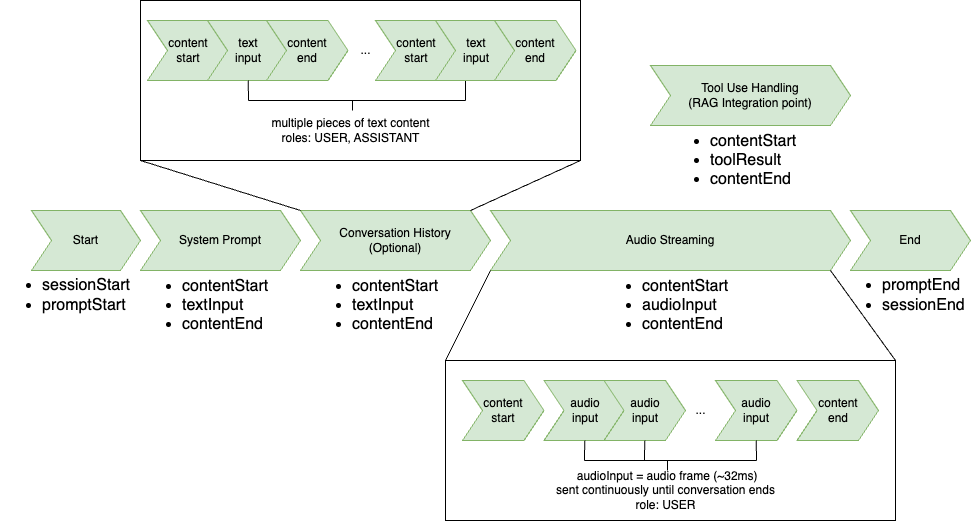

# Handling input events with the bidirectional API

###### Note

This documentation is for Amazon Nova Version 1. For the Amazon Nova 2 Sonic guide, visit [Handling input events with the bidirectional API](../nova2-userguide/sonic-input-events.md "../nova2-userguide/sonic-input-events.md").

The bidirectional Stream API uses an event-driven architecture with structured input and output events. Understanding the correct event ordering is crucial for implementing successful conversational applications and maintaining the proper conversation state throughout interactions.

The Nova Sonic conversation follows a structured event sequence. You begin by sending a `sessionStart` event that contains the inference configuration parameters, such as temperature and token limits. Next, you send `promptStart` to define the audio output format and tool configurations, assigning a unique `promptName` identifier that must be included in all subsequent events.

For each interaction type (system prompt, audio, and so on), you follow a three-part pattern: use `contentStart` to define the content type and the role of the content (`SYSTEM`, `USER`, `ASSISTANT`, `TOOL`), then provide the actual content event, and finish with `contentEnd` to close that segment. The `contentStart` event specifies whether you're sending tool results, streaming audio, or a system prompt. The `contentStart` event includes a unique `contentName` identifier.

A conversation history can be included only once, after the system prompt and before audio streaming begins. It follows the same `contentStart`/`textInput`/`contentEnd` pattern. The `USER` and `ASSISTANT` roles must be defined in the `contentStart` event for each historical message. This provides essential context for the current conversation but must be completed before any new user input begins.

Audio streaming operates with continuous microphone sampling. After sending an initial `contentStart`, audio frames (approximately 32ms each) are captured directly from the microphone and immediately sent as `audioInput` events using the same `contentName`. These audio samples should be streamed in real-time as they're captured, maintaining the natural microphone sampling cadence throughout the conversation. All audio frames share a single content container until the conversation ends and it is explicitly closed.

After the conversation ends or needs to be terminated, it's essential to properly close all open streams and end the session in the correct sequence. To properly end a session and avoid resource leaks, you must follow a specific closing sequence:

1. Close any open audio streams with the `contentEnd` event.
2. Send a `promptEnd` event that references the original `promptName`.
3. Send the `sessionEnd` event.
   Skipping any of these closing events can result in incomplete conversations or orphaned resources.

These identifiers create a hierarchical structure: the `promptName` ties all conversation events together, while each `contentName` marks the boundaries of specific content blocks. This hierarchy ensures that model maintains proper context throughout the interaction.



## Input event flow

The structure of the input event flow is provided in this section.

1. `RequestStartEvent`

```
{
    "event": {
        "sessionStart": {
            "inferenceConfiguration": {
                "maxTokens": "int",
                "topP": "float",
                "temperature": "float"
            }
        }
    }
}
```

2. `PromptStartEvent`

```
{
    "event": {
        "promptStart": {
            "promptName": "string", // unique identifier same across all events i.e. UUID
            "textOutputConfiguration": {
                "mediaType": "text/plain"
            },
            "audioOutputConfiguration": {
                "mediaType": "audio/lpcm",
                "sampleRateHertz": 8000 | 16000 | 24000,
                "sampleSizeBits": 16,
                "channelCount": 1,
                "voiceId": "matthew" | "tiffany" | "amy" |
                        "lupe" | "carlos" | "ambre" | "florian" |
                        "greta" | "lennart" | "beatrice" | "lorenzo",
                "encoding": "base64",
                "audioType": "SPEECH",
            },
            "toolUseOutputConfiguration": {
                "mediaType": "application/json"
            },
            "toolConfiguration": {
                "tools": [{
                    "toolSpec": {
                        "name": "string",
                        "description": "string",
                        "inputSchema": {
                            "json": "{}"
                        }
                    }
                }]
            }
        }
    }
}
```

3. `InputContentStartEvent`
   - `Text`

   ```
   {
       "event": {
           "contentStart": {
               "promptName": "string", // same unique identifier from promptStart event
               "contentName": "string", // unique identifier for the content block
               "type": "TEXT",
               "interactive": false,
               "role": "SYSTEM" | "USER" | "ASSISTANT",
               "textInputConfiguration": {
                   "mediaType": "text/plain"
               }
           }
       }
   }
   ```

   - `Audio`

   ```
   {
       "event": {
           "contentStart": {
               "promptName": "string", // same unique identifier from promptStart event
               "contentName": "string", // unique identifier for the content block
               "type": "AUDIO",
               "interactive": true,
               "role": "USER",
               "audioInputConfiguration": {
                   "mediaType": "audio/lpcm",
                   "sampleRateHertz": 8000 | 16000 | 24000,
                   "sampleSizeBits": 16,
                   "channelCount": 1,
                   "audioType": "SPEECH",
                   "encoding": "base64"
               }
           }
       }
   }
   ```

   - `Tool`

   ```
   {
       "event": {
           "contentStart": {
               "promptName": "string", // same unique identifier from promptStart event
               "contentName": "string", // unique identifier for the content block
               "interactive": false,
               "type": "TOOL",
               "role": "TOOL",
               "toolResultInputConfiguration": {
                   "toolUseId": "string", // existing tool use id
                   "type": "TEXT",
                   "textInputConfiguration": {
                       "mediaType": "text/plain"
                   }
               }
           }
       }
   }
   ```

4. `TextInputContent`

```
{
    "event": {
        "textInput": {
            "promptName": "string", // same unique identifier from promptStart event
            "contentName": "string", // unique identifier for the content block
            "content": "string"
        }
    }
}
```

5. `AudioInputContent`

```
{
    "event": {
        "audioInput": {
            "promptName": "string", // same unique identifier from promptStart event
            "contentName": "string", // same unique identifier from its contentStart
            "content": "base64EncodedAudioData"
        }
    }
}
```

6. `ToolResultContentEvent`

```
"event": {
    "toolResult": {
        "promptName": "string", // same unique identifier from promptStart event
        "contentName": "string", // same unique identifier from its contentStart
        "content": "{\"key\": \"value\"}" // stringified JSON object as a tool result
    }
}
```

7. `InputContentEndEvent`

```
{
    "event": {
        "contentEnd": {
            "promptName": "string", // same unique identifier from promptStart event
            "contentName": "string" // same unique identifier from its contentStart
        }
    }
}
```

8. `PromptEndEvent`

```
{
    "event": {
        "promptEnd": {
            "promptName": "string" // same unique identifier from promptStart event
        }
    }
}
```

9. `RequestEndEvent`

```
{
    "event": {
        "sessionEnd": {}
    }
}
```
