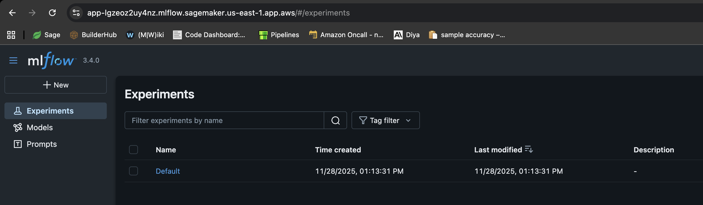
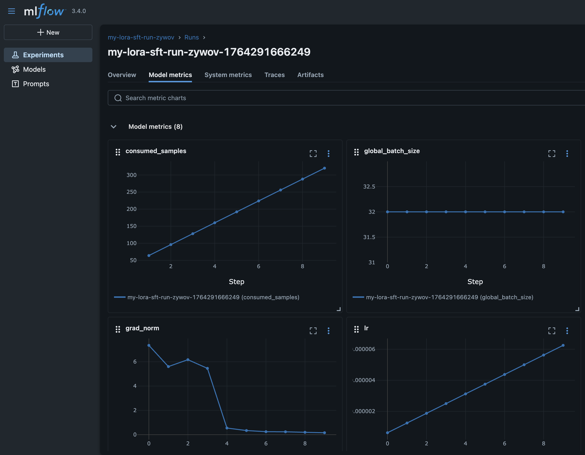

# Monitoring HyperPod jobs with MLflow

You can use MLflow to track and monitor your training jobs on SageMaker HyperPod. Follow these steps to set up MLflow and connect it to your training recipes.

**Create the MLflow
App**

Example AWS CLI command

```
aws sagemaker-mlflow create-mlflow-app \
    --name <app-name> \
    --artifact-store-uri <s3-bucket-name> \
    --role-arn <role-arn> \
    --region <region-name>
```

Example output

```
{
    "Arn": "arn:aws:sagemaker:us-east-1:111122223333:mlflow-app/app-LGZEOZ2UY4NZ"
}
```

**Generate pre-signed
URL**

Example AWS CLI command

```
aws sagemaker-mlflow create-presigned-mlflow-app-url \
    --arn <app-arn> \
    --region <region-name> \
    --output text
```

Example output

```
https://app-LGZEOZ2UY4NZ.mlflow.sagemaker.us-east-1.app.aws/auth?authToken=eyJhbGciOiJIUzI1NiJ9.eyJhdXRoVG9rZW5JZCI6IkxETVBPUyIsImZhc0NyZWRlbnRpYWxzIjoiQWdWNGhDM1VvZ0VYSUVsT2lZOVlLNmxjRHVxWm1BMnNhZ3JDWEd3aFpOSmdXbzBBWHdBQkFCVmhkM010WTNKNWNIUnZMWEIxWW14cFl5MXJaWGtBUkVFd09IQmtVbU5IUzJJMU1VTnVaVEl3UVhkUE5uVm9Ra2xHTkZsNVRqTTNXRVJuTTNsalowNHhRVFZvZERneVdrMWlkRlZXVWpGTWMyWlRUV1JQWmpSS2R6MDlBQUVBQjJGM2N5MXJiWE1BUzJGeWJqcGhkM002YTIxek9uVnpMV1ZoYzNRdE1Ub3pNVFF4TkRZek1EWTBPREk2YTJWNUx6Y3dOMkpoTmpjeExUUXpZamd0TkRFeU5DMWhaVFUzTFRrMFlqTXdZbUptT1RJNU13QzRBUUlCQUhnQjRVMDBTK3ErVE51d1gydlFlaGtxQnVneWQ3YnNrb0pWdWQ2NmZjVENVd0ZzRTV4VHRGVllHUXdxUWZoeXE2RkJBQUFBZmpCOEJna3Foa2lHOXcwQkJ3YWdiekJ0QWdFQU1HZ0dDU3FHU0liM0RRRUhBVEFlQmdsZ2hrZ0JaUU1FQVM0d0VRUU1yOEh4MXhwczFBbmEzL1JKQWdFUWdEdTI0K1M5c2VOUUNFV0hJRXJwdmYxa25MZTJteitlT29pTEZYNTJaeHZsY3AyZHFQL09tY3RJajFqTWFuRjMxZkJyY004MmpTWFVmUHRhTWdJQUFCQUE3L1pGT05DRi8rWnVPOVlCVnhoaVppSEFSLy8zR1I0TmR3QWVxcDdneHNkd2lwTDJsVWdhU3ZGNVRCbW9uMUJnLy8vLy93QUFBQUVBQUFBQUFBQUFBQUFBQUFFQUFBUTdBMHN6dUhGbEs1NHdZbmZmWEFlYkhlNmN5OWpYOGV3T2x1NWhzUWhGWFllRXNVaENaQlBXdlQrVWp5WFY0ZHZRNE8xVDJmNGdTRUFOMmtGSUx0YitQa0tmM0ZUQkJxUFNUQWZ3S1oyeHN6a1lDZXdwRlNpalFVTGtxemhXbXBVcmVDakJCOHNGT3hQL2hjK0JQalY3bUhOL29qcnVOejFhUHhjNSt6bHFuak9CMHljYy8zL2JuSHA3NVFjRE8xd2NMbFJBdU5KZ2RMNUJMOWw1YVVPM0FFMlhBYVF3YWY1bkpwTmZidHowWUtGaWZHMm94SDJSNUxWSjNkbG40aGVRbVk4OTZhdXdsellQV253N2lTTDkvTWNidDAzdVZGN0JpUnRwYmZMN09JQm8wZlpYSS9wK1pUNWVUS2wzM2tQajBIU3F6NisvamliY0FXMWV4VTE4N1QwNHpicTNRcFhYMkhqcDEvQnFnMVdabkZoaEwrekZIaUV0Qjd4U1RaZkZsS2xRUUhNK0ZkTDNkOHIyRWhCMjFya2FBUElIQVBFUk5Pd1lnNmFzM2pVaFRwZWtuZVhxSDl3QzAyWU15R0djaTVzUEx6ejh3ZTExZVduanVTai9DZVJpZFQ1akNRcjdGMUdKWjBVREZFbnpNakFuL3Y3ajA5c2FMczZnemlCc2FLQXZZOWpib0JEYkdKdGZ0N2JjVjl4eUp4amptaW56TGtoVG5pV2dxV3g5MFZPUHlWNWpGZVk1QTFrMmw3bDArUjZRTFNleHg4d1FrK0FqVGJuLzFsczNHUTBndUtESmZKTWVGUVczVEVrdkp5VlpjOC9xUlpIODhybEpKOW1FSVdOd1BMU21yY1l6TmZwVTlVOGdoUDBPUWZvQ3FvcW1WaUhEYldaT294bGpmb295cS8yTDFKNGM3NTJUaVpFd1hnaG9haFBYdGFjRnA2NTVUYjY5eGxTN25FaXZjTTlzUjdTT3REMEMrVHIyd0cxNEJ3Zm9NZTdKOFhQeVRtcmQ0QmNKOEdOYnVZTHNRNU9DcFlsV3pVNCtEcStEWUI4WHk1UWFzaDF0dzJ6dGVjVVQyc0hsZmwzUVlrQ0d3Z1hWam5Ia2hKVitFRDIrR3Fpc3BkYjRSTC83RytCRzRHTWNaUE02Q3VtTFJkMnZLbnozN3dUWkxwNzdZNTdMQlJySm9Tak9idWdNUWdhOElLNnpWL2VtcFlSbXJsVjZ5VjZ6S1h5aXFKWFk3TTBXd3dSRzd5Q0xYUFRtTGt3WGE5cXF4NkcvZDY1RS83V3RWMVUrNFIxMlZIUmVUMVJmeWw2SnBmL2FXWFVCbFQ2ampUR0M5TU1uTk5OVTQwZHRCUTArZ001S1d2WGhvMmdmbnhVcU1OdnFHblRFTWdZMG5ZL1FaM0RWNFozWUNqdkFOVWVsS1NCdkxFbnY4SEx0WU9uajIrTkRValZOV1h5T1c4WFowMFFWeXU0ZU5LaUpLQ1hJbnI1N3RrWHE3WXl3b0lZV0hKeHQwWis2MFNQMjBZZktYYlhHK1luZ3F6NjFqMkhIM1RQUmt6dW5rMkxLbzFnK1ZDZnhVWFByeFFmNUVyTm9aT2RFUHhjaklKZ1FxRzJ2eWJjbFRNZ0M5ZXc1QURVcE9KL1RrNCt2dkhJMDNjM1g0UXcrT3lmZHFUUzJWb3N4Y0hJdG5iSkZmdXliZi9lRlZWRlM2L3lURkRRckhtQ1RZYlB3VXlRNWZpR20zWkRhNDBQUTY1RGJSKzZSbzl0S3c0eWFlaXdDVzYwZzFiNkNjNUhnQm5GclMyYytFbkNEUFcrVXRXTEF1azlISXZ6QnR3MytuMjdRb1cvSWZmamJucjVCSXk3MDZRTVR4SzhuMHQ3WUZuMTBGTjVEWHZiZzBvTnZuUFFVYld1TjhFbE11NUdpenZxamJmeVZRWXdBSERCcDkzTENsUUJuTUdVQ01GWkNHUGRPazJ2ZzJoUmtxcWQ3SmtDaEpiTmszSVlyanBPL0h2Z2NZQ2RjK2daM3lGRjMyTllBMVRYN1FXUkJYZ0l4QU5xU21ZTHMyeU9uekRFenBtMUtnL0tvYmNqRTJvSDJkZHcxNnFqT0hRSkhkVWRhVzlZL0NQYTRTbWxpN2pPbGdRPT0iLCJjaXBoZXJUZXh0IjoiQVFJQkFIZ0I0VTAwUytxK1ROdXdYMnZRZWhrcUJ1Z3lkN2Jza29KVnVkNjZmY1RDVXdHeDExRlBFUG5xU1ZFbE5YVUNrQnRBQUFBQW9qQ0Jud1lKS29aSWh2Y05BUWNHb0lHUk1JR09BZ0VBTUlHSUJna3Foa2lHOXcwQkJ3RXdIZ1lKWUlaSUFXVURCQUV1TUJFRURHemdQNnJFSWNEb2dWSTl1d0lCRUlCYitXekkvbVpuZkdkTnNYV0VCM3Y4NDF1SVJUNjBLcmt2OTY2Q1JCYmdsdXo1N1lMTnZUTkk4MEdkVXdpYVA5NlZwK0VhL3R6aGgxbTl5dzhjcWdCYU1pOVQrTVQxdzdmZW5xaXFpUnRRMmhvN0tlS2NkMmNmK3YvOHVnPT0iLCJzdWIiOiJhcm46YXdzOnNhZ2VtYWtlcjp1cy1lYXN0LTE6MDYwNzk1OTE1MzUzOm1sZmxvdy1hcHAvYXBwLUxHWkVPWjJVWTROWiIsImlhdCI6MTc2NDM2NDYxNSwiZXhwIjoxNzY0MzY0OTE1fQ.HNvZOfqft4m7pUS52MlDwoi1BA8Vsj3cOfa_CvlT4uw
```

**Open presigned URL and view the
app**

Click

```
https://app-LGZEOZ2UY4NZ.mlflow.sagemaker.us-east-1.app.aws/auth?authToken=eyJhbGciOiJIUzI1NiJ9.eyJhdXRoVG9rZW5JZCI6IkxETVBPUyIsImZhc0NyZWRlbnRpYWxzIjoiQWdWNGhDM1VvZ0VYSUVsT2lZOVlLNmxjRHVxWm1BMnNhZ3JDWEd3aFpOSmdXbzBBWHdBQkFCVmhkM010WTNKNWNIUnZMWEIxWW14cFl5MXJaWGtBUkVFd09IQmtVbU5IUzJJMU1VTnVaVEl3UVhkUE5uVm9Ra2xHTkZsNVRqTTNXRVJuTTNsalowNHhRVFZvZERneVdrMWlkRlZXVWpGTWMyWlRUV1JQWmpSS2R6MDlBQUVBQjJGM2N5MXJiWE1BUzJGeWJqcGhkM002YTIxek9uVnpMV1ZoYzNRdE1Ub3pNVFF4TkRZek1EWTBPREk2YTJWNUx6Y3dOMkpoTmpjeExUUXpZamd0TkRFeU5DMWhaVFUzTFRrMFlqTXdZbUptT1RJNU13QzRBUUlCQUhnQjRVMDBTK3ErVE51d1gydlFlaGtxQnVneWQ3YnNrb0pWdWQ2NmZjVENVd0ZzRTV4VHRGVllHUXdxUWZoeXE2RkJBQUFBZmpCOEJna3Foa2lHOXcwQkJ3YWdiekJ0QWdFQU1HZ0dDU3FHU0liM0RRRUhBVEFlQmdsZ2hrZ0JaUU1FQVM0d0VRUU1yOEh4MXhwczFBbmEzL1JKQWdFUWdEdTI0K1M5c2VOUUNFV0hJRXJwdmYxa25MZTJteitlT29pTEZYNTJaeHZsY3AyZHFQL09tY3RJajFqTWFuRjMxZkJyY004MmpTWFVmUHRhTWdJQUFCQUE3L1pGT05DRi8rWnVPOVlCVnhoaVppSEFSLy8zR1I0TmR3QWVxcDdneHNkd2lwTDJsVWdhU3ZGNVRCbW9uMUJnLy8vLy93QUFBQUVBQUFBQUFBQUFBQUFBQUFFQUFBUTdBMHN6dUhGbEs1NHdZbmZmWEFlYkhlNmN5OWpYOGV3T2x1NWhzUWhGWFllRXNVaENaQlBXdlQrVWp5WFY0ZHZRNE8xVDJmNGdTRUFOMmtGSUx0YitQa0tmM0ZUQkJxUFNUQWZ3S1oyeHN6a1lDZXdwRlNpalFVTGtxemhXbXBVcmVDakJCOHNGT3hQL2hjK0JQalY3bUhOL29qcnVOejFhUHhjNSt6bHFuak9CMHljYy8zL2JuSHA3NVFjRE8xd2NMbFJBdU5KZ2RMNUJMOWw1YVVPM0FFMlhBYVF3YWY1bkpwTmZidHowWUtGaWZHMm94SDJSNUxWSjNkbG40aGVRbVk4OTZhdXdsellQV253N2lTTDkvTWNidDAzdVZGN0JpUnRwYmZMN09JQm8wZlpYSS9wK1pUNWVUS2wzM2tQajBIU3F6NisvamliY0FXMWV4VTE4N1QwNHpicTNRcFhYMkhqcDEvQnFnMVdabkZoaEwrekZIaUV0Qjd4U1RaZkZsS2xRUUhNK0ZkTDNkOHIyRWhCMjFya2FBUElIQVBFUk5Pd1lnNmFzM2pVaFRwZWtuZVhxSDl3QzAyWU15R0djaTVzUEx6ejh3ZTExZVduanVTai9DZVJpZFQ1akNRcjdGMUdKWjBVREZFbnpNakFuL3Y3ajA5c2FMczZnemlCc2FLQXZZOWpib0JEYkdKdGZ0N2JjVjl4eUp4amptaW56TGtoVG5pV2dxV3g5MFZPUHlWNWpGZVk1QTFrMmw3bDArUjZRTFNleHg4d1FrK0FqVGJuLzFsczNHUTBndUtESmZKTWVGUVczVEVrdkp5VlpjOC9xUlpIODhybEpKOW1FSVdOd1BMU21yY1l6TmZwVTlVOGdoUDBPUWZvQ3FvcW1WaUhEYldaT294bGpmb295cS8yTDFKNGM3NTJUaVpFd1hnaG9haFBYdGFjRnA2NTVUYjY5eGxTN25FaXZjTTlzUjdTT3REMEMrVHIyd0cxNEJ3Zm9NZTdKOFhQeVRtcmQ0QmNKOEdOYnVZTHNRNU9DcFlsV3pVNCtEcStEWUI4WHk1UWFzaDF0dzJ6dGVjVVQyc0hsZmwzUVlrQ0d3Z1hWam5Ia2hKVitFRDIrR3Fpc3BkYjRSTC83RytCRzRHTWNaUE02Q3VtTFJkMnZLbnozN3dUWkxwNzdZNTdMQlJySm9Tak9idWdNUWdhOElLNnpWL2VtcFlSbXJsVjZ5VjZ6S1h5aXFKWFk3TTBXd3dSRzd5Q0xYUFRtTGt3WGE5cXF4NkcvZDY1RS83V3RWMVUrNFIxMlZIUmVUMVJmeWw2SnBmL2FXWFVCbFQ2ampUR0M5TU1uTk5OVTQwZHRCUTArZ001S1d2WGhvMmdmbnhVcU1OdnFHblRFTWdZMG5ZL1FaM0RWNFozWUNqdkFOVWVsS1NCdkxFbnY4SEx0WU9uajIrTkRValZOV1h5T1c4WFowMFFWeXU0ZU5LaUpLQ1hJbnI1N3RrWHE3WXl3b0lZV0hKeHQwWis2MFNQMjBZZktYYlhHK1luZ3F6NjFqMkhIM1RQUmt6dW5rMkxLbzFnK1ZDZnhVWFByeFFmNUVyTm9aT2RFUHhjaklKZ1FxRzJ2eWJjbFRNZ0M5ZXc1QURVcE9KL1RrNCt2dkhJMDNjM1g0UXcrT3lmZHFUUzJWb3N4Y0hJdG5iSkZmdXliZi9lRlZWRlM2L3lURkRRckhtQ1RZYlB3VXlRNWZpR20zWkRhNDBQUTY1RGJSKzZSbzl0S3c0eWFlaXdDVzYwZzFiNkNjNUhnQm5GclMyYytFbkNEUFcrVXRXTEF1azlISXZ6QnR3MytuMjdRb1cvSWZmamJucjVCSXk3MDZRTVR4SzhuMHQ3WUZuMTBGTjVEWHZiZzBvTnZuUFFVYld1TjhFbE11NUdpenZxamJmeVZRWXdBSERCcDkzTENsUUJuTUdVQ01GWkNHUGRPazJ2ZzJoUmtxcWQ3SmtDaEpiTmszSVlyanBPL0h2Z2NZQ2RjK2daM3lGRjMyTllBMVRYN1FXUkJYZ0l4QU5xU21ZTHMyeU9uekRFenBtMUtnL0tvYmNqRTJvSDJkZHcxNnFqT0hRSkhkVWRhVzlZL0NQYTRTbWxpN2pPbGdRPT0iLCJjaXBoZXJUZXh0IjoiQVFJQkFIZ0I0VTAwUytxK1ROdXdYMnZRZWhrcUJ1Z3lkN2Jza29KVnVkNjZmY1RDVXdHeDExRlBFUG5xU1ZFbE5YVUNrQnRBQUFBQW9qQ0Jud1lKS29aSWh2Y05BUWNHb0lHUk1JR09BZ0VBTUlHSUJna3Foa2lHOXcwQkJ3RXdIZ1lKWUlaSUFXVURCQUV1TUJFRURHemdQNnJFSWNEb2dWSTl1d0lCRUlCYitXekkvbVpuZkdkTnNYV0VCM3Y4NDF1SVJUNjBLcmt2OTY2Q1JCYmdsdXo1N1lMTnZUTkk4MEdkVXdpYVA5NlZwK0VhL3R6aGgxbTl5dzhjcWdCYU1pOVQrTVQxdzdmZW5xaXFpUnRRMmhvN0tlS2NkMmNmK3YvOHVnPT0iLCJzdWIiOiJhcm46YXdzOnNhZ2VtYWtlcjp1cy1lYXN0LTE6MDYwNzk1OTE1MzUzOm1sZmxvdy1hcHAvYXBwLUxHWkVPWjJVWTROWiIsImlhdCI6MTc2NDM2NDYxNSwiZXhwIjoxNzY0MzY0OTE1fQ.HNvZOfqft4m7pUS52MlDwoi1BA8Vsj3cOfa_CvlT4uw
```

View


**Pass to recipe under run block of your
SageMaker HyperPod recipe**

Recipe

```
run
    mlflow_tracking_uri: arn:aws:sagemaker:us-east-1:111122223333:mlflow-app/app-LGZEOZ2UY4NZ
```

View


