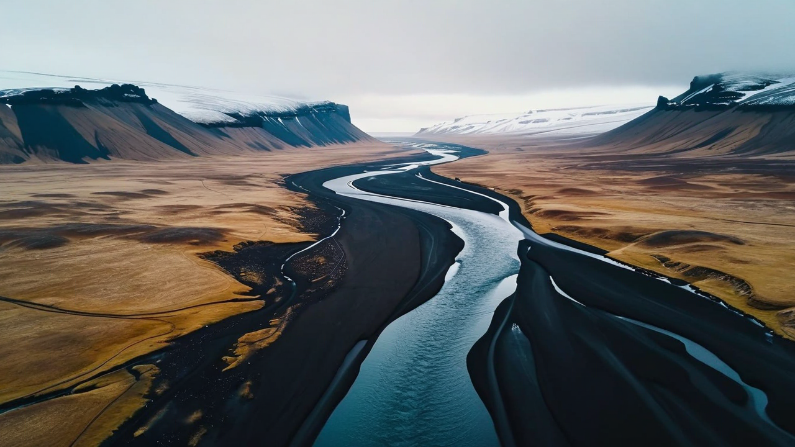
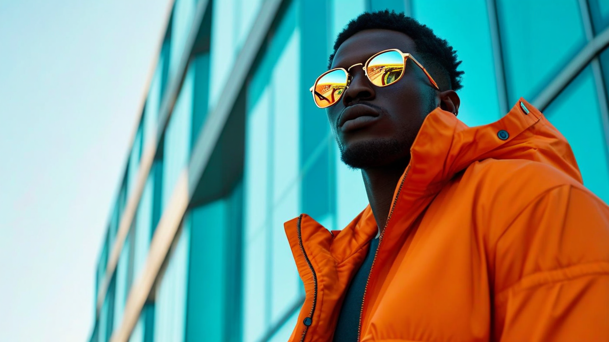

# Amazon Nova Canvas prompting best

practices

Prompting for image generation models differs from prompting for large language models
(LLMs). Image generation models do not have the ability to reason or interpret explicit
commands. Therefore, it's best to phrase your prompt as if it were an image caption rather
than a command or conversation. You might want to include details about the subject, action,
environment, lighting, style, and camera position.

When writing an image generation prompt, be mindful of the following requirements and best
practices:

- Prompts must be no longer than 1024 characters. For very long prompts, place the
  least important details of your prompt near the end.
- Do not use negation words like _"no"_,
  _"not"_, _"without"_, and so on in your
  prompt. The model doesn't understand negation in a prompt and attempting to use
  negation will result in the opposite of what you intend. For example, a prompt such
  as _"a fruit basket with no bananas"_ will actually signal the
  model to include bananas. Instead, you can use a negative prompt, via the
  `negativeText` parameter, to specify any objects or characteristics
  that you want to exclude from the image. For example
  _"bananas"_.
- As with prompts, omit negation words from your negative prompts.
- When the output you get from a prompt is close to what you want but not quite
  perfect, try the following techniques one at a time in turn to refine your
  result:

      + Using a consistent `seed` value, make small changes to your
       prompt or negative prompt and re-run the prompt. This allows you to better
       understand how your prompt wording affects the output, allowing you to
       iteratively improve your results in a controlled way.
      + Once the prompt has been refined to your liking, generate more variations
       using the same prompt but a different `seed` value. It is often
       useful to generate multiple variations of an image by running the sample
       prompt with different seeds in order to find that perfect output
       image.

  An effective prompt often includes short descriptions of...

1. the subject
2. the environment
3. (optional) the position or pose of the subject
4. (optional) lighting description
5. (optional) camera position/framing
6. (optional) the visual style or medium ("photo", "illustration", "painting", and so
   on)
   **Prompt:** realistic editorial photo of female
   teacher standing at a blackboard with a warm smile

**Negative Prompt:** crossed arms

**Prompt:** whimsical and ethereal soft-shaded story
illustration: A woman in a large hat stands at the ship's railing looking out across
the ocean

**Negative Prompt:** clouds, waves

**Prompt:** drone view of a dark river winding
through a stark Iceland landscape, cinematic quality

**Prompt:** A cool looking stylish man in an orange
jacket, dark skin, wearing reflective glasses. Shot from slightly low angle, face
and chest in view, aqua blue sleek building shapes in background.

###### Topics

- [Negative prompts](prompting-image-negative.md "prompting-image-negative.md")
- [Mask prompts](prompting-image-masks.md "prompting-image-masks.md")
- [Inpainting prompts](prompting-image-inpainting.md "prompting-image-inpainting.md")
- [Outpainting prompts](prompting-image-outpainting.md "prompting-image-outpainting.md")
