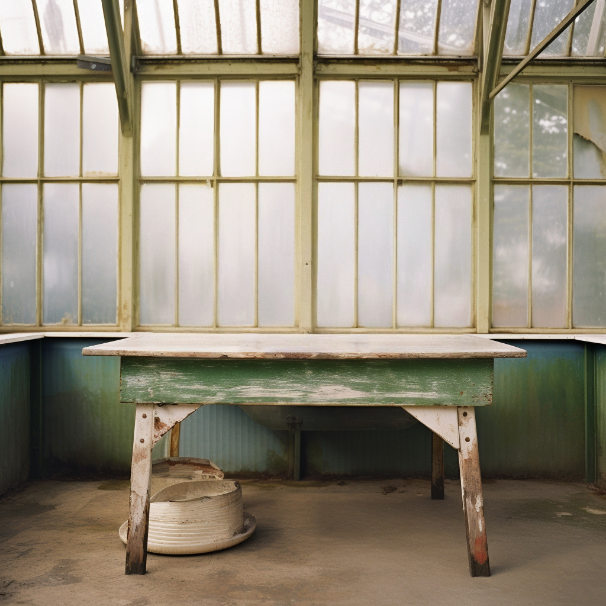
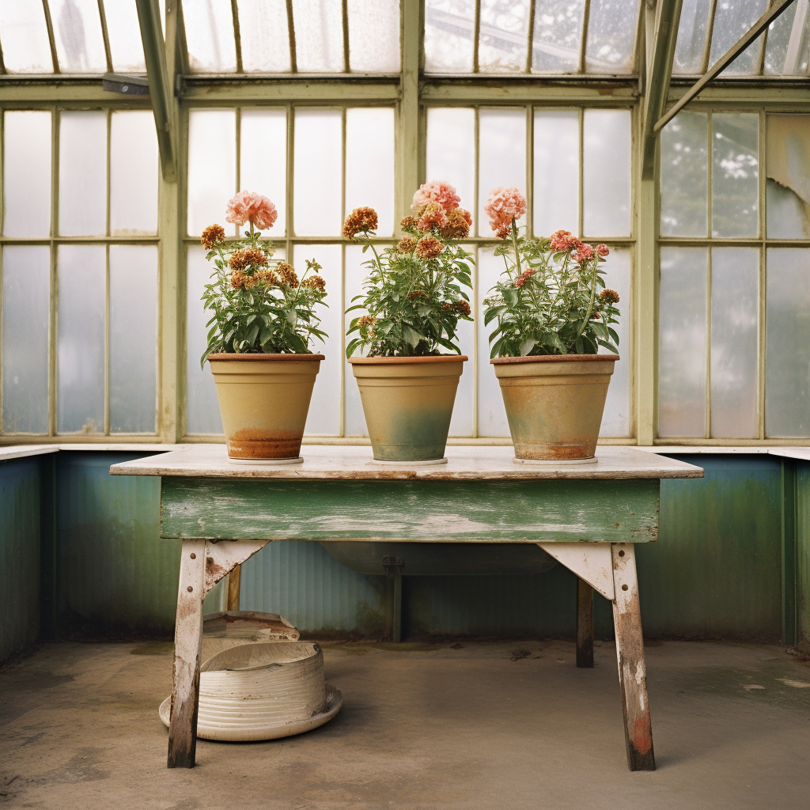
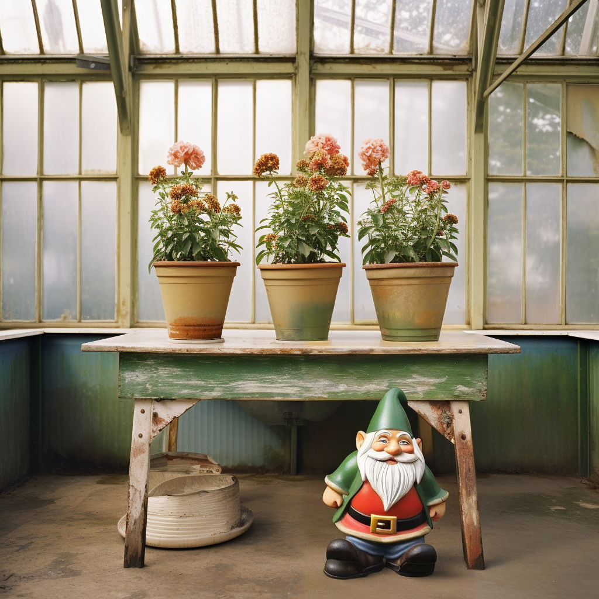
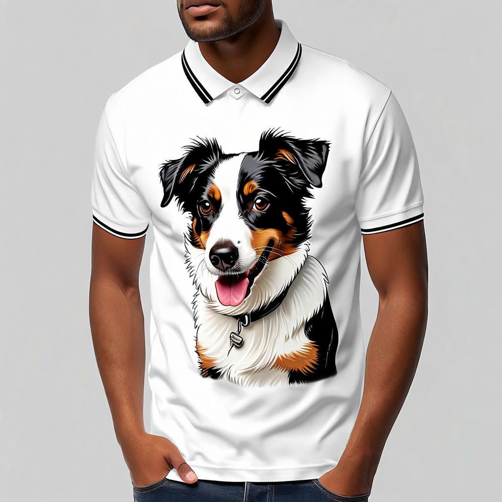

# Inpainting prompts

Inpainting is an editing operation that can be used to add, remove, or replace elements
within an image. Inpainting requires an input image and either a natural language mask
prompt (`maskPrompt`) or a user-provided mask image (`maskImage`) to
define which parts of an image to change.

To remove an element from an image, provide a mask that fully encompasses the
thing you want to remove, and omit the `text` parameter from your
request. This signals to the model to remove that element.

**Input Image**

**Mask Prompt**

"flowers in pots"

**Result**

To add an element to an image, use a mask that defines the bounds of the area
where you want the element to be added and a text prompt that describes what you
want the _whole_ image to look like after the edit. It is usually
more effective to use a mask image for this, but you may use a mask prompt
instead.

The following example uses a `text` value of _"a garden gnome
under a table in a greenhouse"._

**Input Image**

**Mask Image**

**Result**

You can replace one element with a new one using inpainting. A common way to
achieve this is to use a mask prompt that describes the thing you want to replace.
When using this approach, the outline of the new content will closely match the
outline of the element which it is replacing. If this is not what you desire, create
a mask image that fully encompasses the element you want to replace but doesn't
adhere directly to its contours.

The following example uses a `text` value of _"a palm tree
graphic"_ and a `negativeText` value of
_"colorful"_.

**Input Image**

**Mask Prompt**

_"dog"_

**Result**

