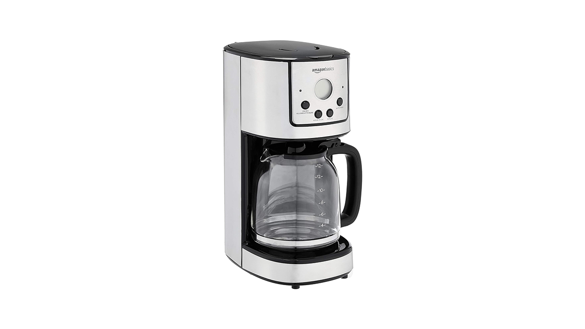
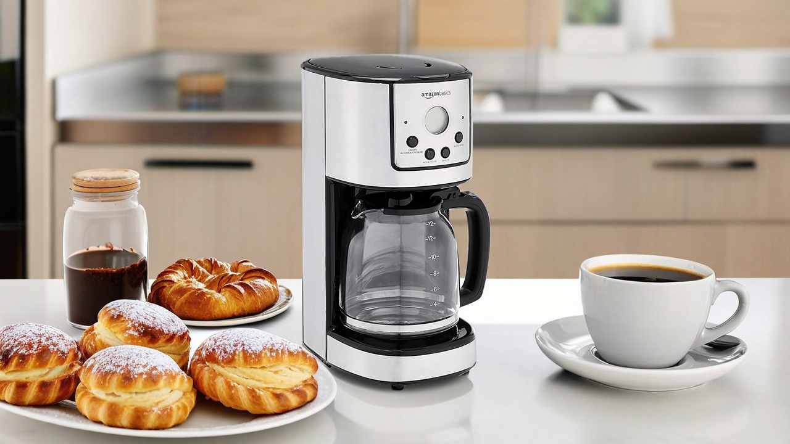
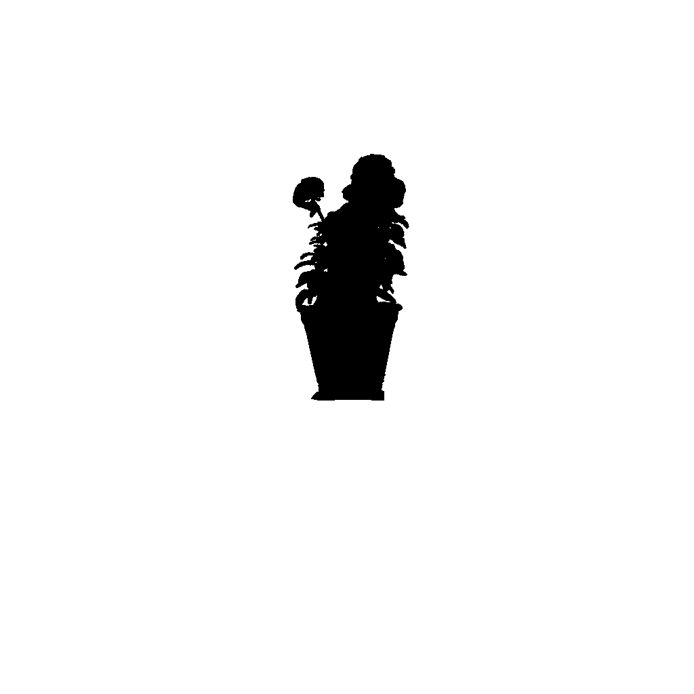
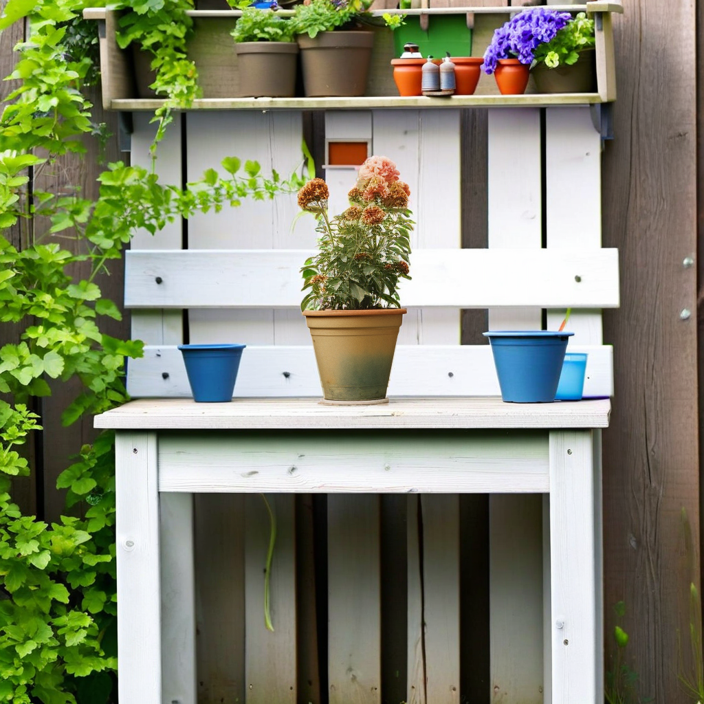

# Outpainting prompts

Outpainting is used to replace the background of an image. For best results, outpainting
prompts should describe what you would like the _whole_ image to look
like, including the parts of the image that will not be changed.

The following example uses a `text` value of _"a coffee maker in a
sparse stylish kitchen, a single plate of pastries next to the coffee maker, a single
cup of coffee"._

**Input Image**

**Mask Prompt**: _"coffee maker"_

**Result**

Here is another example that uses a `text` value of _"detailed photo
of a flower pot sitting on an outdoor potting bench"._

**Input Image**

**Mask Image**

**Result**

