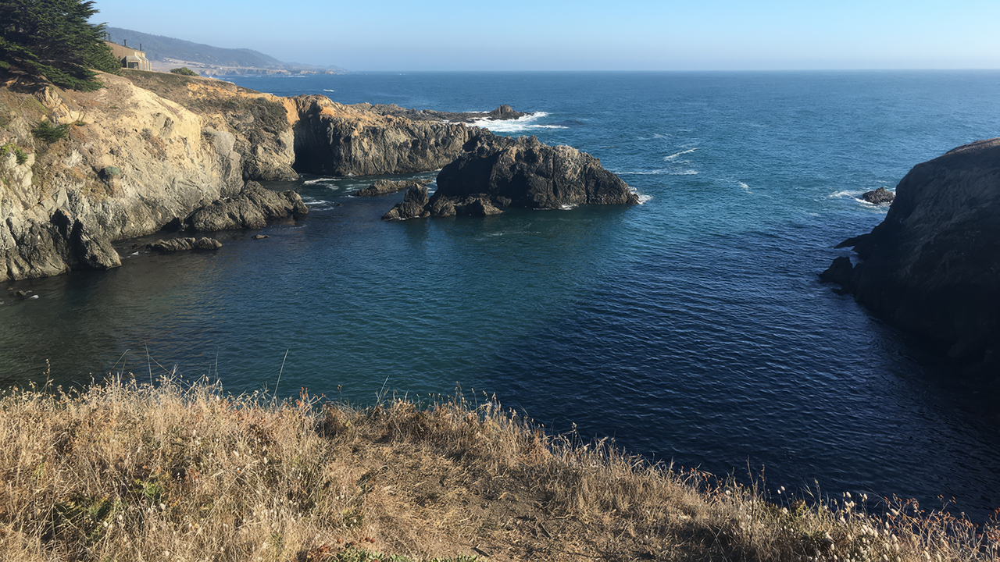
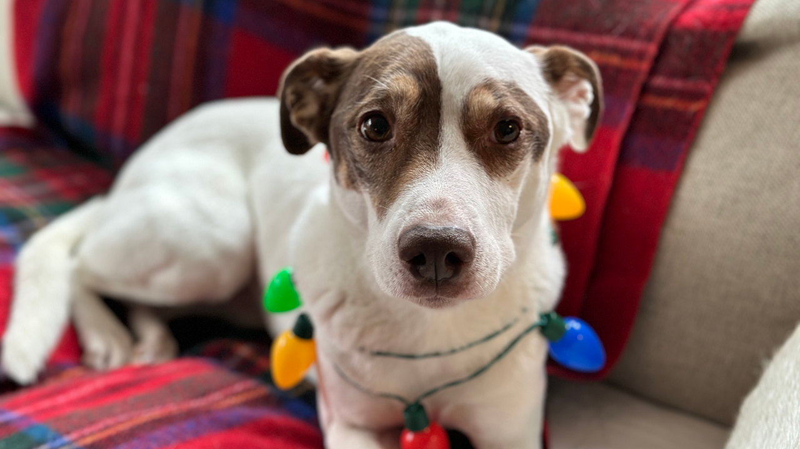

# Image-based video generation prompts

Image-based prompts are a great way to gain more control over your video output and to
streamline your video generation workflow. By providing a starting frame that reflects the
exact content, framing, and visual style you would like, you greatly improve the likelihood
that your generated video will meet your needs. For best results, use the Amazon Nova Canvas
model to create your input image. Amazon Nova Reel and Amazon Nova Canvas have been designed to
work well together.

There are two primary approaches you can leverage when using images as input for video
generation.

If your goal is to add camera motion to bring a static image to life, you can rely on the
image itself to convey the subject and visual style while using the text prompt to describe
only the camera motion. (See [Camera controls](prompting-video-camera-control.md "prompting-video-camera-control.md") for more on prompting camera
movement.)

**Example of prompting with camera motion only**

**Input image**

**Prompt**: _"dolly forward"_

However, if you desire to have your subjects perform a particular action or would like to
influence other changes that play out over time, it's best to describe the subjects,
actions, and changes in detail. Remember to phrase the prompt as a summary rather than a
command.

**Input Image**

**Prompt**: _"dynamic handheld shot: the dog looks
to the left as colored holiday lights on its body blink rhythmically"_

For videos longer than six seconds, you can only include prompt images if you use the storyboard. You can include an optional input image and prompt to guide the creation of each six second shot of the video. However, you don't need to include inputs for every six second shot.
