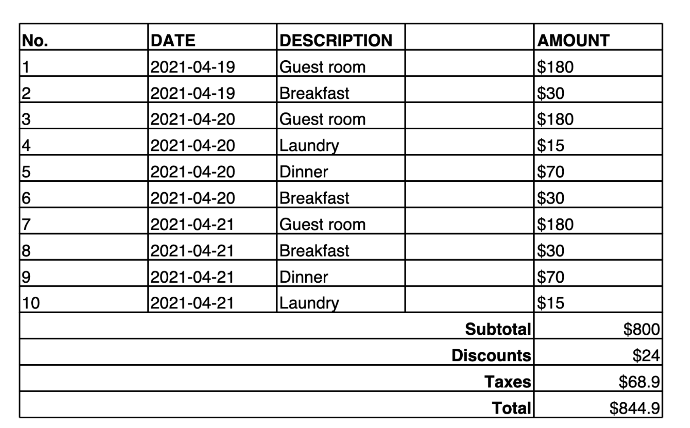

# Vision understanding prompting

techniques

###### Note

This documentation is for Amazon Nova Version 1. For information about how to prompt multimodal understanding in Amazon Nova 2, visit [Prompting multimodal inputs](../nova2-userguide/prompting-multimodal.md "../nova2-userguide/prompting-multimodal.md").

The following vision prompting techniques will help you create better prompts for
Amazon Nova.

###### Topics

- [Placement matters](#prompting-video-placement "#prompting-video-placement")
- [Multiple media files with vision
  components](#prompting-video-vision-components "#prompting-video-vision-components")
- [Use user instructions for improved instruction following for vision understanding tasks](#prompting-video-instructions "#prompting-video-instructions")
- [Few shot exemplars](#prompting-video-exemplars "#prompting-video-exemplars")
- [Bounding box detection](#prompting-video-bounding "#prompting-video-bounding")
- [Richer outputs or style](#prompting-video-richer-output "#prompting-video-richer-output")
- [Extract document contents into Markdown](#prompting-video-markdown "#prompting-video-markdown")
- [Inference parameter settings for vision understanding](#prompting-video-parameters "#prompting-video-parameters")
- [Video classification](#prompting-video-classification "#prompting-video-classification")

## Placement matters

We recommend that you place media files (such as images or videos) before adding any documents, followed by your instructional text or prompts to guide the model. While images placed after text or
interspersed with text will still perform adequately, if the use case permits, the
_{media_file}-then-{text}_ structure is the preferred
approach.

The following template can be used to place media files before text when performing
vision understanding.

```
`{
 "role": "user",
 "content": [
 {
 "image": "..."
 },
 {
 "video": "..."
 },
 {
 "document": "..."
 },
 {
 "text": "..."
 }
 ]
}`
```

|      | **No structured<br>followed**                     | Optimized Prompt                                        |
| ---- | ------------------------------------------------- | ------------------------------------------------------- |
| User | Explain whats happening in the image [Image1.png] | [Image1.png]<br>Explain what is happening in the image? |

## Multiple media files with vision

components

In situations where you provide multiple media files across turns, introduce each
image with a numbered label. For example, if you use two images, label them `Image
 1:` and `Image 2:`. If you use three videos, label them `Video
 1:`, `Video 2:`, and `Video 3:`. You don't need
newlines between images or between images and the prompt.

The following template can be used to place multiple media files:

```
`messages = [
 {
 "role": "user",
 "content": [
 {"text":"Image 1:"},
 {"image": {"format": "jpeg", "source": {"bytes": img_1_base64}}},
 {"text":"Image 2:"},
 {"image": {"format": "jpeg", "source": {"bytes": img_2_base64}}},
 {"text":"Image 3:"},
 {"image": {"format": "jpeg", "source": {"bytes": img_3_base64}}},
 {"text":"Image 4:"},
 {"image": {"format": "jpeg", "source": {"bytes": img_4_base64}}},
 {"text":"Image 5:"},
 {"image": {"format": "jpeg", "source": {"bytes": img_5_base64}}},
 {"text":`user_prompt`},
 ],
 }
 ]`
```

| Unoptimized Prompt                                                                                   | Optimized Prompt                                                                                           |
| ---------------------------------------------------------------------------------------------------- | ---------------------------------------------------------------------------------------------------------- |
| Describe what you see in the second image.<br>[Image1.png] [Image2.png]                              | [Image1.png]<br>[Image2.png]<br>Describe what you see in the second image.                                 |
| Is the second image described in the included document?<br>[Image1.png] [Image2.png] [Document1.pdf] | [Image1.png]<br>[Image2.png]<br>[Document1.pdf]<br>Is the second image described in the included document? |

Due to the long context tokens of the media file types, the system prompt indicated in
the beginning of the prompt might not be respected in certain occasions. On this
occasion, we recommend that you move any system instructions to user turns and follow
the general guidance of _{media_file}-then-{text}_. This does not
impact system prompting with RAG, agents, or tool usage.

## Use user instructions for improved instruction following for vision understanding tasks

For video understanding, the number of tokens in-context makes the recommendations in
[Placement matters](#prompting-video-placement "#prompting-video-placement") very important. Use the system prompt for more general things like tone and style. We
recommend that you keep the video-related instructions as part of the user prompt for
better performance.

The following template can be used to for improved instructions:

```
`{
 "role": "user",
 "content": [
 {
 "video": {
 "format": "mp4",
 "source": { ... }
 }
 },
 {
 "text": "You are an expert in recipe videos. Describe this video in less than 200 words following these guidelines: ..."
 }
 ]
}`
```

Just like for text, we recommended applying chain-of-thought for images and videos to gain improved performances. We also recommended that you place the chain-of-thought directives in the system prompt, while keeping other instructions in the user prompt.

###### Important

The Amazon Nova Premier model is a higher intelligence model in the Amazon Nova family, able to handle more complex tasks. If your tasks require advanced chain-of-thought thinking, we recommend that you utilize the prompt template provided in [Give Amazon Nova time to think (chain-of-thought)](prompting-chain-of-thought.md "prompting-chain-of-thought.md"). This approach can help enhance the model's analytical and problem-solving abilities.

## Few shot exemplars

Just like for text models, we recommend that you provide examples of images for improved image understanding performance (videos exemplars cannot be provided, due to the single-video-per-inference limitation). We recommended that you place the examples in the user prompt, after the media file, as opposed to providing it in the system prompt.

|           | 0-Shot                                              | 2-Shot                                              |
| --------- | --------------------------------------------------- | --------------------------------------------------- |
| User      |                                                     | [Image 1]                                           |
| Assistant |                                                     | The image 1 description                             |
| User      |                                                     | [Image 2]                                           |
| Assistant |                                                     | The image 2 description                             |
| User      | [Image 3]<br>Explain what is happening in the image | [Image 3]<br>Explain what is happening in the image |

## Bounding box detection

If you need to identify bounding box coordinates for an object, you can utilize the Amazon Nova model to output bounding boxes on a scale of [0, 1000). After you have obtained these coordinates, you can then resize them based on the image dimensions as a post-processing step. For more detailed information on how to accomplish this post-processing step, please refer to the [Amazon Nova Image Grounding notebook](https://github.com/aws-samples/amazon-nova-samples/blob/main/multimodal-understanding/repeatable-patterns/13-image-grounding/image_grounding.ipynb "https://github.com/aws-samples/amazon-nova-samples/blob/main/multimodal-understanding/repeatable-patterns/13-image-grounding/image_grounding.ipynb").

The following is a sample prompt for bounding box detection:

```
`Detect bounding box of objects in the image, only detect {item_name} category objects with high confidence, output in a list of bounding box format.
Output example:
[
 {"{item_name}": [x1, y1, x2, y2]},
 ...
]

Result:`
```

## Richer outputs or style

Video understanding output can be very short. If you want longer outputs, we recommend
creating a persona for the model. You can direct this persona to respond in your desired
manner, similar to utilizing the system role.

Further modifications to the responses can be achieved with [one-shot and few-shot techniques](prompting-examples.md "prompting-examples.md"). Provide
examples of what a good response should be and the model can mimic aspects of it while
generating answers.

## Extract document contents into Markdown

Amazon Nova Premier demonstrates enhanced capabilities to understand charts embedded within documents and the ability to read and comprehend content from complex domains such as scientific papers. Additionally, Amazon Nova Premier shows improved performance when extracting document contents and can output this information into Markdown Table and Latex formats.

The following example provides a table in an image, along with a prompt for Amazon Nova Premier convert the contents of the image to a Markdown table. After the Markdown (or Latex Representation) is created, you can use tools to convert the content into JSON or other structured output.

```
`Make a table representation in Markdown of the image provided.`
```



Here is the output provided by the model:

```
| No. | DATE       | DESCRIPTION | AMOUNT |
|-----|------------|-------------|--------|
| 1   | 2021-04-19 | Guest room  | $180   |
| 2   | 2021-04-19 | Breakfast   | $30    |
| 3   | 2021-04-20 | Guest room  | $180   |
| 4   | 2021-04-20 | Laundry     | $15    |
| 5   | 2021-04-20 | Dinner      | $70    |
| 6   | 2021-04-20 | Breakfast   | $30    |
| 7   | 2021-04-21 | Guest room  | $180   |
| 8   | 2021-04-21 | Breakfast   | $30    |
| 9   | 2021-04-21 | Dinner      | $70    |
| 10  | 2021-04-21 | Laundry     | $15    |
|     |            | Subtotal    | $800   |
|     |            | Discounts   | $24    |
|     |            | Taxes       | $68.9  |
|     |            | Total       | $844.9 |
```

This output uses custom table notation where `||` is used as the column separator and `&&` is used as the row separator.

## Inference parameter settings for vision understanding

For vision understanding use cases, we recommended that you start with the inference parameters `temperature` set to `0` and `topK` set to `1`. After observing the model's output, you can then adjust the inference parameters based on the use case. These values usually depend on the task and variance required, increase the temperature setting to induce more variations in the answers.

## Video classification

To effectively sort video content into appropriate categories, provide categories that the model can use for classification. Consider the following sample prompt:

```
[Video]

Which category would best fit this video? Choose an option from the list below:
\Education\Film & Animation\Sports\Comedy\News & Politics\Travel & Events\Entertainment\Trailers\How-to & Style\Pets & Animals\Gaming\Nonprofits & Activism\People & Blogs\Music\Science & Technology\Autos & Vehicles
```

###### Tagging videos

Amazon Nova Premier showcases improved functionality for creating video tags. For best results, use the following instruction requesting comma separated tags, “Use commas to separate each tag”. Here is an example prompt:

```
[video]

"Can you list the relevant tags for this video? Use commas to separate each tag."
```

###### Dense Captioning of Videos

Amazon Nova Premier demonstrates enhanced capabilities to provide dense captions - detailed textual descriptions generated for multiple segments within the video. Here is an example prompt:

```
[Video]

Generate a comprehensive caption that covers all major events and visual elements in the video.
```
