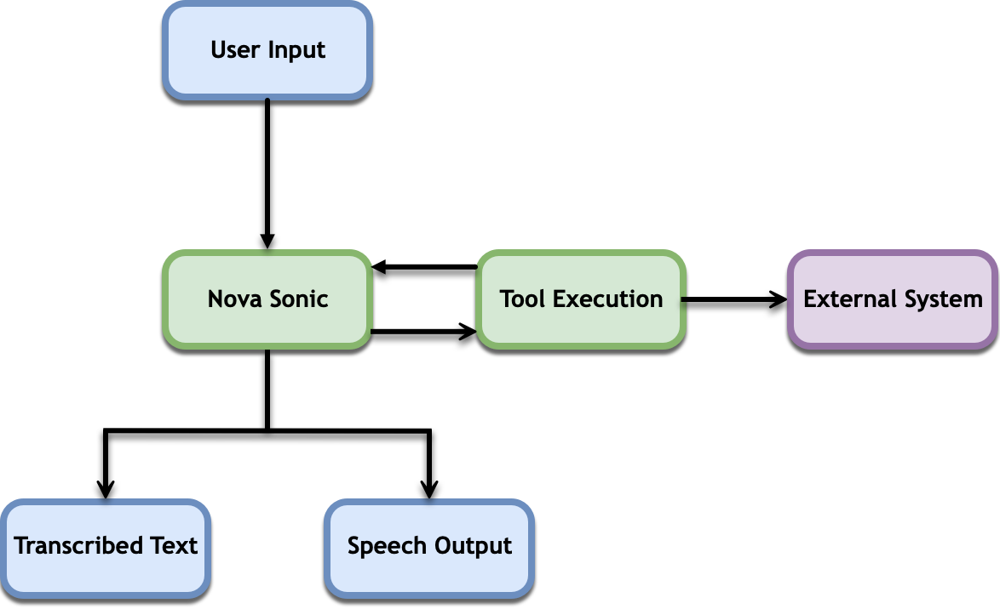

# Tool Use, RAG, and Agentic Flows with Amazon Nova Sonic

The Amazon Nova Sonic model extends its capabilities beyond pre-trained knowledge by supporting tool use. Tool use, sometimes called function calling, enables integration with external functions, APIs, and data sources. This section explains how to implement tool use, Retrieval-Augmented Generation (RAG), and agentic workflows with Amazon Nova Sonic.

You can control what tool the model uses by specifying the `toolChoice` parameter. For more information, see [Choosing a tool](tool-choice.md "tool-choice.md").

###### Topics

- [Using tools](speech-tools-use.md "speech-tools-use.md")
- [Controlling how tools are chosen](speech-tools-choice.md "speech-tools-choice.md")
- [Tool choice best practices](speech-tools-bp.md "speech-tools-bp.md")
- [Implementing RAG](speech-rag.md "speech-rag.md")
- [Building agentic flows](speech-agentic.md "speech-agentic.md")
