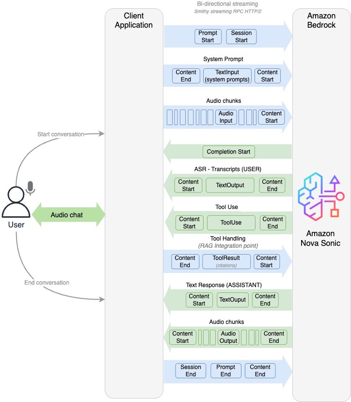

# Using the Amazon Nova Sonic Speech-to-Speech model

###### Note

This documentation is for Amazon Nova Version 1. For the Amazon Nova 2 Sonic guide, visit [Speech-to-Speech](../nova2-userguide/using-conversational-speech.md "../nova2-userguide/using-conversational-speech.md").

The Amazon Nova Sonic model provides real-time, conversational interactions through bidirectional audio streaming. Amazon Nova Sonic processes and responds to real-time speech as it occurs, enabling natural, human-like conversational experiences.

Amazon Nova Sonic delivers a transformative approach to conversational AI with its unified speech understanding and generation architecture. This state-of-the-art foundation model boasts industry-leading price performance, allowing enterprises to build voice experiences that remain natural and contextually aware.

Key capabilities and features

- State-of-the-art streaming speech understanding with bidirectional stream API capabilities that enable real-time, low-latency multi-turn conversations.
- Natural, human-like conversational AI experiences are provided with contextual richness across all supported languages.
- Adaptive speech response that dynamically adjusts delivery based on the prosody of the input speech.
- Graceful handling of user interruptions without dropping conversational context.
- Knowledge grounding with enterprise data using Retrieval Augmented Generation (RAG).
- Function calling and agentic workflow support for building complex AI applications.
- Robustness to background noise for real-world deployment scenarios.
- Multilingual support with expressive voices and speaking styles. Expressive voices are offered, including both masculine-sounding and feminine sounding, in five languages: English (US, UK), French, Italian, German, and Spanish.
- Recognition of varied speaking styles across all supported languages.

###### Topics

- [Amazon Nova Sonic architecture](#speech-architecture "#speech-architecture")
- [Using the Bidirectional Streaming API](speech-bidirection.md "speech-bidirection.md")
- [Speech-to-speech Example](s2s-example.md "s2s-example.md")
- [Code examples for Amazon Nova Sonic](speech-code-examples.md "speech-code-examples.md")
- [Handling input events with the bidirectional API](input-events.md "input-events.md")
- [Handling output events with the bidirectional API](output-events.md "output-events.md")
- [Voices available for Amazon Nova Sonic](available-voices.md "available-voices.md")
- [Handling errors with Amazon Nova Sonic](speech-errors.md "speech-errors.md")
- [Tool Use, RAG, and Agentic Flows with Amazon Nova Sonic](speech-tools.md "speech-tools.md")

## Amazon Nova Sonic architecture

Amazon Nova Sonic implements an event-driven architecture through the bidirectional stream API, enabling real-time conversational experiences. Here are the key architectural components of the API:

1. **Bidirectional event streaming**: Amazon Nova Sonic uses a persistent bidirectional connection that allows simultaneous event streaming in both directions. Unlike traditional request-response patterns, this approach permits the following:
   - Continuous audio streaming from the user to the model
   - Concurrent speech processing and generation
   - Real-time model responses without waiting for complete utterances

2. **Event-driven communication flow**: The entire interaction follows an event-based protocol where
   - The client and model exchange structured JSON events
   - The events control session lifecycle, audio streaming, text responses, and tool interactions
   - Each event has specific roles in the conversation flow

The bidirectional stream API consists of these three main components:

1. **Session initialization**: The client establishes a bidirectional stream and sends the configuration events.
2. **Audio streaming**: User audio is continuously captured, encoded, and streamed as events to the model, which continuously processes the speech.
3. **Response streaming**: As audio arrives, the model simultaneously sends event responses:
   - Text transcriptions of user speech (ASR)
   - Tool use events for function calling
   - Text response of the model
   - Audio chunks for spoken output

The following diagram provides a high-level overview of the bidirectional stream API.

