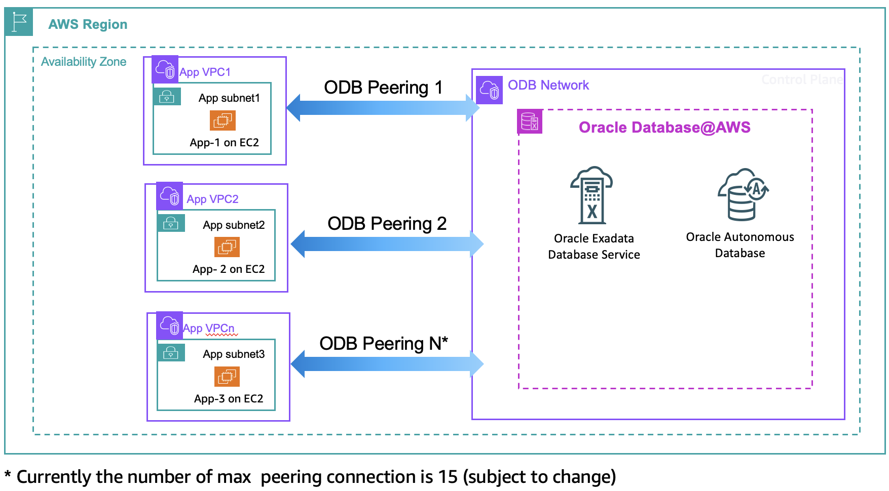
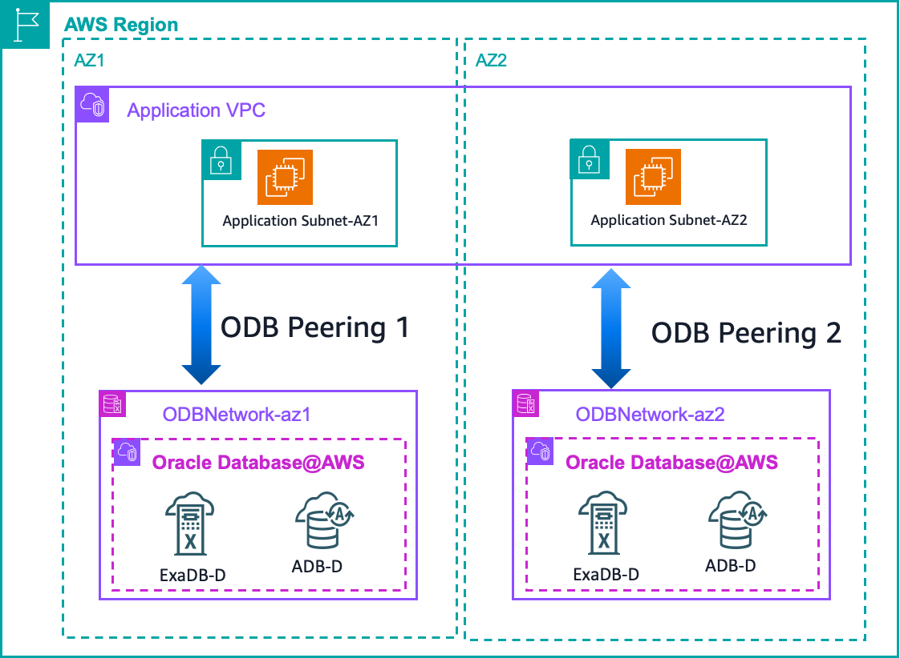
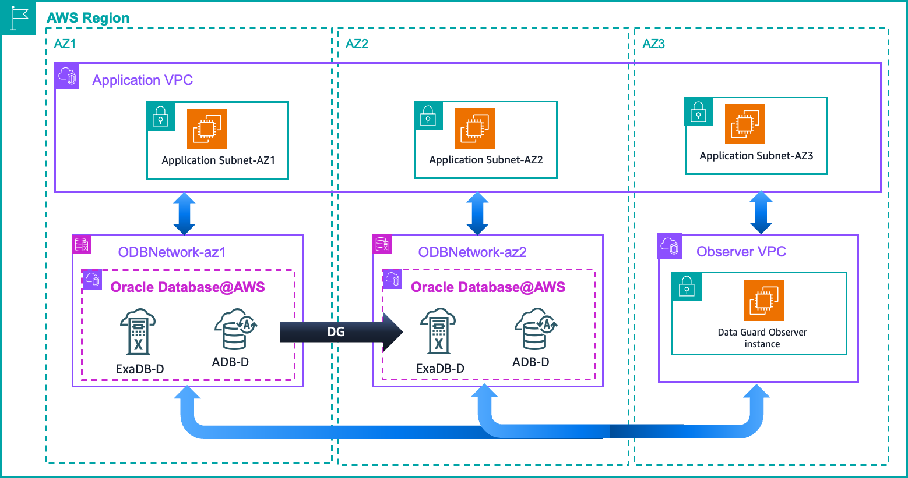
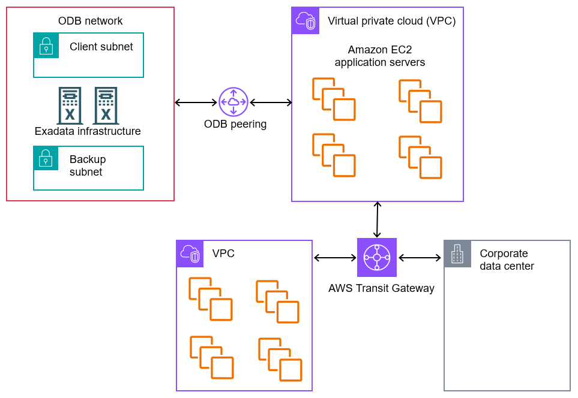
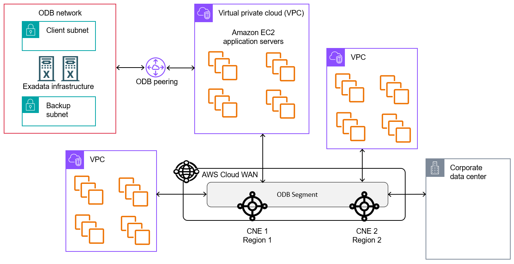

# Configuring ODB peering to an Amazon VPC in Oracle Database@AWS

_ODB peering_ is a user-created network connection that enables
traffic to be routed privately between an Amazon VPC and an ODB networkAfter you create a peering connection using the console, CLI, or API,
make sure to update your VPC route tables and configure DNS resolution. For a conceptual overview
of ODB peering, see [ODB peering](how-it-works.md#how-it-works.peering "how-it-works.md#how-it-works.peering").

###### Note

Now, you can now have up to 45 ODB peering connections between your Amazon VPCs and ODB network, allowing you to establish low latency connectivity at scale between your Exadata databases in your ODB network and applications in your VPCs.

## Creating an ODB peering connection in Oracle Database@AWS

With ODB peering connections, you can establish private network connectivity between your Oracle Exadata infrastructure
and the applications running in your Amazon VPCs. Each ODB peering connection is a separate resource that
you can create, view, and delete independently of the ODB network.

When creating an ODB peering connection, you can specify peer network CIDR ranges. This technique
limits network access to the required subnets, reduces potential targets for attacks, and enables
more granular network segmentation for compliance requirements.

You can create the following types of ODB peering connections:

**Same-account ODB peering**

You can create an ODB peering connection between an ODB network and an Amazon VPC in the same AWS
account.

**Cross-account ODB peering**

You can create an ODB peering connection between an ODB network in one account and an Amazon VPC in a
different account, after the ODB network has been shared using AWS RAM. VPC owner accounts can manage
CIDR ranges specified in the peering connection without also owning the ODB network.

You can create up to 45 peerings for a single ODB network.

1. Sign in to the AWS Management Console and open the Oracle Database@AWS console at [https://console.aws.amazon.com/odb/](https://console.aws.amazon.com/odb/ "https://console.aws.amazon.com/odb/").
2. In the navigation pane, choose **ODB peering connections**.
3. Choose **Create ODB peering connection**.
4. (Optional) For **ODB peering name**, enter a unique name for your
   connection.
5. For **ODB network**, choose the ODB network to peer.
6. For **Peer network**, choose the Amazon VPC to peer with your ODB network.
7. (Optional) For **Peer network CIDRs**, specify additional CIDR blocks
   from the peer VPC that can access the ODB network. If you don't specify CIDRs, all CIDRs from the
   peer VPC are allowed access.
8. (Optional) In **Tags**, add a key and value pair.
9. Choose **Create ODB peering connection**.
   After creating an ODB peering connection, configure your Amazon VPC route tables to route traffic to
   the peered ODB network. For more information, see [Configuring VPC route tables for ODB peering](#configure-routes "#configure-routes"). Note that Oracle Database@AWS automatically configures the ODB network
   route tables.

To create an ODB peering connection, use the `create-odb-peering-connection`
command.

```
aws odb create-odb-peering-connection \
    --odb-network-id `odbnet-1234567890abcdef` \
    --peer-network-id `vpc-abcdef1234567890`
```

To limit access to the ODB network to specific CIDR ranges, use the
`--peer-network-cidrs-to-be-added` parameter. If you don't specify CIDR ranges, all
ranges have access.

```
aws odb create-odb-peering-connection \
    --odb-network-id `odbnet-1234567890abcdef` \
    --peer-network-id `vpc-abcdef1234567890` \
    --peer-network-cidrs-to-be-added `"10.0.1.0/24,10.0.2.0/24"`
```

To list your ODB peering connections, use the `list-odb-peering-connections`
command.

```
aws odb list-odb-peering-connections
```

To get details about a specific ODB peering connection, use the
`get-odb-peering-connection` command.

```
aws odb get-odb-peering-connection \
    --odb-peering-connection-id `odbpcx-1234567890abcdef`
```

### Updating an ODB peering connection

You can update an existing ODB peering connection to add or remove peer network CIDRs. You
control which subnets in the peer VPC have access to your ODB network.

1. Sign in to the AWS Management Console and open the Oracle Database@AWS console at [https://console.aws.amazon.com/odb/](https://console.aws.amazon.com/odb/ "https://console.aws.amazon.com/odb/").
2. In the navigation pane, choose **ODB peering connections**.
3. Select the ODB peering connection that you want to update.
4. Choose **Actions**, and then choose **Update peering connection**.
5. In the **Peer network CIDRs** section, add or remove CIDR blocks as needed:
   - To add CIDRs, choose **Add CIDR** and enter the CIDR block.
   - To remove CIDRs, choose the **X** next to the CIDR block you want to remove.

6. Choose **Update peering connection**.
   To add peer network CIDRs to an ODB peering connection, specify the parameter
   `--peer-network-cidrs-to-be-added` in the
   `update-odb-peering-connection` command.

```
aws odb update-odb-peering-connection \
    --odb-peering-connection-id `odbpcx-1234567890abcdef` \
    --peer-network-cidrs-to-be-added `"10.0.1.0/24,10.0.3.0/24"`
```

To remove peer network CIDRs from an ODB peering connection, specify the parameter
`--peer-network-cidrs-to-be-removed` in the
`update-odb-peering-connection` command.

```
aws odb update-odb-peering-connection \
    --odb-peering-connection-id `odbpcx-1234567890abcdef` \
    --peer-network-cidrs-to-be-removed `"10.0.1.0/24,10.0.3.0/24"`
```

## Configuring VPC route tables for ODB peering

A _route table_ contains a set of rules, called
_routes_, that determine where network traffic from your subnet or gateway
is directed. The destination CIDR in a route table is a range of IP addresses where you want
traffic to go. If you specified a VPC for ODB peering to your ODB network, update your VPC route table with
the destination IP range in your ODB network. For more information about ODB peering, see [ODB peering](how-it-works.md#how-it-works.peering "how-it-works.md#how-it-works.peering").

To update a route table, use the AWS CLI `ec2 create-route` command. The following
examples updates Amazon VPC route tables. For more information, see Configuring VPC route tables for ODB peering.

```
aws ec2 create-route \
    --route-table-id `rtb-1234567890abcdef` \
    --destination-cidr-block `10.0.0.0/16` \
    --odb-network-arn `arn:aws:odb:us-east-1:111111111111:odb-network/odbnet_1234567890abcdef`
```

The ODB network route tables are automatically updated with the VPC CIDRs. To allow access to the
ODB network for only specific subnet CIDRs rather than all CIDRs in the VPC, you can specify peer network CIDRs when creating an ODB peering connection or update an existing ODB peering connection to add or remove peered CIDR ranges. For more information, see [Creating an ODB peering connection in Oracle Database@AWS](#network-peering "#network-peering") and [Updating an ODB peering connection](#updating-peering "#updating-peering").

For more information about VPC route tables, see [Subnet route tables](../../../vpc/latest/userguide/subnet-route-tables.md "../../../vpc/latest/userguide/subnet-route-tables.md") in the
_Amazon Virtual Private Cloud User Guide_ and [ec2
create-route](../../../cli/latest/reference/ec2/create-route.md "../../../cli/latest/reference/ec2/create-route.md") in the _AWS CLI Command Reference_.

## Configuring DNS for Oracle Database@AWS

Amazon Route 53 is a highly available and scalable Domain Name System (DNS) web service that you
can use for DNS routing. When you create an ODB peering connection between your ODB network and a VPC, you
need a mechanism to resolve DNS queries for ODB network resources from within the VPC. You can use
Amazon Route 53 to configure the following resources:

- An outbound endpoint

The endpoint is required to send DNS queries to the ODB network.

- A resolver rule

This rule specifies the domain name of the DNS queries that the Route 53 Resolver forwards to the DNS
for the ODB network.

### How DNS works in Oracle Database@AWS

Oracle Database@AWS manages Domain Name System (DNS) configuration for the ODB network automatically. For
the domain name, you can either specify a custom prefix for the default domain name
`oraclevcn.com` or a fully custom domain name. For more information, see [Step 1: Create an ODB network in Oracle Database@AWS](getting-started.md#getting-started-odb "getting-started.md#getting-started-odb").

When Oracle Database@AWS provisions an ODB network, it creates the following resources:

- An Oracle Cloud Infrastructure (OCI) virtual cloud network (VCN) with the same CIDR blocks as the
  ODB network

This VCN resides in the customer’s linked OCI tenancy. There is a 1:1 mapping between
an ODB network and an OCI VCN. Every ODB network is associated with an OCI VCN.

- A private DNS resolver within the OCI VCN

This DNS resolver handles DNS queries within the OCI VCN. OCI automation creates
records for the VM cluster. Scans use the `*.oraclevcn.com` fully qualified domain name
(FQDN).

- A DNS listening endpoint within the OCI VCN for the private DNS resolver

You can find the DNS listening endpoint in the ODB network details page on the Oracle Database@AWS
console.

### Configuring an outbound endpoint in an ODB network in

Oracle Database@AWS

An outbound endpoint allows DNS queries to be sent from your VPC to a network or IP
address. The endpoint specifies the IP addresses from which queries originate. To forward DNS
queries from your VPC to your ODB network, create an outbound endpoint using the Route 53 console.
For more information, see [Forwarding
outbound DNS queries to your network](../../../Route53/latest/DeveloperGuide/resolver-forwarding-outbound-queries.md "../../../Route53/latest/DeveloperGuide/resolver-forwarding-outbound-queries.md").

###### To configure an outbound endpoint in an ODB network

1. Sign in to the AWS Management Console and open the Route 53 console at [https://console.aws.amazon.com/route53/](https://console.aws.amazon.com/route53/ "https://console.aws.amazon.com/route53/").
2. From the left pane, choose **Outbound endpoints**.
3. On the navigation bar, choose the **Region** for the VPC where you want
   to create the outbound endpoint.
4. Choose **Create outbound endpoint**.
5. Complete the **General settings for outbound endpoint** section as
   follows:
   1. Choose a **Security group** that allows outbound TCP and UDP
      connectivity to the following:
      - IP addresses that the resolvers use for DNS queries on your ODB network
      - Ports that the resolvers use for DNS queries on your ODB network

   2. For **Endpoint Type**, choose **IPv4**.
   3. For **Protocols for this endpoint**, choose
      **Do53**.

6. In **IP addresses**, provide the following information:
   - Either specify IP addresses or let the Route 53 Resolver choose IP addresses for you from the
     available addresses in the subnet. Choose a minimum of 2 up to a maximum of 6 IP addresses
     for DNS queries. We recommend that you choose IP addresses in at least two different
     Availability Zones.
   - For **Subnet**, choose subnets that have the following:
     - Route tables that include routes to the IP addresses of the DNS listener on
       ODB network
     - Network access control lists (ACLs) that allow UDP and TCP traffic to the IP
       addresses and the ports that the resolvers use for DNS queries on ODB network
     - Network ACLs that allow traffic from resolvers on destination port range
       1024-65535

7. (Optional) For **Tags**, specify tags for the endpoint.
8. Choose **Submit**.

### Configuring a resolver rule in Oracle Database@AWS

A resolver rule is a set of criteria that determines how to route DNS queries. Either reuse
or create a rule that specifies the domain name of the DNS queries that the resolver forwards to
the DNS for the ODB network.

#### Using an existing resolver rule

To use an existing resolver rule, your action depends on the type of rule:

A rule for the same domain in the same AWS Region as the VPC in your
AWS account

Associate the rule with your VPC instead of creating a new rule. Choose the rule from
the rule dashboard and associate it with the applicable VPCs in the AWS Region.

A rule for the same domain in the same Region as your VPC but in a different
account

Use AWS Resource Access Manager to share the rule from the remote account to your account. When you share
a rule, you also share the corresponding outbound endpoint. After you share the rule with
your account, choose the rule from the rule dashboard and associate it with the VPCs in your
account. For more information, see [Managing forwarding rules](../../../Route53/latest/DeveloperGuide/resolver-rules-managing.md#resolver-rules-managing-sharing "../../../Route53/latest/DeveloperGuide/resolver-rules-managing.md#resolver-rules-managing-sharing").

#### Creating a new resolver rule

If you can't reuse an existing resolver rule, create a new rule using the Amazon Route 53
console.

###### To create a new resolver rule

1. Sign in to the AWS Management Console and open the Route 53 console at [https://console.aws.amazon.com/route53/](https://console.aws.amazon.com/route53/ "https://console.aws.amazon.com/route53/").
2. From the left pane, choose **Rules**.
3. On the navigation bar, choose the **Region** for the VPC where the
   outbound endpoint exists.
4. Choose **Create rule**.
5. Complete the **Rule for outbound traffic** sections as follows:
   1. For **Rule type**, choose **Forward rule**.
   2. For **Domain name**, specify the full domain name from ODB
      network.
   3. For **VPCs that use this rule**, associate it with the VPC from where
      DNS queries are forwarded to your ODB network.
   4. For **Outbound endpoint**, choose the outbound endpoint that you
      created in [Configuring an outbound endpoint in an ODB network in
      Oracle Database@AWS](#configuring.endpoint "#configuring.endpoint").

   ###### Note

   The VPC associated with this rule doesn't need to be the same VPC where you created
   the outbound endpoint.

6. Complete the **Target IP addresses** section as follows:
   1. For **IP address**, specify the IP address of the DNS listener IP on
      your ODB network.
   2. For **Port**, specify **53**. This is the port that
      the resolver use for DNS queries.

   ###### Note

   The Route 53 Resolver forwards DNS queries that match this rule and originate from a
   VPC associated with this rule to the referenced outbound endpoint. These queries are
   forwarded to the target IP addresses that you specify in the **Target IP
   addresses**. 3. For **Transmission protocol**, choose
   **Do53**.

7. (Optional) For **Tags**, specify tags for the rule.
8. Choose **Submit**.

### Testing your DNS configuration in Oracle Database@AWS

After you have creating your outbound endpoint and resolver rule, test to make sure that
the DNS resolves correctly. Using an Amazon EC2 instance in your application VPC, perform a DNS
resolution as follows:

**For Linux or MacOS**

Use a command of the form `dig `record-name`
`record-type``.

**For Windows**

Use a command of the form `nslookup -type=`record-name`
`record-type``.

## Configuring Multiple Application VPCs for Oracle Database@AWS

You can configure multiple application VPCs to connect directly to your ODB network through ODB peering connections. This architecture supports the following connectivity patterns:

- **Multiple VPCs to one ODB network** – Connect multiple application VPCs to a single ODB network
- **One VPC to multiple ODB networks** – Connect a single application VPC to multiple ODB networks
- **Multiple VPCs to multiple ODB networks** - Connect multiple application VPCs to multiple ODB networks
- **Multiple VPCs to multiple ODB networks via TGW** – Connect multiple application VPCs peered with multiple ODB networks with TGW and cloud WAN.

### Architecture

The following diagrams show example architectures for multiple application VPC configurations:

**Single AZ with multiple Application VPC peers:**



**Multi-AZ with a single application VPC peer:**



**Multi-AZ with Data Guard Observer for fast start failover (FSFO):**



###### Note

Data Guard communications between ODB networks must be routed through the OCI network or a transit gateway with transit VPCs.

### Benefits

- **Direct connectivity** – Application traffic flows directly between VPCs and the ODB network, reducing latency by eliminating intermediate routing hops.
- **Independent management** – Create, modify, or delete each peering connection independently without affecting other connections.
- **Network isolation** – Traffic between different application VPCs remains isolated, as each VPC communicates only with the ODB network through its own peering connection.
- **Flexible scaling** – Add or remove application VPCs or ODB networks as needed by creating or deleting individual peering connections.
- **Multi-network access** – Connect a single VPC to multiple ODB networks for cross-database operations, migrations, or disaster recovery scenarios.

### Considerations

Before implementing this architecture, consider the following:

- An ODB network supports up to a maximum of 45 peering connections.
- Each VPC CIDR block consumes routing resources in the ODB network.
- CIDR blocks must not overlap between the ODB network and peered VPCs to avoid routing conflicts.
- A VPC can establish multiple peering connections to different ODB networks, but only one peering connection to each ODB network.
- Supernet CIDR blocks that encompass multiple existing subnets are not supported in peered configurations.
- The error message "security rules per network security group count limit exceeded" indicates that you have reached your NSG rule limit on OCI. To fix this issue, you raise the quota limit from the OCI console to increase your NSG rule limit (limit-name: securityrules-per-networksecuritygroup-count). This limit request is auto approved.Once your NSG rules are increased, you can add more ODB peering.
- ODB networks in US East (N. Virginia) and US West (Oregon) created before February 7, 2026, require a network upgrade before adding more than 1 ODB peering. To upgrade, you need to fully recreate your ODB network. Deletion of ODB network requires you to delete all Exadata VMs but does not require you to delete or recreate your Exadata Infrastructure.

### Prerequisites

To implement this architecture, you need:

- An ODB network configured in your AWS account, or access to an ODB network shared with your account via AWS Resource Access Manager. For more information, see [Step 1: Create an ODB network in Oracle Database@AWS](getting-started.md#getting-started-odb "getting-started.md#getting-started-odb").
- One or more application VPCs in the same AWS Region as the ODB network. For more information, see [Create a VPC](../../../vpc/latest/userguide/create-vpc.md "../../../vpc/latest/userguide/create-vpc.md") in the _Amazon Virtual Private Cloud User Guide_.
- Non-overlapping CIDR blocks for all VPCs and the ODB network

### Configuration steps

1. Identify your application VPCs that require access to the ODB network, or identify the ODB networks that a single VPC needs to access.
2. Verify CIDR blocks to ensure no overlaps exist between VPCs and the ODB network.
3. Create ODB peering connections for each VPC-to-ODB network relationship that you need to establish.
4. Test connectivity from each application VPC to verify successful communication with the ODB network.

For more information about creating and managing ODB peering connections, see [Creating an ODB peering connection in Oracle Database@AWS](#network-peering "#network-peering").

## Configuring Amazon VPC Transit Gateways for Oracle Database@AWS

Amazon VPC Transit Gateways is a network transit hub that interconnects virtual private clouds (VPCs) and
on-premises networks. Each VPC in the hub-and-spoke architecture can connect to the transit
gateway to gain access to other connected VPCs. AWS Transit Gateway supports traffic for both IPv4 and
IPv6.

In Oracle Database@AWS, an ODB network supports up to 45 peering connections. You can establish direct peering connections between your ODB network and multiple VPCs. Alternatively, if you connect a
transit gateway to a VPC that is peered to an ODB network, you can route traffic from multiple VPCs through this central hub. Applications running in these different VPCs can access an Exadata VM cluster running in your
ODB network.

The following diagram shows a transit gateway that is connected to two VPCs and one
on-premises network.



In the preceding diagram, one VPC is peered to an ODB network. In this configuration, the ODB network
can route traffic to all VPCs attached to the transit gateway. The route table for each VPC
includes both the local route and routes that send traffic destined for the ODB network to the transit
gateway.

In AWS Transit Gateway, you're charged for the number of connections that you make to the transit
gateway per hour and the amount of traffic that flows through AWS Transit Gateway. For cost information,
see [AWS Transit Gateway pricing](https://aws.amazon.com/transit-gateway/pricing/ "https://aws.amazon.com/transit-gateway/pricing/").

### Requirements

Make sure your Oracle Database@AWS environment meets the following requirements:

- The VPC that is peered to your ODB network must be in the same AWS account. If the peered VPC
  is in a different account from the ODB network, transit gateway attachments fail regardless of the
  sharing configurations.
- The VPC that is peered to your ODB network must have a transit gateway attachment.

###### Note

If the transit gateway is configured for sharing, it can reside in any account. Thus, the
gateway itself doesn't need to be in the same account as the VPC and ODB network.

- The transit gateway attachment must be in the same Availability Zone (AZ) as the
  ODB network.

### Limitations

Note the following limitations of Amazon VPC Transit Gateways for Oracle Database@AWS:

- Amazon VPC Transit Gateways doesn't offer native integration to use an ODB network as an attachment.
  Therefore, VPC features such as the following aren't available:
  - Resolution of public DNS hostnames to private IP addresses
  - Event notification for changes in the ODB network topology, routing, and connection
    status

- Multicast traffic to the ODB network isn't supported.

### Setting up and configuring a transit gateway

You create and configure a transit gateway by using the Amazon VPC console or `aws
 ec2` commands. The following procedure assumes that you don't have an ODB network peered to a
VPC in your AWS account. If an ODB network and VPC are already peered in your account, skip steps
1–3.

###### Note

If you attach or reattach the attachments on your VPC, make sure you re-enter the CIDR
ranges to the ODB ODB network.

###### To set up and configure a transit gateway for Oracle Database@AWS

1. Create an ODB network. For more information, see [Step 1: Create an ODB network in Oracle Database@AWS](getting-started.md#getting-started-odb "getting-started.md#getting-started-odb").
2. Create a VPC, using the same account that contains the ODB network. For more information, see
   [Create a VPC](../../../vpc/latest/userguide/create-vpc.md "../../../vpc/latest/userguide/create-vpc.md") in
   the Amazon VPC User Guide.
3. Create an ODB peering connection between your ODB network and your VPC. For more information, see
   [Configuring ODB peering to an Amazon VPC in Oracle Database@AWS](configuring.md "configuring.md").
4. Set up a transit gateway by following the steps in [Get started with using Amazon VPC Transit Gateways](../../../vpc/latest/tgw/tgw-getting-started.md "../../../vpc/latest/tgw/tgw-getting-started.md").
   The gateway must be either in the same AWS account as the ODB network and VPC, or shared by
   another account.

###### Important

Create the transit gateway attachment in the same AZ as the ODB network. 5. Add CIDR ranges to your ODB network for the VPCs and on-premises networks that you plan to
attach to your core network. For more information, see [Updating an ODB network in Oracle Database@AWS](managing.md#managing.updating "managing.md#managing.updating").

If you're using the CLI, run the command `update-odb-network` with
`--peered-cidrs-to-be-added` and `--peered-cidrs-to-be-removed`. For
more information, see the _[AWS CLI Command Reference](../../../cli/latest/reference/odb/update-odb-network.md "../../../cli/latest/reference/odb/update-odb-network.md")_.

## Configuring AWS Cloud WAN for Oracle Database@AWS

AWS Cloud WAN is a managed wide-area networking (WAN) service. You can use AWS Cloud WAN to build, manage,
and monitor a unified global network that connects resources running across your cloud and
on-premises environments.

In AWS Cloud WAN, a _global network_ is a single, private network that acts as
the high-level container for your network objects. A _core network_ is the
part of your global network managed by AWS.

AWS Cloud WAN provides the following key benefits:

- Centralized network management that simplifies operations while maintaining security across
  multiple Regions
- Core networks with built-in segmentation to isolate traffic through multiple routing
  domains
- Support for policies to automate network management and define consistent configurations
  across your global network

In Oracle Database@AWS, an ODB network supports up to 45 peering connections. You can connect multiple VPCs directly to your ODB network, or use AWS Cloud WAN for global traffic routing. If you connect a AWS Cloud WAN core network to
one or more peered VPCs, it enables global traffic routing. Applications in attached VPCs across multiple
Regions can access Exadata VM clusters in your ODB network. You can isolate ODB network traffic in its own segment or
enable access to other segments.

The following diagram shows an AWS Cloud WAN core network that is connected to three VPCs and one
on-premises network.



AWS Cloud WAN doesn't offer native integration to use an ODB network as an attachment. Therefore, VPC
features such as the following aren't available:

- Resolution of public DNS hostnames to private IP addresses
- Event notification for changes in the ODB network topology, routing, and connection
  status

In AWS Cloud WAN, you're charged hourly for the following:

- Number of Regions (core network edges)
- Number of core network attachments
- The amount of traffic that flows through your core network through the attachments

For detailed pricing information, see [AWS Cloud WAN pricing](https://aws.amazon.com/cloud-wan/pricing/ "https://aws.amazon.com/cloud-wan/pricing/").

###### To configure a core network for Oracle Database@AWS

1. Add CIDR ranges to your ODB network for the VPCs and on-premises networks that you plan to
   attach to your core network. For more information, see [Updating an ODB network in Oracle Database@AWS](managing.md#managing.updating "managing.md#managing.updating").

###### Note

If you attach or reattach the attachments on your VPC, make sure you re-enter the CIDR
ranges to the ODB ODB network. 2. Follow the steps in [Create an AWS Cloud WAN global network and core network](../../../network-manager/latest/cloudwan/cloudwan-getting-started.md "../../../network-manager/latest/cloudwan/cloudwan-getting-started.md").
