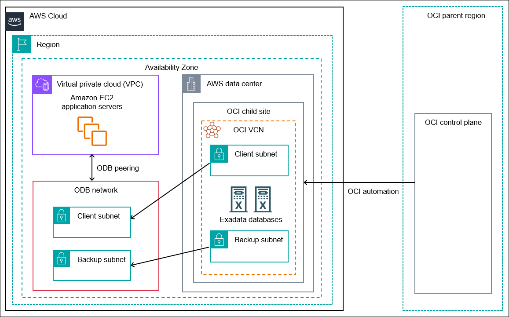
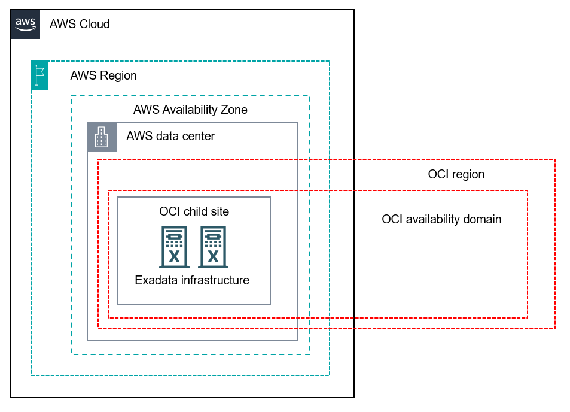
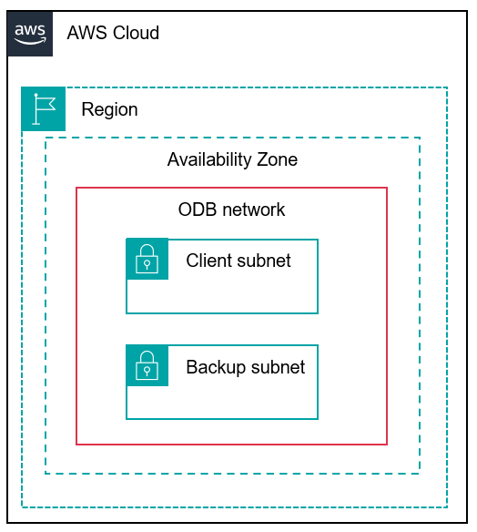
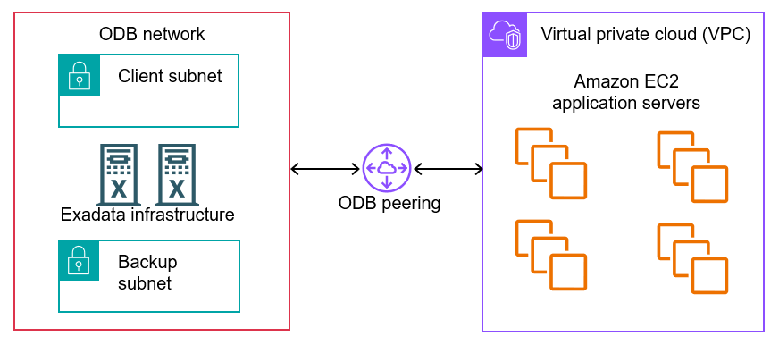

# How Oracle Database@AWS works

Oracle Database@AWS integrates Oracle Cloud Infrastructure (OCI) with the AWS Cloud. In the following sections,
you can learn about the key components of this multicloud architecture.

Oracle Exadata Database Service on Dedicated Infrastructure is an OCI service that provides
Exadata Database Machine. Oracle Exadata Database Machine is an integrated, preconfigured, and
pretested full-stack platform for use in enterprise data centers. You can create the Oracle Exadata infrastructure and
VM clusters in an AWS Availability Zone (AZ) using the AWS console, CLI, or APIs.

After you have created your resources in AWS, you use OCI APIs to create and manage
Oracle Exadata databases. An ODB network, which you peer to an Amazon VPC, enables Amazon EC2 application servers to
access your Exadata databases. In this way, Oracle Exadata databases are integrated into the AWS
environment.

The following diagram shows the Oracle Database@AWS architecture.



## OCI child sites

Oracle Cloud Infrastructure is hosted in OCI regions and availability domains. An _OCI
region_ consists of _OCI availability domains (ADs)_, which are
isolated data center clusters within an OCI region. An _OCI child site_ is
a data center that extends an OCI availability domain to an Availability Zone (AZ) in an
AWS Region. The Exadata infrastructure logically resides in an OCI region and physically
resides in an AWS Region.



The OCI child site for Oracle Database@AWS physically resides in an AWS data center. AWS hosts
the Exadata infrastructure, and OCI provisions and maintains the Exadata infrastructure hardware inside the data center. You
can configure the Exadata infrastructure, private network, and VM clusters using the AWS console, CLI, or APIs. You
can use AWS services such as Amazon EC2 and Amazon VPC to allow application access to Oracle Exadata databases
running on the infrastructure.

## Oracle Exadata infrastructure

The Oracle Exadata infrastructure is the underlying architecture of database servers and storage servers that
runs Oracle Exadata databases. The infrastructure resides in an AWS Availability Zone (AZ). To create
VM clusters on Exadata infrastructure, you use the AWS console, CLI, or APIs.

The Oracle Exadata infrastructure is distributed on physical machines called _database
servers_. These servers provide the compute resources, similar to Amazon EC2 dedicated
servers. Each database server hosts one or more virtual machines (VMs) running on a hypervisor.
For architectural diagrams that illustrate these relationships, see [Exadata Database Service on Dedicated Infrastructure Technical Architecture](https://docs.oracle.com/en/engineered-systems/exadata-cloud-service/ecsid/exadbd_overview.html "https://docs.oracle.com/en/engineered-systems/exadata-cloud-service/ecsid/exadbd_overview.html").

When you create Exadata infrastructure in Oracle Database@AWS, you specify information such as the following:

- The total number of database servers
- The total number of storage servers
- The Exadata system model (X11M)
- The AZ that hosts the infrastructure (see [Supported Regions for Oracle Database@AWS](getting-started.md#supported-odb-regions "getting-started.md#supported-odb-regions"))

To learn how to create Oracle Exadata infrastructure, see [Step 2: Create an Oracle Exadata infrastructure in Oracle Database@AWS](getting-started.md#getting-started-infra "getting-started.md#getting-started-infra").

## ODB network

An _ODB network_ is a private isolated network that hosts OCI
infrastructure in an AWS Availability Zone (AZ). The ODB network consists of a CIDR range of IP
addresses. The ODB network maps directly to the network that
exists within the OCI child site, thus serving as the means of communication between AWS and
OCI. You must specify an ODB network when you create your Exadata VM clusters (see [Step 3: Create an Exadata VM cluster or Autonomous VM cluster in Oracle Database@AWS](getting-started.md#getting-started-vm "getting-started.md#getting-started-vm")).



You provision resources in an ODB network using Oracle Database@AWS APIs. The ODB network is managed by AWS, but
you can set up an ODB peering connection to connect an Amazon VPC to the ODB network. For more information, see
en[ODB peering](#how-it-works.peering "#how-it-works.peering").

When you create an ODB network, you specify information such as the following:

- Availability Zone — The ODB network is specific to an AZ.

You can use Oracle Database@AWS in the following AWS Regions:

**US East (N. Virginia)**

You can use the AZs with the physical IDs `use1-az4` and `use1-az6`.

**US West (Oregon)**

You can use the AZs with the physical IDs `usw2-az3` and
`usw2-az4`.

**Asia Pacific (Tokyo)**

You can use the AZs with the physical IDs `apne1-az1` and
`apne1-az4`.

**US East (Ohio)**

You can use the AZs with the physical IDs `use2-az1` and
`use2-az2`.

**Europe (Frankfurt)**

You can use the AZs with the physical IDs `euc1-az1` and
`euc1-az2`.

**Canada (Central)**

You can use the AZ with the physical ID `cac1-az4`.

**Asia Pacific (Sydney)**

You can use the AZ with the physical ID `apse2-az4`.

To find the logical AZ names in your account that map to the preceding physical AZ IDs, run
the following command.

```
aws ec2 describe-availability-zones \
  --region us-east-1 \
  --query "AvailabilityZones[*].{ZoneName:ZoneName, ZoneId:ZoneId}" \
  --output table
```

- Client CIDR addresses — The ODB network requires a client subnet CIDR for Exadata VM clusters
  and Autonomous VM clusters.
- Backup CIDR addresses — The ODB network requires a backup subnet CIDR for managed
  database backups of VM clusters. The backup subnet is optional for Exadata VM clusters.
- AWS service integrations — You can configure a network path for AWS service
  integrations such as Amazon S3 and zero-ETL with Amazon Redshift. For more information, see [AWS service integrations](#service-integrations-overview "#service-integrations-overview").

For more information, see [Step 1: Create an ODB network in Oracle Database@AWS](getting-started.md#getting-started-odb "getting-started.md#getting-started-odb").

## Virtual Private Cloud (VPC)

A _Virtual Private Cloud (VPC)_ is a virtual network that you create in
the AWS cloud. It is logically isolated from other virtual networks in the AWS cloud,
providing you with complete control over the virtual networking environment, including selection
of your own IP address range, creation of subnets, and configuration of route tables and network
gateways. For more information, see [What is Amazon VPC?](../../../vpc/latest/userguide/what-is-amazon-vpc.md "../../../vpc/latest/userguide/what-is-amazon-vpc.md")

You can launch Amazon EC2 instances into your Amazon VPC. The EC2 instances can host application
servers that communicate with Oracle Exadata databases. You can manage and launch the application
servers just like any other EC2 instances in your VPC. For more information, see [What is Amazon EC2?](../../../AWSEC2/latest/UserGuide/concepts.md "../../../AWSEC2/latest/UserGuide/concepts.md")

By default, the ODB network doesn't have connectivity to VPCs. To connect the ODB network to your
existing AWS infrastructure, create a peering connection between the ODB network and one VPC. You
can specify the VPC when you create the ODB network. For more information, see [Step 1: Create an ODB network in Oracle Database@AWS](getting-started.md#getting-started-odb "getting-started.md#getting-started-odb").

## ODB peering

_ODB peering_ is a user-created network connection that enables
traffic to be routed privately between an Amazon VPC and an ODB network. There is a 1:1 relationship between a
VPC and an ODB network. After peering, an Amazon EC2 instance within the VPC can communicate with an
Oracle Exadata database in the ODB network as if they were within the same network.

###### Note

ODB peering is different from VPC peering, which is a peering connection between two VPCs that
routes traffic between them.



You can peer an ODB network in one account and a VPC in another account using AWS RAM. If you share
an ODB network with another account, the trust account can directly initiate peering. The account that
initiates the ODB peering connection owns and manages the connection.

You can specify peer network CIDRs when you create or update ODB peering connections. In this
way, you control which subnets in the peer VPC have access to your ODB network. A VPC account can
update the CIDR ranges without also owning the ODB network. For more information, see [Configuring ODB peering to an Amazon VPC
in Oracle Database@AWS](configuring.md "configuring.md").

Resources in a VPC can span Availability Zones (AZs). In an ODB network, resources are bound to a
single AZ. You define this AZ when you create the ODB network.

### Creation of an ODB peering connection

An ODB peering connection isn't a characteristic of an ODB network but is an independent resource
with its own ID (prefixed with `odbpcx-`) and lifecycle. You manage a peering
connection with a set of dedicated APIs. For example, you create an ODB peering connection to an
existing ODB network using the Oracle Database@AWS console or the `CreateOdbPeeringConnection` API.
For more information, see [Creating an ODB peering connection in Oracle Database@AWS](configuring.md#network-peering "configuring.md#network-peering").

When you create an ODB peering connection, Oracle Database@AWS performs the following actions
automatically:

1. Validates the network configurations, including checking for overlapping CIDR blocks with
   the Oracle VCN CIDR
2. Sets up the underlying network peering infrastructure
3. Configures the ODB network (not the VPC) route tables with the VPC CIDR addresses

After you create your ODB peering connection, update your VPC route tables manually using the
Amazon EC2 `create-route` command. For more information, see [Configuring VPC route tables for ODB peering](configuring.md#configure-routes "configuring.md#configure-routes").

## AWS service integrations

To provide enhanced functionality and connectivity options for your Oracle databases,
Oracle Database@AWS integrates with AWS services using Amazon VPC Lattice. You can configure network paths to
AWS services directly from your ODB network without requiring additional VPCs or complex networking
setups.

Oracle Database@AWS supports the following AWS managed service integrations:

**Amazon S3**

You can integrate Amazon S3 with Oracle Database@AWS in the following ways:

- Oracle managed automatic backups to Amazon S3 – Oracle Database@AWS automatically enables network
  access for automatic backups. This integration can't be disabled. If you set Amazon S3 as your
  managed backup target in the OCI console, then OCI uploads automatic backups to an S3
  bucket.
- Direct access to Amazon S3 from your ODB network – You can enable direct ODB network access to S3
  and then store scripts, import and export files, and related files in an S3 bucket. You can
  disable this access. This setting is independent of the automatic network access for Oracle
  managed automatic backups.

**Zero-ETL integration with Amazon Redshift**

You can enable zero-ETL integration of your ODB network with Amazon Redshift. This integration enables you
to replicate data to Amazon Redshift from your Oracle databases running in Oracle Database@AWS without the
traditional extract, transform, and load (ETL) process. This integration enables real-time
analytics and AI workloads by automatically synchronizing your Oracle data with Amazon Redshift.

In addition to managed integrations for AWS services, you can also use VPC Lattice to access
services and resources hosted in other VPCs, or access ODB network instances from your VPC. You can
manage access and resources using the VPC Lattice console, CLI, and APIs. For more information, see
the following resources:

- [Backing up in Oracle Database@AWS](managing-backups.md "managing-backups.md")
- [Oracle Database@AWS Zero-ETL integration with Amazon Redshift](zero-etl-integration.md "zero-etl-integration.md")
- [What is
  Amazon VPC Lattice?](../../../vpc-lattice/latest/ug/what-is-vpc-lattice.md "../../../vpc-lattice/latest/ug/what-is-vpc-lattice.md") and [VPC Lattice for Oracle Database@AWS](../../../vpc-lattice/latest/ug/vcp-lattice-oci.md "../../../vpc-lattice/latest/ug/vcp-lattice-oci.md")

## Routing traffic from multiple VPCs

To allow multiple VPCs to access Oracle Database@AWS resources in one ODB network, you can use AWS Transit Gateway
or AWS Cloud WAN.

### AWS Transit Gateway

An Amazon VPC transit gateway is a network transit hub used to interconnect VPCs and on-premises
networks. An ODB network supports only one-to-one direct peering between the ODB network and a single VPC.
You can peer your ODB network to a VPC, and then attach this VPC to a transit gateway. The gateway
can connect to multiple VPCs. With this transit gateway configuration, you can route traffic
between multiple VPC subnets to a single ODB network.


For more information, see [Configuring Amazon VPC Transit Gateways for Oracle Database@AWS](configuring.md#configuring-tgw "configuring.md#configuring-tgw").

### AWS Cloud WAN

AWS Cloud WAN is a managed wide-area networking (WAN) service that enables you to build, manage,
and monitor a unified global network connecting resources across your cloud and on-premises
environments. Using the central dashboard, you can connect on-premises branch offices, data
centers, and VPCs across the AWS global network.

You can peer your ODB network to a VPC, and then attach this VPC to the Cloud WAN core network.
With this configuration, you can use Cloud WAN to route traffic between multiple VPCs or
on-premises networks and your ODB network. For more information, see [Configuring AWS Cloud WAN for Oracle Database@AWS](configuring.md#configuring-cwan "configuring.md#configuring-cwan").

## Exadata VM clusters

An _Exadata VM cluster_ is a set of tightly coupled Exadata VMs. Each VM has a
complete Oracle database installation that includes all features of Oracle Enterprise Edition,
including Oracle Real Application Clusters (Oracle RAC) and Oracle Grid Infrastructure. You can
create one or more Oracle Exadata databases on a VM cluster. For diagrams that show the architecture of VMs
and VM clusters, see [Exadata Database Service on Dedicated Infrastructure Technical Architecture](https://docs.oracle.com/en/engineered-systems/exadata-cloud-service/ecsid/exadbd_vmclusters.html "https://docs.oracle.com/en/engineered-systems/exadata-cloud-service/ecsid/exadbd_vmclusters.html").

When you create a _VM cluster_, you specify information that includes the
following:

- An ODB network
- An Oracle Exadata infrastructure
- The database servers on which to place the VMs in the cluster
- The total amount of usable Exadata storage

You can configure the CPU cores, memory, and local storage for each VM in a VM cluster. For more
information, see [Step 3: Create an Exadata VM cluster or Autonomous VM cluster in Oracle Database@AWS](getting-started.md#getting-started-vm "getting-started.md#getting-started-vm").

## Autonomous VM clusters

_Autonomous VM clusters_ are fully managed databases that automate key
management tasks using machine learning and AI. Unlike traditional databases, autonomous
databases automatically provision, secure, update, backup, and tune the database with no human
intervention required.

You can configure the ECPU core count per VM, database memory per CPU, database storage, and
maximum number of autonomous container databases. For more information, see [Step 3: Create an Exadata VM cluster or Autonomous VM cluster in Oracle Database@AWS](getting-started.md#getting-started-vm "getting-started.md#getting-started-vm").

## Oracle Exadata databases

Oracle Exadata is an engineered system that provide a high-performance platform for running
Oracle databases. With Oracle Database@AWS, you use the AWS console to create the Oracle Exadata infrastructure and VM clusters
that host the Exadata databases. You then use OCI APIs to create and manage the Oracle databases.
For more information, see [Step 4: Create Oracle Exadata databases in Oracle Cloud Infrastructure](getting-started.md#getting-started-db "getting-started.md#getting-started-db").
