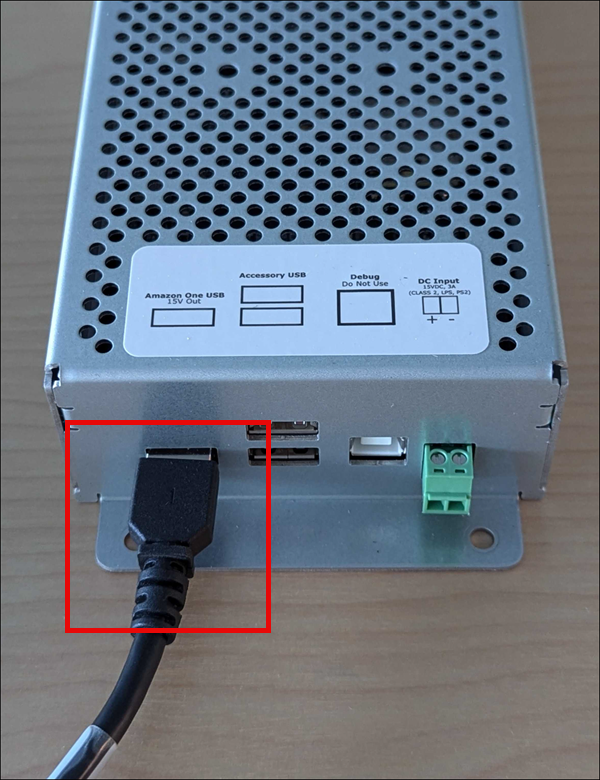
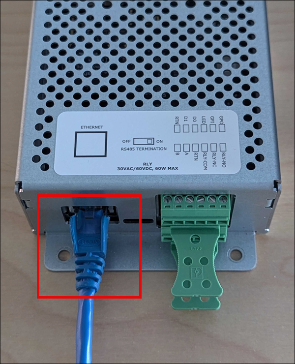
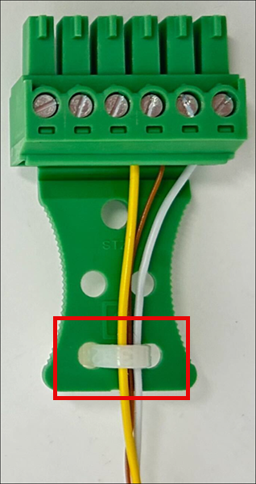
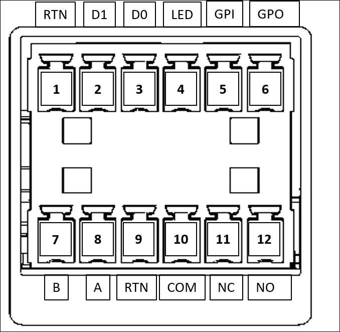
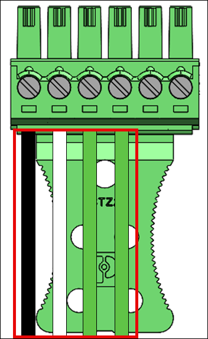
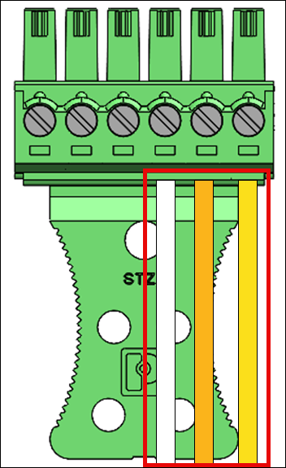
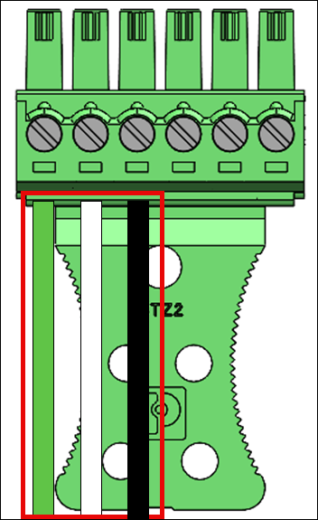
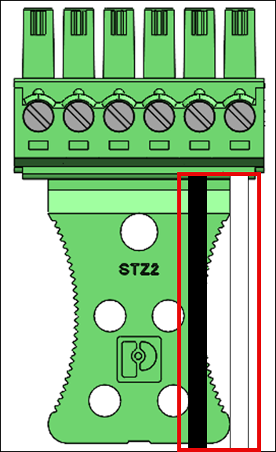
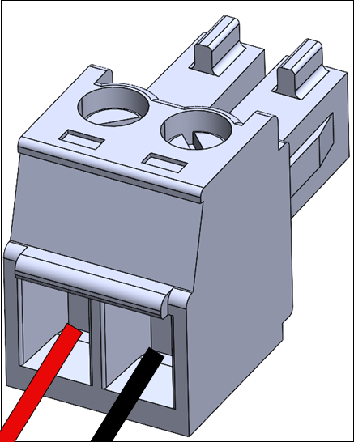
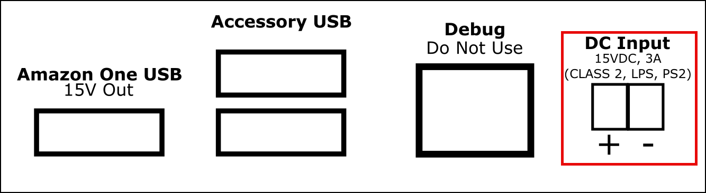

# Installing Amazon One device I/O Hub for secure access

The Amazon One device with I/O Hub is an integral part of the Amazon One Enterprise system, designed to enhance security and streamline access control for a variety of environments.
The device leverages biometric palm recognition to provide secure, touchless authentication for users, making it ideal for use in high-security areas such as office buildings, restricted entry points, or facilities requiring seamless access management.
The I/O Hub acts as a bridge between the device and your existing security infrastructure, enabling communication with door locks, alarms, and other access control systems.

This section provides the location requirements and step-by-step instructions for installing the Amazon One device with I/O Hub.
Proper preparation and installation are key to ensuring the system operates securely and efficiently, providing users with a smooth, reliable experience.

**Prerequisites and preparation for installing the Amazon One Device with I/O Hub**

Before starting the installation, ensure the following conditions are met to ensure a safe, secure, and effective setup:

- Indoor use only: The Amazon One device with I/O Hub is designed for indoor use only. Ensure it is installed in an appropriate environment.
- Power Over Ethernet (PoE++): If using Power Over Ethernet (PoE++), verify that an IEEE 802.3bt (Type 3) Class 6 PoE++ switch (end span) or injector (midspan) is available.
  The PoE++ source must be listed or certified and comply with IEC 62368-1 standards. Importantly, the PoE++ source must be located within the same building as the device.
  Only use an approved PoE++ source with the AOE device.

- 15V DC power input: If you are using 15V DC power input, ensure that only an NEC Class 2 or power-limited, approved power supply is used.
  The power supply must be listed or certified for safety. For further details, refer to the Optional DC section below.
  **Required tools**

- Wire stripper
- #2 Phillips screwdriver
- 0.5mm x 2mm flathead screwdriver
  **Included with the Amazon One device with I/O Hub**

- 2x 6 position terminal block connectors
- DC plug connector
- 72" power/data cable
  Once these prerequisites are confirmed, you can proceed with the installation process, ensuring a secure and efficient setup of your Amazon One device with I/O Hub.
  Proper preparation will help guarantee the device functions as intended and integrates smoothly into your secure access system.

###### To install the I/O hub for your Amazon One device

1. Remove your Amazon One device with I/O Hub from the packaging.
2. Secure the I/O hub in the desired location.
3. Plug in the Amazon One USB cable into the I/O hub port.

 4. For POE++ power, plug in the Ethernet cable from the POE++ source into the I/O hub port.

Optional: For DC power, refer to the install DC wiring section below.

###### To wire the I/O hub for your Amazon One device

- Install a drip loop to avoid liquids accidently running down the cord and into the I/O hub.
- Attach a strain relief clamp to protect the wires from damage or stress, as shown in the following image.

1. Insert the terminal block plugs into the I/O hub. 2. Insert only the required wires for your application through the terminal block plugs. Refer to the following wiring table and diagrams.
**Connections**

| Pin | Connection | Description            | Use                                         |
| --- | ---------- | ---------------------- | ------------------------------------------- | ------------------------------------------------------------------------------------------------------------------------------------------------------------------------------------------------------------------------------------------------------------------------------------------------------------------------------------------------------------------------------------------------------------------------------------------------------------------------------------------------------------------------------------------------------------------------------------------------------------------------------------------------------------------------------------------------------------------------------------------------------------------------------------------------------------------------------------------------------------------------------------------------------------------------------------------------------------------------------------------------------------------------------------------------------------------------------------------------------------------------------------------------------------------------------------------------------------------------------------------------------------------------------------------------------------------------------------------------------------------------------------------------------------------------------------------------------------------------------------------------------------------------------------------------------------------------------------------------------------------------------------------------------------------------------------------------------------------------------------------------------------------------------------------------------------------------------------------------------------------------------------------ |
| 1   | RTN        | Signal return          | Wiegand ground – Black wire                 |
| 2   | D1         | Wiegand D1             | Wiegand Data 1 – White wire                 |
| 3   | D0         | Wiegand D0             | Wiegand data 0 – Green wire                 |
| 4   | LED        | Wiegand LED            | Wiegand LED – Optional                      |
| 5   | GPI        | General purpose input  | Digital input signal – Optional             |
| 6   | GPO        | General purpose output | Digital output signal - Optional            |
| 7   | B          | RS485_B/D0/Data        | OSDP D0 – Green wire                        |
| 8   | A          | RS485_A/D1/Clock       | OSDP D1 – White wire                        |
| 9   | RTN        | Signal return          | OSDP return – Black wire                    |
| 10  | COM        | Relay Common           | Contact relay common – White wire           |
| 11  | NC         | Relay normally closed  | Contact relay normally closed – Orange wire |
| 12  | NO         | Relay Normally Open    | Contact relay normally open – Yellow wire   | **Wiegand connections**  • Insert the black wire in Pin 1 (RTN).  • Insert the white wire in Pin 2 (D1).  • Insert the green wire in Pin 3 (D0).  • Optional: Insert the green wire in Pin 4 (LED). **Relay connections**  • Insert the white wire in Pin 10 (COM).  • Insert the orange wire in Pin 11 (NC).  • Insert the yellow wire in Pin 12 (NO). **Relay diagram** The relay should be operated in accordance to the specified safety ratings 30VAC/60VDC, 60W Max. **RS485 connections**  • Insert the green wire in Pin 7 (B).  • Insert the white wire in Pin 8 (A).  • Insert the black wire in Pin 9 (RTN). Turn RS485 termination switch “ON” if the device is the last unit on the line. This switch activates 120 Ohms resistor termination on the line. Digital input/output connections  • Insert the black wire in Pin 5 (GPI).  • Insert the white wire in Pin 6 (GPO). \* The digital input/output connections should be operated as listed. ###### Optional: To install DC wiring 1. Strip off 3mm-5mm from the end of a red wire for positive (+) and a black wire for negative (-). 2. Insert the stripped end of the DC wire into the DC plug.  3. Screw the wire into position. 4. Insert the wired DC plug into the DC Input port.  After installing your Amazon One device, you are ready to activate the device. |
