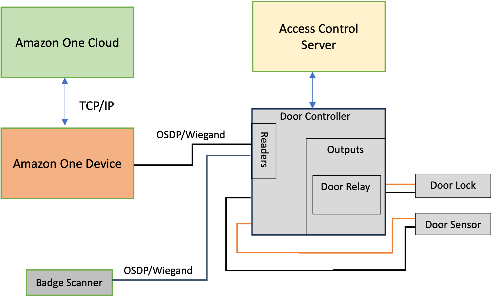

# Understanding installation concepts

To properly secure
building access, Amazon One recommends that you install the device as part of a
typical access control environment, as described in the following block diagram.

An access control environment typically consists of these components:

- Amazon One device: This is the palm recognition device that will perform
  biometric authentication to identify the individual who is attempting to
  gain access to a secure area of the building.
- Access control server: This component typically controls the access rights
  of users to the secure area. The badge IDs of individuals who have access to
  the area are stored on this server. This server caches the relevant
  IDs to the appropriate door controllers.
- Door controller:
  - An Amazon One device connects to the door controller server through
    an OSDP interface.
  - If a Wiegand interface is necessary, a COTS OSDP-to-Wiegand
    converter can be used.
  - Upon successful authentication, the Amazon One device sends the
    badge ID of the user to the door controller.
  - The door controller responds with a decision, which then allows
    the Amazon One device to display either an Access Granted or Access
    Denied message.

- Badge scanner: A badge scanner is typically used to scan RFID badges and send the badge number to the access control server.
  With Amazon One, a badge scanner connects to the Amazon One device, allowing users to scan their badges, which associates them with their palm profiles.
