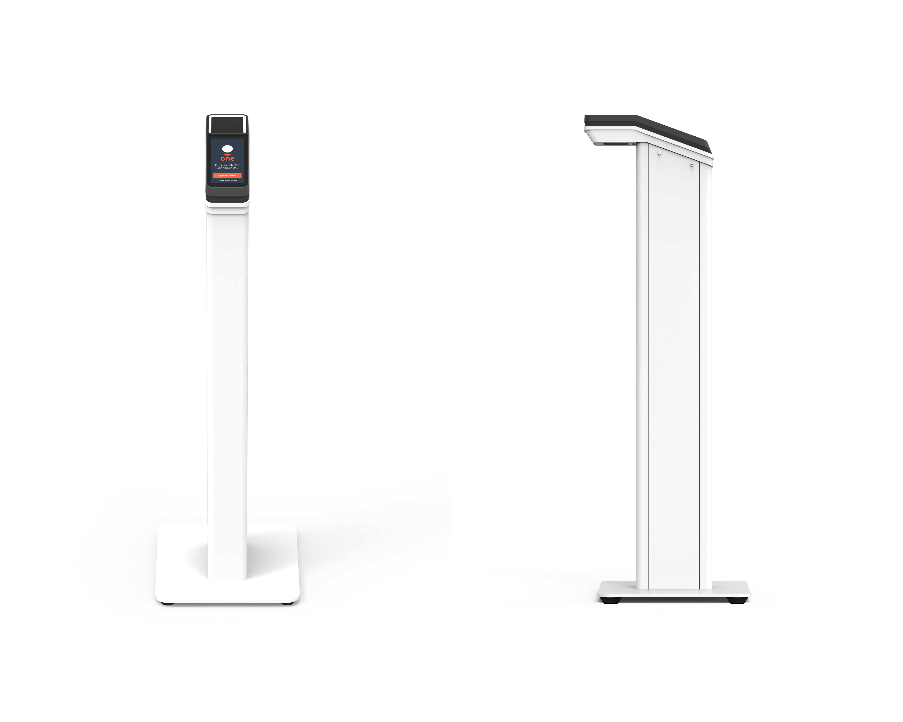

# Installing Amazon One Pedestal

The Amazon One Pedestal is a key component of the Amazon One identification and transaction system, designed to deliver a seamless, touchless experience for users.
This device features secure biometric authentication. You can integrate it into various locations to provide frictionless access or payment solutions.

This section provides the location requirements and step-by-step instructions for installing Amazon One Pedestal.
Proper preparation and installation are key to ensuring the system operates securely and efficiently, providing users with a smooth, reliable experience.

**Prerequisites and preparation for installing the Amazon One Pedestal**

Before starting the installation, ensure the following conditions are met for a safe, secure, and effective setup:

- Power requirements: If you use POE+ (Power over Ethernet) to power the device, verify that Cat6 cabling is already installed, and a POE+ injector or switch is available for use.
  Alternatively, if AC power (120V) is being used, ensure that an accessible AC outlet is located within 20 feet of the pedestal.
- Physical setup: The floor must be level, clean, and free of any debris to ensure stable and safe pedestal installation.
- Pedestal location: Install the pedestal in a location where it will not block doors, lanes, or access points, allowing for easy movement around the area.
- Cable management: Route and secure all excess cables inside the pedestal to avoid clutter and prevent any potential damage during normal use.
  Once these prerequisites are confirmed, you can proceed with the installation process.

###### To install Amazon One Pedestal

1. Remove the Amazon One Pedestal from the packaging.
2. Remove the door by unscrewing both M4 tamper resistant
   screws.
3. Plug in the power cable.
4. Route the cable through the hole in the pedestal base plate.
5. Coil any excess power cable inside the pedestal.
6. Route the Ethernet cable (Cat5E or better)
   through the bottom plate of the pedestal and plug
   into the Ethernet port.
7. Install a ferrite loop on the Ethernet cable 2
   inches above the base of the pedestal.
8. Feed RS485 serial cable from the access
   control panel (or the badge reader) to the
   pedestal, with 1 ft excess in length.
9. Install a ferrite loop on the RS485 cable 2
   inches above the base of the pedestal.
10. Plug in power to the outlet and confirm that the
    Amazon One device turns on.
11. Reattach the door to the pedestal and rescrew the two M4
    tamper resistance screws to secure.
    After installing your Amazon One device, you are ready to activate the device.
