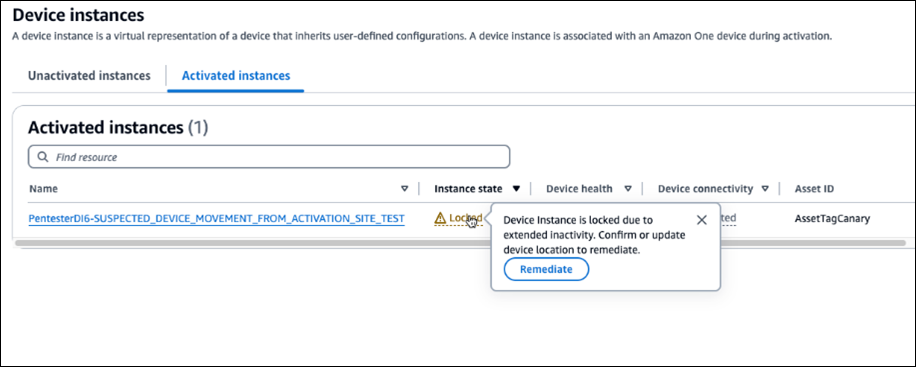

# Troubleshooting the Amazon One device

If you have problems with Amazon One Console or one of your Amazon One Devices, use these suggestions to troubleshoot the problem.
Then, if you're still having trouble, contact AWS Support.

###### Topics

- [Blank screen](#w2aac49c15b7 "#w2aac49c15b7")
- [I am unable to connect to Wi-Fi or network](#w2aac49c15b9 "#w2aac49c15b9")
- [Rebooting a device with active alerts](#w2aac49c15c11 "#w2aac49c15c11")
- [System error](#w2aac49c15c13 "#w2aac49c15c13")
- [QR code is not recognized](#w2aac49c15c15 "#w2aac49c15c15")
- [Unable to read QR code](#w2aac49c15c17 "#w2aac49c15c17")
- [Multiple QR codes detected](#w2aac49c15c19 "#w2aac49c15c19")
- [Device instance does not exist](#w2aac49c15c21 "#w2aac49c15c21")
- [Site not found](#w2aac49c15c23 "#w2aac49c15c23")
- [ZIP Code does not match](#w2aac49c15c25 "#w2aac49c15c25")
- [Gateway timed out](#w2aac49c15c27 "#w2aac49c15c27")
- [I am unable to configure device](#w2aac49c15c29 "#w2aac49c15c29")
- [Device restarted with error message and error code](#w2aac49c15c31 "#w2aac49c15c31")
- [Amazon logo on the device screen with no further activity](#w2aac49c15c33 "#w2aac49c15c33")
- [Temporarily unavailable](#w2aac49c15c35 "#w2aac49c15c35")
- [Something went wrong on our end](#w2aac49c15c37 "#w2aac49c15c37")
- [Temporarily out of service](#w2aac49c15c39 "#w2aac49c15c39")
- [Amazon One device has physical damage](#w2aac49c15c41 "#w2aac49c15c41")
- [Unable to read palm](#w2aac49c15c43 "#w2aac49c15c43")
- [Palm not recognized](#w2aac49c15c45 "#w2aac49c15c45")
- [Device locked due to extended inactivity](#w2aac49c15c47 "#w2aac49c15c47")
- [Device locked due to tamper event](#w2aac49c15c49 "#w2aac49c15c49")

## Blank screen

This occurs when the device doesn’t have power or gets stuck during reboot.

Perform the following to troubleshoot this issue:

- Wait a few moments (less than 30 seconds) in case the device is rebooting.
- If the light ring is pulsing while the device is blank, wait up to 30 seconds.
- Check if the power cord is plugged into both the power outlet as well as firmly in the back of the Amazon One device. Also, check that the cord is not damaged.
- Check the power source.
- Check that all the cables are connected properly to the Amazon One and USB hub.
- Reboot the device from the console.
- If rebooting the device doesn’t fix the issue, unplug the Amazon One USB hub from the power supply, and then plug it back in.
- If the issue persists, contact AWS Support.

## I am unable to connect to Wi-Fi or network

This occurs when the device loses connectivity.

Perform the following to troubleshoot this issue:

- If connected to Wi-Fi, use another device to check if the Wi-Fi shows up in the available networks.
- Check if the Wi-Fi router is switched on and within range.
- The device will reconnect once the network recovers.
- If the issue persists, contact AWS support.

## Rebooting a device with active alerts

When a Reboot is requested from the console, the operation waits up to 15 minutes for the device to receive the command and attempt a reboot, even if it's offline or facing network issues.

Perform the following to troubleshoot this issue:

- Wait for the reboot to complete.
- If the issue persists, contact AWS support.

## System error

This occurs due to an internal error.

Perform the following to troubleshoot this issue:

- Choose **Restart** on the screen to restart the application.
- After 2 attempts, if the issue is not resolved, contact AWS Support.

## QR code is not recognized

This occurs because of an unauthorized QR code or expired QR code.

Perform the following to troubleshoot this issue:

- Choose **Try again** to navigate back to the QR code screen.
- Create a new QR code on the AWS console, and then scan the valid QR code.

## Unable to read QR code

This occurs when the application is unable to read the QR code.

Perform the following to troubleshoot this issue:

- Choose **Try again** to navigate back to the QR code screen.
- If the issue persists, cancel the activation workflow and restart.

## Multiple QR codes detected

This occurs when multiple QR codes are scanned.

Perform the following to troubleshoot this issue:

- Choose **Try again** to navigate back to the QR code screen.
- Scan only one valid QR code at a time.

## Device instance does not exist

This occurs when the device instance is deleted or does not exist in the AWS console.

Perform the following to troubleshoot this issue:

- Choose **Try again** to navigate back to the QR code screen.
- Check the AWS console for the correct device instance. If the device instance is missing, contact your administrator.
- Create a new QR code for that device instance, and then scan the new QR code.

## Site not found

This occurs when the site is deleted or does not exist in the AWS console.

Perform the following to troubleshoot this issue:

- Check the AWS console for the site information. If the site doesn’t exist, contact your administrator.

## ZIP Code does not match

This occurs when entering a different ZIP Code than the one configured for the device.

Perform the following to troubleshoot this issue:

- Choose **Try again** to navigate back to the ZIP Code screen.
- Check if you have the correct site ZIP Code.
- If the issue persists, contact your administrator to check the site ZIP Code on the AWS console.

## Gateway timed out

This occurs when there is no response from gateway within a specified time.

Perform the following to troubleshoot this issue:

- Choose **Restart** to restart the application.
- After two attempts, if the issue is not resolved, contact AWS Support.

## I am unable to configure device

This occurs when the operation failed to save the configuration on the device disk.

Perform the following to troubleshoot this issue:

- Choose **Restart** to restart the application.
- After two attempts, if the issue is not resolved, contact AWS Support.

## Device restarted with error message and error code

Perform the following to troubleshoot this issue:

- Choose **Restart**, and let the device recover.
- If the device doesn’t recover, unplug the USB hub from the power supply and reconnect.
- If the issue persists, contact AWS Support.

## Amazon logo on the device screen with no further activity

Perform the following to troubleshoot this issue:

- Wait a few moments (less than 30 seconds) in case the device is rebooting.
- Unplug the USB hub from the power supply and reconnect.
- If the issue persists, contact AWS Support.

## Temporarily unavailable

Perform the following to troubleshoot this issue:

- Ensure that the USB connections with the host device/system are secure.
- Disconnect and reconnect all the cables going into the USB hub.
- If the issue persists, contact AWS Support.

## Something went wrong on our end

This occurs when there is an internal error.

Perform the following to troubleshoot this issue:

1. Shut down the device.
2. Disconnect it from its power supply.
3. Wait 30 seconds.
4. Plug the device back into its power source.
5. Power on the device.
6. If the issue persists, contact AWS Support.

## Temporarily out of service

This occurs when the device has been moved out of service by Amazon One.

Perform the following to troubleshoot this issue:

- Contact AWS Support.

## Amazon One device has physical damage

Perform the following to troubleshoot this issue:

- Contact AWS Support for next steps, and provide as many details as possible, such as what happened, when it happened, and why it happened.

## Unable to read palm

Perform the following to troubleshoot this issue:

- Double-check that the Amazon One device is free from streaks and smudges.
- Ensure the customer’s palm is free of occlusions such as bandages, sleeves, and significant dirt/oil.
- If the issue persists, and the device does not read any palm, contact AWS Support.

## Palm not recognized

Perform the following to troubleshoot this issue:

- Have the customer try using their other palm.
- Ensure the customer is already enrolled. If not, have them enroll online or on the device.
- If the issue persists, and the device does not read any palm contact, contact AWS Support.

## Device locked due to extended inactivity

When the device suspects it has been moved from the activation site, it locks out users.
This occurs when the device exceeds the maximum 120 hours of offline time.

Perform the following to unlock the device:

1. Log in to your AWS console, and choose the device instance.
2. From the error banner on the top of the page, select **Remediate**.

Optionally: From **Activated instances**, select **Locked**, and choose **Remediate**.

 3. If the device is still at the original activation site, choose **Yes, device is at this site**. 4. If the device is in a different site, choose **No, the device is at a different site**.
Choosing **No** deactivates the device. Activate the device at the new site.

## Device locked due to tamper event

For security reasons, Amazon One device will be locked in case of any tamper event.

Perform the following to troubleshoot this issue:

- Contact AWS Support.
