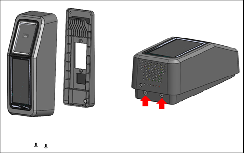
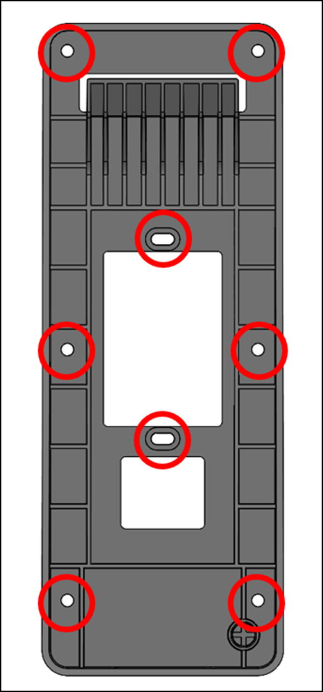
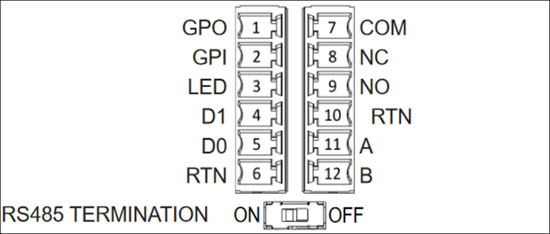
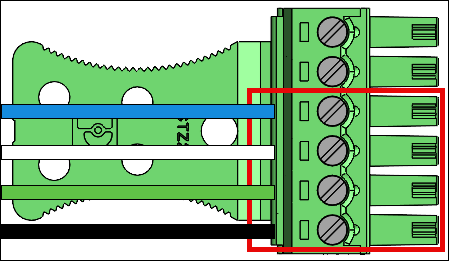
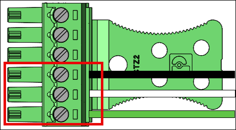
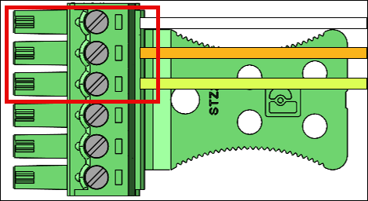
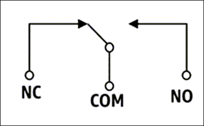
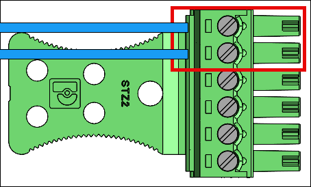

# Installing the wall-mountable Amazon One device

The wall-mountable Amazon One device is a versatile, compact biometric identification system designed to provide a seamless, touchless experience for users in various environments.
It uses advanced palm recognition technology for secure access or payment, making it ideal for high-traffic locations such as retail spaces, office entrances, and more.

This section outlines the necessary location requirements and detailed steps for installing the wall-mountable Amazon One device to ensure optimal performance and security.

**Prerequisites and preparation for installing the wall-mountable Amazon One device**

Before you begin the installation, ensure that the following conditions are met to guarantee the device operates effectively and is properly set up within your space:

- Indoor use only: The wall-mountable Amazon One device is intended for indoor use only, so ensure it is being installed in an appropriate environment.
- Wall requirements: The wall must be level to ensure proper alignment and functionality of the device.
- Mounting height: The top of the wall mount should be positioned no higher than 44-46 inches from the ground after installation, ensuring ease of access for users.
- Cable management: Ensure that all excess cables are routed behind the wall mount and securely fastened to prevent damage or clutter.
- Power Over Ethernet (PoE++): If using Power Over Ethernet (PoE++), verify that an IEEE 802.3bt (Type 3) Class 6 PoE++ switch (end span) or injector (midspan) is available.
  The PoE++ source must be listed or certified and comply with IEC 62368-1 standards. Importantly, the PoE++ source must be located within the same building as the device.
  Only use an approved PoE++ source with the AOE device.
- 15V DC Power Input: If using 15V DC power input, ensure that only an NEC Class 2 or a power-limited approved power supply is used.
  The power supply must be listed or certified for safety and compatibility.
  **Required tools**

- 1/4” dry wall or masonry drill bit if wall anchors are required
- Wire stripper
- 7/64” drill bit for drilling pilot holes
- #2 Phillips screwdriver
- 0.5mm x 2mm flathead screwdriver
- T12 Secure Torx Driver
- Pencil
- Level
  **Included with the wall-mountable Amazon One device**

- 6x #8 Drywall anchors
- 6x #8-32 1in long screws
- 2x #6-32 1in Machine Screws
- 2x 6 Position terminal block connectors
- 2 Torx Security M4x10 flathead screws
  Once these prerequisites are confirmed, you can proceed with the installation steps to securely mount and configure the wall-mountable Amazon One device.

###### To install the wall-mounting plate for your Amazon One device

1. Remove your Amazon One device from the packaging.
2. Separate the mounting plate from your Amazon One device by removing the two bottom Torx security screws.

 3. Position the mounting plate on the wall in the desired location. Use the bracket as a template to mark the outer six screw holes as shown in the following image.

(Optional) If a single gang box is available in the installation position,
perform the following:

    * Loosely mount the plate to the gang box by inserting the included #6-32 machine screws through the oblong holes.
    * Ensure the mounting plate is level.
    * Use the mounting plate as a template to mark the six screw positions with a pencil.
     You can use the oblong holes and #6-32 screw as extra support for the mounting plate.
     Don't use the #6-32 screw positions as the primary means of mounting the wall plate.

 4. If mounting into stucco, drywall, brick, or concrete surfaces, drill 1/4” holes at each marked location, and then install wall anchors by pressing them into the hole until the anchor is flush with the wall.

If mounting onto a wooden surface, the anchors are not required and only 7/64” pilot holes are required in the marked locations. 5. Loosely fasten the wall plate to the wall using the #8 wood screws in the anchor positions. 6. After all the fasteners are in place, ensure the mounting plate is level. 7. Tighten the screws to secure the mounting plate to the wall.

###### To connect your wall-mountable Amazon One device

You can configure Amazon One device with OSDP and Weigand access control protocols. To simplify installation, Amazon One device utilizes terminal block connectors (Mfg P/N: Phoenix Contact 1767694).
You also have the option to configure Amazon One device to directly control external devices by using the internal relay or the General Purpose Input and Output connections.

1. To determine the appropriate wiring configuration for your application, refer to the following diagram and Connections Table.

For detailed electrical characteristics of the signals, refer to the Wiring instructions.

**Connections**

| Pin | Connection | Description            | Use                                         |
| --- | ---------- | ---------------------- | ------------------------------------------- | ------------------------------------------------------------------------------------------------------------------------------------------------------------------------------------------------------------------------------------------------------------------------------------------------------------------------------------------------------------------------------------------------------------------------------------------------------------------------------------------------------------------------------------------------------------------------------------------------------------------------------------------------------------------------------------------------------------------------------------------------------------------------------------------------------------------------------------------------------------------------------------------------------------------------------------------------------------------------------------------------------------------------------------------------------------------------------------------------------------------------------------------------------------------------------------------------------------------------------------------------------------------------------------------------------------------------------------------------------------------------------------------- |
| 1   | GPO        | General purpose output | Digital output signal - Optional            |
| 2   | GPI        | General purpose input  | Digital input signal – Optional             |
| 3   | LED        | Wiegand LED            | Wiegand LED – Optional                      |
| 4   | D1         | Wiegand D1             | Wiegand data 1 – White wire                 |
| 5   | D0         | Wiegand D0             | Wiegand data 0 – Green wire                 |
| 6   | RTN        | Signal return          | Wiegand Ground – Black wire                 |
| 7   | Com        | Relay common           | Contact relay common – White wire           |
| 8   | NC         | Relay normally closed  | Contact relay normally closed – Orange wire |
| 9   | NO         | Relay normally open    | Contact relay normally open – Yellow wire   |
| 10  | RTN        | Signal return          | OSDP return – Black wire                    |
| 11  | A          | RS485_A/D1/Clock       | OSDP D1 – White wire                        |
| 12  | B          | RS485_B/D0/Data        | OSDP D0 – Green wire                        | 2. When installing a wire, strip 3mm-5mm off the end of the wire. 3. Insert the stripped end of the wire into the desired terminal position. 4. Using a flathead screwdriver, turn the terminal retention screw clockwise to clamp down on the wire until it is snug. Do not over tighten. 5. After fastening, gently tug on the wire to ensure that it is seated. 6. After you make the necessary connections, insert the plug into the corresponding receptacle of your Amazon One device terminal block. 7. Insert the Cat6 Ethernet cable to RJ45 jack. 8. Position Amazon One device so the hook on the wall plate slides into the opening on the rear of the device. 9. Ensure the cables are not caught between the device and the mounting plate, and let the device pivot and seat into position. 10. Secure your Amazon One device to the mounting plate with two Torx Security M4x10 flathead screws. 11. Hand tighten the screws. Don't over tighten. ###### To wire your wall-mountable Amazon One device Install only the required wires for your application. **Wiegand connections**  • Insert the blue wire in Pin 3 (LED).  • Insert the white wire in Pin 4 (D1).  • Insert the green wire in Pin 5 (D0).  • Insert the black wire in Pin 6 (RTN). **Wiegand output wiring** |
| Pin | Connection | Description            | Use                                         |
| --- | ---        | ---                    | ---                                         |
| 3   | LED        | Wiegand LED            | Wiegand LED input – Optional (5V TTL)       |
| 4   | D1         | Wiegand D1             | Wiegand D1 output (5V TTL)                  |
| 5   | D0         | Wiegand D0             | Wiegand D0 output (5V TTL)                  |
| 6   | RTN        | Signal return          | Wiegand GND reference                       | Turn RS485 termination switch “ON” if the device is the last unit on the line. This switch activates 120 Ohms resistor termination on the line. **RS485 connections**  • Insert the black wire in Pin 10 (RTN).  • Insert the white wire in Pin 11 (A).  • Insert the green wire in Pin 12 (B). **RS485 wiring**                                                                                                                                                                                                                                                                                                                                                                                                                                                                                                                                                                                                                                                                                                                                                                                                                                                                                                                                                                                |
| Pin | Connection | Description            | Use                                         |
| --- | ---        | ---                    | ---                                         |
| 10  | RTN        | Signal return          | Ground                                      |
| 11  | A          | RS485_A/D1/Clock       | RS485 non-inverting signal                  |
| 12  | B          | RS485_B/D0/Data        | RS485 inverting signal                      | **Relay connections**  • Insert the white wire in Pin 7 (COM).  • Insert the orange wire in Pin 8 (NC).  • Insert the yellow wire in Pin 9 (NO). **Relay wiring**                                                                                                                                                                                                                                                                                                                                                                                                                                                                                                                                                                                                                                                                                                                                                                                                                                                                                                                                                                                                                                                                                                                                  |
| Pin | Connection | Description            | Use                                         |
| --- | ---        | ---                    | ---                                         |
| 7   | COM        | Relay common           | Contact relay Common – White wire           |
| 8   | NC         | Relay normally closed  | Contact relay normally closed – Orange wire |
| 9   | NO         | Relay normally open    | Contact relay normally open – Yellow wire   | The relay should be operated in accordance to the specified safety ratings 30VAC/60VDC, 60W Max. **Digital input/output connections**  • Insert the blue wire in Pin 1 (GPO).  • Insert the blue wire in Pin 2 (GPI). **Digital input/output wiring**                                                                                                                                                                                                                                                                                                                                                                                                                                                                                                                                                                                                                                                                                                                                                                                                                                                                                                                                                                  |
| Pin | Connection | Description            | Use                                         |
| --- | ---        | ---                    | ---                                         |
| 1   | GPO        | General purpose output | Digital output signal (5V)                  |
| 2   | GPI        | General purpose input  | Digital input signal (3.6V – 5V)            |  • The digital input/output connections should be operated as listed. After installing your Amazon One device, you are ready to activate the device.                                                                                                                                                                                                                                                                                                                                                                                                                                                                                                                                                                                                                                                                                                                                                                                                                                                                                                                                                                                                                                                                                                                                                                                                                                     |
