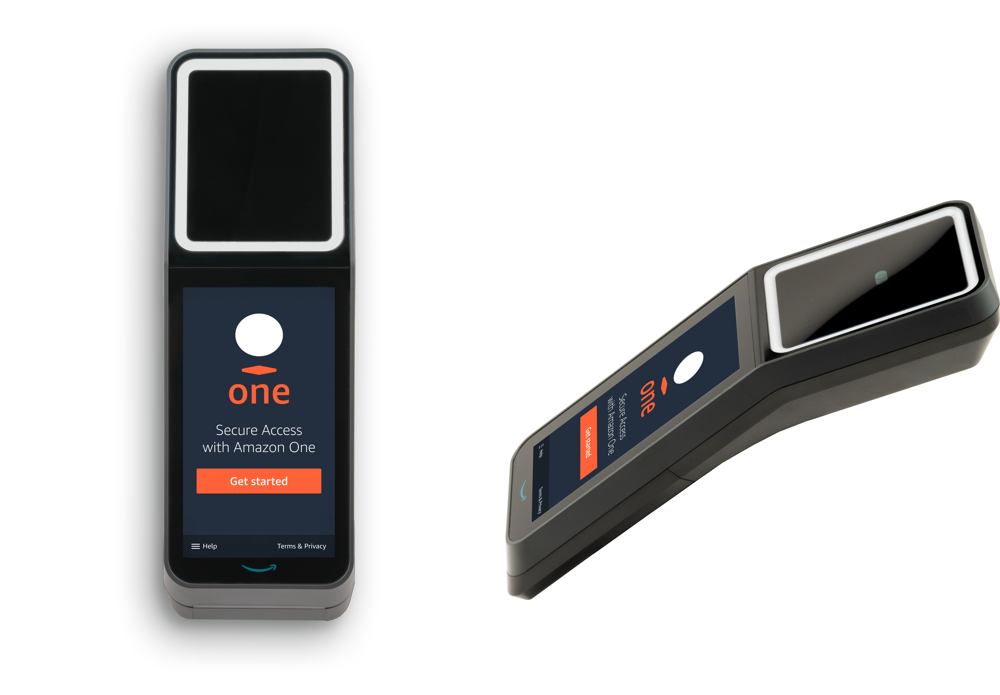

# What is Amazon One Enterprise?

Amazon One Enterprise is a new palm-based authentication service that provides employees with secure
access to buildings and enterprise assets, without the use of badges, PINs, or passcodes.

###### Topics

- [Amazon One device](#one-enterprise-device "#one-enterprise-device")
- [Amazon One Enterprise console](#console-overview "#console-overview")
- [Purchasing Amazon One devices](#how-to-buy "#how-to-buy")
- [Amazon One Enterprise pricing](#pricing "#pricing")

## Amazon One device

The Amazon One device is designed for Amazon One Enterprise, a secure, palm-based identity service for
enterprise access control. Note the following device specifications:

- User inputs — Palm Biometrics, QR Code matching
- Host interface — Wi-Fi (2.4 GHz and 5 GHz), Ethernet, 2x USB Type-A, 1 USB Type-B
- User feedback — 5.5” Touchscreen, Lightring, speaker, headphone
- Physical Access Control Protocol — OSDP and Wiegand
- Power supply — POE, 110/220 VAC input AC to DC adaptor provided, 30W @ 15V
- Security — Tamper switches
- Dimension (HxWxD mm) — 86 x 85 x 256

## Amazon One Enterprise console

Amazon One Enterprise includes a console, which can be used in the following ways:

- An IT or facility manager uses Amazon One Enterprise to create and manage a site. The site resembles a
  physical location for the tasks that the team performs while monitoring and managing Amazon One Enterprise
  devices and user profiles. The IT or facility manager tasks include:
  - Creating a site to contain all of the Amazon One device instances in a physical
    location
  - Adding an admin user to manage the site, and an installer user to access activation QR
    codes

- An admin uses Amazon One Enterprise to create device instances and to manage Amazon One devices. Admin
  tasks include:
  - Creating a device instance under a site
  - Creating a configuration template to be applied to a device instance
  - Monitoring device health and updating device configurations
  - Canceling user enrollments

- An installer uses Amazon One Enterprise to access activation QR codes to activate devices. Installer
  tasks include:
  - Accessing an activation QR code on the console
  - Selecting a QR code that corresponds to the device instance to be activated
  - Scanning the selected QR code with the Amazon One device installed

## Purchasing Amazon One devices

[Contact us](https://mkt.justwalkout.com/AOE-Contact-Us "https://mkt.justwalkout.com/AOE-Contact-Us") to learn more
about Amazon One Enterprise, and a Business Development team member will get in touch to share more details
about our offering, including pricing, and answer any questions that you may have.

## Amazon One Enterprise pricing

[Contact us](https://mkt.justwalkout.com/AOE-Contact-Us "https://mkt.justwalkout.com/AOE-Contact-Us") to learn more about Amazon One Enterprise pricing.
