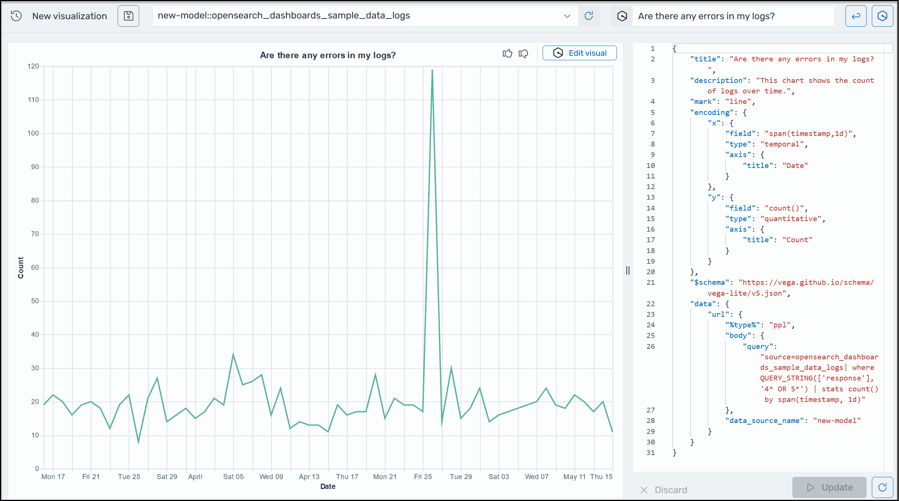

# Generate

visualizations using natural language

To help you gain further insights into your operational data, AI Assistant for OpenSearch Service
supports using natural language prompts to build visualizations. Before you start, verify that you've set up [AI Assistant for OpenSearch Service](AI-Assistant-setting-up.md "AI-Assistant-setting-up.md"). Once confirmed, launch your OpenSearch Service UI application, navigate to the **Visualizations** page, select the **+ Create Visualization** button, and choose **natural language**. You can now specify a data source, and enter a requirement in natural language to generate the visualizations. Here is an example.

Visualizations can expedite troubleshooting by breaking down error analysis according
to different dimensions. Visualizations can also help you identify patterns and trends,
speed up decision making, reveal relationships, and simplify complex data. Alternatively, you can also create visualizations in **Discover** page as part of the query results.
