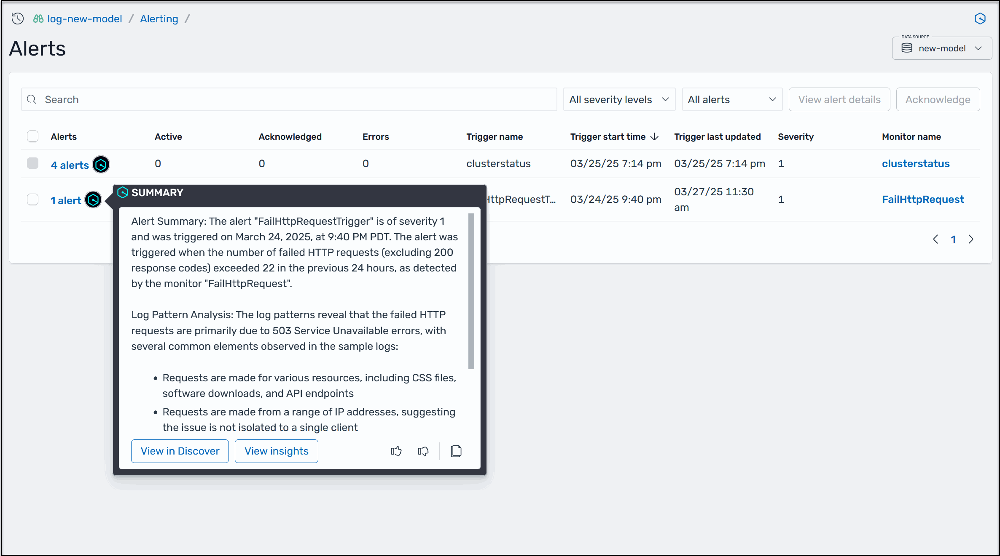
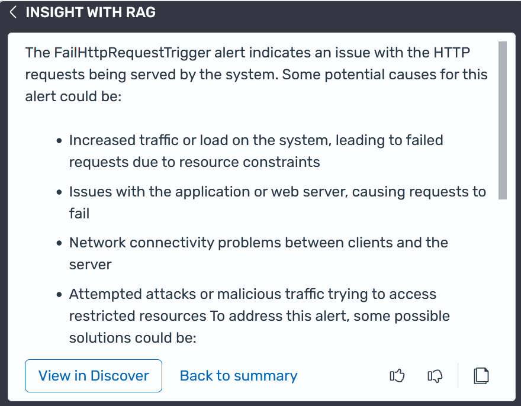

# View alert summaries and

insights

You can configure OpenSearch Service to create an alert monitor when data from one or more indexes
meets certain conditions. To help you quickly understand and troubleshoot an alert, you
can view an alert summary by clicking the AI Assistant icon beside an alert. A summary
provides details about the underlying issue that triggered the alert and, when
available, additional analysis to help you locate the root cause of the problem. The
following screenshot shows an example of an alert summary created by AI Assistant.

If you connect a knowledge base to provide additional context about your environment,
as described later in this topic, AI Assistant creates insights about an alert. Insights
provide details and troubleshooting options to help you remedy the root cause of an
alert. For the previously shown alert, AI Assistant also produced the following
insights.

###### Note

Depending on the nature of the alert and the information available, AI Assistant can
give you the option to view the alert data on the **Discover** page
in the OpenSearch Dashboards. If you see the **View in Discover** button
at the bottom of an AI Assistant alert summary, click the button to open the corresponding
data set in **Discover** with an active filter for the alert data.

###### Topics

- [Before you
  begin](#AI-assistant-alert-summary-insight-setup "#AI-assistant-alert-summary-insight-setup")
- [Viewing alert summaries
  and insights](#AI-assistant-viewing-alert-summaries "#AI-assistant-viewing-alert-summaries")

## Before you

begin

Complete the following steps to configure an Amazon Bedrock knowledge base so that AI Assistant
can create insights for OpenSearch Service alerts.

### Step 1: Create the LambdaInvokeOpenSearchMLCommonsRole IAM role

Create a new role named `LambdaInvokeOpenSearchMLCommonsRole` in
AWS Identity and Access Management (IAM). OpenSearch Service uses this role to create an AI connector in OpenSearch
that helps produce insights based on configured knowledge base articles. You
must map this role to the OpenSearch Service `ml_full_access` role, as described in
step 2.

When you create the new role, for **Trusted entity type**,
choose **AWS account**. You don't need to specify a
permission policy. On the **Add permissions** page, choose
**Next**. For more information about creating a new role,
see [Creating a role for an AWS service (console)](../../../IAM/latest/UserGuide/id_roles_create_for-service.md#roles-creatingrole-service-console "../../../IAM/latest/UserGuide/id_roles_create_for-service.md#roles-creatingrole-service-console").

### Step 2: Map the LambdaInvokeOpenSearchMLCommonsRole role to the OpenSearch Service

ml_full_access role

Use the following procedure to map the
`LambdaInvokeOpenSearchMLCommonsRole` role to the OpenSearch Service
`ml_full_access` role. This mapping also helps OpenSearch Service create the AI
connector.

###### To map the required IAM role to the OpenSearch Service ml_full_access role

1. Open the OpenSearch Service Dashboard **Data administration**
   page.
2. Under **Data access and user**, choose
   **Roles**.
3. Use the search box to locate the `ml_full_access`
   role.
4. On the **ml_full_access** page, choose the
   **Mapped users** tab.
5. Choose **Map users**.
6. In the **Backend roles** field, paste the Amazon
   Resource Name (ARN) of the
   `LambdaInvokeOpenSearchMLCommonsRole` role, and then
   choose **Map**.

### Step 3: Configure an OpenSearch Service knowledge base using CloudFormation

Use the following procedure to configure an OpenSearch Service knowledge base using
AWS CloudFormation so that AI Assistant can generate insights.

###### To configure a knowledge base for insights

1. Sign in to the Amazon OpenSearch Service console [https://console.aws.amazon.com/aos/home](https://console.aws.amazon.com/aos/home "https://console.aws.amazon.com/aos/home") in a supported
   AWS Region. For more information, see [Supported AWS Regions](Amazon-Q-developer-support.md#Amazon-Q-developer-supported-regions "Amazon-Q-developer-support.md#Amazon-Q-developer-supported-regions").
2. In the navigation pane, choose
   **Integrations**.
3. In the **Integration templates** section, choose the
   **Integrate with knowledge base through Amazon Bedrock**
   template. If you don't see this template, verify you're in a supported
   Region.
4. In the **Integrate with knowledge base through Amazon Bedrock**
   tile, choose **Configure domain**, and then choose one
   of the available options. OpenSearch Service opens the CloudFormation stack template with the
   required fields pre-populated. The CloudFormation stack supports integration for
   public and VPC domains.
5. Choose **Create stack**. After CloudFormation creates the
   resources, the service displays the Amazon Bedrock agent
   **AgentId**, **ConnectorId**, and
   **ModelId**.

When applicable, AI Assistant now creates insights for OpenSearch Service alerts.

## Viewing alert summaries

and insights

Use the following procedure to view alert summaries and insights in OpenSearch Service.

###### Viewing alert summaries and insights

1. Verify that you've [set up AI Assistant for OpenSearch Service](AI-Assistant-setting-up.md "AI-Assistant-setting-up.md").
2. Verify that you've [set up
   alerts for OpenSearch Service](alerting.md "alerting.md").
3. In the OpenSearch Dashboards main menu, choose **Alerting**,
   and then choose **Alerts**.
4. Choose the AI Assistant icon beside an alert. AI Assistant can take up to 10 seconds
   to generate the summary.
5. If present in the alert summary, choose **View insights**
   to view more details about the alert based on your configured knowledge
   base.
6. If present in the alert summary, choose **View in
   Discover** to view the alert data on the
   **Discover** page in the OpenSearch Dashboards.
