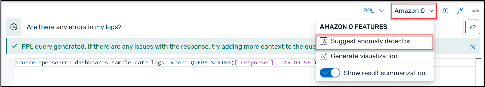

# View recommended anomaly

detectors

Anomaly detection in Amazon OpenSearch Service automatically detects anomalies in your OpenSearch data
in near-real time by using the Random Cut Forest (RCF) algorithm. RCF is an unsupervised
machine learning algorithm that models a sketch of your incoming data stream. The
algorithm computes an `anomaly grade` and `confidence score` value
for each incoming data point. Anomaly detection uses these values to differentiate an
anomaly from normal variations in your data.

To simplify the process of creating anomaly detectors, AI Assistant can generate suggested
detectors based on your selected data source on the **Discover** page.
AI Assistant supports suggested anomaly detectors for any language.

###### To view AI Assistant recommended anomaly detectors

1. Verify that you've [set up AI Assistant for OpenSearch Service](AI-Assistant-setting-up.md "AI-Assistant-setting-up.md").
2. In the OpenSearch UI main menu, choose the **Discover**
   page, and then choose a data source.
3. From the **AI Assistant** menu, choose **Suggest anomaly
   detector**, as shown in the following screen shot.

AI Assistant can take a few seconds to generate the features for the
detector. 4. Choose **Create detector**.
