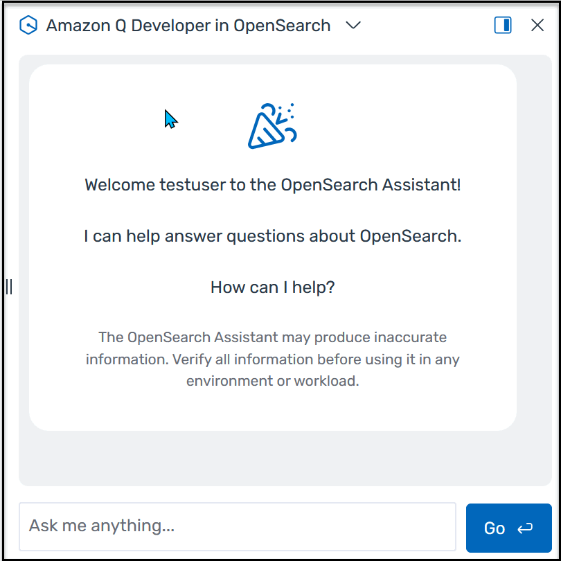
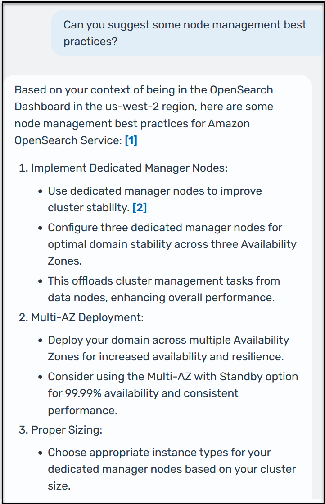

# Access Amazon Q chat for

OpenSearch-related questions

If you have questions about Amazon OpenSearch Service, including conceptual or procedural questions
related to OpenSearch Service features or functionality, you can ask Amazon Q Developer for information. The
chatbot supports a conversational chat that preserves context of your discussion. It
also saves a history of your conversations for later reference. To access the chatbot,
click the Amazon Q icon at the top-right corner of any OpenSearch Service page. Type a question in the
text box and click **Go**. Amazon Q can take up to 30 seconds to generate
a response.

Here is an example response from Amazon Q.

###### Note

Amazon Q _chat_ can't access your data. For this reason, you
can't engage the chatbot in a conversation about your data.
