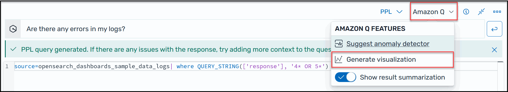

# Generate

visualizations using natural language

To help you gain further insights into your operational data, Amazon Q Developer for OpenSearch Service
supports using natural language prompts to build visualizations. You can generate
visualizations like the following example using natural language from the
**Visualizations** page or the **Discover** page.

Visualizations can expedite troubleshooting by breaking down error analysis according
to different dimensions. Visualizations can also help you identify patterns and trends,
speed up decision making, reveal relationships, and simplify complex data.

###### To generate a visualization using natural language

1. Verify that you've [set up Amazon Q for OpenSearch Service](Amazon-Q-developer-support-setting-up.md "Amazon-Q-developer-support-setting-up.md").
2. In the OpenSearch Dashboards main menu, choose the **Discover**
   page, and then choose a data source.
3. From the **Amazon Q** menu, choose **Generate
   visualization**, as shown in the following screen shot.

 4. If you entered a natural language query on the **Discover**
page, Amazon Q copies the context when creating a visualization based off of that
query. If you didn't already enter a natural language query, in the Amazon Q text
box, enter a prompt, and then click the button beside the text box to run the
query. Amazon Q can take a few seconds to create the visualization. 5. To update the visual, choose the **Edit visual** button on
the top right corner of the visual. Type a new prompt, for example, "Change this
to a line graph", and then choose **Apply**.
