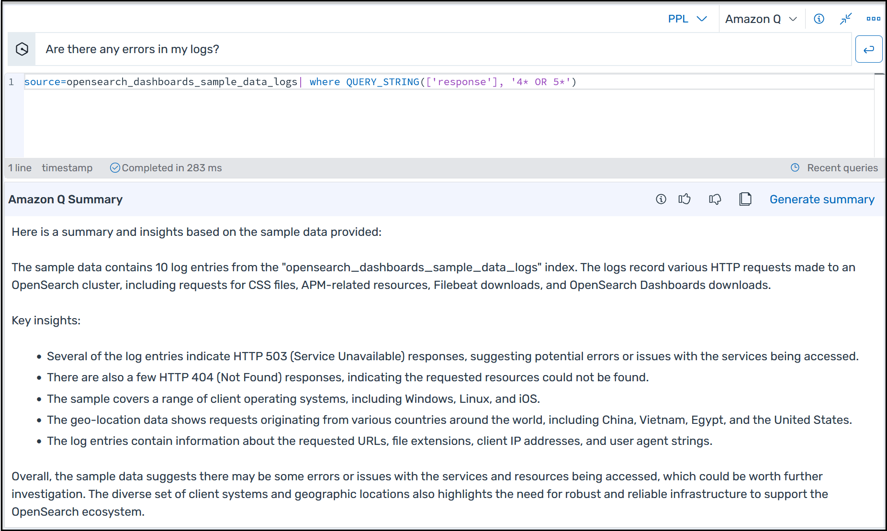

# View Amazon Q-generated query

result summaries on the Discover page

OpenSearch Service enables you to [query
your data with natural language prompts](natural-language-query.md "natural-language-query.md") using the Piped Processing Language
(PPL) query language on the **Discover** page. For example, you can
write queries like the following:

- Are there any errors in my error logs?
- What's the average request size by week?
- How many requests were there group by response code last week?
  In response, Amazon Q generates natural language summaries of your query results based
  on the first ten records, like the following:

The combination of natural language query generation and query summaries can add an
additional level of inquiry when troubleshooting an alert or a user-friendly means of
understanding your data without having to write complex queries.

###### To view Amazon Q-generated query result summaries on the Discover page

1. Verify that you've [set up Amazon Q for OpenSearch Service](Amazon-Q-developer-support-setting-up.md "Amazon-Q-developer-support-setting-up.md").
2. In the OpenSearch Dashboards main menu, choose
   **Discover**.
3. In the query language drop-down list, choose **PPL**.
4. In the Amazon Q text box, enter a prompt, and then click the button beside the
   text box to run the query. Amazon Q can take up to 10 seconds to return a summary.
   After your initial query, you must choose **Generate summary**
   for subsequent summaries.

###### Note

You can turn summary generation off from the **Amazon Q** drop-down
list in **Discover**.
